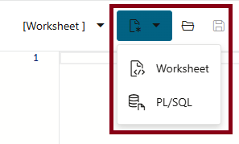

# Import ONNX Trained LLMs

## Introduction

Oracle 23ai allows LLMs based on the Open Neural Network Exchange (ONNX) model to be stored directly within the database itself. In this lab, you'll load three different ONNX LLMs into your Oracle 23ai database and probe the models' attributes.

Estimated Time: 5 minutes

### Objectives

In this lab, you will:

- Load ONNX LLMs directly into your 23ai database
- Explore metadata for the newly-loaded LLMs through Oracle 23ai data dictionary views

### Prerequisites

This lab assumes you:
- Have completed all previous labs successfully
- Are still connected to SQL Web Developer as the **HOL23** user

## Task 1: Import ONNX LLMS into Database

Our next step is to import the ONNX LLMs directly into our 23ai database.

1. In your SQL Web Developer session, open the **load-onnx-models.sql** script by clicking on the *File ... Open* icon.  Either click the *Run Script* button or hit *F5* to execute the script. 

   

   **NOTE:** If any errors occur during this script's execution, be sure you properly completed the prior steps to set up proper credentials and have copied all files from object storage successfully.


2. Since The ONNX LLMS just loaded conform to the same standards that Oracle data mining and machine learning algorithms use, let's review their metadata and features.

    In your SQL Web Developer session, open a new SQL worksheet:

    

 
3. Copy this SQL query into the SQL worksheet and then execute it by clicking on the *Run Statement* button:

    ```
    <copy>
    SELECT 
      model_name
    , mining_function
    , algorithm
    , algorithm_type
    , model_size
      FROM all_mining_models;
    </copy>
    ```

    

    These results reveal some basic information about each LLM, including its primary function, which algorithm it uses, and its size. Note that because they have been pre-trained, they are quite large!

4. Copy this SQL query into the SQL worksheet and then execute it to display more detailed attributes of each ONNX LLM.

    ```
    <copy>
    SELECT 
      model_name
    , attribute_name
    , attribute_type
    , data_type
    , target
    , vector_info
      FROM all_mining_model_attributes
     ORDER BY model_name, attribute_name;
    </copy>
    ```
 
    

    This shows some additional details about each LLM: 
    - The LLM accepts *text only* as input. As we'll see in later labs, text will be passed into these models as CLOB datatypes.
    - It also returns a **VECTOR** datatype. In this case, up to **384** possible elements of a VECTOR array can be stored as floating point decimal values. These numbers represent *embeddings* that the model creates when processing "chunks" of text data, as we'll see in a later lab.


5. **All ONNX LLMs have been successfully loaded into your 23ai database.** You may proceed to the next lab.

## Learn More
- [Importing Pretrained Models in ONNX Format](https://docs.oracle.com/en/database/oracle/oracle-database/23/vecse/import-pretrained-models-onnx-format-vector-generation-database.html)
- [Oracle SQL Web Developer Concepts and Usage](https://docs.oracle.com/en/cloud/paas/autonomous-database/serverless/adbsb/connect-database-actions.html#GUID-102845D9-6855-4944-8937-5C688939610F)


## Acknowledgements
* **Author** - [Oracle LiveLabs Contact], Jim Czuprynski
* **Contributors** - Jim Czuprynski, LiveLabs Contributor, Zero Defect Computing, Inc.
* **Last Updated By/Date** - Jim Czuprynski, February 2025