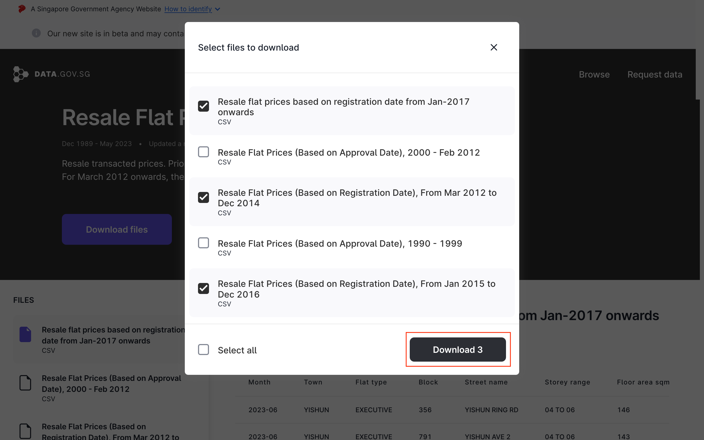
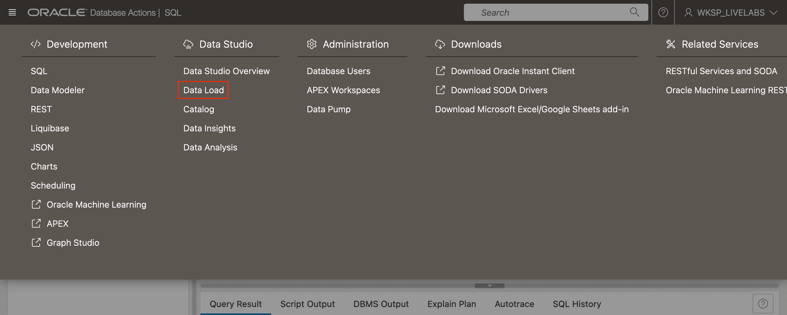
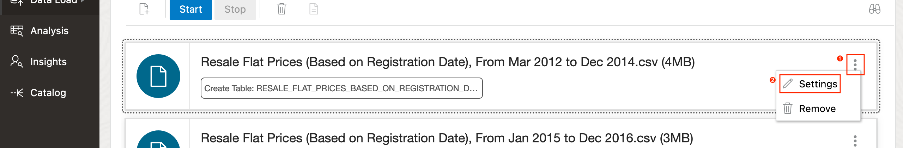
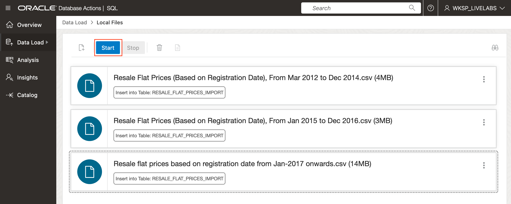
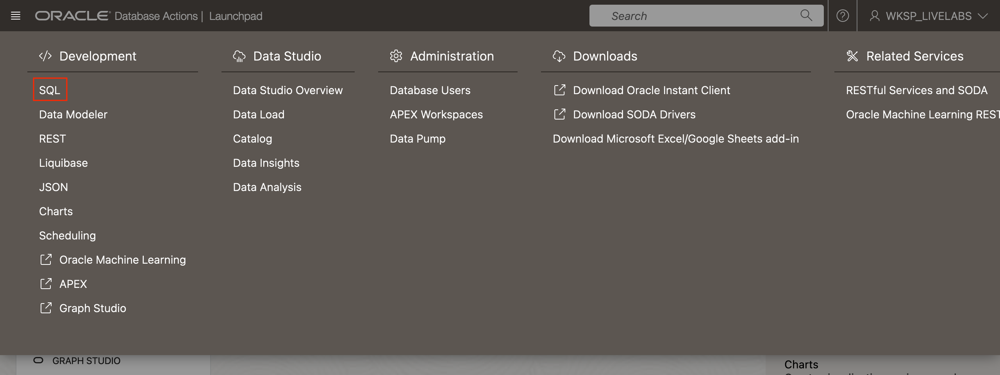

# Download and Import Data Set with Data Studio

## Introduction

In this lab, we will download a publicly available data set provided through the Singapore Government's open data [initiative](https://data.gov.sg). The data set that we will use for the lab contains the historical prices from the resale transactions of Housing and Development Board (HDB) flats.

Estimated Time: 15 minutes

### Open Data

Open data refers to the concept of making data freely available and accessible to the public, without restrictions on its use, reuse, or redistribution. It encompasses the idea that certain types of information, such as government datasets, scientific research findings, or public records, should be openly shared in a standardized and machine-readable format. Open data aims to promote transparency, collaboration, and innovation by enabling individuals, businesses, and organizations to analyze and derive insights from the available data. By facilitating the free flow of information, open data initiatives foster greater accountability, informed decision-making, and the development of new solutions to societal challenges.

### Oracle Data Studio

Oracle Data Studio is a visual tool included with the Autonomous Database, and accessed through Database Actions. It allows users to load, catalog, transform, visualize, gain insights, and share data.

### Objectives

In this lab, you will:

* Download all the CSV files available through the HDB resale flat prices data collection.
* Load the data contained in the CSV files into a database table.

### Prerequisites

This lab assumes that you have:

* Access to an Oracle Cloud tenancy.
* Provisioned a schema on the Oracle Autonomous Database.
* Granted the schema permission to use Database Actions.

## Task 1: Download the Data Set

The data set that we will use in this lab contains the registered transaction prices of resale flats in Singapore from 1990. The data is divided into several files representing different time periods the data was collected. This collection of files can be accessed at this URL: [https://beta.data.gov.sg/datasets/189/view](https://beta.data.gov.sg/datasets/189/view).

> **Note:**
>
> The data collection is maintained by an external party and is subject to change. Optionally, use the search function on the website and look for the data set using the keywords "resale flat prices".

1. Launch the data set's page using URL provided.
1. Click the button *Download files*.

1. Select the following files:
    * Resale flat prices based on registration date from Jan-2017 onwards
    * Resale Flat Prices (Based on Registration Date), From Jan 2015 to Dec 2016
    * Resale Flat Prices (Based on Registration Date), From Mar 2012 to Dec 2014
1. Click the button *Download 3* to begin downloading the selected files.


## Task 2: Prepare a Database Table to Load Data

In this task, you will login to Database Actions as the schema used as the parsing schema for the Oracle APEX application, for example, *WKSP_LIVELABS*. The URL for Database Actions can be retrieved from the OCI console using the steps outlined in Lab 1, Task 3.

Each of the three CSV file downloaded in the previous task contains the following columns:

* `month`
* `town`
* `flat_type`
* `block`
* `street_name`
* `storey_range`
* `floor_area_sqm`
* `flat_model`
* `lease_commence_date`
* `remaining_lease` (only from year 2015)
* `resale_price`

The data from each CSV will be imported into a single database table called `RESALE_FLAT_PRICES`.


1. In Lab 1, Task 1, you were introduced to the ADB's tools page. Return to the tools page, and then scroll down till you find the section *Database Actions*. Click the button *Copy* to copy the URL to *Database Actions*.

1. Open a new browser window or tab, then open the URL copied in the earlier step. Login as the user *WKSP_LIVELABS*.

1. Upon successful login, you will be redirectored to the *Database Action's Launchpad*. Click the tab *SQL*, and then click the button *Open* on the bottom-right.

1. If this is the first time that you are accessing *Database Actions*, you will be prompted to walkthrough a tutorial to learn how the tool works. If you wish to skip the tutorial, then click the button *X* to close the modal,

1. Copy the SQL statement below, and paste the content into the worksheet.
    ```sql
    <copy>
    create table resale_flat_prices_import(
        month varchar2(10)
        , town varchar2(255)
        , flat_type varchar2(255)
        , block varchar2(255)
        , street_name varchar2(255)
        , storey_range varchar2(255)
        , floor_area_sqm number
        , flat_model varchar2(255)
        , lease_commence_date number
        , remaining_lease varchar2(255)
        , resale_price number
    )
    /
    </copy>
    ```
1. Click the button *Run Script* (press the function key *F5* on your keyboard) on the worksheet's toolbar to execute the SQL script.


## Task 3: Import the Data using Data Load

The *Data Studio* is an integral component of Database Actions that provides tools for developers and database administrators to load, catalog, transform, visualize, and gain insights into the data. An upcoming feature will also allow database administrators to share data using the [Delta Sharing](https://delta.io/sharing/) protocol.

1. From the navigation menu on the top-left of the webpage, navigate to Data Studio's *Data Load* tool.

1. On the *Data Load* page, select the action, *Load Data*.

1. First, change the *Consumer Group* to *Low*. Then, drag and drop each file into the upload area.

1. Click each file's "edit" button to edit its settings.

1. Select the *Option* to *Insert into Table*, and then choose the target table under the field *Name*. Under the *Mapping* section, check that the source and target columns are correctly mapped. Finally, click the button *Close*.

1. Once all three files have been correctly configured, click on the button *Start* to begin the data load job.

1. Click the button *Run* when prompted to confirm the job execution.

1. If the job statuses are not updated, click the "refresh" button.

1. When the data load job is completed, there should be a green tick for each file. Click the button *Done* to exit this page, and then proceed to the next task.


## Task 4: Prepare the Data for Training the Machine Learning Model

1. Click the navigation menu on the top-left of the landing page, and then navigate to the Database Action's SQL user interface.

1. Copy the SQL statement below, and paste the content into the worksheet.
    ```sql
    <copy>
    create table resale_flat_prices
    as
    select
        rownum as transaction_id
        , to_number(regexp_substr(month, '(\d+)', 1, 1))
            as transaction_year
        , to_number(regexp_substr(month, '(\d+)', 1, 2))
            as transaction_month
        , town
        , flat_type
        , block
        , street_name
        , to_number(regexp_substr(storey_range, '(\d+)', 1, 1))
            as storey_from
        , to_number(regexp_substr(storey_range, '(\d+)', 1, 2))
            as storey_to
        , floor_area_sqm
        , flat_model
        , lease_commence_date
        , to_number(regexp_substr(remaining_lease, '(\d+)', 1, 1))
            as remaining_lease_year
        , to_number(regexp_substr(remaining_lease, '(\d+)', 1, 2))
            as remaining_lease_month
        , resale_price
    from resale_flat_prices_import
    where to_number(regexp_substr(month, '(\d+)', 1, 1)) < 2024
    /

    -- Add a primary key constraint on the column transaction_id
    alter table resale_flat_prices
    add constraint resale_flat_prices_pk primary key (transaction_id)
    /
    </copy>
    ```
1. Click the button *Run Script* (press the function key *F5* on your keyboard) on the worksheet's toolbar to execute the SQL script.


> **Note:**
>
> The data used for training the ML model will contain data for years before 2024. Data for 2024 may be used to check the performance of the trained ML model.

You may now **proceed to the next lab**.

## Acknowledgements

* **Author** - Adrian Png, Director of Innovation, AI and Cloud Solutions, Insum Solutions Inc.
* **Last Updated By/Date** - Adrian Png, August 2024
