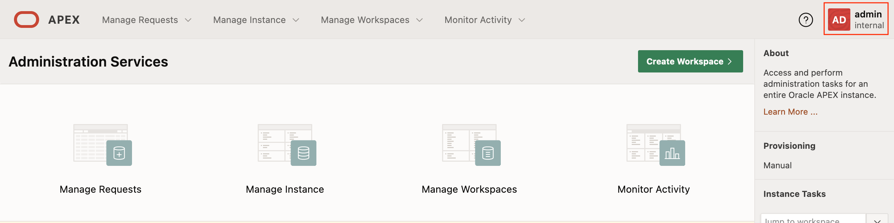
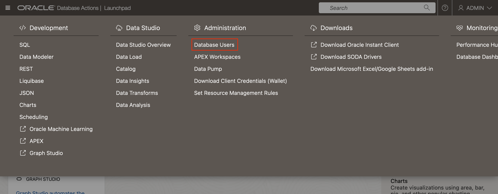
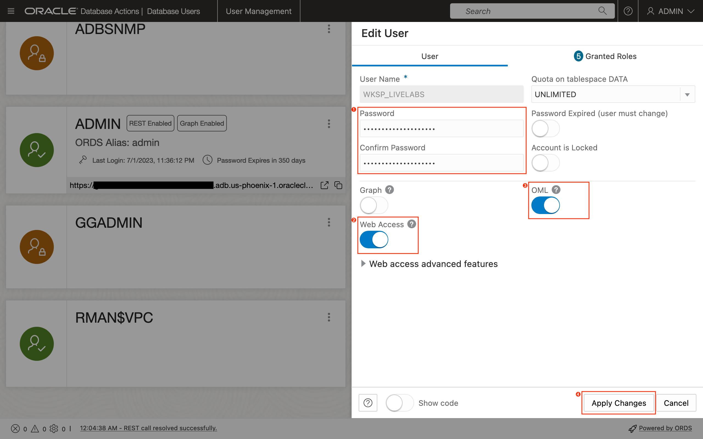

# Prepare Environment for Machine Learning on an Oracle Autonomous Database

## Introduction

In this lab, we will prepare the environment for performing machine learning tasks on the Oracle Autonomous Database (ADB), and creating Oracle APEX applications.

Estimated Time: 15 minutes

### Objectives

In this lab, you will learn how to:

* Provision an Oracle Autonomous Database instance.
* Create an Oracle APEX workspace and a database schema.
* Configure the user for accessing Oracle Machine Learning.

### Prerequisites

This lab assumes that you have:

* Access to an Oracle Cloud tenancy.
* The necessary privileges to create the resources in this lab.

## Task 1: Provision an Oracle Autonomous Database

1. Click the *navigation menu* (sometimes known as the "hamburger") button on the top left to show all the available menu items on the OCI Console, *Oracle Database*, and then *Autonomous Database*.

1. Click the *Create Autonomous Database* button.

1. Begin by choosing the target compartment to create the database. Next, enter a suitable *Display name* and *Database name*. Then, select the desired the workload type, for example, *Transaction Processing*.

1. Scroll down and select the *Serverless* deployment type.

1. For this workshop, select *Always Free* option if within the tenancy's service limits. For Always Free databases, the *OCPU count* and storage limits are fixed. Also, auto scaling is not available for both OCPU and storage. Select the database version *19c* and then scroll down again.

1. Enter a password (twice) that meets the database's password complexity rules. It must be between 12 and 30 characters long and must include at least one uppercase letter, one lowercase letter, and one numeric character. It should not include the word *admin*.

1. Scroll down once more. If this is an Always Free ADB, then the license type choice is set. If not, select the license type that is appropriate to the tenancy. Next, optionally provide an email address to be contacted about announcements and notifications concerning the newly provisioned instance. Finally, click the *Create Autonomous Database* button.

## Task 2: Create an Oracle APEX Workspace and Database Schema

1. Once the ADB has been fully provisioned, return to the *Autonomous Database* page, locate the instance's display name, and then click on it to view the ADB's details page. Click the *Tools* tab.

1. Click the *Copy* button to copy the URL to launch the Oracle APEX development environment. Open the link in a new browser window or tab.

1. For new ADB instances, this should launch the *Administration Services* login screen. Enter the password for the *admin* user and click the *Sign In to Administration* button.

1. Again, for new ADB instances, after a successful login, the browser will redirect to the page shown below. Click the *Create Workspace* button.

1. Click and select the *New Schema* option.

1. Enter the desired *Workspace Name* and *Workspace Username*. The latter will be used to create an Oracle Database user account. Also, provide a new *Workspace Password* that conforms to the same password policy described in *Task 1*. Click the *Create Workspace* button to create the workspace.

1. After the workspace has been successfully provisioned, click the button on the top-right, and then click the *Sign out* button to return to the App Builder login screen.

1. Enter the workspace name, username, and password set earlier when creating the workspace. Click the *Sign In* button to access the newly created workspace.

1. After successful authentication, the browser will redirect to the default App Builder landing page where workspace administrators and developers will have access to various functionalities to develop and manage APEX applications.

## Task 3: Configure User to Access Oracle Machine Learning

When the workspace was created in Task 2, the system had automatically created a database schema and attached it to the workspace. The schema name is the workspace's name and prefixed with the characters *WKSP_*. For example, if the workspace name is *LIVELABS*, then the a parsing schema named *WKSP_LIVELABS* is created. Parsing schemas are used by applications to access database objects managed either in the same or associated schemas. We will use the same parsing schema for loading data for training the machine learning model.

1. In Task 1, you were introduced to the ADB's tools page. Return to the tools page, and then scroll down till you find the section *Database Actions*. Click the button *Copy* to copy the URL to *Database Actions*.

1. Open a new browser window or tab, then open the URL copied in the earlier step. Login as the ADB's *admin* user.

1. Click the navigation (hamburger) menu icon on the top-left corner of the page, and then under the section *Administration*, click the menu item *Database Users*.

1. From the list of database users, locate the parsing schema, e.g., *WKSP_LIVELABS*, and then click the button with three vertical dots on the top-right corner of the schema's display card. Then, click the menu item *Edit*.

1. Set a password for the the parsing schema. Next, enable the features *Web Access* (Database Actions) and *OML*, and then click the button *Apply Changes* to save the changes.

1. To sign out from Database Actions, click the dropdown menu on the top-right of the page, and then click the button *Sign Out*.

You may now **proceed to the next lab**.

## Acknowledgements

* **Author** - Adrian Png, Senior Cloud Solutions Architect, Insum Solutions Inc.
* **Last Updated By/Date** - Adrian Png, June 2023
