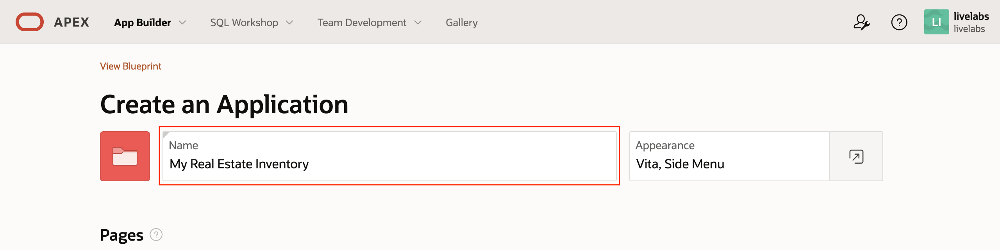
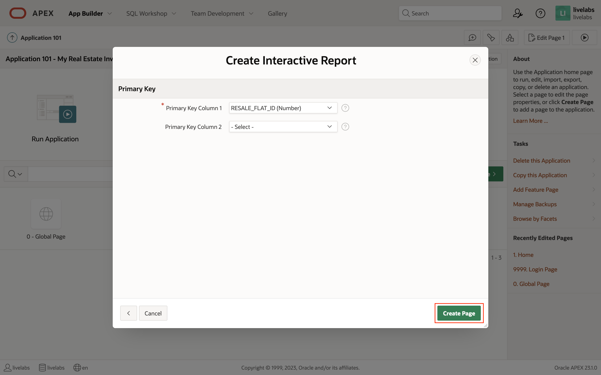
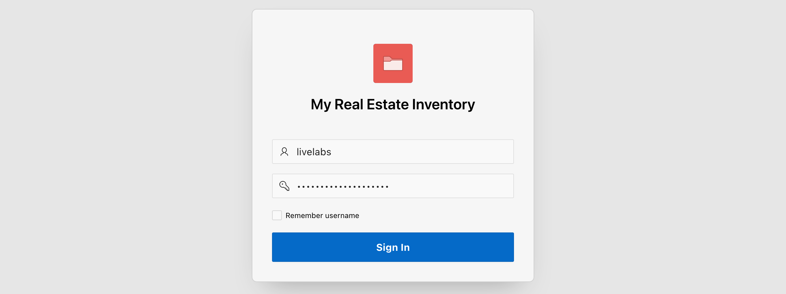
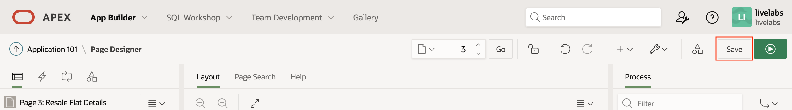

# Use the ML Model in an Oracle APEX Application

## Introduction

In this final lab, we will gather the necessary information about the deployed machine learning (ML) model using its *OpenAPI Specification*, create an Oracle APEX application,

Estimated Time: 30 minutes

### OpenAPI

The OpenAPI Specification is a standard for describing and documenting RESTful APIs. It provides a machine-readable format (usually in JSON or YAML) that defines the endpoints, request and response formats, parameters, authentication methods, and other details of an API. These specifications assist application developers ensure that they correctly consume the API and adhere to its specifications.

### Oracle APEX

Oracle APEX is a low-code development platform that allows developers to quickly build scalable and secure web applications using a browser-based interface. It leverages the power of the Oracle Database and SQL, providing a robust backend for application development. Developers can create functional web applications rapidly by utilizing pre-built components, templates, and wizards. It offers a wide range of declarative features, such as drag-and-drop page design, data forms, interactive reports, and powerful data validations.

Oracle APEX provides a seamless integration with Oracle Database, enabling developers to leverage SQL and PL/SQL for data processing and implementing business logic. It also supports RESTful web services, allowing integration with external systems, including the ML model trained and deployed using the Oracle Machine Learning user interface.

### Objectives

In this lab, you will:

* Gather the information required for working with the deployed ML model using REST.
* Create an Oracle APEX application that allows the user to manage records about HDB flats for sale.
* Predict the price of the HDB flat when a record is created.

### Prerequisites

This lab assumes that you have:

* Access to an Oracle Cloud tenancy.
* Provisioned a workspace and schema on the Oracle Autonomous Database.
* Performed all the steps for loading the open data set, use AutoML UI to generate, and deploy a machine learning model.

## Task 1: Gather Required Information for Calling the Deployed ML Model

1. In Lab 1, Task 1, you were introduced to the ADB's tools page. Return to the tools page, and then scroll down till you find the section *Oracle Machine Learning user interface* (OML UI). Click the button *Copy* to copy the URL to tool.

1. Login to the OML UI as the schema user, e.g., *`WKSP_LIVELABS`*.

1. Click on the navigation menu that would be on the top-left corner of the page to display the menu. Click the menu item *Models* to view the list of available ML models.

1. Click on the tab *Deployments* to view the list of deployed models.

1. Find the model that was deployed in Lab 3, Task 3. Under the column *URI*, click the URI assigned to the deployed model. In this example, the URI is `prfp`. This will open a modal containing the deployed model's OpenAPI Specification.

1. From the OpenAPI Specification, note the endpoint's `url`, `paths`, and `requestBody` attributes. From the information provided, we can glean that we need to make a HTTP `POST` request to the path `/omlmod/v1/deployment/prfp/score` with the *Content-Type* `application/json`. The HTTP request body should contain a valid JSON described by the schema `PRFP_NN_202307021843_INPUT_TYPE`.
    
    Scrolling down, the specification describes the expected JSON schema that includes an array, `inputRecords`, containing one or more objects containing the attributes described.
    

    In the example model deployed, the attributes include:
    * `BLOCK`
    * `FLOOR_AREA_SQM`
    * `LEASE_COMMENCE_DATE`
    * `STOREY_TO`
    * `STREET_NAME`
    * `TOWN`
    * `TRANSACTION_YEAR`

    Below is an example of what the request body JSON should look like:

    ```json
    {
        "inputRecords": [
            {
                "BLOCK": "410",
                "FLOOR_AREA_SQM": 72,
                "LEASE_COMMENCE_DATE": 1979,
                "STOREY_TO": 6,
                "STREET_NAME": "PANDAN GDNS",
                "TOWN": "JURONG EAST",
                "TRANSACTION_YEAR": 2023
            }
        ]
    }
    ```

    Finally, for the response, it will be a JSON payload based on the schema `PRFP_NN_202307021843_OUTPUT_TYPE`.
    

    It is defined using the schema below:

    

    And below, an example of the response body returned by the REST service.

    ```json
    {
        "scoringResults": [
            {
                "regression": 349278.09240880446
            }
        ]
    }
    ```

## Task 2: Create a Database Table to Store Records of HDB Flats

In this task, you will login to the Oracle APEX Development Environment that was created in Lab 1. The URL for Database Actions can be retrieved from the OCI console using the steps outlined in that lab's Task 2.

1. Login to apex

1. Go to *SQL Command*.

1. Copy the SQL statement below, and paste the content into the worksheet.
    ```sql
    <copy>
    create table resale_flat(
        resale_flat_id number generated always as identity
        , block varchar2(255) not null
        , street_name varchar2(255) not null
        , storey number not null
        , town varchar2(255) not null
        , flat_type varchar2(255)
        , flat_model varchar2(255)
        , floor_area_sqm number not null
        , lease_commence_date number not null
        , constraint resale_flat_pk primary key(resale_flat_id)
    )
    /
    </copy>
    ```

1. Click the link *App Builder* to return to the App Builder.


## Task 3: Create an Oracle APEX Application to Manage Records of HDB Flats

1. Click to create new app

1. Click the button *New Application*.

1. Enter the desired name for the application, for example, *My Real Estate Inventory*.

1. Scroll down and modify the authentication scheme to use *Database Accounts*, and then click the button *Create Application* to create the application.

1. After the application has been created, the browser will redirect to the application's homepage. Click the button *Create Page >* to launch the *Create a Page* wizard.

1. On the second page of this application, we want a list of properties displayed as a table. Select to create an *Interactive Report*.

1. Enter a name for the interactive report, and then toggle the option *Include From Page*, which will expose additional details required for the associated *Form* page. Name this page as well.

1. Scroll down to the *Data Source* section, and then click the button next to the field *Table/View Name*.

1. In the search field, enter *RESALE* and then press the *Enter* key. The list of tables will be refreshed and filtered. Then, select the desired table for the data source, and that is, *RESALE_FLAT*.

1. Leave the remaining fields in their default value or setting, and then click the button *Next >*.

1. The primary key should already be selected, so proceed to click the button *Create Page* to complete the process.


## Task 4: Run the Application

1. Return to the application's homepage by clicking the breadcrumb link on the top-left of the page.

1. Click on the large image navigation button *Run Application* to run the application.

1. Login to the application using any valid database credentials, including the one used to login to the workspace.

1. Expand the application's navigation menu by clicking on the hamburger icon on the top-left corner of the page. Then, click the menu item *Resale Flats* to navigate to the *Resale Flats* interactive report.

1. The table would be empty initially. Click on the button *Create* to navigate to the *Resale Flat* page to create a new record.

1. The *Resale Flat Details* page is implemented as a drawer user interface and will slide out from the right of the page. Enter a value for all required fields, indicated by the red corners, and then click the button *Create*.

1. After the record has been created, the drawer will be closed, returning you to the report page with the data refreshed. Click on the edit icon to view or edit the record.

1. The form page would reappear with the fields populated with the data previously entered.


## Task 5: Modify the Application to the Predict Sale Price When a Record is Created or Modified

1. Go to the application's *Shared Components* by clicking on the icon indicated by the red box.

1. Click the link *Application Definitions*.

1. Click the tab *Substitution Strings*, and then enter the following:


    | Substitution String | Substitution Value                                                      |
    | ------------------- | ----------------------------------------------------------------------- |
    | `G_USERNAME`        | *Database user with access to OML and deployed model.*                  |
    | `G_PASSWORD`        | *The database user's password.*                                         |
    | `G_OML_SERVICE_URL` | `https://{TENANCY_ID}-{DATABASE_NAME}.adb.{REGION}.oraclecloudapps.com` |
    | `G_TOKEN_PATH`      | `/omlusers/api/oauth2/v1/token`                                         |
    | `G_MODEL_PATH`      | `/omlmod/v1/deployment/{URI}/score`                                     |

1. Return to the *Resale Flat Details* page by using the search functionality. Click inside the search field, enter the term *resale flat details*, and then click the target page.

1. Right click on the *Region Body*, and then click the menu item *Create Page Item*.

1. Set the page item's name to *`P3_ESTIMATED_VALUE`*, and type, *Display Only*.

1. Scroll down and set the server-side condition for the page item to render only if the page item *`P3_RESALE_FLAT_ID`* is not null. The page item will only render when viewing an existing record.

1. On the left pane, under the *Rendering* tab, expand the nodes *Pre-Rendering*, *Before Header*, then *Processes*. Right-click on the node *Processes*, and then click the menu item *Create Process*.

1. Enter a suitable name for the process, for example, *Estimate Value of Resale Flat*. Then, scroll down, and under *Source*, click the icon next to the field label *PL/SQL Code* to open the PL/SQL code editor.

1. Copy the PL/SQL anonymous procedure below to the clipboard.
    ```sql
    <copy>
    declare
        l_token varchar2(32767);
        l_response clob;
    begin
        -- 1. Perform authentication and obtain a token.
        apex_web_service.g_request_headers(1).name := 'Content-Type';
        apex_web_service.g_request_headers(1).value := 'application/json';

        l_response := apex_web_service.make_rest_request(
            p_url => :G_OML_SERVICE_URL || :G_TOKEN_PATH
            , p_http_method => 'POST'
            , p_body => json_object(
                'grant_type' value 'password'
                , 'username' value :G_USERNAME
                , 'password' value :G_PASSWORD
            )
        );

        -- 2. Retrieve the token.
        if apex_web_service.g_status_code = 200 then
            apex_debug.info(l_response);
            apex_json.parse(p_source => l_response);

            l_token := apex_json.get_varchar2(p_path => 'accessToken');
        else
            raise_application_error(-20001, 'Authentication '
                || 'request failed. HTTP status code returned: '
                || apex_web_service.g_status_code);
        end if;

        -- 3. Call the deployed ML model REST endpoint.
        apex_web_service.clear_request_headers;

        apex_web_service.g_request_headers(1).name := 'Authorization';
        apex_web_service.g_request_headers(1).value := 'Bearer ' || l_token;

        apex_web_service.g_request_headers(2).name := 'Content-Type';
        apex_web_service.g_request_headers(2).value := 'application/json';

        l_response := apex_web_service.make_rest_request(
            p_url => :G_OML_SERVICE_URL || :G_MODEL_PATH
            , p_http_method => 'POST'
            , p_body => json_object(
                'inputRecords' value json_array(
                    json_object(
                        'BLOCK' value :P3_BLOCK
                        , 'FLOOR_AREA_SQM' value
                            to_number(:P3_FLOOR_AREA_SQM)
                        , 'LEASE_COMMENCE_DATE' value
                            to_number(:P3_LEASE_COMMENCE_DATE)
                        , 'STOREY_TO' value to_number(:P3_STOREY)
                        , 'STREET_NAME' value :P3_STREET_NAME
                        , 'TOWN' value :P3_TOWN
                        , 'TRANSACTION_YEAR'
                            value extract(year from sysdate)
                    )
                )
            )
        );

        -- 4. Parse the results.
        if apex_web_service.g_status_code != 200 then
            raise_application_error(-20002
                , 'Error predicting results. HTTP status code: '
                || apex_web_service.g_status_code);
        else
            select round(results.regression)
            into :P3_ESTIMATED_VALUE
            from json_table(
                l_response, '$.scoringResults[0]' columns(regression)
            ) as results;
        end if;
    end;
    </copy>
    ```
1. Paste the contents of the clipboard into the code editor, then, click the code validation icon on the toolbar. If the code validates successfully, click the button *OK*.

1. Scroll down and set the server-side condition for the process to execute only if the page item *`P3_RESALE_FLAT_ID`* is not null. The process will only execute when viewing an existing record.

1. Click the button *Save* on the top-right corner of the page to save all changes made on this page.

1. Repeat Task 4 to view a resale flat's details. The predicted sales price should now appear at the bottom of the drawer.


Congratulations! You have **completed** all the necessary labs and tasks.

## Acknowledgements

* **Author** - Adrian Png, Senior Cloud Solutions Architect, Insum Solutions Inc.
* **Last Updated By/Date** - Adrian Png, June 2023
