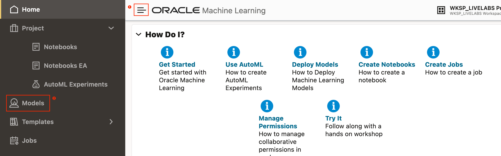
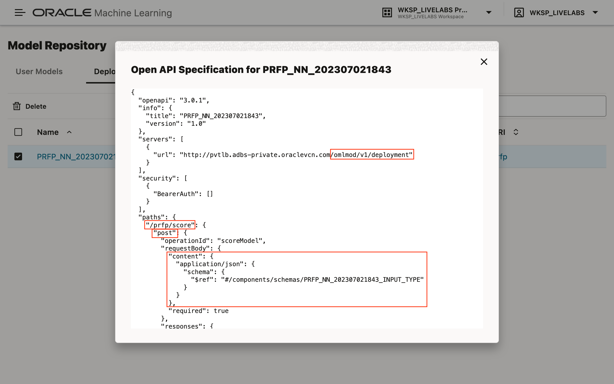

# Use the ML Model in an Oracle APEX Application

## Introduction

TODO

Estimated Time: 30 minutes

### Oracle APEX

TODO

### Objectives

In this lab, you will:

* Gather the information required for working with the deployed ML model using REST.
* Create an Oracle APEX application that allows the user to manage records about HDB flats for sale.
* Predict the price of the HDB flat when a record is created.

### Prerequisites

This lab assumes that you have:

* Access to an Oracle Cloud tenancy.
* Provisioned a workspace and schema on the Oracle Autonomous Database.
* Performed all the steps for loading the open data set, use AutoML UI to generate, and deploy a machine learning model.

## Task 1: Gather Required Information for Calling the Deployed ML Model

1. ...

1. ...

1. ...

1. ...


## Task 2: Create a Database Table to Store Records of HDB Flats

1. Login to apex

1. Go to *SQL Command*.

1. Copy the SQL statement below, and paste the content into the worksheet.
    ```sql
    <copy>
    create table resale_flat(
        resale_flat_id number generated always as identity
        , block varchar2(255) not null
        , street_name varchar2(255) not null
        , storey number not null
        , town varchar2(255) not null
        , flat_type varchar2(255)
        , flat_model varchar2(255)
        , floor_area_sqm number not null
        , lease_commence_date number not null
        , constraint resale_flat_pk primary key(resale_flat_id)
    )
    /
    </copy>
    ```

1. Click the link *App Builder* to return to the App Builder.


## Task 3: Create an Oracle APEX Application to Manage Records of HDB Flats

1. Click to create new app

1. Click the button *New Application*.

1. Enter the desired name for the application, for example, *My Real Estate Inventory*.

1. Scroll down and modify the authentication scheme to use *Database Accounts*, and then click the button *Create Application* to create the application.

1. After the application has been created, the browser will redirect to the application's homepage. Click the button *Create Page >* to launch the *Create a Page* wizard.

1. On the second page of this application, we want a list of properties displayed as a table. Select to create an *Interactive Report*.

1. Enter a name for the interactive report, and then toggle the option *Include From Page*. Additional

1. ...

1. ...

1. ...

1. ...

1. ...

## Task 4: Run the Application

1. Return to the application homepage.

1. Run the application

1. Login

1. Go to Resale Flats Interactive Report
1. Create
1. Edit/view

## Task 5: Modify the Application to the Predict Sale Price When a Record is Created or Modified

1. Go to the application's *Shared Components* by clicking on the icon indicated by the red box.

1. Click the link *Application Definitions*.

1. Click the tab *Substitution Strings*, and then enter the following:


    | Substitution String | Substitution Value                                                      |
    | ------------------- | ----------------------------------------------------------------------- |
    | `G_USERNAME`        | *Database user with access to OML and deployed model.*                  |
    | `G_PASSWORD`        | *The database user's password.*                                         |
    | `G_OML_SERVICE_URL` | `https://{TENANCY_ID}-{DATABASE_NAME}.adb.{REGION}.oraclecloudapps.com` |
    | `G_TOKEN_PATH`      | `/omlusers/api/oauth2/v1/token`                                         |
    | `G_MODEL_PATH`      | `/omlmod/v1/deployment/{URI}/score`                                     |

1. Return to the *Resale Flat Details* page by using the search functionality. Click inside the search field, enter the term *resale flat details*, and then click the target page.

1. Right click on the *Region Body*, and then click the menu item *Create Page Item*.

1. Set the page item's name to *`P3_ESTIMATED_VALUE`*, and type, *Display Only*.

1. Scroll down and set the server-side condition for the page item to render only if the page item *`P3_RESALE_FLAT_ID`* is not null. The page item will only render when viewing an existing record.

1. On the left pane, under the *Rendering* tab, expand the nodes *Pre-Rendering*, *Before Header*, then *Processes*. Right-click on the node *Processes*, and then click the menu item *Create Process*.

1. Enter a suitable name for the process, for example, *Estimate Value of Resale Flat*. Then, scroll down, and under *Source*, click the icon next to the field label *PL/SQL Code* to open the PL/SQL code editor.

1. Copy the PL/SQL anonymous procedure below to the clipboard.
    ```sql
    <copy>
    declare
        l_token varchar2(32767);
        l_response clob;
    begin
        -- 1. Perform authentication and obtain a token.
        apex_web_service.g_request_headers(1).name := 'Content-Type';
        apex_web_service.g_request_headers(1).value := 'application/json';

        l_response := apex_web_service.make_rest_request(
            p_url => :G_OML_SERVICE_URL || :G_TOKEN_PATH
            , p_http_method => 'POST'
            , p_body => json_object(
                'grant_type' value 'password'
                , 'username' value :G_USERNAME
                , 'password' value :G_PASSWORD
            )
        );

        -- 2. Retrieve the token.
        if apex_web_service.g_status_code = 200 then
            apex_debug.info(l_response);
            apex_json.parse(p_source => l_response);

            l_token := apex_json.get_varchar2(p_path => 'accessToken');
        else
            raise_application_error(-20001, 'Authentication '
                || 'request failed. HTTP status code returned: '
                || apex_web_service.g_status_code);
        end if;

        -- 3. Call the deployed ML model REST endpoint.
        apex_web_service.clear_request_headers;

        apex_web_service.g_request_headers(1).name := 'Authorization';
        apex_web_service.g_request_headers(1).value := 'Bearer ' || l_token;

        apex_web_service.g_request_headers(2).name := 'Content-Type';
        apex_web_service.g_request_headers(2).value := 'application/json';

        l_response := apex_web_service.make_rest_request(
            p_url => :G_OML_SERVICE_URL || :G_MODEL_PATH
            , p_http_method => 'POST'
            , p_body => json_object(
                'inputRecords' value json_array(
                    json_object(
                        'BLOCK' value :P3_BLOCK
                        , 'FLOOR_AREA_SQM' value
                            to_number(:P3_FLOOR_AREA_SQM)
                        , 'LEASE_COMMENCE_DATE' value
                            to_number(:P3_LEASE_COMMENCE_DATE)
                        , 'STOREY_TO' value to_number(:P3_STOREY)
                        , 'STREET_NAME' value :P3_STREET_NAME
                        , 'TOWN' value :P3_TOWN
                        , 'TRANSACTION_YEAR'
                            value extract(year from sysdate)
                    )
                )
            )
        );

        -- 4. Parse the results.
        if apex_web_service.g_status_code != 200 then
            raise_application_error(-20002
                , 'Error predicting results. HTTP status code: '
                || apex_web_service.g_status_code);
        else
            select round(results.regression)
            into :P3_ESTIMATED_VALUE
            from json_table(
                l_response, '$.scoringResults[0]' columns(regression)
            ) as results;
        end if;
    end;
    </copy>
    ```
1. Paste the contents of the clipboard into the code editor, then, click the code validation icon on the toolbar. If the code validates successfully, click the button *OK*.

1. Scroll down and set the server-side condition for the process to execute only if the page item *`P3_RESALE_FLAT_ID`* is not null. The process will only execute when viewing an existing record.

1. Click the button *Save* on the top-right corner of the page to save all changes made on this page.

1. Repeat Task 4 to view a resale flat's details. The predicted sales price should now appear at the bottom of the drawer.


Congratulations! You have **completed** all the necessary labs and tasks.

## Acknowledgements

* **Author** - Adrian Png, Senior Cloud Solutions Architect, Insum Solutions Inc.
* **Last Updated By/Date** - Adrian Png, June 2023
