# Deploy the LLM

## Introduction

In this lab, ...

Estimated Time: 15 minutes

### Objectives

In this lab, you will learn how to:

* Perform additional steps to prepare the OCI tenancy for publishing Conda environments from the OCI Data Science notebook session, and creating OCI Logging logs for logging a model deployment.
* Prepare the OCI Data Science project for deploying the large language model (LLM) that you have trained.
* Register the model to the OCI Data Science model catalog.
* Deploy the model on the OCI Data Science.

### Prerequisites

This lab assumes that you have:

* Access to an Oracle Cloud tenancy.
* The necessary privileges to create the resources in this lab.
* An OCI Data Science notebook session.
* A fine-tuned model that has been saved on the notebook session's file system.

## Task 1: Create an OCI Object Storage Bucket

1. Click the *navigation menu* (sometimes known as the "hamburger") button on the top left to show all the available menu items on the OCI Console.
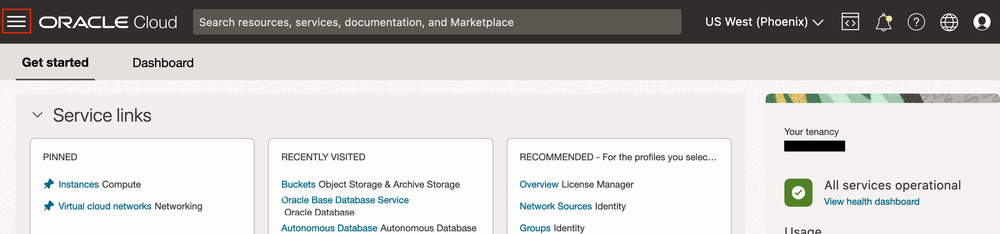
1. Click the link *Storage*, and then under *Object Storage * Archive Storage*, click *Buckets*.
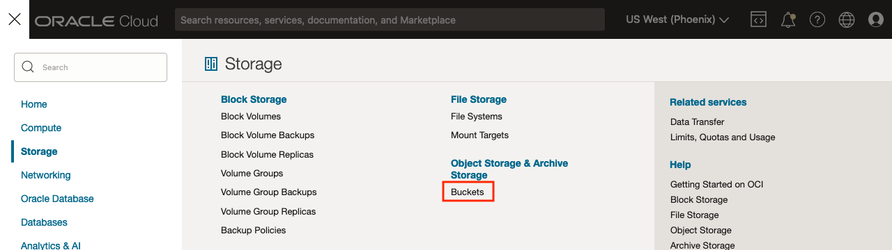
1. Click the *Create Bucket* button.
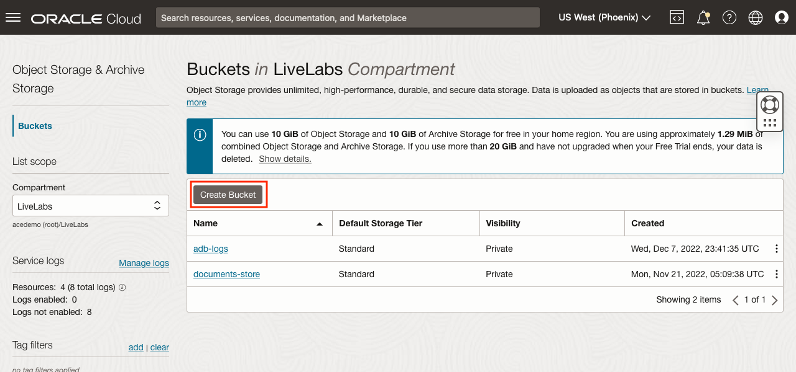
1. Enter a suitable bucket name, and then click the *Create* button.
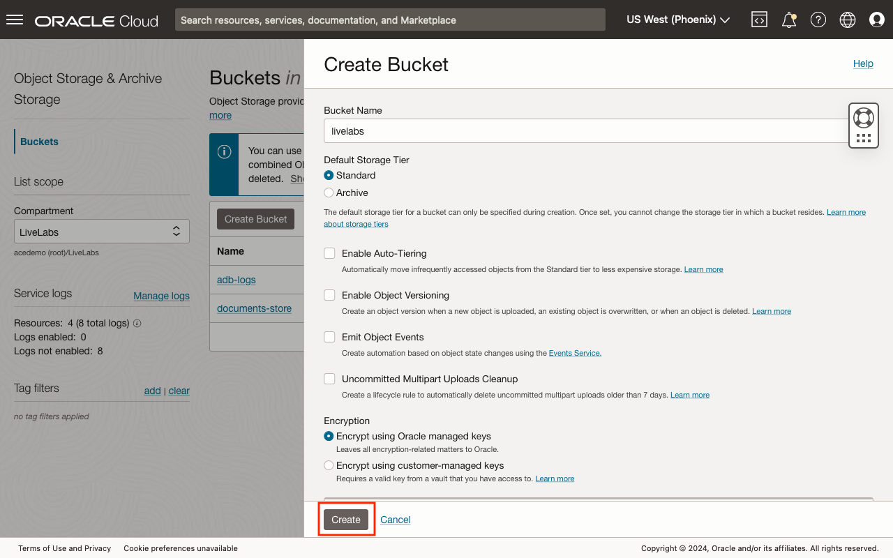

## Task 2: Create Two OCI Logging Logs

1. Click the *navigation menu* button on the top left to show all the available menu items on the OCI Console.

1. Click the link *Observability & Management*, and then under *Logging*, click *Log Groups*.
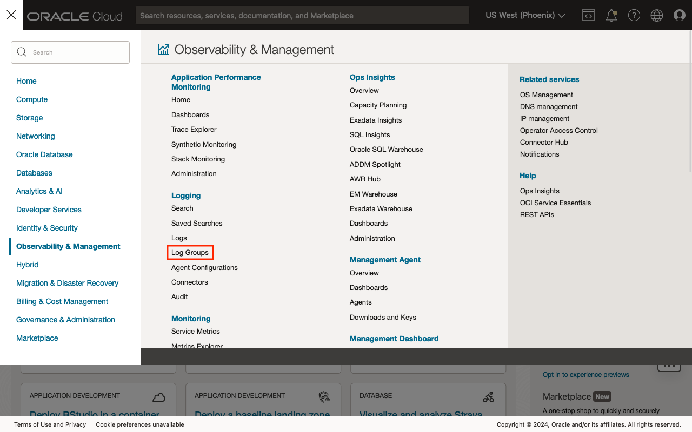
1. Click the *Create Log Group* button.
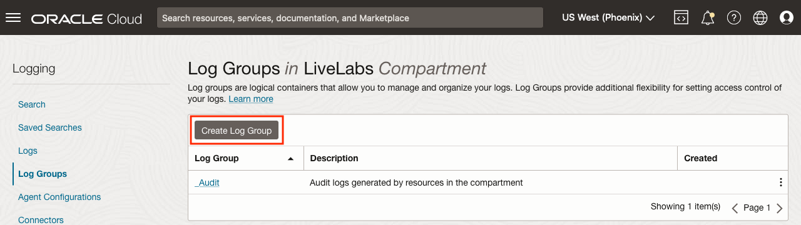
1. Enter details about the new log group, and then click the *Create* button.
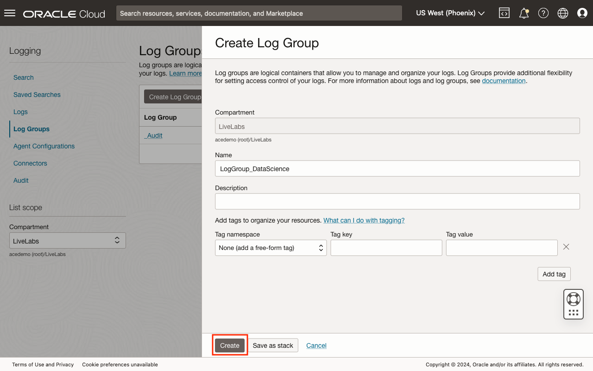
1. From the new log group's details page, under the *Resources* list on the left side of the page, click the *Logs* link.
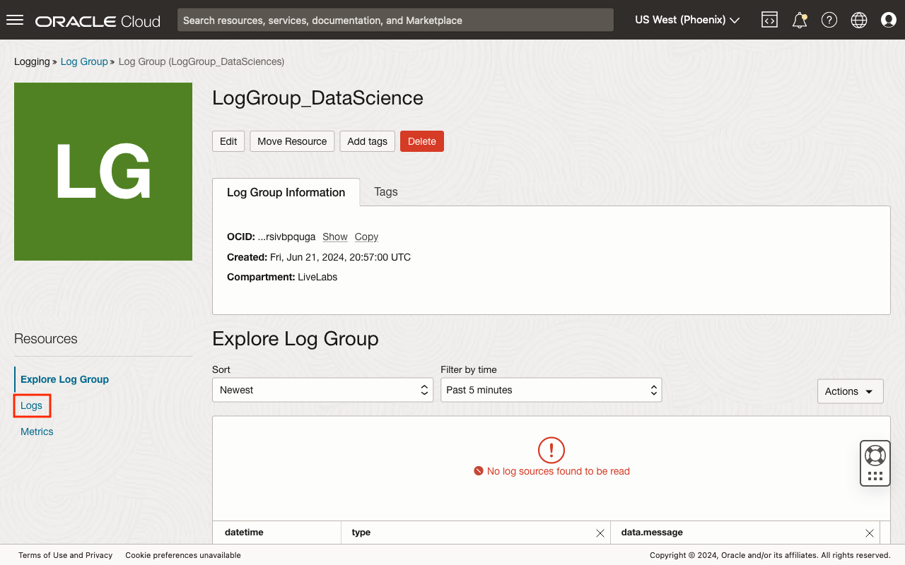
1. Click the *Create custom log* button to create a new log.
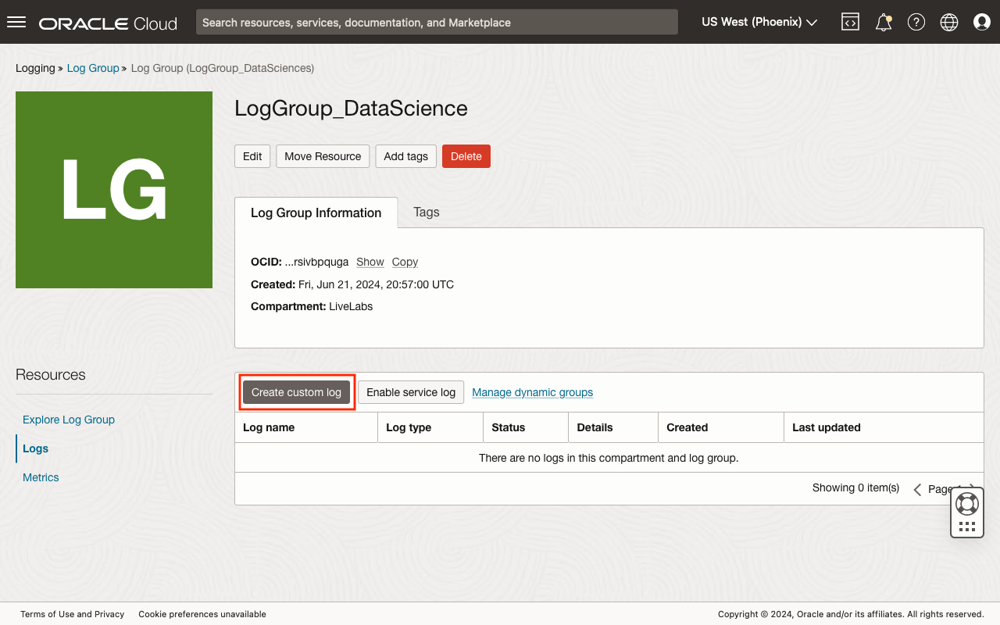
1. Enter a suitable name for the "access" log. Then, ensure that the correct compartment and log group are selected. Finally, click the *Create custom log*.

1. Click the *Create custom log* button again to create a second log.
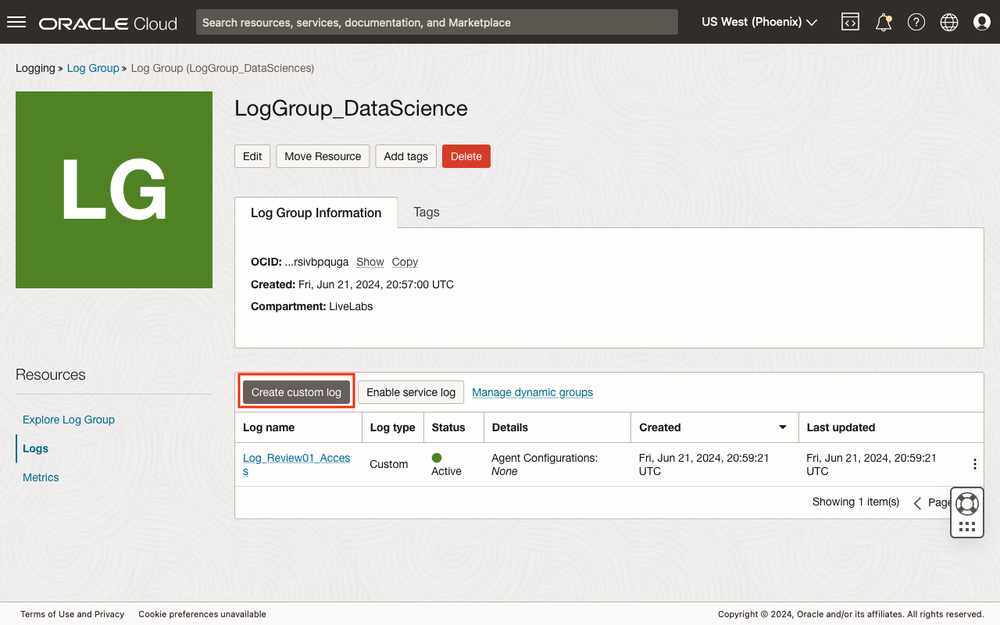
1. In the *Create agent config* step, select the option *Add configuration later*, as this is not required.
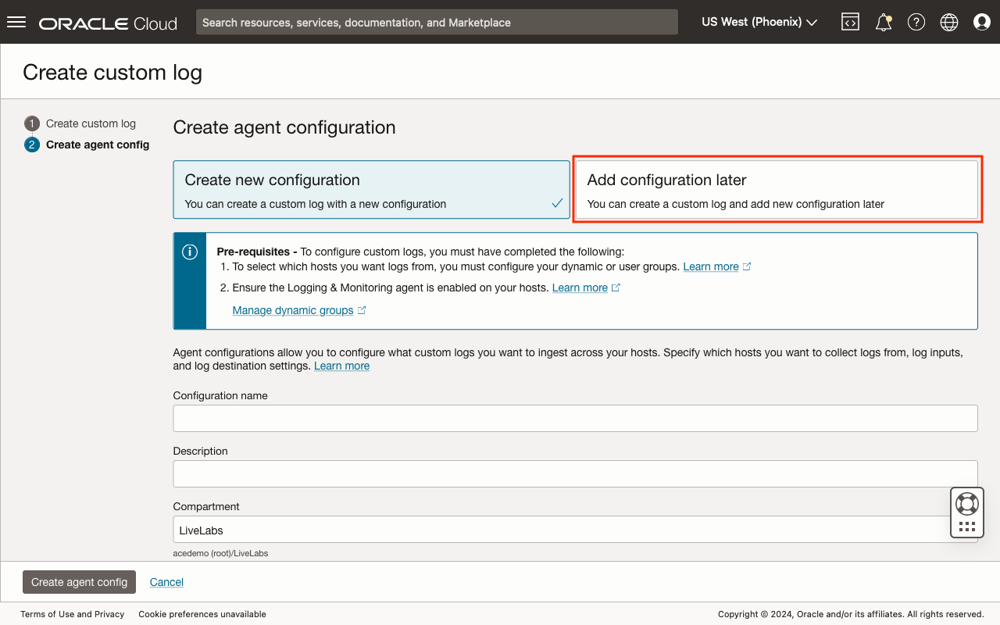
1. Click the *Create agent config* button to complete the log creation process.
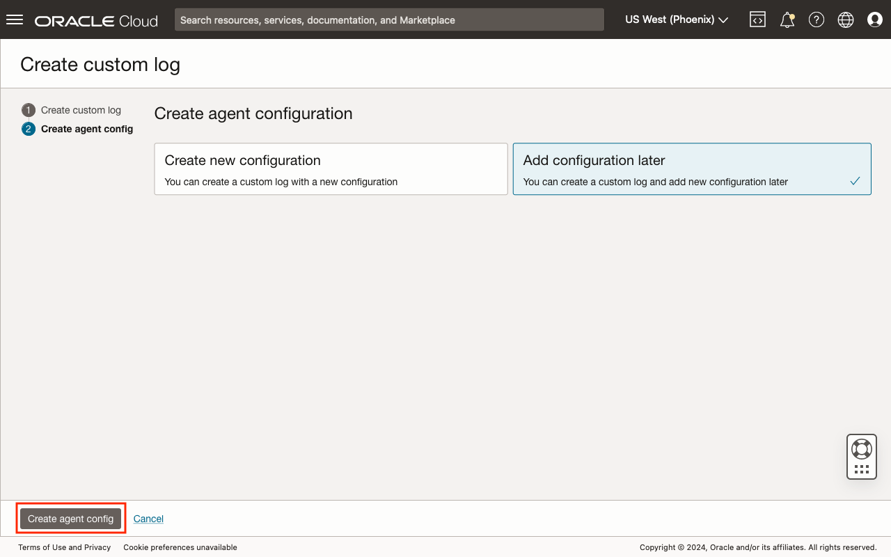
1. Enter a suitable name for the "predict" log. Then, ensure that the correct compartment and log group are selected. Finally, click the *Create custom log*.
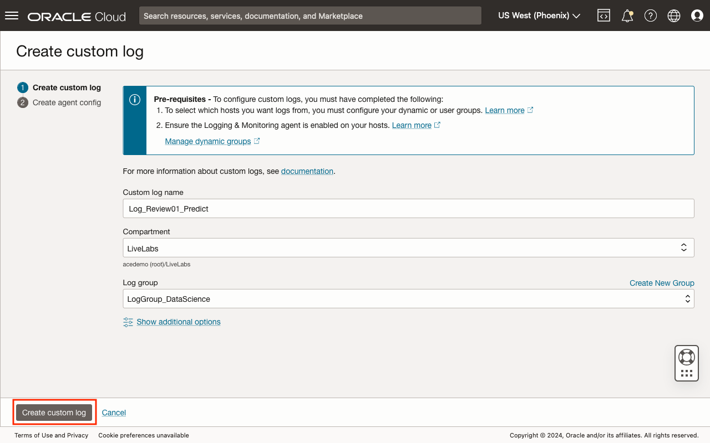
1. As with the access log, opt to create the agent configuration and complete the log creation process.
1. Back on the log group's details page, click on the link to the access log.
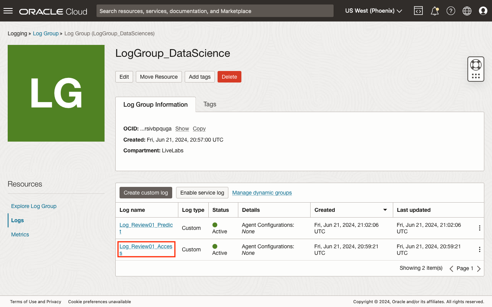
1. Next to the field *OCID*, click the *Copy* link to copy the log's OCID to the clipboard. Note the value for a later task.
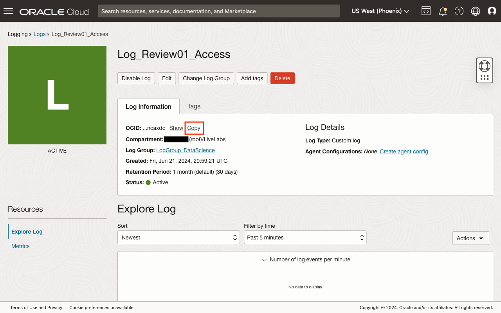
1. Repeat the last two steps to obtain the OCID for the predict log. Likewise, note the value for a later task.

## Task 3: Configure the Notebook Session for Publishing Conda Environments to Object Storage

1. Click the notebook's *File* menu item, click *New*, and then *Terminal* to launch a terminal session.
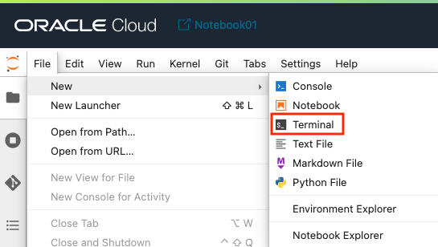
1. Set the OCI CLI's authentication method to use `resource_principal`.
    ```bash
    <copy>
    export OCI_CLI_AUTH=resource_principal
    </copy>
    ```
1. Set some Bash environment variables. Set the value of `BUCKET_NAME` to the name of the bucket that was created in Task 1.
    ```bash
    <copy>
    BUCKET_NAME=livelabs
    TENANCY_NAMESPACE=$(oci os ns get | jq -r '.data')
    AUTHENTICATION_METHOD=resource_principal
    </copy>
    ```
1. Check that the `TENANCY_NAMESPACE` was set correctly.
    ```bash
    <copy>
    echo $TENANCY_NAMESPACE
    </copy>
    ```
1. Configure the notebook session to allow access to the bucket for publishing Conda environments.
    ```bash
    <copy>
    odsc conda init -b $BUCKET_NAME -n $TENANCY_NAMESPACE \
        -a $AUTHENTICATION_METHOD
    </copy>
    ```
1. Validate that the setup was successful. The following command should not have any errors, and will list any previously published Conda environments, if any.
    ```bash
    <copy>
    odsc conda list -o
    </copy>
    ```
    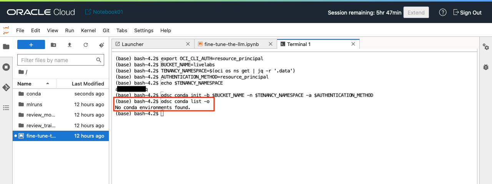

## Task 4: Publish the Conda Environment to Object Storage

1. If you had launched a new terminal session, rememnber to set the OCI CLI's authentication method to use `resource_principal`. Otherwise, you may ignore this step.
    ```bash
    <copy>
    export OCI_CLI_AUTH=resource_principal
    </copy>
    ```
1. Execute the command below to list the Conda environments installed locally.
    ```bash
    <copy>
    odsc conda list -l
    </copy>
    ```
1. Note the name of the Conda environment, `conda_name`, also sometimes referred to as the *slug*. It will be used in the next step to set the environment variable `CONDA_ENV_NAME`.
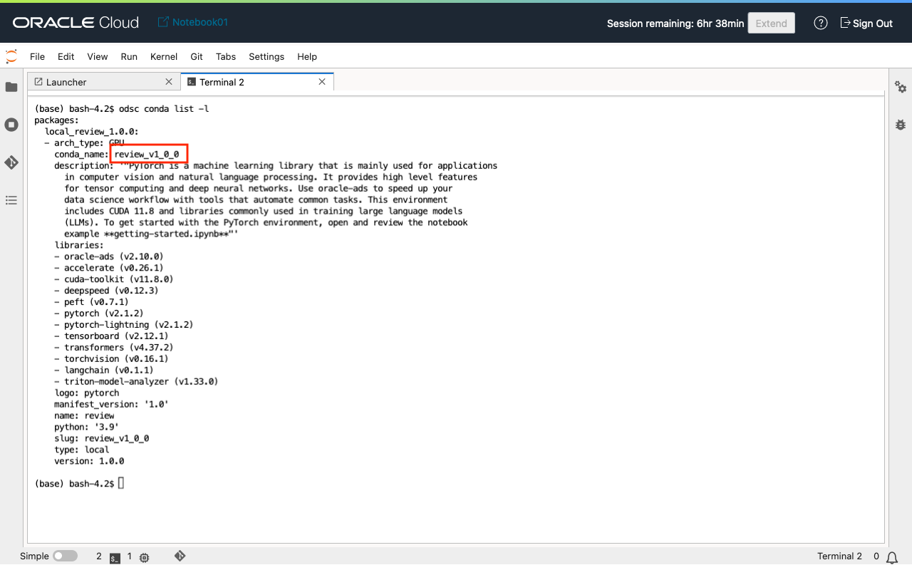
1. Set the environment variable `CONDA_ENV_NAME` using the name of the Conda environment to be used in the deployment.
    ```bash
    <copy>
    CONDA_ENV_SLUG=review_v1_0_0
    </copy>
    ```
1. Publish the Conda environment to the bucket. This process may take a while.
    ```bash
    <copy>
    odsc conda publish -s $CONDA_ENV_SLUG
    </copy>
    ```
1. If the Conda environment was published successfully, you should see the artifacts in the bucket using the OCI Console.
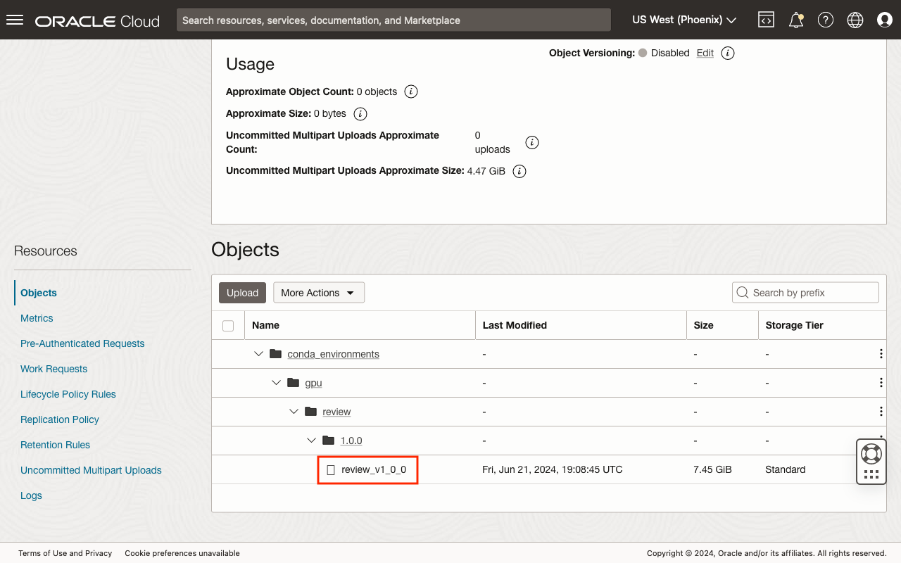
1. Back in the terminal session, list the published Conda environments using the command:
    ```bash
    <copy>
    odsc conda list -o
    </copy>
    ```
1. Identify Conda environment of interest using its *slug*. Note the value of `pack_path`. In the next task, when working through the notebook, use this value for the Python variables `inference_conda_env_pack_path` and `training_conda_env_pack_path`.
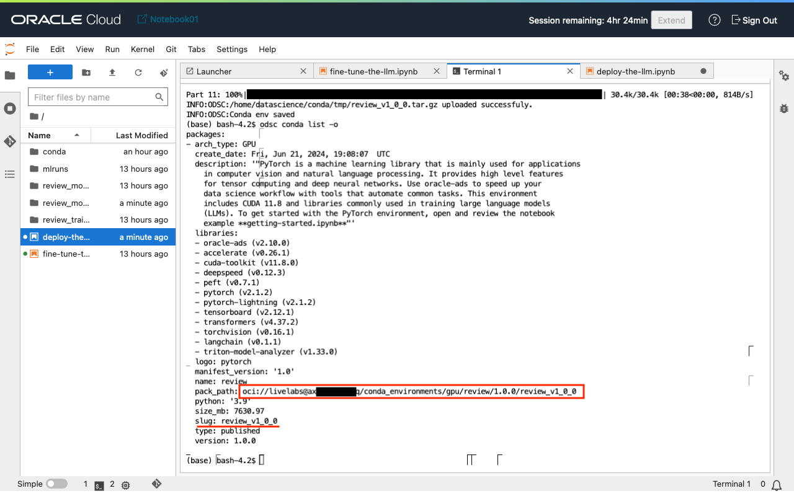

## Task 5: Load the Jupyter Notebook

In this task, we will download and launch a notebook that will walk through the steps of:

* Prepare the running kernel to interact with the OCI Data Science service.
* Prepare model artifacts.
* Register the model on the model catalog.
* Deploy the model.
* Perform an inference to validate that the deployment was successful.

1. Click on the *File* menu item, and then click *Open from URL...*.
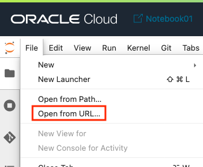
1. Right-click and copy the link to [deploy-the-llm.ipynb](./deploy-the-llm.ipynb)
1. Paste the copied URL, and then click the *Open* button. A copy of the notebook will be downloaded locally on the notebook session's file system.

1. You will be prompted to select a Python kernel. Select the Conda environment that was created in the previous task.
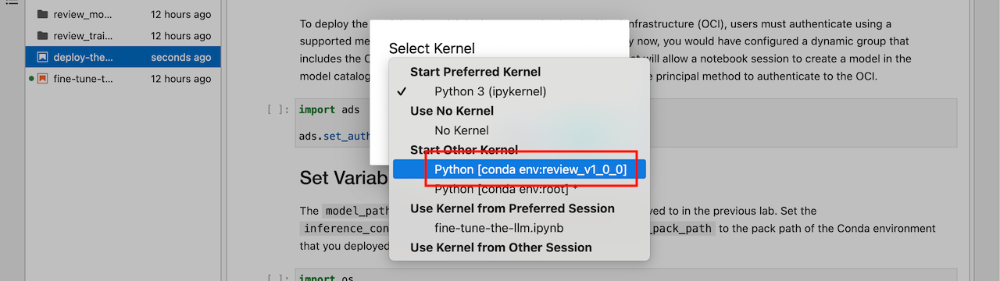
1. Click the *Select* button to set the notebook's kernel.
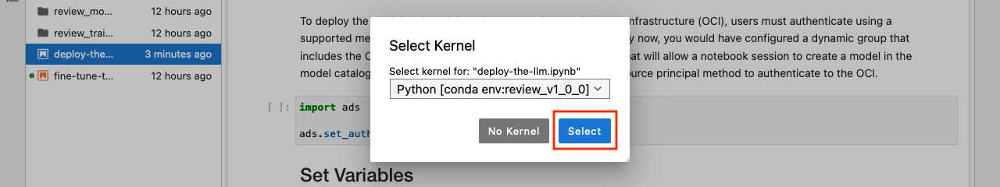

## Task 6: Follow the Jupyter Notebook Instructions to Deploy the Fine-tuned LLM

You are now ready to continue the rest of this lab in the notebook session. However, before staring on the lab, please ensure that you have the following information:

* The pack path of the published Conda environment that will be used by the model deployment.
* OCID of the OCI Log Group.
* OCIDs of the access and predict OCI Logs.

Run each notebook cell in the sequential order. Select each cell of Python code, and the either click the "run" icon or use the appropriate keyboard shortcut for your workstation's operating system.
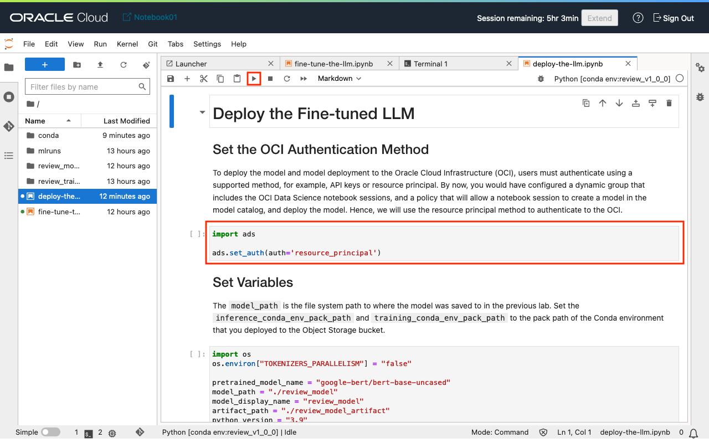

You may now **proceed to the next lab**.

## Acknowledgements

* **Author** - Adrian Png, Director of Innovation, AI and Cloud Solutions, Insum Solutions Inc.
* **Last Updated By/Date** - Adrian Png, June 2024