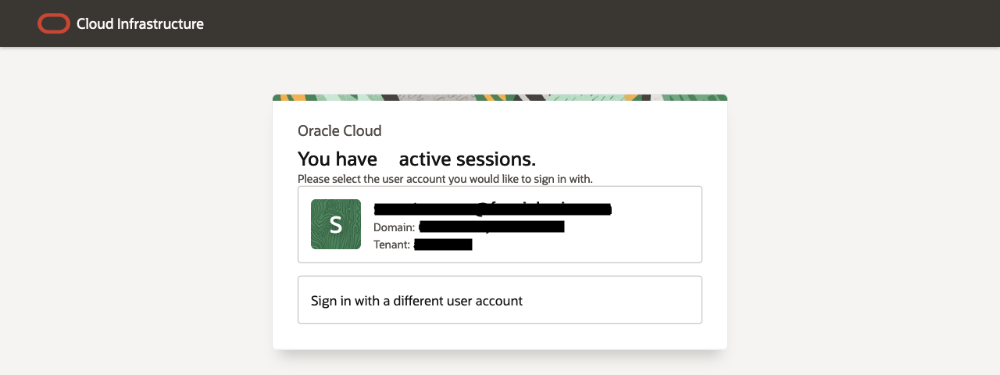
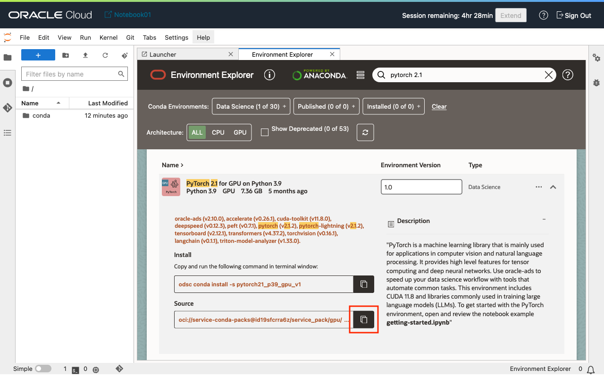

# Fine-tune the LLM

## Introduction

Large language models (LLMs) are usually trained using an extremely large corpus of text, requiring a huge amount of computing resources to complete the process in a reasonable amount of time. Hence, pre-training a LLM can be time consuming, and a very expensive endeavour. Fortunately, the transformer architecture is a deep learning neural network that we can perform transfer learning or fine-tuning. This means preserving a large portion of the model's weights while adding weights that are trained for specific tasks. For example, given a [dataset of public reviews](https://www.yelp.com/dataset) from Yelp, the [BERT base model](https://huggingface.co/google-bert/bert-base-uncased) from Hugging Face can be fine-tuned to generate a label or score for a new review.

In this lab, we will walk through an adapted version of this [tutorial](https://huggingface.co/docs/transformers/training) from Hugging Face using the OCI Data Science service.  

Estimated Time: 45 minutes

### Objectives

In this lab, you will learn how to:

* Prepare the OCI Data Science notebook session for performing fine-tuning.
* Fine-tune the BERT base model using the Yelp dataset.
* Perform an inference, in Python, using the fine-tuned model.

### Prerequisites

This lab assumes that you have:

* Access to an Oracle Cloud tenancy.
* Access to the Internet.
* An OCI Data Science notebook session.

## Task 1: Launch the Notebook Session

1. From the new notebook session's page, click the *Open* button to launch it.

1. Login to the notebook session using your OCI credentials.

1. By default, the notebook session's session expires in one hour. On the top right of the application, click the *Extend* button to extend the session for a few more hours.


## Task 2: Create a Conda Environment

Certainly! [Conda](https://conda.io) is an open-source, cross-platform package and environment manager. Originally designed for Python data scientists, it now serves as a popular package manager for Python and R packages. With Conda, you can easily find, install, update, and remove software packages, and create isolated environments for your projects. It simplifies package management and dependency handling, making it a valuable tool for developers and researchers.

Installed with a notebook session is *odsc*, a command line tool (CLI) that allows users to interact with the OCI Data Science service. It includes a command for working with Conda environments, and we will use this to setup the desired Python kernel for running the notebook.

1. On the notebook's *Launcher*, scroll down, and then click the *Environment Explorer* item to launch the Conda Environment Explorer.

1. On the Environment Explorer's search bar, enter the keywords `pytorch 2.1`. The list of Conda environments should narrow to show only one matching environment. This is an Oracle maintained Conda environment that has the Python packages required to train machine learning models using [PyTorch](https://pytorch.org/). This environment can be used on a Compute instance with or without attached GPU resources.

1. Scroll down and then click the highlighted copy button to copy the Conda environment's pack path. Use this as the value of the `PACK_PATCH` environment variable in the next step.

1. Click the notebook's *File* menu item, click *New*, and then *Terminal* to launch a terminal session.

1. First, set some Bash environment variables. `CONDA_ENV_NAME` is the name that will be used to refer to the Conda environment.
    ```bash
    <copy>
    CONDA_ENV_NAME=review
    PACK_PATH=oci://service-conda-packs@id19sfcrra6z/service_pack/gpu/PyTorch_2.1_for_GPU_on_Python_3.9/1.0/pytorch21_p39_gpu_v1
    </copy>
    ```
    
1. Install the Conda environment locally on the notebook's host.
    ```bash
    <copy>
    odsc conda install --uri $PACK_PATH -e $CONDA_ENV_NAME -v 1.0.0
    </copy>
    ```
    
1. Execute the command below to list the Conda environments installed locally.
    ```bash
    <copy>
    odsc conda list -l
    </copy>
    ```
1. Note the name of the Conda environment, `conda_name`, also sometimes referred to as the *slug*.


## Task 3: Load the Jupyter Notebook

Jupyter Notebook is an open-source web application that lets you create and share documents containing live code, equations, visualizations, and text. These documents are called *notebooks*. They allow developers to share code, documentation, data, visualizations, and more.

In this task, we will download and launch a notebook that will walk through the steps of:

* Installing the Python dependencies that will allow you to perform fine-tuning on an open-source LLM.
* Load a publicly available data set to use for fine-tuning the LLM.
* Prepare and setup the model training.
* Perform the model training; and finally
* Persisting the model for the next lab.

1. Click on the *File* menu item, and then click *Open from URL...*.

1. Right-click and copy the link to [fine-tune-the-llm.ipynb](./fine-tune-the-llm.ipynb)
1. Paste the copied URL, and then click the *Open* button. A copy of the notebook will be downloaded locally on the notebook session's file system.

1. You will be prompted to select a Python kernel. Select the Conda environment that was created in the previous task.

1. Click the *Select* button to set the notebook's kernel.


## Task 4: Follow the Jupyter Notebook Instructions to Fine-tune the LLM

You are now ready to continue the rest of this lab in the notebook session.

1. Run each notebook cell in the sequential order. Select each cell of Python code, and the either click the "run" icon or use the appropriate keyboard shortcut for your workstation's operating system.

1. At the end of this task, you should have a directory in `/home/datascience` that contains the artifacts for the fine-tuned LLM.


You may now **proceed to the next lab**.

## Acknowledgements

* **Author** - Adrian Png, Director of Innovation, AI and Cloud Solutions, Insum Solutions Inc.
* **Last Updated By/Date** - Adrian Png, June 2024
