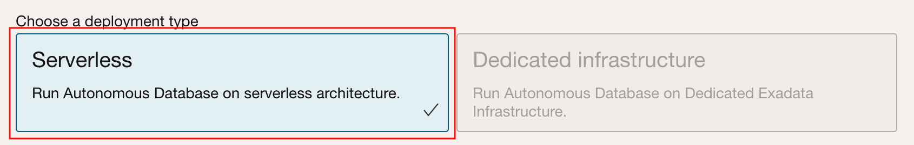
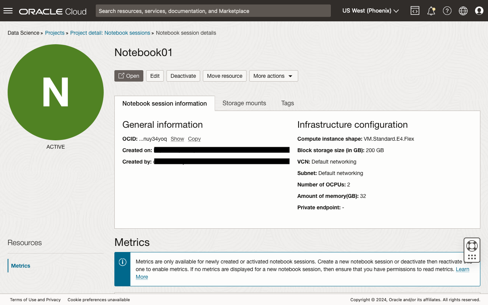

# Prepare the Environment

## Introduction

In this lab, we will prepare the environment, the Oracle Cloud Infrastructure (OCI) tenancy, for this LiveLabs workshop. The completed environment will provide platforms for fine-tuning and training a large language model (LLM), deploying the trained model, and creating an Oracle APEX application that will use it.

Estimated Time: 30 minutes

### Objectives

In this lab, you will learn how to:

* Set up the required Identity Access Management resources and policies.
* Provision an Oracle Autonomous Database instance.
* Create an Oracle APEX workspace and a database schema.
* Create an OCI Data Science project and notebook session for training and deploying the LLM.

### Prerequisites

This lab assumes that you have:

* Access to an Oracle Cloud tenancy.
* The necessary privileges to create the resources in this lab.

## Task 1: Create a Compartment

1. Click the *navigation menu* (sometimes known as the "hamburger") button on the top left to show all the available menu items on the OCI Console.

1. Click the link *Identity & Security*, and then *Compartments*.

1. Click the *Create Compartment* button.

1. Enter the required details, the *Name* and *Description*, and optionally, select a *Parent Compartment*. Click the *Create Compartment* button to create the desired compartment.


## Task 2: Create a Group

In tenancies provisioned with IAM using *identity domains*, users and groups are managed within domains. Such tenancies will have a *Default* domain created by default. We will create a new group in this task.

1. Access the navigation menu, and click the link *Identity & Security*. Under the *Identity* heading, click the link *Domains*.

1. Under the table of domains, click on the link to the *Default* domain. If you do not see the correct domain, on the left side of the page, check that the *root* compartment is selected.

1. On the left navigation menu, click the link *Groups*.

1. Click the *Create Group* button.

1. Create a group named *ApexAgents* and enter an appropriate description. Click the *Create* button to create the group.

1. Validate that the group was created successfully.


## Task 3: Create a User

1. While on the group's details page, a the top, click on the breadcrumb link *Default domain*, to return to the domain's details page.

1. In the left navigation menu, click the link *Users*.

1. Click the *Create User* button.

1. At minimum, enter a *Last name* and the desired *Username*. Depending on domain's settings, an email address is required. If a different username is desired, uncheck the option *Use the email address as the username*, and then enter **both** the *Username* and *Email* fields.

1. Scroll down and assign the user to the group created in Task 1 by selecting the checkbox next to the desired group's name. Click the *Create* button to create the user.

1. On the user's details page, click the *Edit user capabilities* button.

1. Uncheck all capabilities except *API keys*, and then click the *Save changes* button.


## Task 4: Generate API Keys for the User to Call OCI REST APIs Securely

1. From the user's details page, under the *Resources* menu, click the *API keys* link, and then click the *Add API key* button.

1. Select the *Generate API key pair* option to have the OCI Console generate the encryption key pair. Click the *Download private key* button to download the private key, and optionally, click the *Download public key* button to download its public counterpart. The latter can be generated from the private key later if required. Store the private key securely. Finally, click the *Add* button.

1. Once the key pair has been created, the OCI Console will display configuration information that can be added to the OCI [*Command Line Interface*](https://docs.oracle.com/iaas/Content/API/Concepts/cliconcepts.htm) (CLI) configuration file. The same information is required for creating the Oracle APEX *Web Credentials* later, so please copy and safely store the values of the fields listed below the image. Click the *Close* button when done.

	* **user** - The [Oracle Cloud ID](https://docs.oracle.com/iaas/Content/General/Concepts/identifiers.htm) (OCID) for the user.
	* **fingerprint** - The fingerprint of the API's public key.
	* **tenancy** - The OCID for the tenancy.

> **NOTE:**
>
> Here, the API keys were generated using the OCI Console. Other alternative ways to create the private and public keys is to use either the OCI CLI, or [OpenSSL](https://www.openssl.org) that is installed in most modern operating systems.

## Task 5: Create a Dynamic Group for Data Science Work

The OCI Data Science Service empowers you to build and deploy machine learning models quickly and easily. With a comprehensive platform featuring distributed training, batch processing, and automated model deployment, you can streamline the entire machine learning workflow. Its intuitive interface and user-friendly features make it ideal for both beginners and experienced data scientists alike.

The OCI Identity Access Management (IAM) Policies control access to Oracle Cloud resources by defining who can perform specific actions and under what circumstances. These flexible policies leverage a powerful rule-based engine to precisely tailor access based on user attributes, resource details, and access time parameters. By leveraging IAM Policies, organizations can achieve granular control over resource access, improve security, streamline workflows, and ensure efficient resource utilization.

First, create a dynamic group that includes various Data Science resources. This dynamic group will then be used to create policies that allow access to other OCI resources like Object Storage and Logging.

1. Navigate to the OCI tenancy's Domains page.

1. Select the Domain where the IAM resources will be managed, for example, *Default*.

1. Go to the Dynamic Groups page.

1. Click the button *Create dynamic group*.

1. Enter the name, description, and a first rule for the new dynamic group. Replace the `resource.compartment.id` with the appropriate OCID where the Data Science resources will be created in.
    ```
    <copy>
    ALL { resource.type = 'datasciencenotebooksession', resource.compartment.id = 'ocid1.compartment.oc1...' }
    </copy>
    ```

1. Click the button *+ Additional rule* button twice to add two more rules:
    ```
    <copy>
    ALL { resource.type = 'datasciencemodeldeployment', resource.compartment.id = 'ocid1.compartment.oc1...' }
    </copy>
    ```
    and
    ```
    <copy>
    ALL { resource.type = 'datasciencejobrun', resource.compartment.id = 'ocid1.compartment.oc1...' }
    </copy>
    ```

1. Click the button *Create* to complete this task.

## Task 6: Create Policies for Consuming the Model Predict URL and OCI Data Science

1. Access the navigation menu, and click the link *Identity & Security*. Under the *Identity* heading, click the link *Policies*.

1. Click the *Create Policy* button.

1. Create a policy named *DataScienceModelPredictPolicy* and enter an appropriate description. Select the "root" compartment where this resource will be created in. Next, switch the *Show manual editor* toggle to enable.

1. Enter the two statements below (tweak if necessary) and then click the *Create* button.
	```text
	<copy>
	allow group 'Default'/'ApexAgents' to {DATA_SCIENCE_MODEL_DEPLOYMENT_PREDICT}  in compartment LiveLabs
	</copy>
	```

1. Repeat the steps 1 to 3, and create another policy called *DataScienceWorkPolicy* required for training and deploying the machine learning model on the OCI Data Science Service. It must contain the following policy statements:
    ```
    <copy>
    allow service datascience to use virtual-network-family in tenancy
    allow dynamic-group 'Default'/'DataScienceService' to read log-groups in compartment LiveLabs
    allow dynamic-group 'Default'/'DataScienceService' to use log-content in compartment LiveLabs
    allow dynamic-group 'Default'/'DataScienceService' to read virtual-network-family in compartment LiveLabs
    allow dynamic-group 'Default'/'DataScienceService' to manage data-science-family in compartment LiveLabs
    allow dynamic-group 'Default'/'DataScienceService' to manage object-family in compartment LiveLabs
    allow dynamic-group 'Default'/'DataScienceService' to read repos in compartment LiveLabs
    allow dynamic-group 'Default'/'DataScienceService' to use vaults in compartment LiveLabs
    allow dynamic-group 'Default'/'DataScienceService' to manage keys in compartment LiveLabs
    </copy>
    ```

## Task 7: Provision an Oracle Autonomous Database

The Oracle Autonomous Database is a fully managed and automated database service that eliminates the burden of database management. It automatically heals, manages, and scales itself, ensuring high availability and scalability. This simplifies database administration, boosts productivity, and reduces costs for organizations.

1. Click the *navigation menu* button on the top left to show all the available menu items on the OCI Console, *Oracle Database*, and then *Autonomous Database*.

1. Click the *Create Autonomous Database* button.

1. Begin by choosing the target compartment to create the database. Next, enter a suitable *Display name* and *Database name*. Then, select the desired the workload type, for example, *Transaction Processing*.

1. Scroll down and select the *Serverless* deployment type.

1. For this workshop, select *Always Free* option if within the tenancy's service limits. For Always Free databases, the *OCPU count* and storage limits are fixed. Also, auto scaling is not available for both OCPU and storage. Select the database version *19c* and then scroll down again.

1. Enter a password (twice) that meets the database's password complexity rules. It must be between 12 and 30 characters long and must include at least one uppercase letter, one lowercase letter, and one numeric character. It should not include the word *admin*.

1. Scroll down once more. If this is an Always Free ADB, then the license type choice is set. If not, select the license type that is appropriate to the tenancy. Next, optionally provide an email address to be contacted about announcements and notifications concerning the newly provisioned instance. Finally, click the *Create Autonomous Database* button.


## Task 8: Create an Oracle APEX Workspace and Database Schema

Oracle APEX is a web-based development platform that simplifies application development without compromising power or flexibility. Its intuitive interface and low-code approach enable developers to build scalable and secure web applications effortlessly.

1. Once the ADB has been fully provisioned, return to the *Autonomous Database* page, locate the instance's display name, and then click on it to view the ADB's details page. Click the *Tools* tab.

1. Click the *Copy* button to copy the URL to launch the Oracle APEX development environment. Open the link in a new browser window or tab.

1. For new ADB instances, this should launch the *Administration Services* login screen. Enter the password for the *admin* user and click the *Sign In to Administration* button.

1. Again, for new ADB instances, after a successful login, the browser will redirect to the page shown below. Click the *Create Workspace* button.

1. Click and select the *New Schema* option.

1. Enter the desired *Workspace Name* and *Workspace Username*. The latter will be used to create an Oracle Database user account. Also, provide a new *Workspace Password* that conforms to the same password policy described in *Task 1*. Click the *Create Workspace* button to create the workspace.

1. After the workspace has been successfully provisioned, click the button on the top-right, and then click the *Sign out* button to return to the App Builder login screen.

1. Enter the workspace name, username, and password set earlier when creating the workspace. Click the *Sign In* button to access the newly created workspace.

1. After successful authentication, the browser will redirect to the default App Builder landing page where workspace administrators and developers will have access to various functionalities to develop and manage APEX applications.


## Task 9: Create a Data Science Project

1. Click the *navigation menu* button on the top left to show all the available menu items on the OCI Console, *Analytics & AI*, and then *Data Science* under the *Machine Learning* heading.

1. Click the *Create project* button.

1. Enter the optional name and description for the project, and then click the *Create* button.


## Task 10: Create a Data Science Notebook Session

1. From the Data Science project page, click the *Create notebook session* button.

1. Enter 200 for the *Block storage size (in GB), and optionally, enter a meaningful name for the notebook session. Then, click the *Change shape* button in the *Compute shape* section.

1. The *AMD* shape series should have already been selected. If not, select it. Select the *VM.Standard.E4.Flex* shape, and then increase the number of OCPUs to `2` or more. The amount of memory assigned would have been increased proportionately. Then click the *Select shape* button to accept the changes.
 
1. Scroll down the page, and in the *Network resources* section, ensure that the *Default networking* networking type, and *Public endpoint* endpoint type is selected.
 
1. Scroll down and leave the default, and then click the *Create* button to provision the notebook session.
 
1. The status of the notebook session should show *Active* when the instance has been successfully created. Note that once provisioned, a notebook session may be deactivated when not in use. In this state, you are not billed the fees required for the OCPUs, only the storage assigned.
 

You may now **proceed to the next lab**.

## Acknowledgements

* **Author** - Adrian Png, Director of Innovation, AI and Cloud Solutions, Insum Solutions Inc.
* **Last Updated By/Date** - Adrian Png, June 2024
