# Use the LLM in an Oracle APEX Application

## Introduction

Oracle APEX is a low-code development platform that enables you to build scalable, secure enterprise apps, with world-class features, that can be deployed anywhere. With Oracle APEX, developers can quickly create and deploy compelling apps that solve real problems and provide immediate value. You don't need to be an expert in a vast array of technologies to deliver sophisticated solutions. Focus on solving the business problem and let Oracle APEX take care of the rest.

Oracle APEX is particularly adept at working with REST endpoints, which are essential for integrating with various web services. It allows for seamless interaction with RESTful web services and can easily consume REST APIs, which is crucial for accessing the OCI Data Science service model deployment. This integration capability enables developers to leverage external data and services within their APEX applications, enhancing their functionality and allowing for the rapid prototyping of intelligent web applications.

In this lab, we will create a *Product Reviews* application that will allow us to manage reviews on the products found in the Oracle Autonomous Database's sample schema. The application will allow users to create product reviews, and it will use the large language model (LLM) that we fine-tuned in the Lab 2 to automatically assign a review rating.

Estimated Time: 15 minutes

### Objectives

In this lab, you will learn how to:

* Set up an Oracle APEX web credential to store the OCI Identity and Access Manager (IAM) user's API keys and configuration information.
* Create an Oracle APEX application to manage reviews.
* Make the application "intelligent" by utilizing the deployed LLM to predict and assign a review rating.

### Prerequisites

This lab assumes that you have:

* Access to an Oracle Cloud tenancy.
* A machine learning model deployed on OCI Data Science service that accepts a body of text and returns a score for the review, and its REST endpoint URL.
* An IAM user associated to an IAM group with the necessary privileges to call the deployed model's predict endpoint.
* Generated an API key, have access to the private key, and knowledge of the the tenancy OCID, user OCID, and its public key's fingerprint.
* Access to an Oracle APEX workspace.
* Some knowledge of Oracle APEX development.

## Task 1: Setup a Workspace Web Credential

1. As instructed in Lab 1, Task 8, login to the Oracle APEX workspace that was created during the lab.
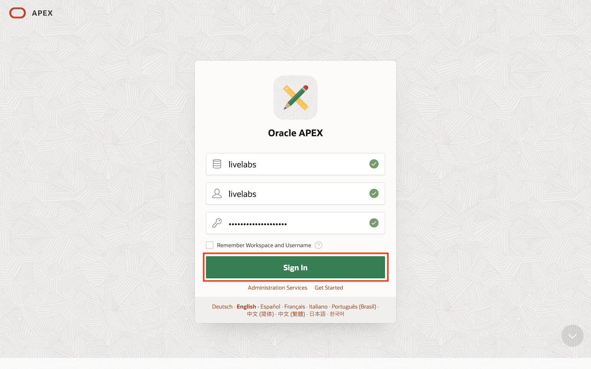
1. Click on the *App Builder* icon.
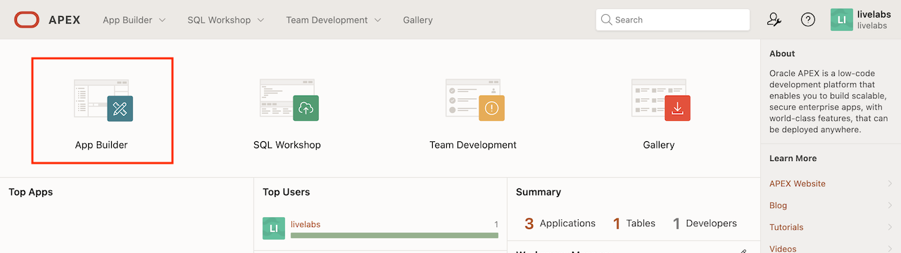
1. Click on the *Workspace Utilities* icon.
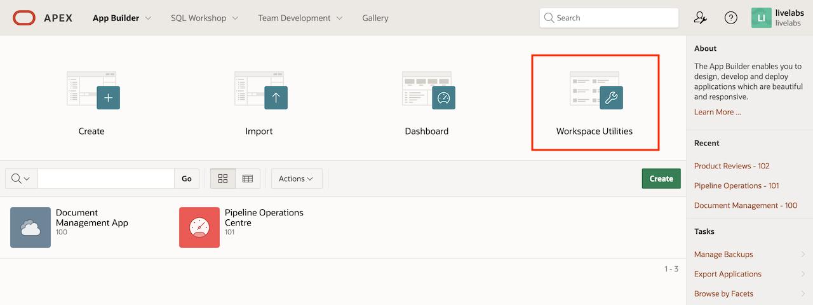
1. Click on the *Web Credentials* link.
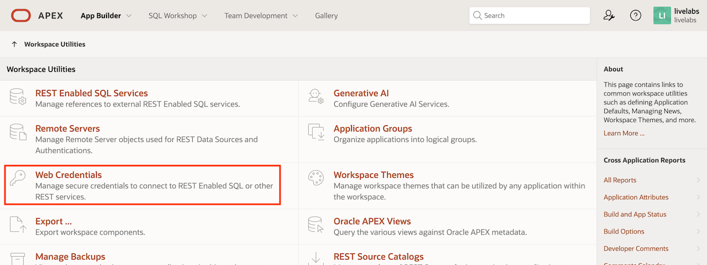
1. Click the *Create* button.
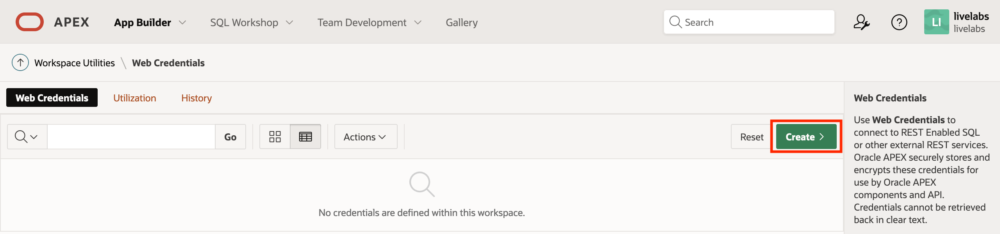
1. Select the authentication type *Oracle Cloud Infrastructure (OCI)*, and then enter the information from Lab 1, Task 4, when an API key was generated for the *Identity and Access Management* (IAM) user that will interact with the OCI REST APIs on the application's behalf. The required information are the tenancy [Oracle Cloud ID](https://docs.oracle.com/iaas/Content/General/Concepts/identifiers.htm) (OCID), user OCID, fingerprint of the user's API public key, and the user's API private key. Then, click the *Create* button.
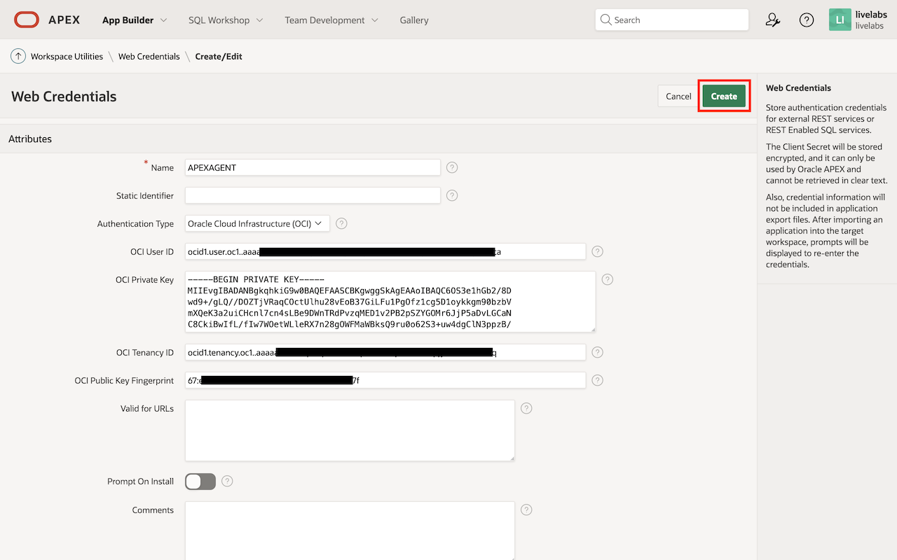
1. Unless specified, the web credential's *Static Identifier* is derived from its name. Note that it may be lowercased. Modify as required.
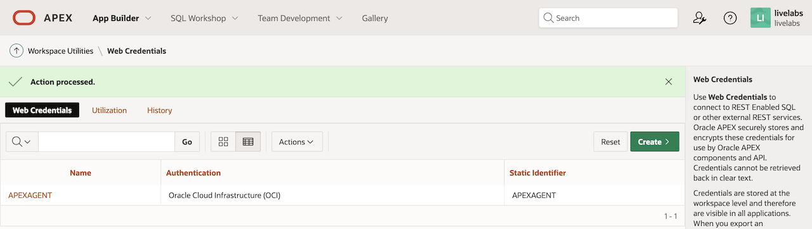

## Task 2: Create an Application Using Quick SQL

1. From the top menu, click the down-pointing chevron, and then click the *Create* menu item.
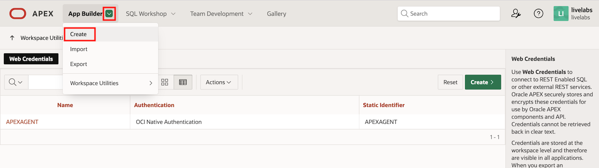
1. Select the option *Create App From Quick SQL*.
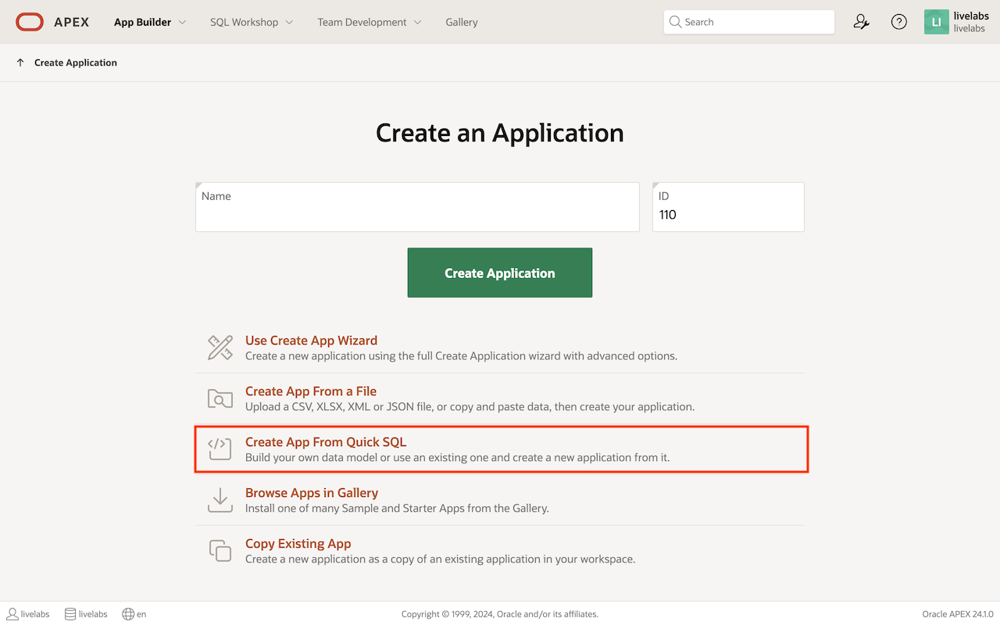
1. Copy the Quick SQL code below, and then click the *Review and Run* button. The code will generate the necessary data definition language (DDL) to create the *REVIEW* table that has the columns `PROD_ID` that is used to reference products in the sample schema's *PRODUCTS* table, `CONTENT` to store the user-submitted review text, `REVIEW_SCORE` that will capture the predicted review score.
    ```
    <copy>
    review /audit columns
        prod_id number not null
        content clob /nn
        review_score number(1,0) /nn /between 1 and 5
        reviewed_by vc30 /nn
        reviewed_on tstz /nn
    </copy>
    ```
    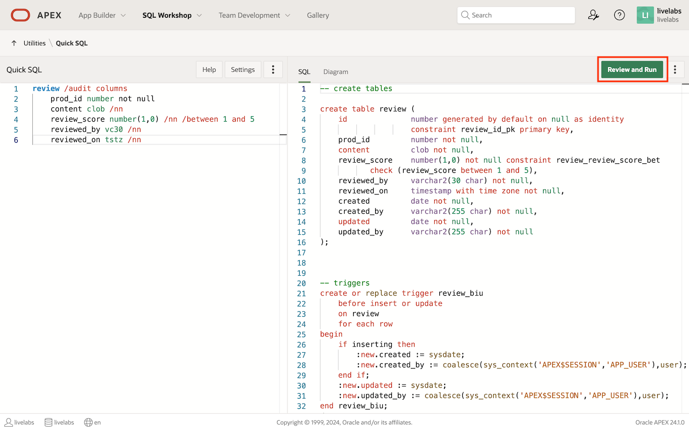
1. Review the script, enter a *Script Name*, and then click the *Run* button.
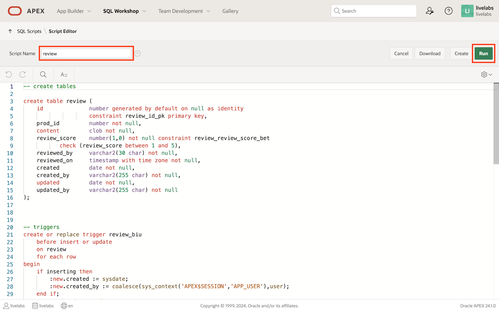
1. Confirm the execution of the script by clicking the *Run Now* button.
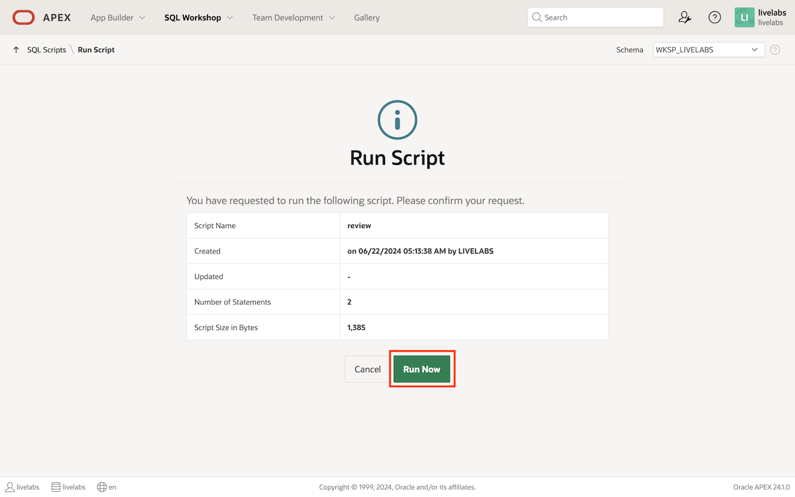
1. Review the results. If there are no errors, click the *Create App* button.
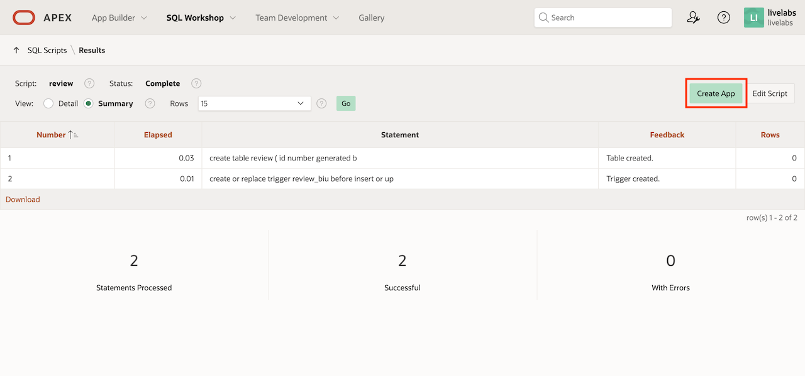
1. Ensure that the correct schema is selected, and then click the button *Create Application*.
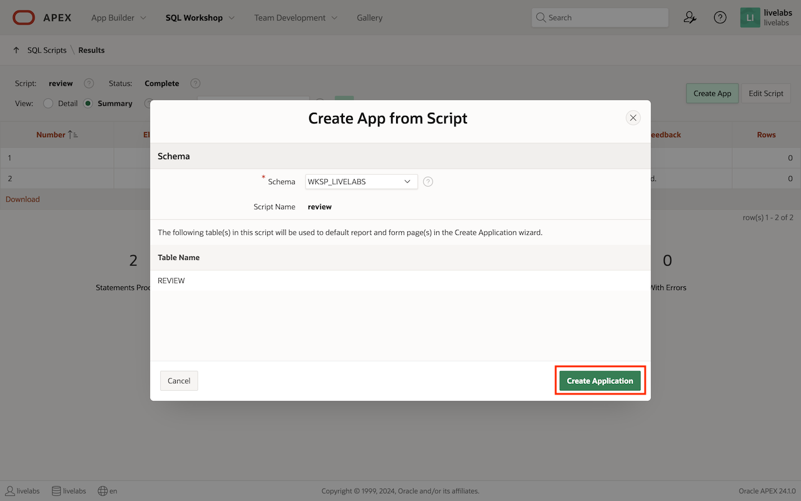
1. Enter the application's name, and then click the *Create Application* button.
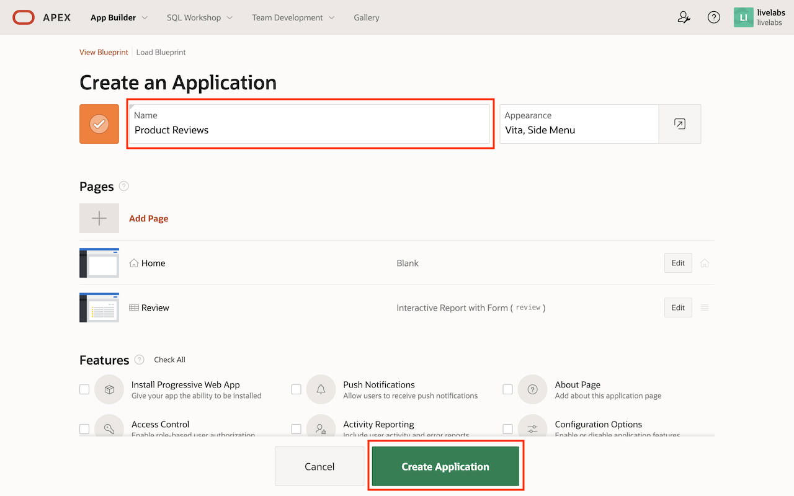

## Task 3: Create Substitution Strings

1. Go to the application definition page.
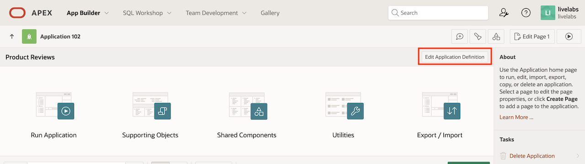
1. In the *Substitutions* region, enter two new substitution strings, and then click the *Apply Changes* button.
    * `G_MODEL_DEPLOYMENT_PREDICT_URL` - the model deployment's predict endpoint URL.
    * `G_OCI_CREDENTIAL_STATIC_ID` - the static ID of the web credentials storing the API keys for the IAM user that will consume the endpoint.
    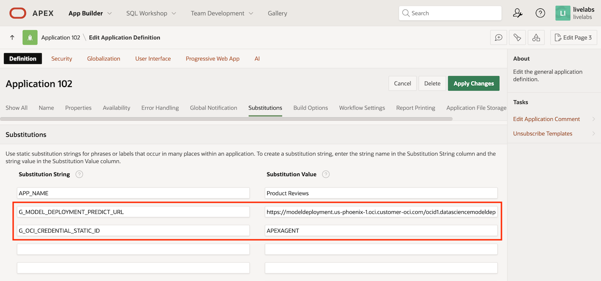

## Task 4: Modify Review Details Page

1. From the application's home page, click to edit page 3, the review details page.
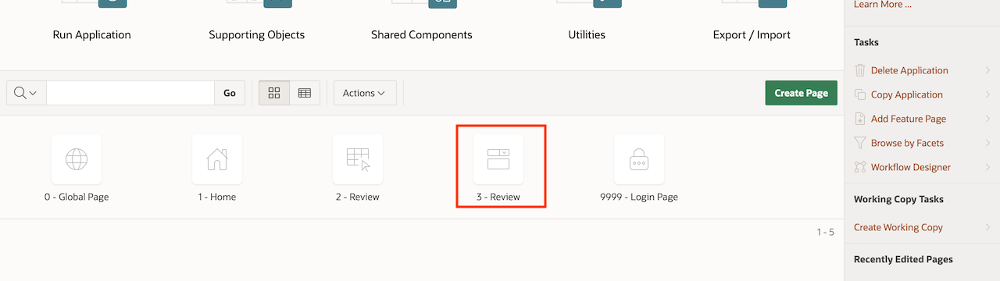
1. Modify the `P3_PROD_ID` page item. 
    * Change the type to *Popup LOV*.
    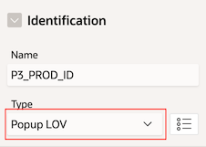
    * Set the *List of Values* to type *SQL Query* and provide the statement.
        ```sql
        <copy>
        select
            prod_name as display_value
            , prod_id as return_value
        from sh.products
        </copy>
        ```
    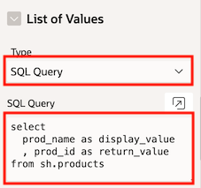
1. Add a dynamic action named *On Change Predict Review Score*.
    * Ensure that the event is set to *Change*, the *Selection Type* is *Item(s)*, and the *Item(s)* is set to `P3_CONTENT`.
    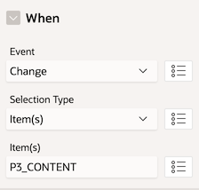
    * Set the *Client-side Condition* to type *Item is not null* and the item `P3_CONTENT`.
    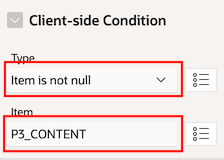
    * Change the action to type *Set Value*.
    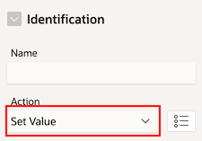
    * Set the *Set Type* setting to *PL/SQL Function Body*, with the function below, and then set the *Items to Submit* to `P3_CONTENT`.
        ```sql
        <copy>
        declare
            l_response clob;
            l_values apex_json.t_values;
            l_prediction_label varchar2(10);
        begin
            apex_web_service.g_request_headers(1).name := 'Content-Type';
            apex_web_service.g_request_headers(1).value := 'application/json';

            l_response := apex_web_service.make_rest_request(
                p_credential_static_id => :G_OCI_CREDENTIAL_STATIC_ID
                , p_http_method => 'POST'
                , p_url => :G_MODEL_DEPLOYMENT_PREDICT_URL
                , p_body => '[' || apex_json.stringify(:P3_CONTENT) || ']'
            );

            if apex_web_service.g_status_code = 200 then
                apex_json.parse(
                    p_values => l_values
                    , p_source => l_response
                );

                l_prediction_label := apex_json.get_varchar2(
                    p_values => l_values
                    , p_path => 'prediction[1].label'
                );

                return
                    case l_prediction_label
                        when 'LABEL_0' then 1
                        when 'LABEL_1' then 2
                        when 'LABEL_2' then 3
                        when 'LABEL_3' then 4
                        when 'LABEL_4' then 5
                        else null
                    end;
            else
                raise_application_error(-20001, 'Failed to process new review.');
            end if;
        end;
        </copy>
        ```
    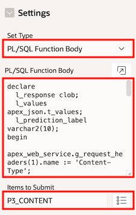
    * Set the *Affected Elements* to *Selection Type* *Item(s), and the *Item(s)* to `P3_REVIEW_SCORE`.
    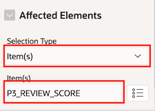
    * Disable the *Fire on Initialization* option.
    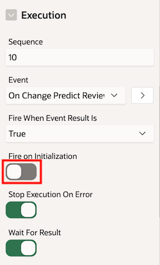
1. Modify the `P3_REVIEW_SCORE` page item.
    * Set the type to *Star Rating*
    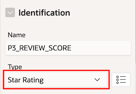
    * Ensure that the *Number of Stars* setting is set to a value of `5`.
    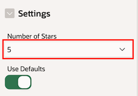
1. Set the `P3_REVIEWED_BY` page item's default value to the PL/SQL expression:
    ```sql
    <copy>
    :APP_USER
    </copy>
    ```
    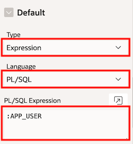
1. Set the `P3_REVIEWED_ON` page item's default value to the PL/SQL expression:
    ```sql
    <copy>
    systimestamp
    </copy>
    ```
    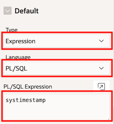

## Task 5: Run Application

1. Click the "run" button on the top-right of the *Page Designer*.
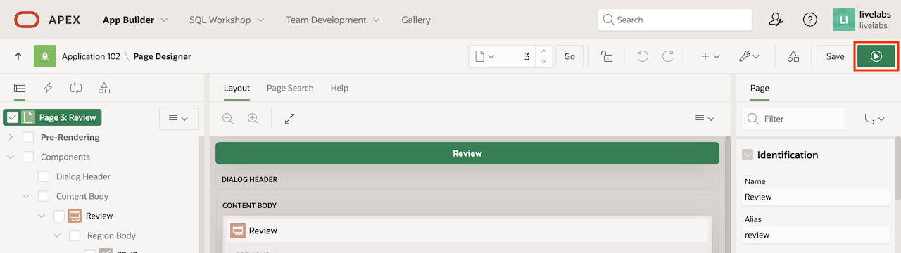
1. Login to the application using an Oracle APEX user account. Enter a valid username and password, then click the *Sign In* button.
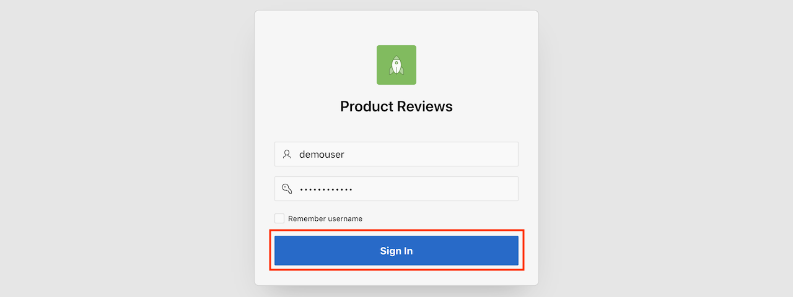
1. Click on the *Review* card on the application's home page.
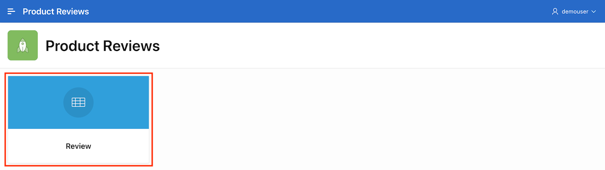
1. Click on the *Create* button to create a new review.
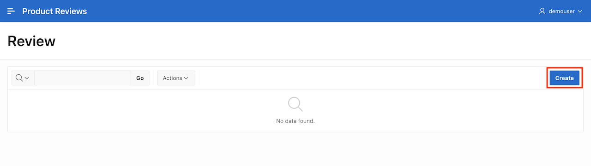
1. Create a new review of a product that you are not pleased with. Here's an example of a negative review for a home theatre package.
    ```
    <copy>
    The Home Theatre Package, boasting DVD audio and video playback capabilities, initially seemed like a solid choice for cinephiles seeking an immersive experience. However, my excitement waned as I encountered several issues. First, the bass-heavy audio distorted at higher volumes, undermining the cinematic impact. Second, the lack of HDR10+ support left me yearning for better contrast and vibrancy. While the sleek design and Dolby Atmos compatibility were commendable, the overall execution fell short. If you’re considering this package, proceed with caution and perhaps explore other options.
    </copy>
    ```
    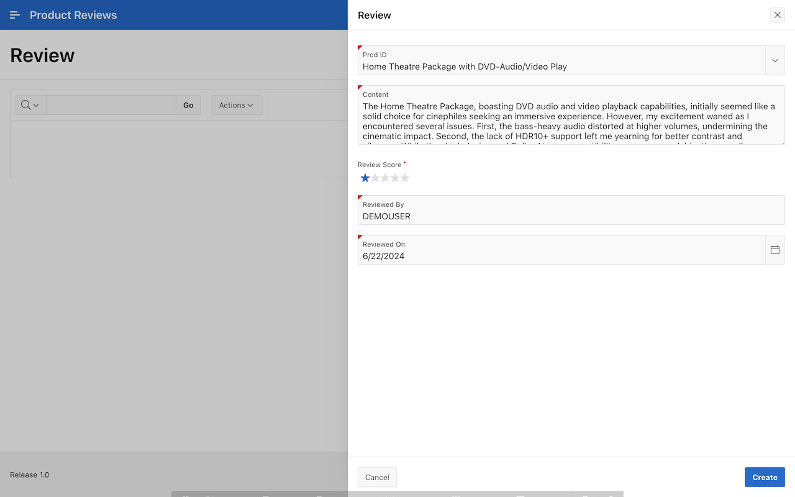
1. The *Review Score* star rating should be set automatically when the cursor leaves the *Content* textarea. Click the *Create* button to save the review.
1. Repeat with another review about a product that you enjoyed. Below is a sample text for a book.
    ```
    <copy>
    In this captivating documentary series, we follow two Australian comic book creators, Wolfgang Byslma and Skye Walker Ogden, as they embark on an audacious quest to conquer the American comic book industry. Their passion, struggles, and creative vision unfold against a backdrop of ink-stained pages, conventions, and iconic characters. While the series occasionally stumbles in pacing, it celebrates the indomitable spirit of those who wield pencils and dreams. Whether you’re a seasoned fan or a curious newcomer, Comic Book Heroes offers an engaging glimpse into a world where imagination knows no bounds.
    </copy>
    ```
    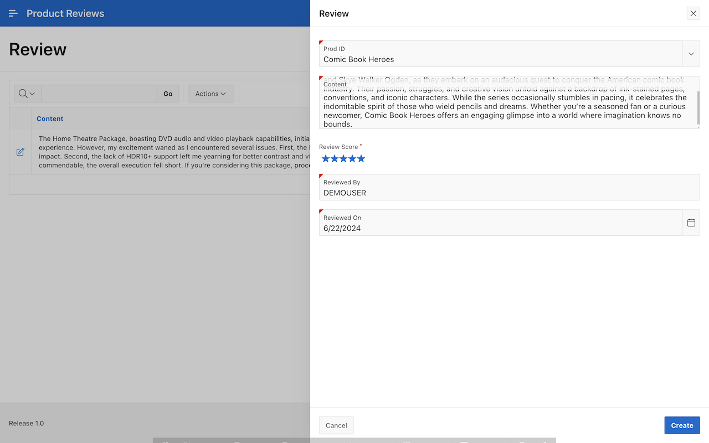

Congratulations! You have **completed** all the necessary labs and tasks.

## Acknowledgements

* **Author** - Adrian Png, Director of Innovation, AI and Cloud Solutions, Insum Solutions Inc.
* **Last Updated By/Date** - Adrian Png, June 2024
