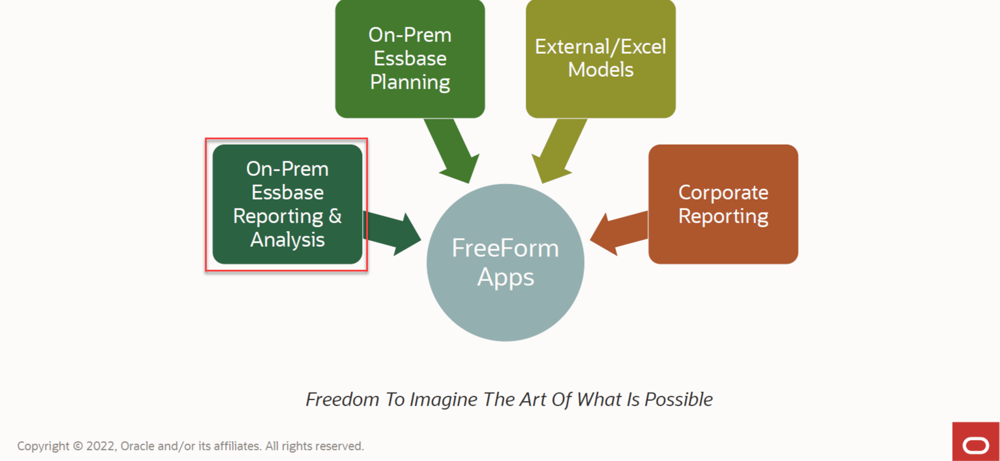
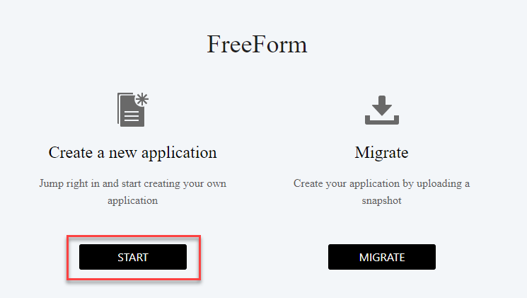
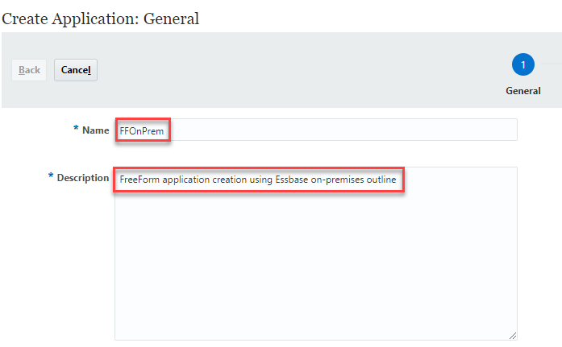
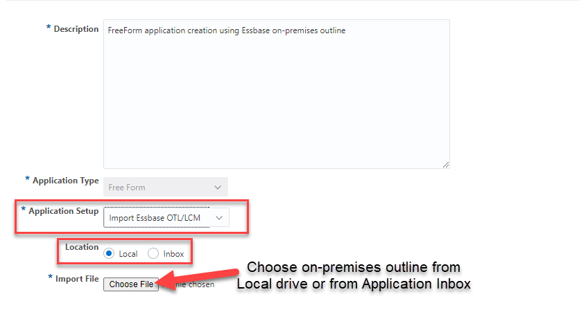
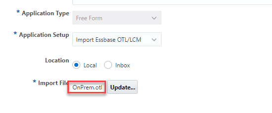
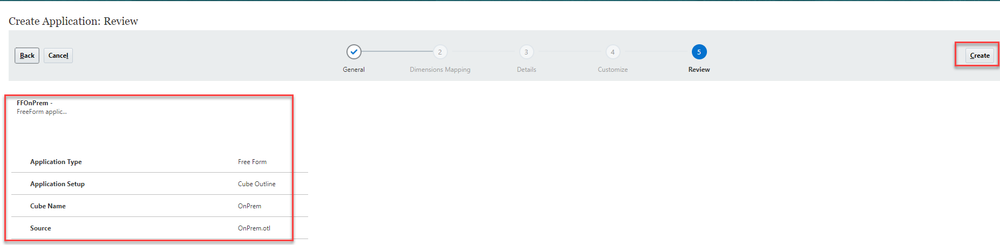
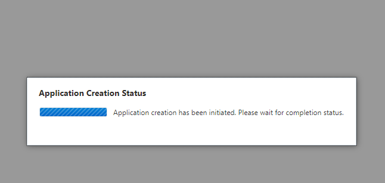
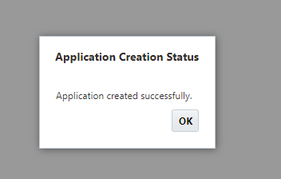

# Create Freeform application using an Oracle Essbase Outline

## Introduction

One of the main use cases for Freeform application is the ease with which an Essbase outline can be used to build Freeform application in EPM Cloud. 	
In this lab, we will use an existing Essbase outline for Aggregate Storage Option (ASO) and create a Freeform application from it.

Estimated Lab Time: 7 minutes

### About creating Freeform application using on-premises outline
Use Cloud EPM Freeform application to migrate on-premises Essbase outline. The process will use an outline file from on-premises application to build the Freeform ASO application.

### Objectives

In this lab, you will:
* Import an ASO outline to EPM Cloud
* Create a Freeform application using the ASO outline

### Prerequisites

This lab assumes you have:
* Access to an Essbase on-premises outline file
* An Oracle Cloud EPM Enterprise subscription
* Service administrator rights to the instance where you are going to create the Freeform application

## Task 1: Creation Process

1. Hit **Start** under **Create a new application**.

	

2. Populate **Name** and **Description** for the Freeform application being created.

  

3. Ensure **Application Setup** is set to **Import Essbase OTL/LCM**. You will need to specificy the **Location** of the file which could either be your **Local drive** or the **Application Inbox**.

  

4. Once the **Import File (Outline File)** is selected you will see the outline populated. Hit **Next**.

  

5. **Review** all your details before hitting **Create**. Once you hit **Create**, an **Application Creation Status** window will guide you through the creation process.
  
  

6. You have created a **Freeform application using an Oracle Essbase outline** (an on-premises outline).
  
   
## Learn More

*Learn more about Freeform applications by using the links below*

* [Information on Oracle Cloud EPM Freeform](https://www.oracle.com/performance-management/FreeForm/) 
* [Create using Outline or a LCM package aka snapshot](https://docs.oracle.com/en/cloud/saas/planning-budgeting-cloud/pfusa/creating_a_freeform_app_using_an_outline_file_or_snapshot.html)
* [Freeform Apps FAQs](https://docs.oracle.com/en/cloud/saas/planning-budgeting-cloud/pfusa/freeform_apps_faq.html)

## Acknowledgements
* **Author** - Vatsal Gaonkar, Director - Cloud & Digital, PwC
* **Last Updated By/Date** - Vatsal Gaonkar, 15 May 2024