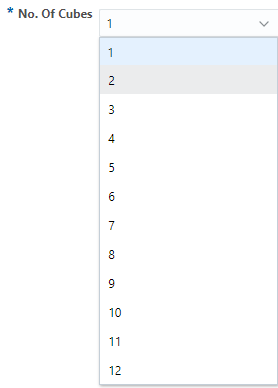
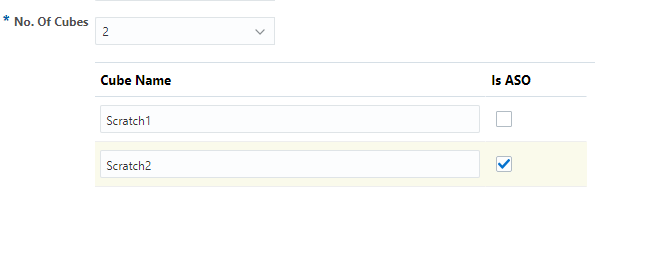
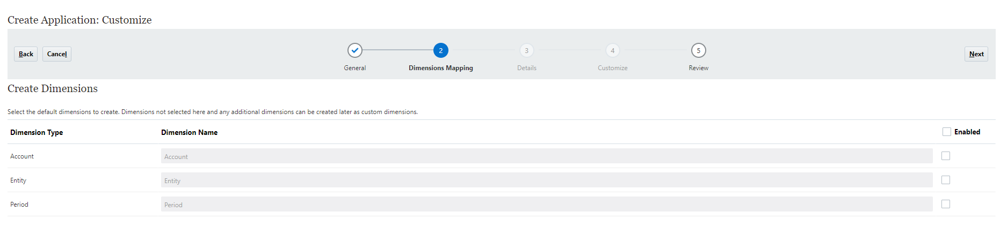
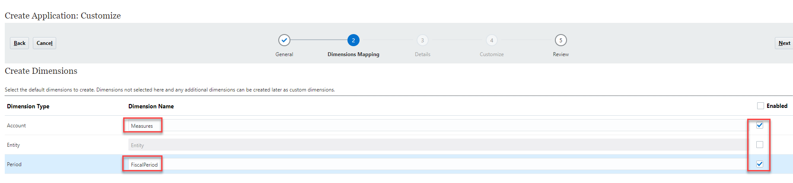
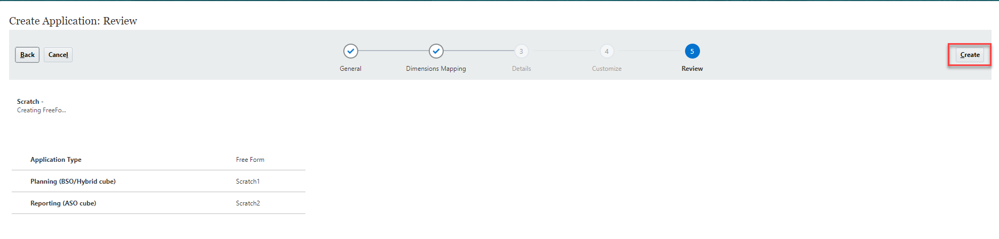
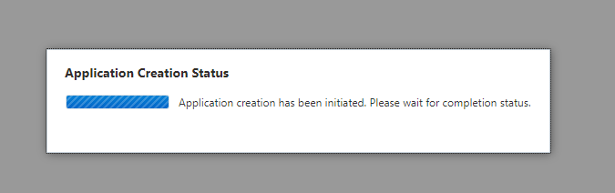
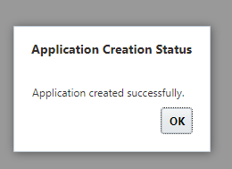

# Create FreeForm application using the Application Creation Wizard (from Scratch)

## Introduction

You can also use the **Application Creation Wizard** in Oracle EPM Cloud to create FreeForm applications. This lab will walkthrough the steps of creating a FreeForm application with multiple cubes in the application.

Estimated Lab Time: **10 minutes**

### About
While a few initial steps will be the same, creating FreeForm application using the **Application Creation Wizard** vastly differs from importing an Outline or a Snapshot. You will learn how to quickly get a FreeForm application stood along with its dimensions across multiple cubes.

### Objectives

In this lab, you will:
* Create a FreeForm application using the **Application Creation Wizard** aka **Create from Scratch**

### Prerequisites

This lab assumes you have:
* An Oracle EPM Enterprise Cloud subscription
* Service administrator rights to the instance where you are going to create the FreeForm application

## Creation Process

1. Hit **Start** under **Create a new application**.

	

2. Populate **Name** and **Description** for the FreeForm application being created.

  

3. Under **Application Setup** select **Create Cubes**. 

  

4. You can select upto 12 cubes to create.
   

5. These cubes can be a combination of **block storage (BSO)** and/ or  **aggregate storage (ASO cubes)**. For more information on **Multi-Cube FreeForm Applications** check [Understanding FreeForm Applications](https://docs.oracle.com/en/cloud/saas/planning-budgeting-cloud/pfusa/understanding_freeform_apps.html). For this exercise we will select 2 cubes. We will make one of the cubes an ASO cube.
  

6. Upon hitting **Next** the **Create Dimensions** screen shows up.
  

7. Enable both **Account** and **Period** type dimension and rename them to **Measures** and **FiscalPeriod** respectively. We will discuss why this is important during the **Optimize FreeForm Configuration** lab (next lab). Hit **Next** after this dimension configuration.
  

8. Review and hit **Create** in this next step. 
  

9. Track the status through Creation for the FreeForm application. 
  
  

10. Keep your FreeForm application intact that was created from this lab for next lab. 

## Learn More

*Learn more about FreeForm applications by using the links below*

* [Create using Application Creation Wizard](https://docs.oracle.com/en/cloud/saas/planning-budgeting-cloud/pfusa/creating_a_freeform_app_using_the_application_creation_wizard.html)
* [FreeForm Apps FAQs](https://docs.oracle.com/en/cloud/saas/planning-budgeting-cloud/pfusa/freeform_apps_faq.html)

## Acknowledgements
* **Author** - Vatsal Gaonkar, Director - Cloud & Digital, PwC
* **Last Updated By/Date** - Vatsal Gaonkar, March 2023