# Optimal configuration

## About

There are certain considerations to optimize a FreeForm application. This lab will start the process of building to optimize some of such configurations, one of which was already done in the previous lab for **Period** dimension during the creation of the **Scratch** FreeForm application. In addition to understanding **Period** dimension configuration, you will also be uploading additional dimensions to pave the way for follow-on optimal configurations in the following workshop and labs.

Estimated Lab Time: **10 minutes**

### Objectives

In this lab, you will:
* Adjust configurations of FreeForm application namely **Scratch** that you just created using the **Application Creation Wizard**.
* Add dimensions and members to the **Scratch** application using **Import Metadata** feature.
* Understand an optimal configuration for **Period** dimension vis-a-vis **BSO** and **ASO** plan types.

### Prerequisites

This lab assumes you have:
* An Oracle EPM Enterprise Cloud subscription
* Service administrator rights to the instance where you are going to create the FreeForm application

## Dimension configuration

1. Navigate to dimensions in the application created in the previous lab. Click on **Overview** and the navigate to **Dimensions**.
	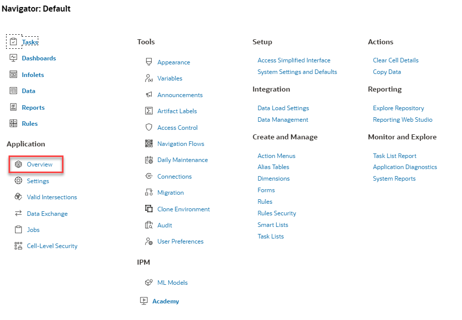
	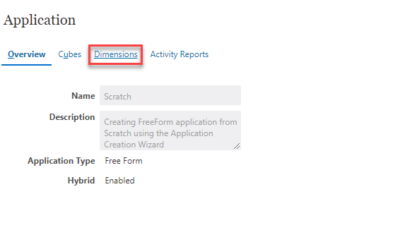

2. When in **Dimensions** toggle or ensure that you have picked **All** in the dropdown.
	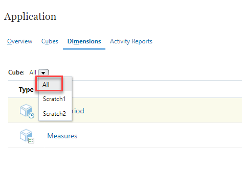
	
	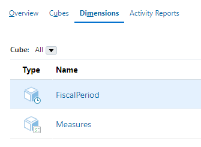

3. Create 3 more dimensions namely **Scenario**, **FiscalYear** and **Company**
    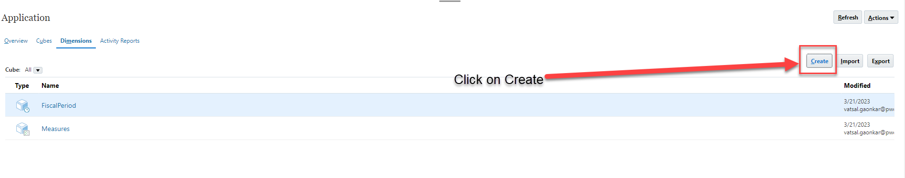
	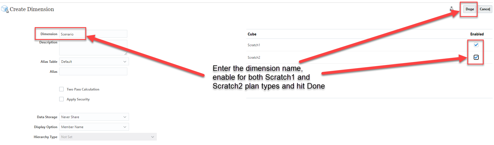
	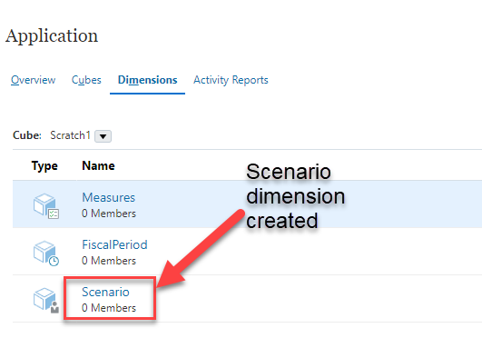

4. Similary create **FiscalYear** and **Company**. Next we will import members into these dimensions using files.
	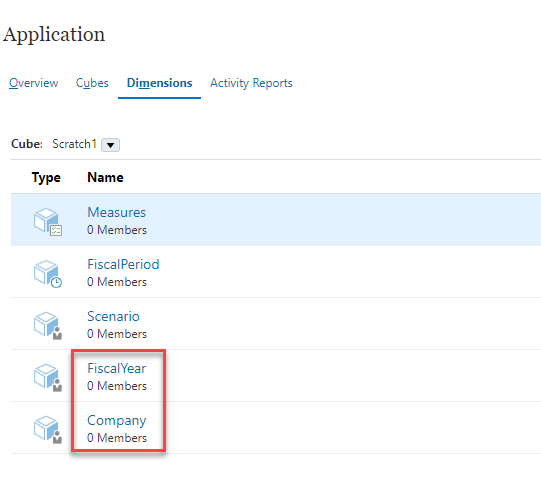

5. Download the files with members for [Company dimension](files/Company.csv) [Measures dimension](files/Measures.csv) [FiscalYear dimension](files/FiscalYear.csv) [FiscalPeriod dimension](files/FiscalPeriod.csv) and [Scenario dimension](files/Scenario.csv) to your local drive. 

6. From **Overview>Dimensions** hit **Import**.
	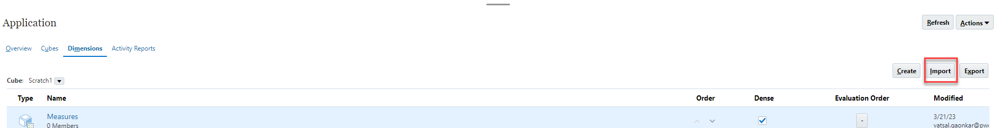

7. Hit **Create** and navigate to select the downloaded files to build dimensions.
	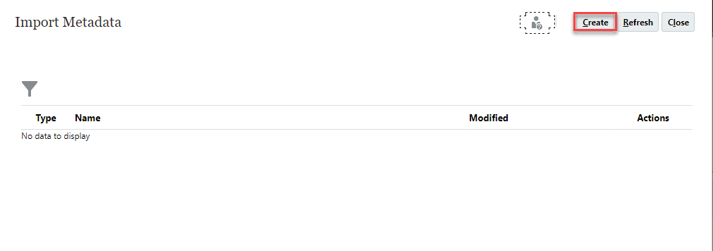
	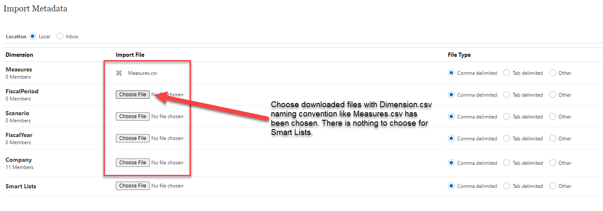
	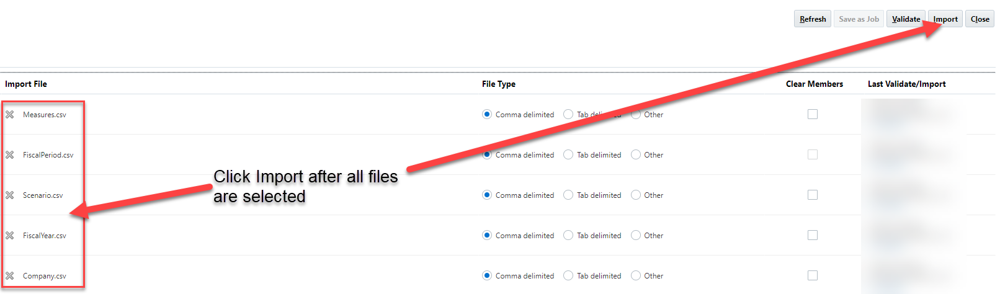
   
   Check the **Refresh Database if Import Metadata is successful** option and hit **OK**.
	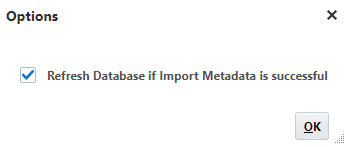

   Job successfully submitted window appears - Hit **OK**.
   	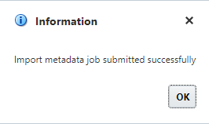

8. Hit **Close** on open windows for the application and go to **Jobs** to check the status of dimension build.
	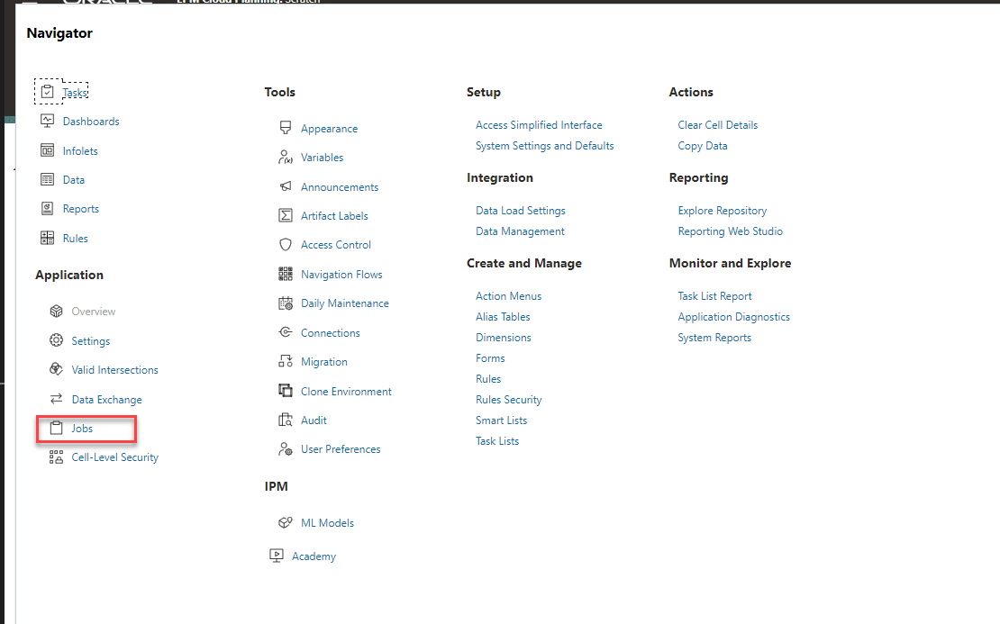
   
   Check to ensure both **Import Metadata** and **Refresh Database** were successful. You have completed the build of dimensions.
   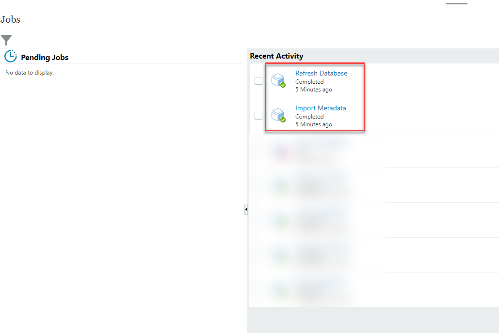
   

## Tips and Techniques
### Period dimension assignment
Setting up of **FiscalPeriod** dimension in the application as a **Period** dimension. You can confirm that your **FiscalPeriod** dimension is a **Period** or **Time** dimension by navigation to **Application>Overview>Dimensions** and checking the **time** icon on the cube in front of the dimension name.
	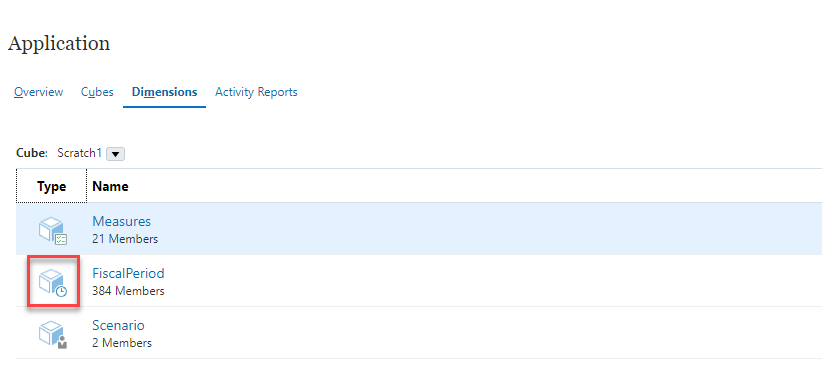

Assigning the time or period dimension appropriately aids in two main aspects - 
* Ensuring seamless period mapping with **Data Integration** which is an integration layer for EPM Cloud applications. For more info check  [Data Integration](https://docs.oracle.com/en/cloud/saas/enterprise-performance-management-common/diepm/integrations_about_110x65a03764.html)
* For ASO (Aggregate Storage Option) databases in an application, setting a compression dimension ensures performant ASO database. It is always recommended to the most dense dimension in an ASO database as the compression dimension, yet at the same time EPM Cloud does not expose the ability to pick a compression dimension. By virue of picking a **Period** or **Time** dimension, ASO in EPM Cloud automatically makes that dimension in this case **FiscalPeriod** a compression dimension, thereby ensuring optimal performance.

### Additional Tips and Techniques
A following workshop will share tips and techniques on optimizing FreeForm applications for following - 
* How to design optimal Data forms in absence of start and end periods from scenario management. More information on [Designing Data Forms](https://docs.oracle.com/en/cloud/saas/planning-budgeting-cloud/pfusa/forms.html)
* Using subvars and groovy scripting to create data form open and close periods. More information on [About Substitution Variables](https://docs.oracle.com/en/cloud/saas/planning-budgeting-cloud/pfusa/about_substitution_variables.html)
* Using groovy scripting to ensure focused data pushes between ASO and BSO plan types

## Learn More

*Learn more about FreeForm applications by using the links below*

* [Create using Application Creation Wizard](https://docs.oracle.com/en/cloud/saas/planning-budgeting-cloud/pfusa/creating_a_freeform_app_using_the_application_creation_wizard.html)
* [FreeForm Apps FAQs](https://docs.oracle.com/en/cloud/saas/planning-budgeting-cloud/pfusa/freeform_apps_faq.html)

## Acknowledgements
* **Author** - Vatsal Gaonkar, Director - Cloud & Digital, PwC
* **Last Updated By/Date** - Vatsal Gaonkar, March 2023