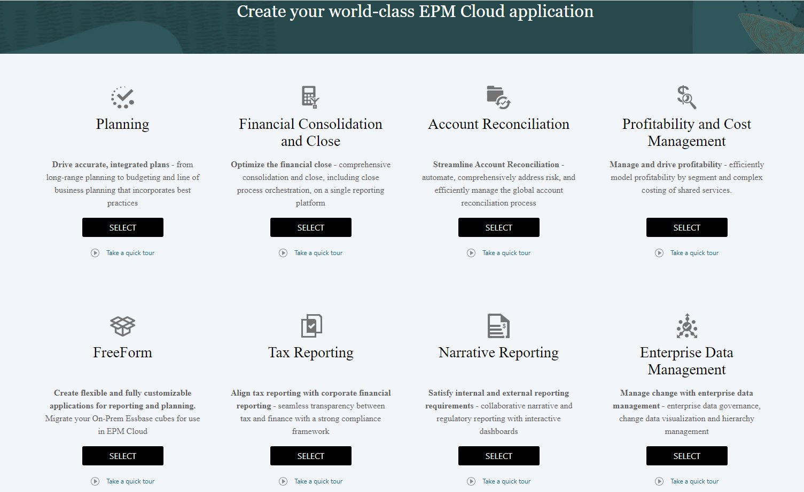
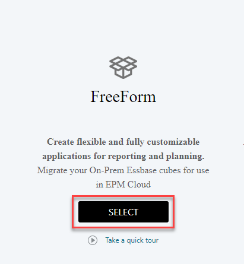
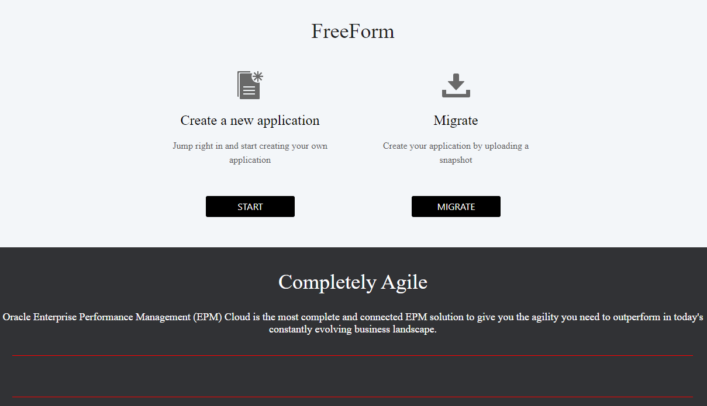

# Setting up the EPM Cloud instance

### **Prerequisites**

Ensure the following that:
* You have an Oracle EPM Enterprise Cloud subscription
* You are a service administrator for the instance where you are going to create the FreeForm application

## Task: FreeForm Application creation readiness

1. *Check whether you have Oracle EPM Enterprise Cloud subscription* 
  
  When you login to your EPM Cloud environment, check whether you have an ability to pick from the below applications as shown. You will be selecting **FreeForm** from the below.

	

2. *Enable the instance as a FreeForm application instance*

  Hit **Select** under FreeForm.

  

  The instance will be created as a **FreeForm** application instance.

  

  You are now ready to start the FreeForm application creation process. In the next 3 labs you will navigate options to create and configure FreeForm applications as per your business needs.

## Learn More

* [Creating an EPM Enterprise Cloud Service Application](https://docs.oracle.com/en/cloud/saas/planning-budgeting-cloud/pfusa/about_epm_enterprise_landing_page.html)
* [Understanding FreeForm applications](https://docs.oracle.com/en/cloud/saas/planning-budgeting-cloud/pfusa/understanding_freeform_apps.html)

## Acknowledgements
* **Author** - Vatsal Gaonkar, Director - Oracle Cloud & Digital, PwC
* **Last Updated By/Date** - Vatsal Gaonkar, March 2023
