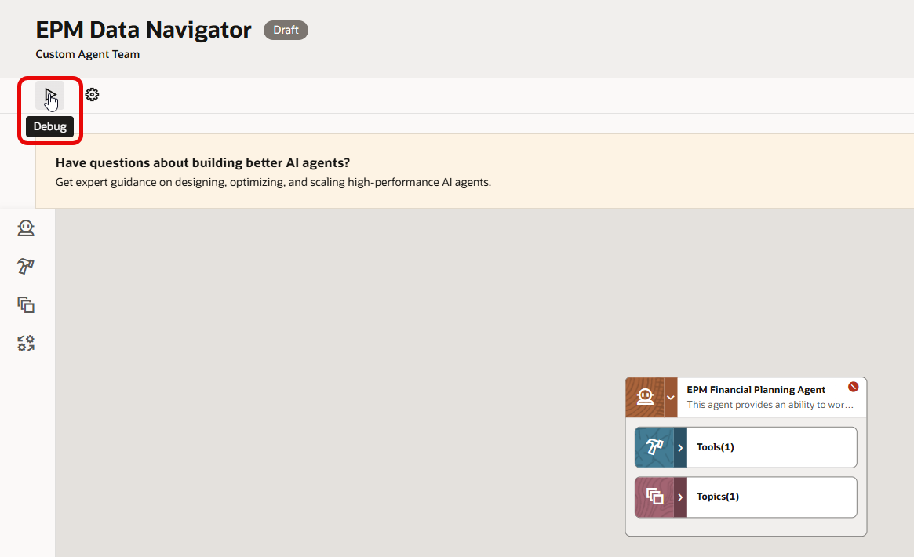
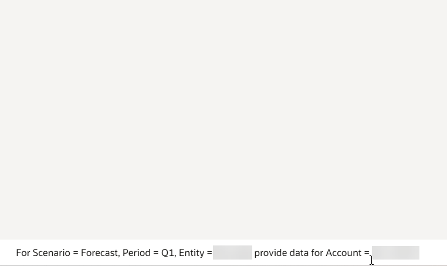
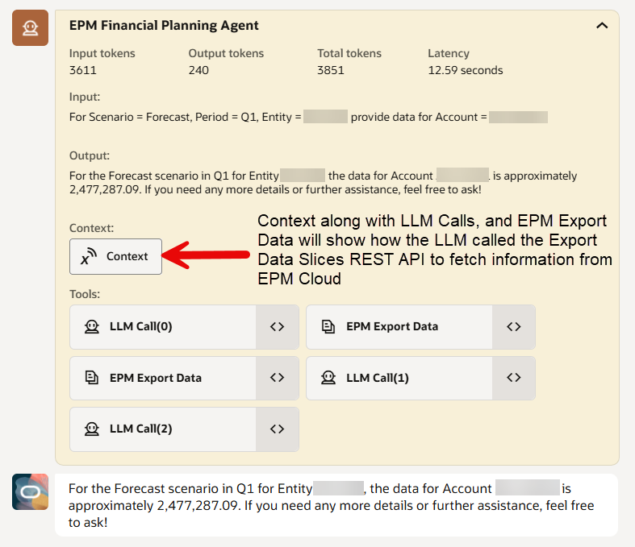
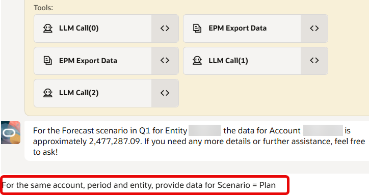
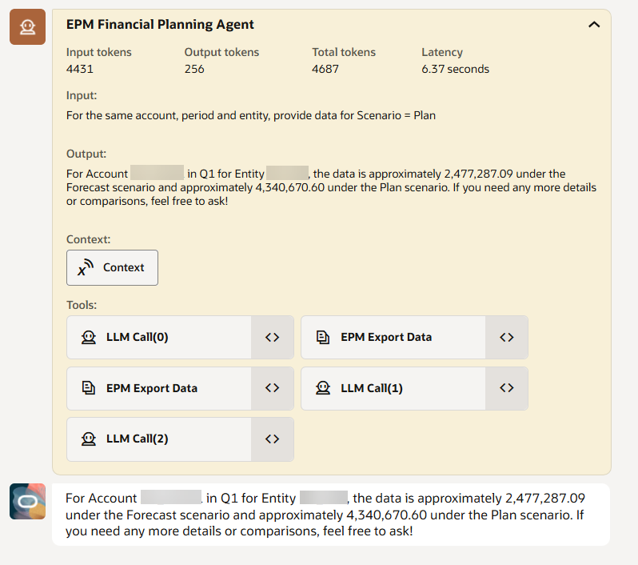

# Test the Agent

## Introduction

Now that the Agent is created, this lab will go through steps of asking questions and observe behavior of the responses. The response improves with each iteration of querying/ questioning/ prompting.

Estimated Lab Time: 10 minutes

### About using Agent Teams
The key to getting appropriate answer depends upon providing information within the constraints of the Agent Tools and Topics. Querying should also be efficient in terms of providing key input parameters and follow-up questions. With proper querying/ prompting, AI Agent's performance improves.

### Objectives

In this lab, you will:
* Ask questions and observe behavior
* See how context setting will work in each subsequent prompt of the Agent

### Prerequisites (Optional)

This lab assumes you have:
* An Oracle Fusion AI Agent license & account
* A foundational understanding of AI Agent Studio components
* An Agent built in Agent Studio that is ready for prompting

## Task 1: Basic Prompting

1. Go to **Agent Teams** and search for **EPM Data Navigator** and then click the **Edit** pencil.

	

2. Hit the **Debug** button to start prompting and to observe behavior.

	

3. In the Agent window ask specific questions with input parameters stated.

    *Note - Account and Entity are blurred for confidentiality reasons.*

	

4. Observe the output and behavior of this basic prompt. You will see information on tokens, time taken (latency), input parameters and outputs.

	

## Task 2: Advanced prompting with context

1. Continue to prompt in the same window as it now has context. Use the following prompt show in the picture below.

	

2. Observe the output and behavior for this Advanced Prompt provided. What has happened is that the Agent has now just substituted the Scenario to be **Plan** instead of **Forecast** and provided information for both Forecast and Plan. Now the Agent is using follow-up context.

	

3. Try the following prompts next: 

    *"Provide the same information for Period = Jan"*
    
    *"Provide variance between Forecast and Plan"*

What you will observe is that the Agent produces output using the context of both previous outputs and new inputs. 

You have now built your first basic EPM Data Navigator in AI Agent Studio using an External REST API Tool.

## Learn More

*Useful resource links:*

* [How to use and build in AI Agent Studio](https://docs.oracle.com/en/cloud/saas/fusion-ai/aiaas/overview.html)
* [Components of Agent Studio](https://docs.oracle.com/en/cloud/saas/fusion-ai/aiaas/components-of-ai-agent-studio.html)

## Acknowledgements
* **Author** - Vatsal Gaonkar, Director, Digital Core Modernization, PwC
* **Last Updated By/Date** - Vatsal Gaonkar, March 2026
