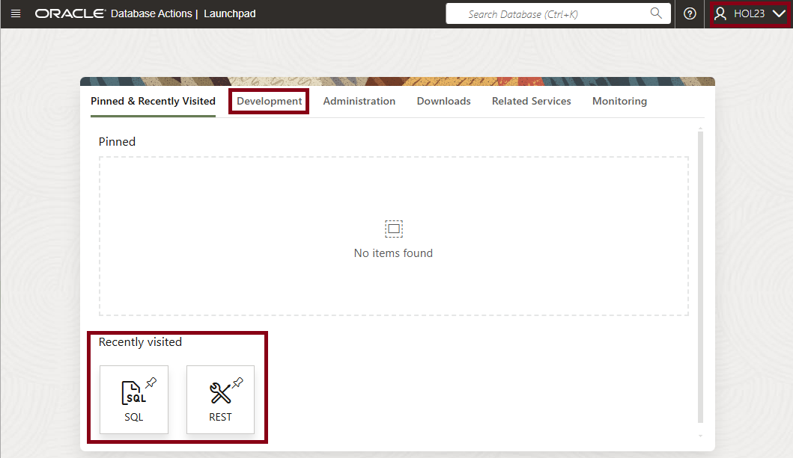
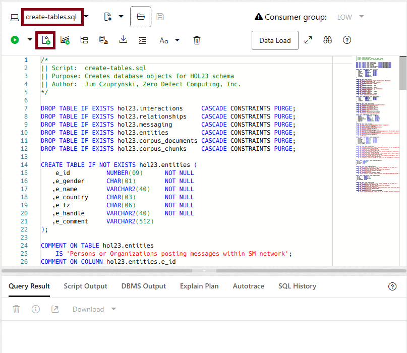
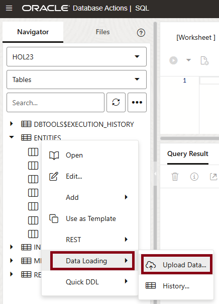
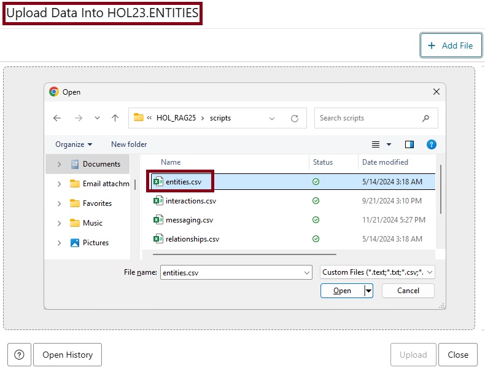
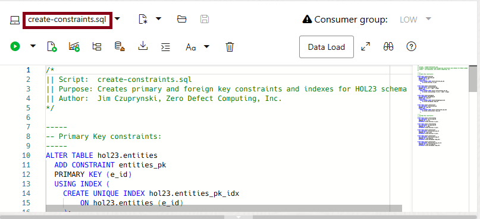

# Populate Database Schema

## Introduction
Our next step is to create and populate all needed tables and other database objects. This lab assumes that you have already created your Oracle Autonomous Database 23*ai* Always Free instance and explored the database tools available for accessing your database environment, especialy SQL Developer Web.

**Estimated Time: 10 minutes**

### Objectives

In this lab, you will:

- Create database objects and populate them with data
- Create an Operational Property Graph view for querying and analyzing the social media campaign's data and relationships

### Prerequisites

This lab assumes you have completed all previous labs successfully.

## Task 1: Create and populate database tables and related objects

1. Log in As the **hol23** user using the password *Future1sNow#*:

    

2. Open your local directory where you downloaded all the scripts and files.

    

    

3. We will now build and populate all of the database objects needed to demonstrate the features of the VECTOR datatype.

- Open the file named **create_tables.sql** by clicking on the *File ... Open* icon. 
- Click the button that shows a document with the small green play button - the *Run Script* button - or simply hit *F5* to execute the script. 

   

4. Review the tables have been created properly in the left-hand panel. 

   

5. Now let's populate the tables that comprise the social media network and messages exchanged between personas in that network. Select the **ENTITIES** table, click the right-mouse button, select the *Data Loading* option, and then choose the *Upload Data ...* option.

   

    When prompted, select the **entities.csv** file from the directory where you downloaded files.

   

    When the file is ready for loading, it will appear with a *Pending* status in the upper-left corner. Click the *Upload* button to start the loading process.

   

    The table should load in a few seconds; when the process is finished, the file's status will change to *Uploaded* and you can now click the *Close* button.

   

6. *Repeat this same process* to load the **INTERACTIONS, MESSAGES,** and **RELATIONSHIPS** tables using each table's corresponding CSV file.

7. If desired, you can browse the contents of each table by highlighting it in the left-hand panel and selecting the *Open* option:

   

    Here's a brief example of the contents of the **ENTITIES** table. You can just click the *Close* button in the bottom-right-hand corner to close this window.

   

8. Open and execute the script named **create-constraints.sql** to apply primary key and foreign key constraints to these four tables.

   

9. Open and execute the script named **create-opgs.sql** to create a new *Operational Property Graph* (OPG) named **SMI\_PAYLOADS.** Our APEX application and PL/SQL packages will use this view in future steps to navigate the contents of and relationships between social media posters and postings.

   

10. **Your schema setup is now complete.** You may proceed to the next lab.

## Learn More
- [Operational Property Graph Fundamentals](https://docs.oracle.com/en/database/oracle/property-graph/24.3/spgdg/introduction-property-graphs.html)
- [Oracle SQL Web Developer Concepts and Usage](https://docs.oracle.com/en/cloud/paas/autonomous-database/serverless/adbsb/connect-database-actions.html#GUID-102845D9-6855-4944-8937-5C688939610F)

## Acknowledgements
* **Author** - [Oracle LiveLabs Contact], Jim Czuprynski
* **Contributors** - Jim Czuprynski, LiveLabs Contributor, Zero Defect Computing, Inc.
* **Last Updated By/Date** - Jim Czuprynski, February 2025