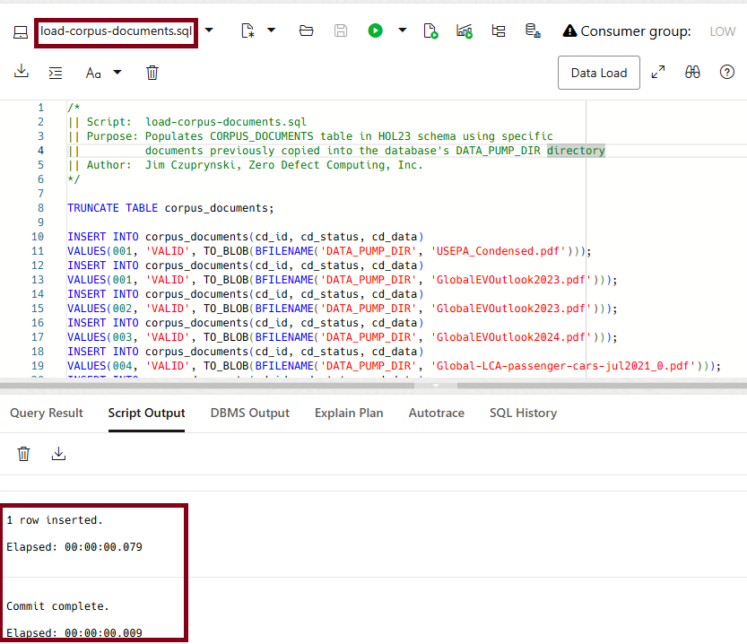
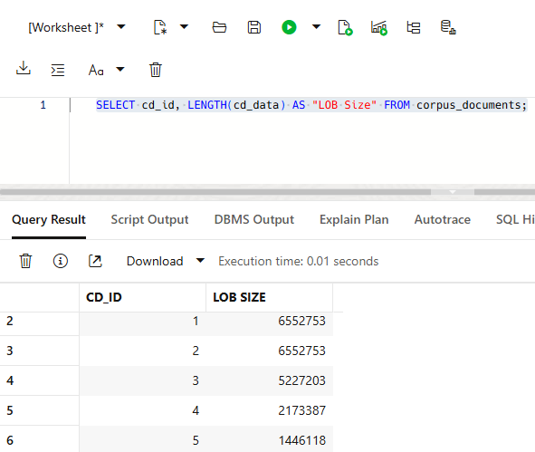

# Build Document Corpus

## Introduction
Before we can construct meaningful responses to prompts to our LLM, we need to build an authoritative set of facts based on a corpus of relevant documents within our 23ai Database.

**Estimated Time: 5 minutes**

### Objectives

In this lab, you will:

- Load documents into **CORPUS\_DOCUMENTS** table as BLOBs
- Explore statistics and features of newly-loaded corpus documents

### Prerequisites

This lab assumes you:
- Have completed all previous labs successfully
- Are still connected to SQL Web Developer as the **HOL23** user

## Task 1: Load Corpus Documents Into 23ai Database

1. Still logged in as the HOL23 user in your SQL Web Developer session, open and execute the **load-corpus-documents.sql** script. This script loads the PDFs you previously copied into your database's **DATA\_PUMP\_DIR** directory and stores them as BLOB datatypes within the **CORPUS\_DOCUMENTS** table.

   

   **NOTE:** If any errors occur during this script's execution, be sure you properly completed the prior steps to copy all files from object storage successfully.

3. Let's take a brief look at what's stored within the **CORPUS\_DOCUMENTS** table. In your SQL Web Developer session, open a new SQL worksheet: 

    

 
4. To confirm the documents have actually been loaded into the table, copy this SQL query into the SQL worksheet and then execute it by clicking on the *Run Statement* button:

    ```
    <copy>
    SELECT cd_id, LENGTH(cd_data) AS "LOB Size" FROM corpus_documents; 
    </copy>
    ```

   


5. **Your document corpus is now ready for chunking and embedding.** You may proceed to the next lab.

## Learn More
- [DBMS_CLOUD Package](https://docs.oracle.com/en/database/oracle/oracle-database/23/arpls/ref-dbms_cloud.html)
- [Oracle SQL Web Developer Concepts and Usage](https://docs.oracle.com/en/cloud/paas/autonomous-database/serverless/adbsb/connect-database-actions.html#GUID-102845D9-6855-4944-8937-5C688939610F)

## Acknowledgements
* **Author** - [Oracle LiveLabs Contact], Jim Czuprynski
* **Contributors** - Jim Czuprynski, LiveLabs Contributor, Zero Defect Computing, Inc.
* **Last Updated By/Date** - Jim Czuprynski, February 2025