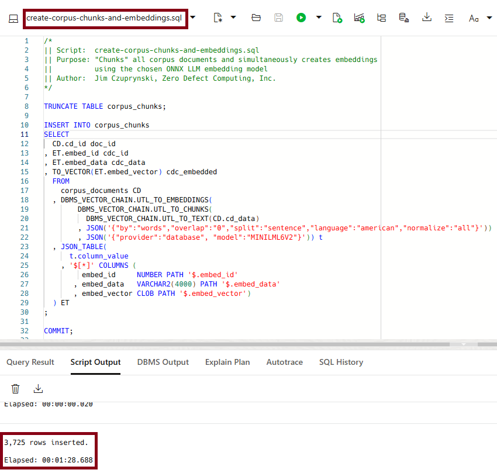
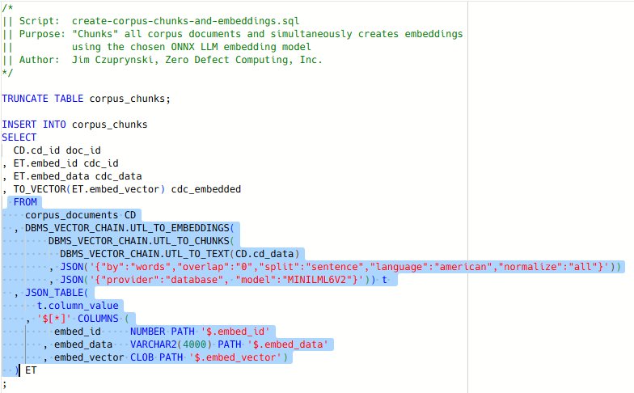
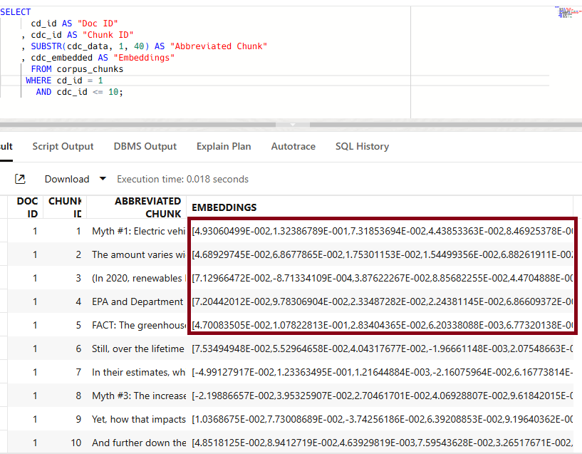

# Create Corpus Embeddings

## Introduction

Our corpus documents have been loaded, so now it's now time to split up document content into appropriately-sized *chunks of text* (appropriately called "chunking"), create *embeddings* based on those chunks' content, and capture those embeddings into the Oracle 23ai VECTOR datatype. We'll do that through several procedures that are part of the new 23ai **DBMS\_VECTOR** and **DBMS\_VECTOR\_CHAIN** packages.

**Estimated Time: 10 minutes**

### Objectives

In this lab, you will:

- Experiment with different sizes and methods of document "chunking" with **DBMS\_VECTOR\_CHAIN.UTL\_TO\_CHUNKS**
- Create embeddings based on a selected chunking method with **DBMS\_VECTOR\_CHAIN.UTL\_TO\_EMBEDDINGS** and store them in a column with a VECTOR datatype
- Verify the results of different chunking methods with **TO\_VECTOR** and **DBMS\_VECTOR.UTL\_TO\_SUMMARY**

### Prerequisites

This lab assumes you:
- Have completed all previous labs successfully
- Are still connected to SQL Web Developer as the **HOL23** user

## Task 1: Create Embeddings for Corpus Documents Within 23ai Database

1. From your SQL Web Developer session, open the **create-corpus-chunks-and-embeddings.sql** script. 

   This script will use the contents stored within the **CORPUS\_DOCUMENTS** table to populate rows in the **CORPUS\_CHUNKS** table. Click the *Run Script* button or hit *F5* to execute the script. *NOTE: This step may take as long as two minutes to complete - it is performing extremely intense computations.*

   


2. Let's take a closer look at the script we just executed. 

   


   It uses several procedures and functions from the **DBMS\_VECTOR\_CHAIN** package that is key to handling chunking data and creating embeddings stored in a column with a VECTOR datatype:

   - The innermost function call to **UTL\_TO\_TEXT** is perhaps the simplest part: It extracts a plain text version of the corpus document selected and then returns it in CLOB format.

   - The results of that call are fed to the **UTL\_TO\_CHUNKS** function, along with parameter settings specifying how the long strings of text should be chunked into smaller yet still meaningful "chunks" of text.
      
      - The *first* set of parameters tells **UTL\_TO\_CHUNKS** to break the incoming text into chunks.
         - Each chunk will be based on word boundaries.
         - Chunks are to be split up based on sentence-ending marks - for example, a period (.) or other comparable punctuation.
         - Chunks will be created without any overlap - in other words, no trailing data from a prior chunk or leading data from the next chunk will be included.
         - The American language scheme (rather than, say, UK English norms) will be deployed to determine accurate chunking.
         - Finally, the LLM is directed to normalize the results.
      

   - The outermost function call to **UTL\_TO\_EMBEDDINGS** actually creates the vectorized embeddings based on the selected pre-trained Large Language Model (LLM) - in this case, the *Mini LLM L6 V2* model that we deployed within our 23ai database in the prior lesson.
   
   - The vectorized embeddings will be stored in the **cdc\_embedded** column, but to format them as expected for its **VECTOR** datatype, the call to the **TO\_VECTOR** function needs to know precisely how incoming data will be formatted ... and that's what output of the call to the **JSON\_TABLE** function defines.


3. What was actually populated into the **cdc\_embedded** column? Open a new SQL worksheet, then copy the code below and execute it.

   ```
    <copy>
    SELECT 
      cd_id AS "Doc ID"
    , cdc_id AS "Chunk ID"
    , SUBSTR(cdc_data, 1, 40) AS "Abbreviated Chunk"
    , cdc_embedded AS "Embeddings"
      FROM corpus_chunks
     WHERE cd_id = 1
       AND cdc_id <= 10;
    </copy>
    ```

   

   As we might expect, the output is simply a series of numbers arrayed in what appears to be a happenstance fashion. 
   
   However, each one of the numbers in the array actually correspond to a particular *feature or attribute* that the pretrained LLM model has derived from the chunked text. These embeddings are what our generative AI application will use via function calls to identify how accurately and adequately a question can be answered by any particular chunk.

4. **You've successfully created embeddings for your document corpus.** You may proceed to the next lab.

## Learn More
- [Vector Datatype Overview](https://docs.oracle.com/en/database/oracle/oracle-database/23/vecse/overview-ai-vector-search.html)
- [Chunking Methods](https://docs.oracle.com/en/database/oracle/oracle-database/23/vecse/perform-chunking-embedding.html)
- [Generating Vector Embeddings](https://docs.oracle.com/en/database/oracle/oracle-database/23/vecse/generate-vector-embeddings-node.html)
- [Oracle SQL Web Developer Concepts and Usage](https://docs.oracle.com/en/cloud/paas/autonomous-database/serverless/adbsb/connect-database-actions.html#GUID-102845D9-6855-4944-8937-5C688939610F)

## Acknowledgements
* **Author** - [Oracle LiveLabs Contact], Jim Czuprynski
* **Contributors** - Jim Czuprynski, LiveLabs Contributor, Zero Defect Computing, Inc.
* **Last Updated By/Date** - Jim Czuprynski, February 2025