# Create ChatBot Application

## Introduction

Our generative AI infrastructure is now complete. We'll next create and configure an APEX application that will let us probe the messengers and messaging within our social media network as well as apply generative AI tools to craft responses to various messages.

### Objectives

In this lab, you will:

- Import the sample **RAG** application into your ADB's **RAG** APEX workspace
- Configure APEX Generative AI Services and corresponding web credentials to access generative AI chatbot models

**Estimated Time: 10 minutes**

### Prerequisites

This lab assumes you have completed all previous labs successfully.

## Task 1: Import RAG APEX application

1. If you are still logged into SQL Workbench, you can navigate back to your ADB's Launchpad by clicking on *Database Actions*. Then, click on the *Launchpad* tab and select *APEX* from the left-hand menu to access your APEX development environment.

    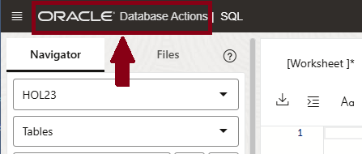

    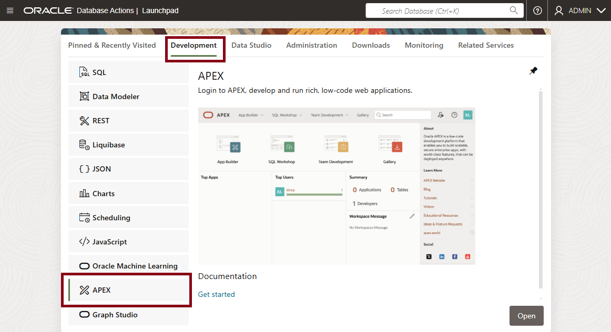

2. Sign into the **RAG** APEX Workspace we created in *Lab 2*. Connect as the **admin** user, specifying the *same* password for your database's **admin** user account that you created when you built your 23ai ADB database.

    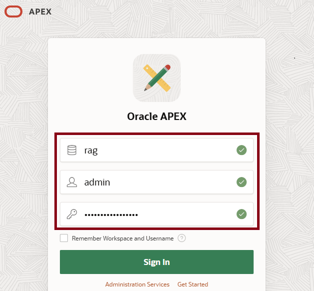

3. The APEX development environment opens. Select the *App Builder* option.

    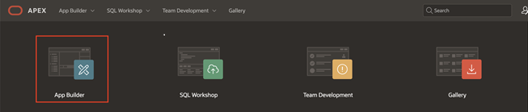

4. We'll now import our existing APEX application from a file. Click on the *Import* icon to start the process.

    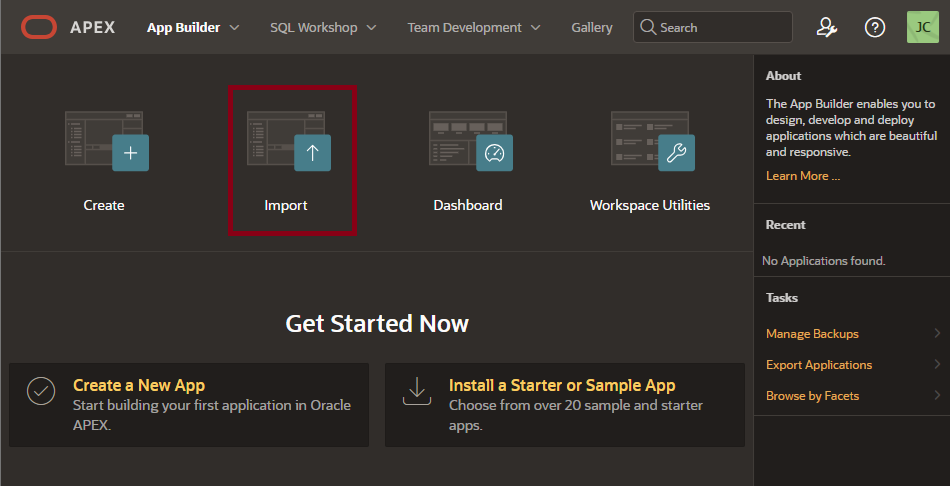

5. Next, click on the *Drag and Drop* icon to select a file. When the *Open file* dialog appears, select the *f100.sql* file from the local directory where you downloaded all scripts for this Live Lab.

    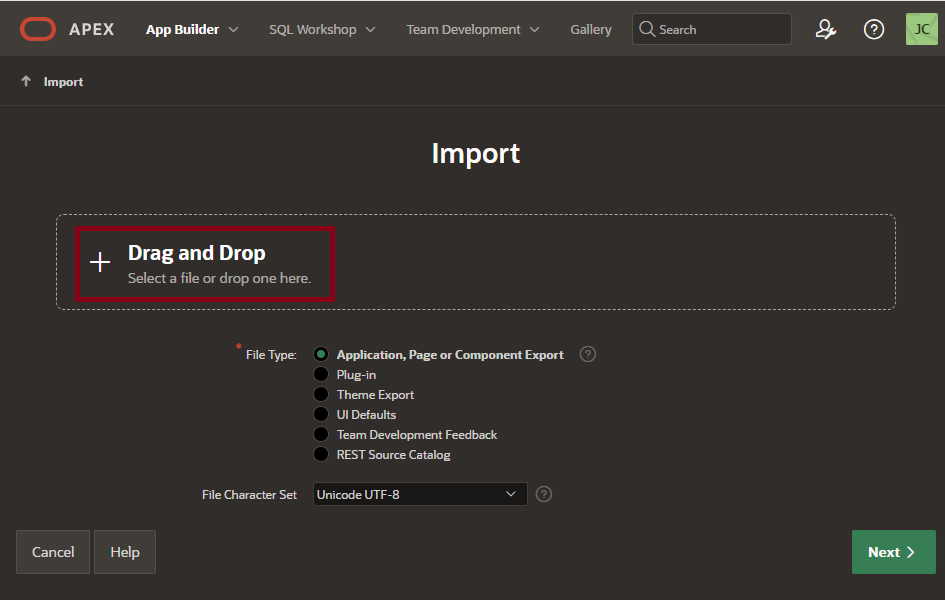

6. APEX confirms the *f100.sql* file is selected, so click the *Next* button.

    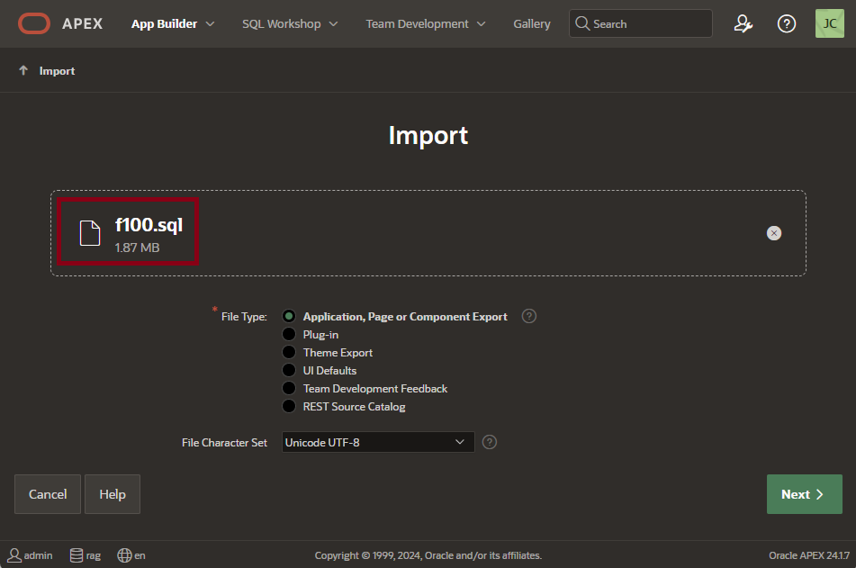

7. Change the *Install As Application* option as desired. Here, we specify re-use of the original APEX application ID, but you could choose either option.

    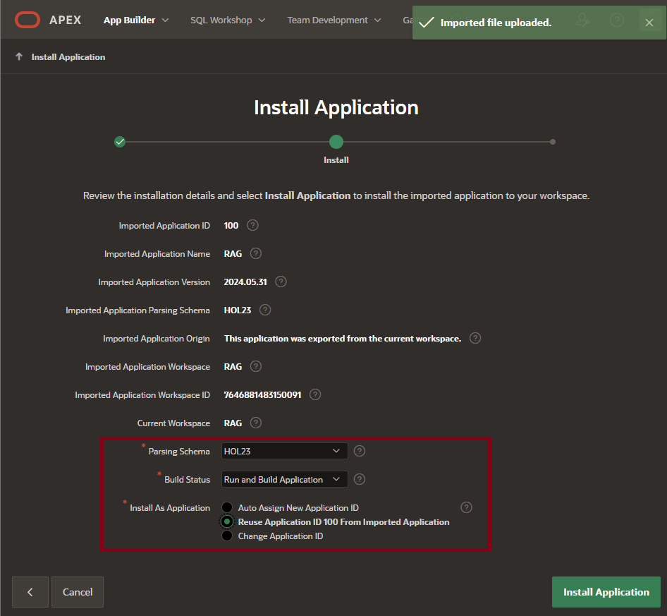

8. It's likely you will see an additional warning about *Credentials* and *Remote Servers* that have already been configured. These can be safely ignored for now, as we'll edit them in the next Lab, so just click the *Next* button to continue. 

    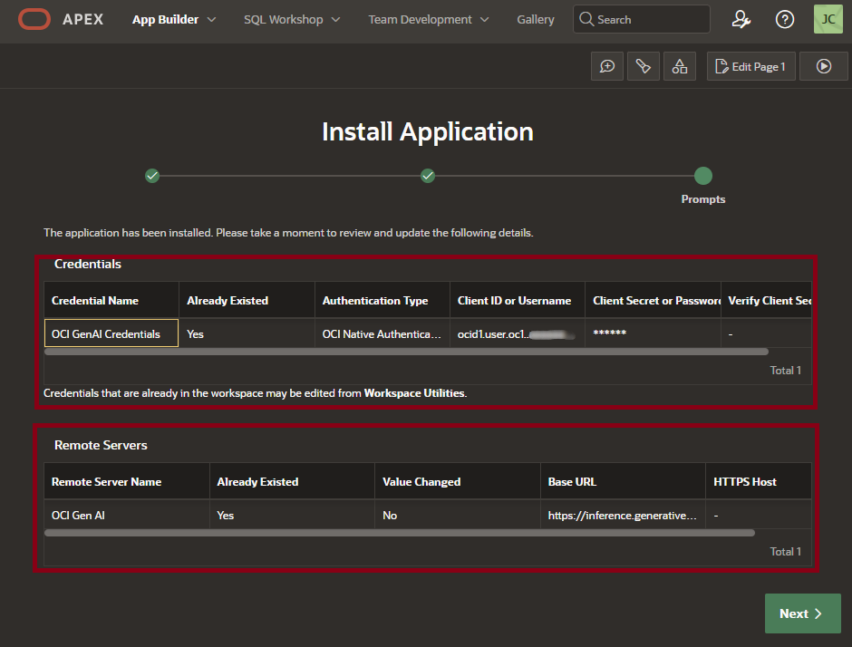

9. After a few moments, APEX will confirm the app has been successfully installed. Click the *Edit Application* button to continue.

    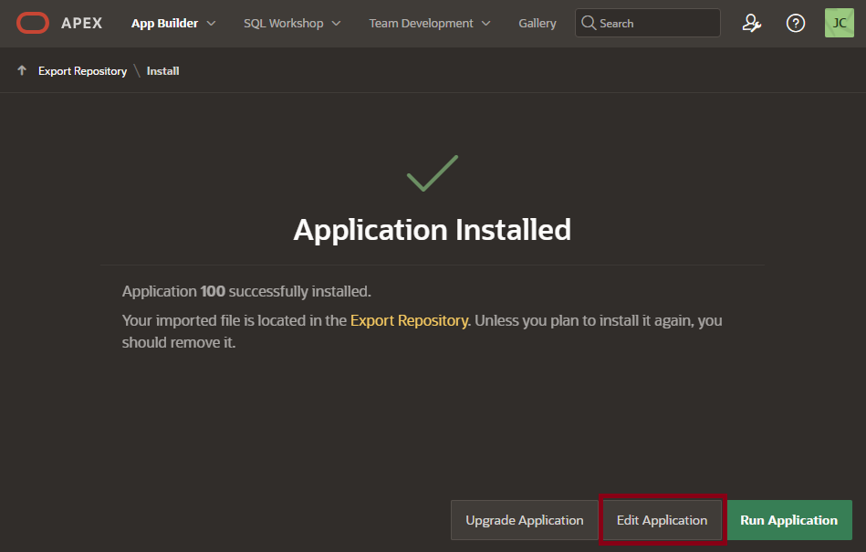

10. The *Edit Application* home page opens. We'll be reviewing application attributes and code as well as running our imported application from this panel.

    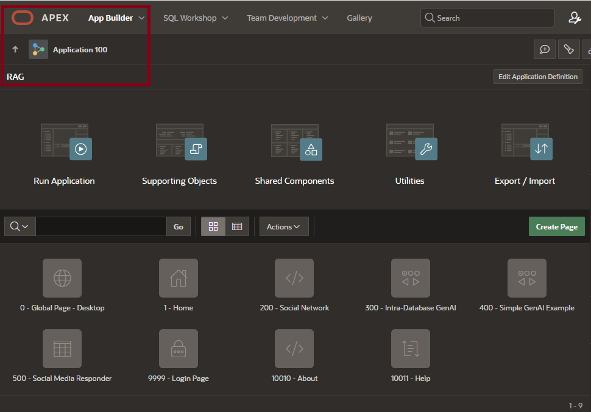

## Task 2: Set Up OCI Generative AI Web Service Credentials
To illustrate how we can use other generative AI and RAG tools from external providers, we will deploy *Oracle Cloud Infrastructure Generative AI* (OCI GenAI) Services within one of our chatbot application pages using an appropriate and supported LLM. 

To accomplish this, we'll first need to *gather pertinent information* about our current OCI configuration. We'll then *generate an API key* within OCI and retain it so we can supply it within APEX in a following step.

1. In a separate window, open your editor of choice (e.g. *Microsoft Notepad*) so you can easily capture all needed OCI IDs (aka *OCIDs*) and other security credentials to retain them in a safe place.

    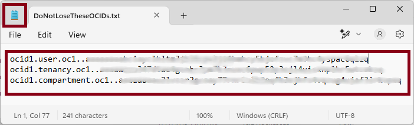

2. Return to your original OCI sign-in page, sign in, and navigate to your 23ai database's *Autonomous Database* page. Be sure to note the *Compartment* - you'll need to confirm that in a moment.

    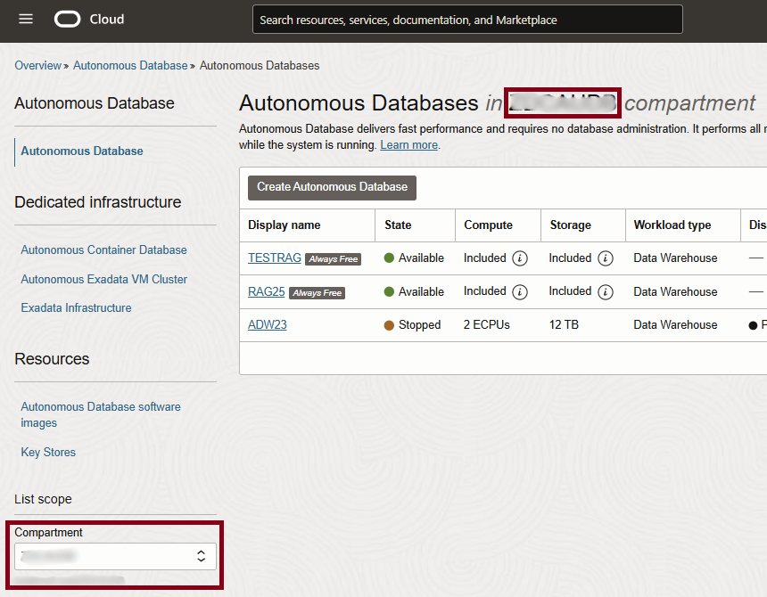

3. Open the profile for the user you've connected as by clicking on the User button near the top right-hand corner.

    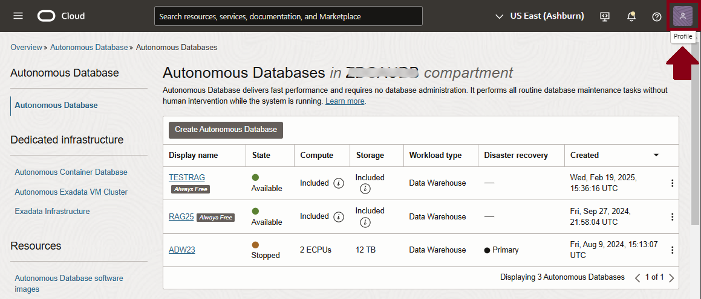

4. Select the URI for the user account.

    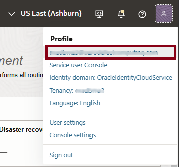

5. Information about the selected OCI User Account is shown. Click on the *Show* link to view the OCID for the user account, and then click the *Copy* link to copy that value to the clipboard. Copy that OCID to the file you've opened in your chosen editor.

    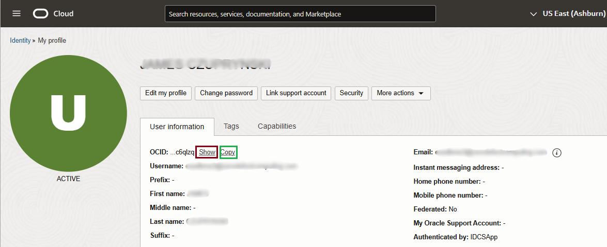

6. Scroll down a bit farther on the OCI User Account page until you see the *Resources* left-hand menu, then select the *API Keys* link.

    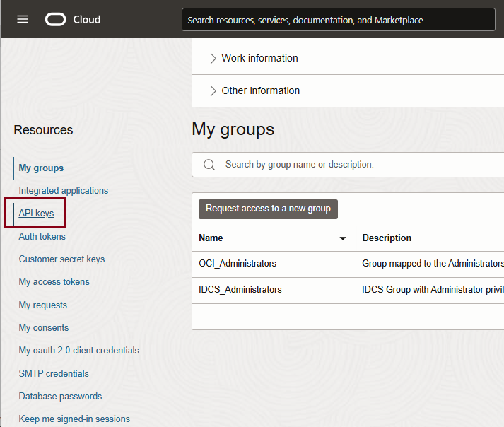

7. A list of all currently-configured API Keys for your user account are shown. Click the *Add API Key* button to start the process of adding a new API key.

    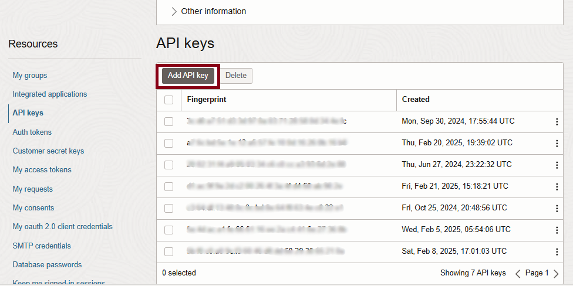

8. Leave the default setting of *Generate API key pair* to create the key by clicking on the *Download private key* button. 

    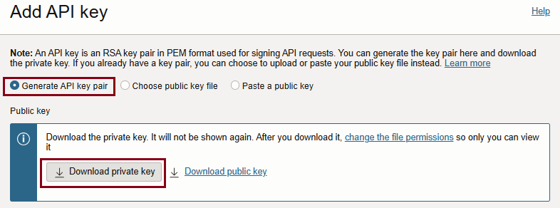

9. When prompted, supply a *filename* and *save the new private API key in your local directory*. You will copy the private key value retained in that file in a future step into your APEX GenAI Service definition. **Do not lose this file, or you will have to regenerate a whole new key pair.**

    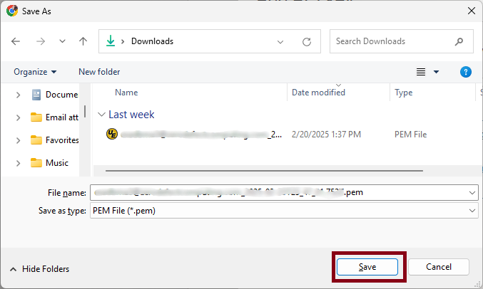

10. Next, click the *Add* button to save the API private key and its corresponding fingerprint within your OCI user's API key repository.

    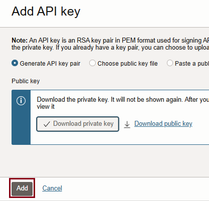

11. From what's displayed next, copy the newly-generated API key's **fingerprint,** the **user OCID,** and the **tenancy OCID** into the file you still have open in your editor of choice, and then click the *Close* button to proceed.

    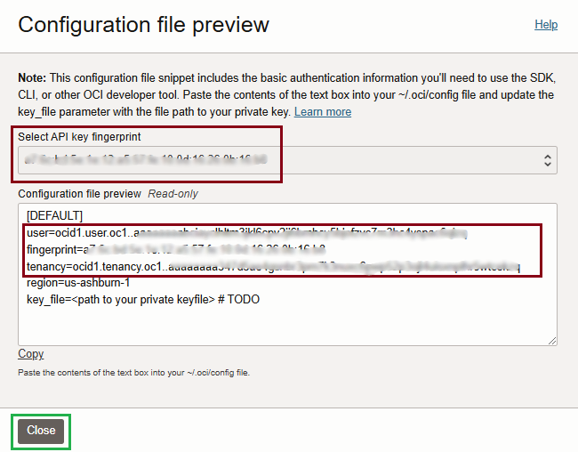

12. Control returns to the *API keys* window. Review what's shown there to confirm the successful creation of the new API key.

    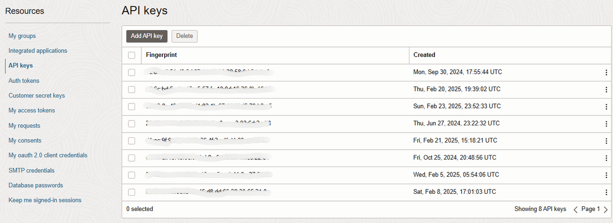

13. Almost done! Now click on the *hamburger* menu at the top left hand corner.

    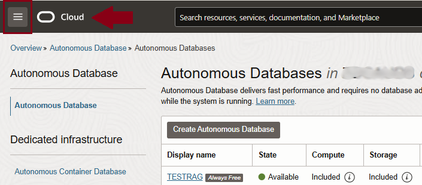

14. From the left hand side menu that's displayed, select the *Identity & Security* option, then select the *Compartments* link to see the list of all compartments for this user account.

    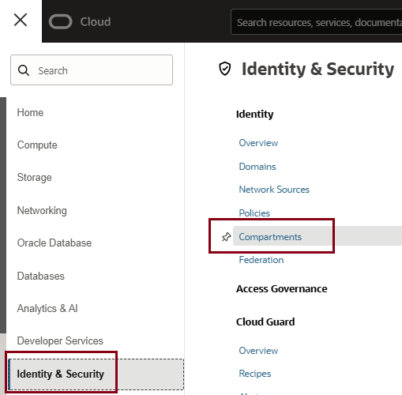

15. Select the compartment ID in which your ADB instance was created, then mouse over the *shortened OCID link* to obtain the option to copy the compartment's OCID. Click the *Copy* link to copy it to the clipboard, and then be sure to paste that into the file you still have open in your editor of choice.

    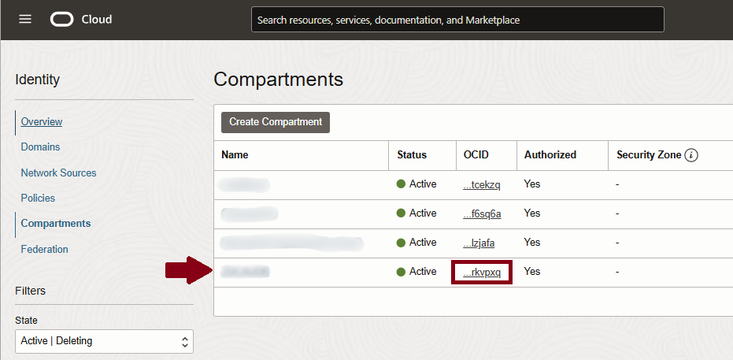

16. **You've successfully captured all pertinent information for configuring OCI Generative AI Services within APEX.** You can proceed to the next task. 
## Learn More
* [APEX Application Builder Concepts](https://docs.oracle.com/en/database/oracle/apex/24.1/htmdb/application-builder-concepts.html)
* [How To Generate An API Signing Key](https://docs.oracle.com/en-us/iaas/Content/API/Concepts/apisigningkey.htm)

## Acknowledgements
- **Author** - Jim Czuprynski, LiveLabs Contributor, Zero Defect Computing, Inc. 
* **Last Updated By/Date** - Jim Czuprynski, February 2025