# Prepare Development Environment

## Introduction

Before we can build our Generative AI solution for reviewing and visualizing our social media campaign's messaging and responding to comments and feedback, we must first initialize our development environment and gather all needed files and document data sources. This lab assumes that you have already created your Oracle Autonomous Database 23*ai* Always Free instance and explored the database tools available for accessing your database environment, especialy SQL Developer Web.

Estimated Time: 10 minutes

### Objectives

In this lab, you will:

- Create a new database schema named **hol23**
- Create a new APEX Workspace for developing our generative AI chatbot application
- Copy LLM bytecode source files and corpus documents into your database's local DATA_PUMP_DIR directory for later processing

### Prerequisites

This lab assumes you have completed all previous labs successfully.

## Task 1: Download the schema creation and population scripts and files

1. Select a local folder on your computer that will become a target for downloaded files. In this example, we are using a Microsoft Windows 11 environment, and we'll use the **Downloads** folder to store files locally.

    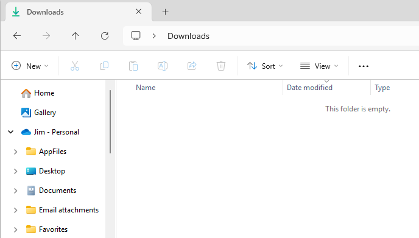

2. Pull down the materials for setup and copy them to your selected local directory. 
    
    - If your operating system is *Microsoft Windows*, copy the URL below into your preferred browser's search bar:

    ```
    $ <copy>
    https://c4u04.objectstorage.us-ashburn-1.oci.customer-oci.com/p/EcTjWk2IuZPZeNnD_fYMcgUhdNDIDA6rt9gaFj_WZMiL7VvxPBNMY60837hu5hga/n/c4u04/b/livelabsfiles/o/partner-solutions%2Fgimme-a-vector%2Fgimme-a-vector.zip
    </copy>
    ```

    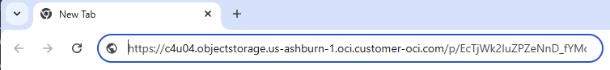

    - Then choose the target local directory to download the ZIP file (in the example below, the *Downloads* directory):

    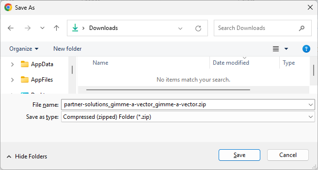

    - If your operating system is Linux, open a command window and then copy and execute the **wget** command below:

    ```
    $ <copy>
    wget --no-check-certificate https://c4u04.objectstorage.us-ashburn-1.oci.customer-oci.com/p/EcTjWk2IuZPZeNnD_fYMcgUhdNDIDA6rt9gaFj_WZMiL7VvxPBNMY60837hu5hga/n/c4u04/b/livelabsfiles/o/partner-solutions%2Fgimme-a-vector%2Fgimme-a-vector.zip
    </copy>
   ```

    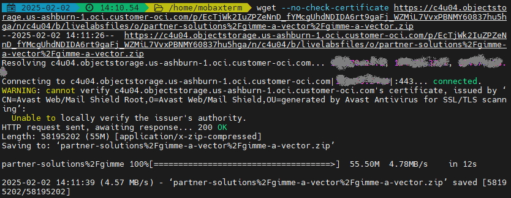

3. Inside this ZIP file are the files to set up and populate your schema's database objects as well as import and create the **RAG** APEX application.

    - If your operating system is *Microsoft Windows*, open File Explorer, select the ZIP file, click the right-mouse button to select the *Extract All ...* option, and specify the destination directory if desired.
    
    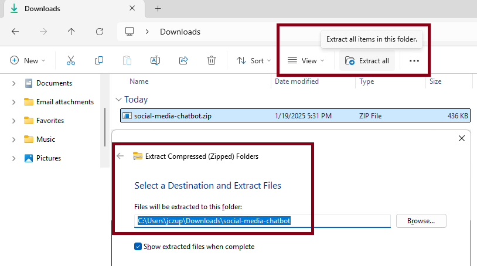

    - If your operating system is *Linux*, open a command window and then use the **unzip** command below to extract the files to your chosen local directory: 

    ```
    $ <copy>unzip -o partner-solutions_gimme-a-vector-gimme-a-vector.zip</copy>
    ```

4. If it's desirable to save disk space, remove the remaining ZIP file after it's been uncompressed.

## Task 2: Create schema owner

1. Now let's navigate to the database toolsets available within our ADB 23ai Always Free environment.  

    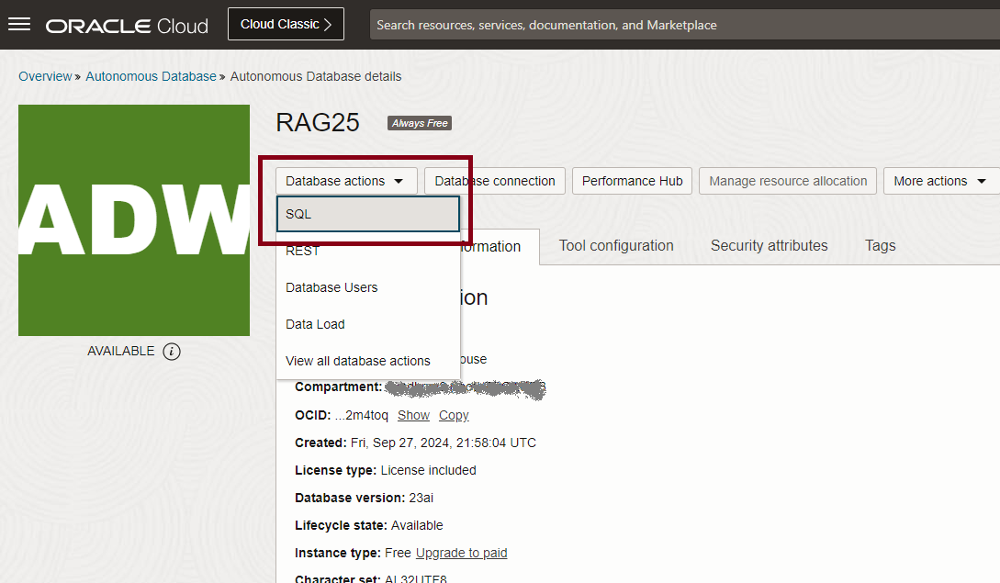

2. The SQL Web Developer home screen is where we'll be doing most of our work in this and following lessons. Note that we're connected as the **admin** user created when as part of ADB database instance creation.

    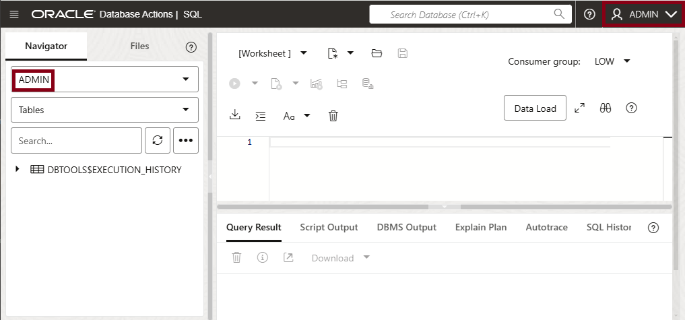

3. Click on the open script button to navigate to the directory where you stored the unzipped file.

    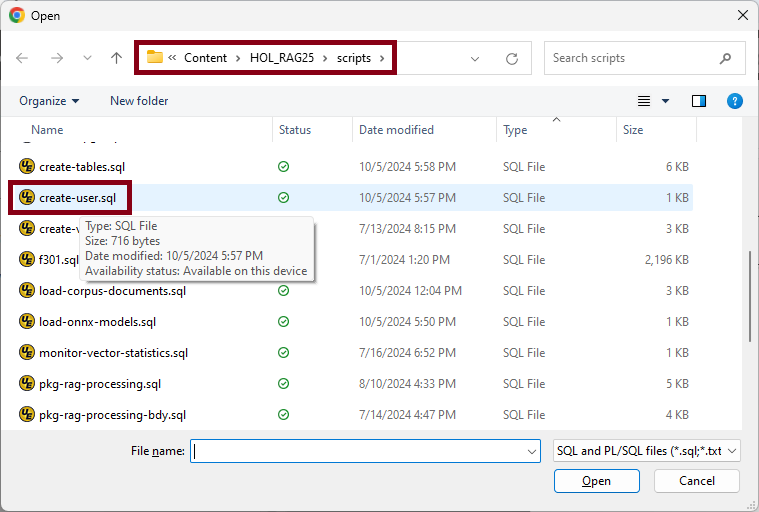

4. Open the **create_user.sql** script. Execute this script by clicking on the *Run Script* icon or by hitting the **F5** key.

    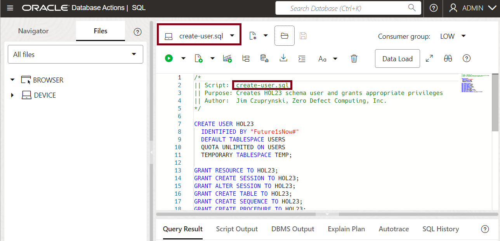

5. Browse the results of the script's execution for any errors.

    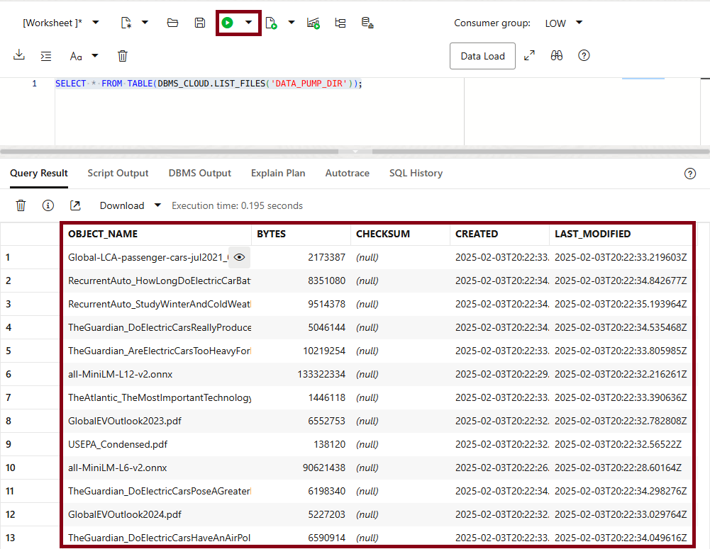

## Task 3: Construct and configure APEX Workspace and development environment

We will be using *Oracle Application Express* (APEX) to construct and execute our chatbot application, but before we can do that, we'll need to initialize an APEX workspace for our development efforts.

1. Still connected as the **admin** user, open and execute the script named **create-apex-workspace.sql** to create a new APEX workspace within your ADB environment.

   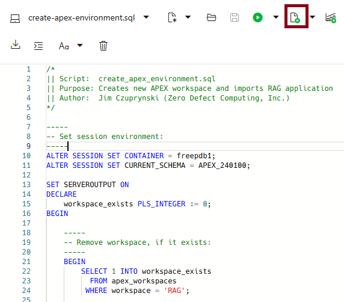

2. Once the script completes, we'll open the APEX application development environment. Hover your mouse over and then click the *Database Actions* logo.

   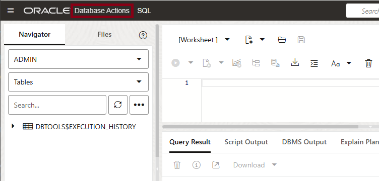

3. If you don't see APEX as a pinned option or that it's been recently visited, just click on the *Development* option.


   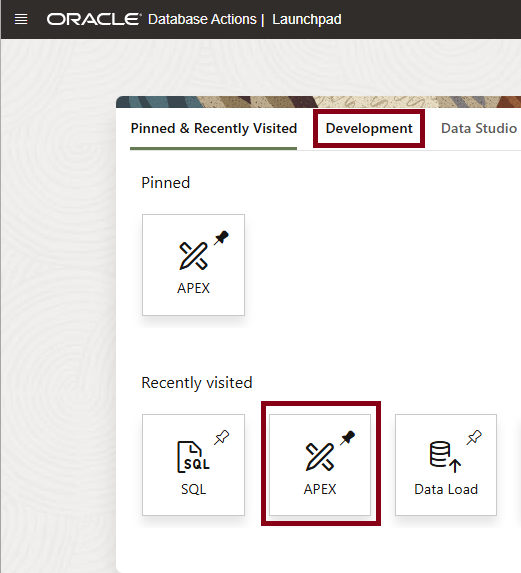

4. The Autonomous Database development options menu opens. Select *APEX* from this menu.


   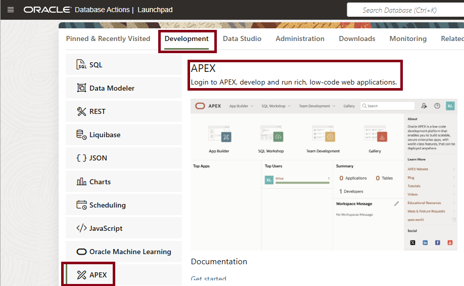

5. Sign into APEX as shown: Specify the **internal** APEX workspace and the **admin** user account; the password is identical to whatever you set for your ADB's **admin** account.


   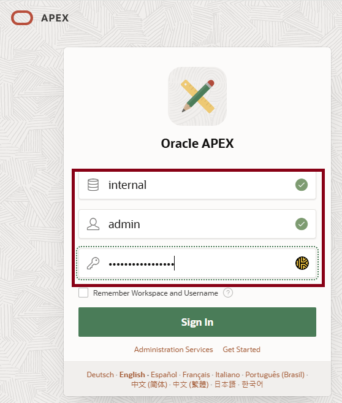

6. The APEX *administration services* menu opens. Select the *Manage Workspaces* option.


   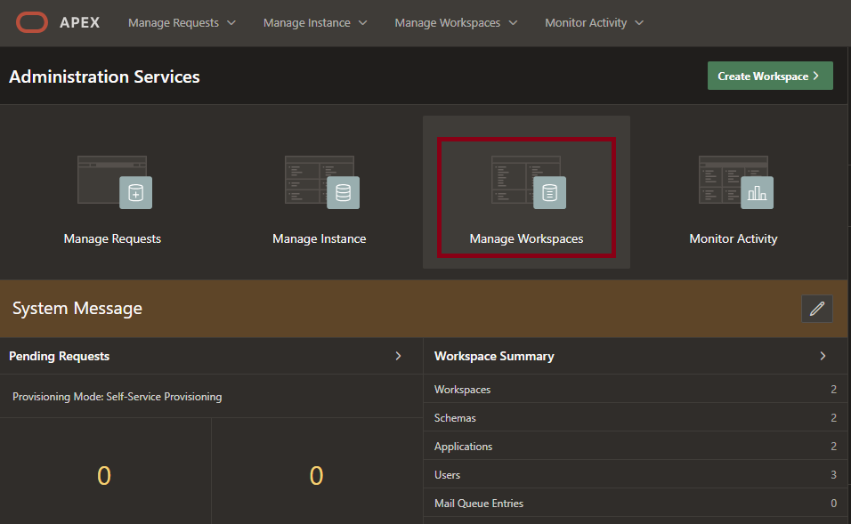

7. Under *Workspace Reports*, choose the *Existing Workspaces* option.


   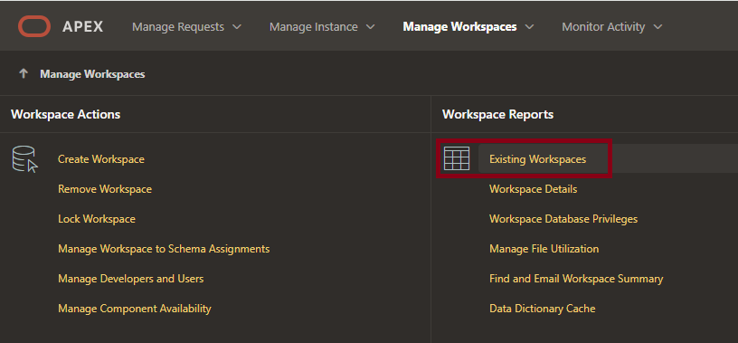

8. Verify that the newly-created **RAG** APEX workspace is present.


   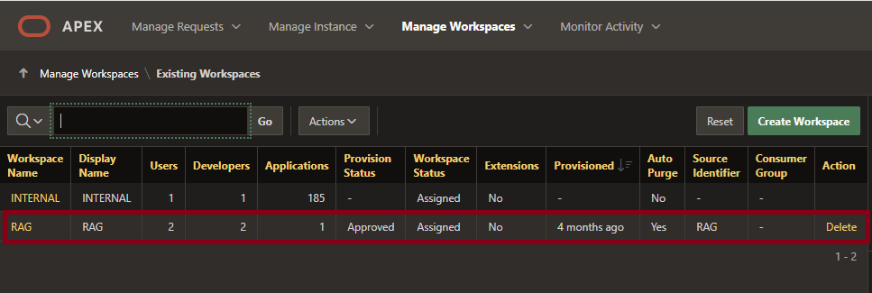


9. Your APEX environment setup is now complete. Close the browser tab to disconnect from APEX for now.

## Task 4: Transfer LLM bytecode files and corpus documents to accessible directory

The files we need to create LLMs and construct a corpus of documents must reside within an accessible directory within our Autonomous Database. We'll use the **DBMS_CLOUD** package to transfer them from an OCI public object storage bucket to our database's DATA_PUMP_DIR directory.

1. Still connected as the **admin** user, open and execute the script named **copy-files-from-object-storage.sql** to initiate the transfer process. It should complete in less than two minutes.

   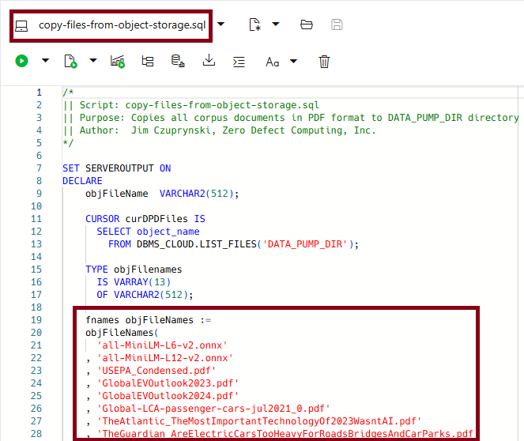


2. Let's verify what was copied via **DBMS_CLOUD.LIST_OBJECTS** function. First, open a new SQL worksheet by clicking on the *New File* button just to the right of *[Worksheet]* in the top left hand corner of your SQL Developer Web session and then choosing the *Worksheet* option: 

   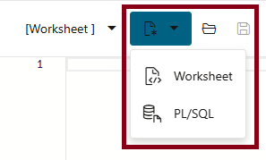

    Then copy the commands below into that new worksheet and execute them by clicking on the  commands and review the results displayed.

    ```
    <copy>
    SELECT * FROM TABLE(DBMS_CLOUD.LIST_FILES('DATA_PUMP_DIR'));
    </copy>
    ```

   

    You should observe that 11 files with a **.pdf** extension and two files with a **.onnx** extension now exist in the **DATA_PUMP_DIR** directory. We will use these files in the next two lessons.

3. Unless otherwise instructed, we'll execute all remaining scripts logged in as the **hol23** user we've just created, so log out of the **admin** account. 

    

4. **Your schema setup is now complete.** You may proceed to the next lab.

## Learn More
- [DBMS_CLOUD Package](https://docs.oracle.com/en/database/oracle/oracle-database/23/arpls/ref-dbms_cloud.html)
- [Oracle SQL Web Developer Concepts and Usage](https://docs.oracle.com/en/cloud/paas/autonomous-database/serverless/adbsb/connect-database-actions.html#GUID-102845D9-6855-4944-8937-5C688939610F)

## Acknowledgements
* **Author** - [Oracle LiveLabs Contact], Jim Czuprynski
* **Contributors** - Jim Czuprynski, LiveLabs Contributor, Zero Defect Computing, Inc.
* **Last Updated By/Date** - Jim Czuprynski, February 2025