# Create ChatBot Application

## Introduction

Our generative AI infrastructure is now complete. We'll next create and configure an APEX application that will let us probe the messengers and messaging within our social media network as well as apply generative AI tools to craft responses to various messages.

### Objectives

In this lab, you will:

- Import the sample **RAG** application into your ADB's **RAG** APEX workspace
- Configure APEX Generative AI Services and corresponding web credentials to access generative AI chatbot models

Estimated Time: 10 minutes.

### Prerequisites

This lab assumes you have completed all previous labs successfully.

## Task 1: Import RAG APEX application

1. If you are still logged into SQL Workbench, you can navigate back to your ADB's Launchpad by clicking on *Database Actions*. Then, click on the *Launchpad* tab and select *APEX* from the left-hand menu to access your APEX development environment.

    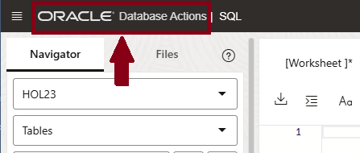

    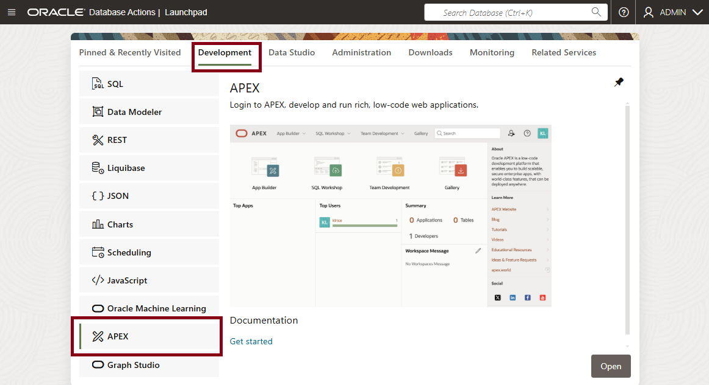

2. Sign into the **RAG** APEX Workspace we created in *Lab 2*. Connect as the **admin** user, specifying the *same* password for your database's **admin** user account that you created when you built your 23ai ADB database.

    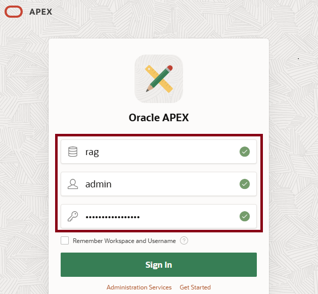

2. The APEX development environment opens. Select the *App Builder* option.

    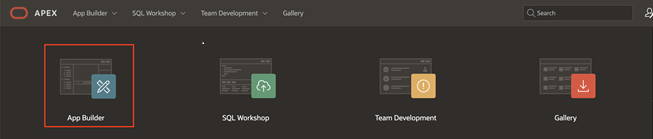

3. We'll now import our existing APEX application from a file. Click on the *Import* icon to start the process.

    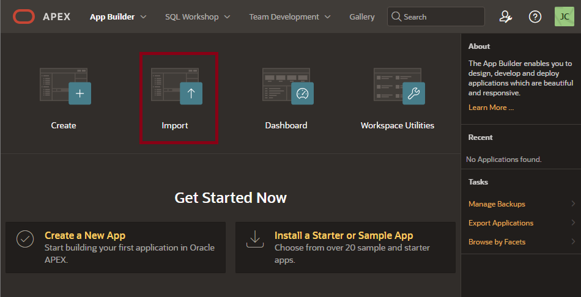

4. Next, click on the *Drag and Drop* icon to select a file. When the *Open file* dialog appears, select the *f301.sql* file from the local directory where you downloaded all scripts for this Live Lab.

    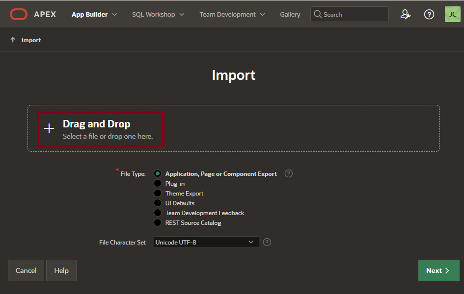

5. APEX confirms the *f301.sql* file is selected, so click the *Next* button.

    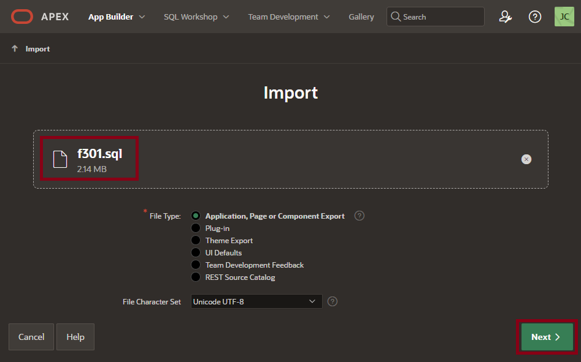

6. Change the *Install As Application* option as desired. Here, we specify re-use of the original APEX application ID, but you could choose either option.

    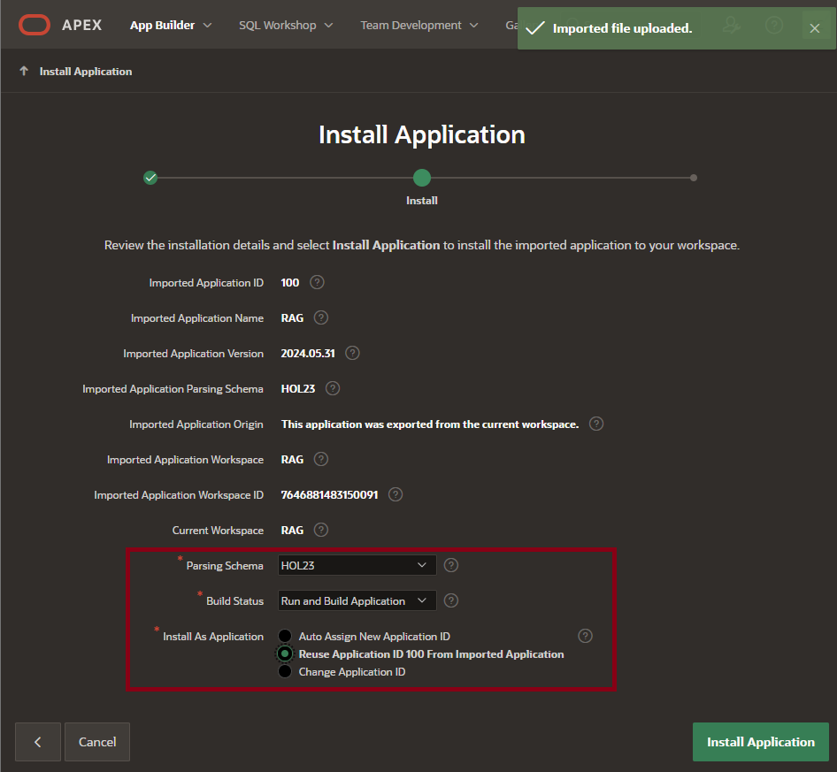

7. After a few moments, APEX will confirm the app has been successfully installed. Click the *Edit Application* button to continue.

    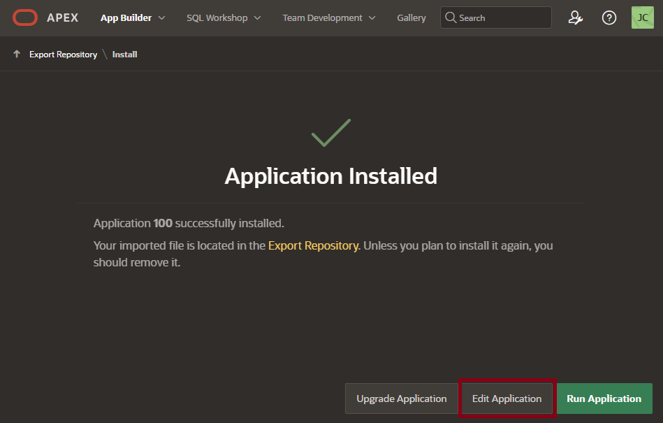

8. The *Edit Application* home page opens. We'll be reviewing application attributes and code as well as running our imported application from this panel.

    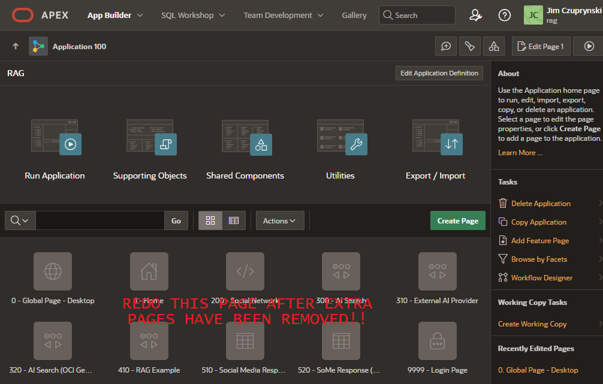

## Task 2: Set Up OpenAI Credentials
To illustrate how we can use other generative AI and RAG tools from external providers, we will deploy OpenAI within one of our chatbot application pages. This requires us to sign up for an OpenAI API key and purchase a small amount of credits for demonstration purposes. (OpenAI offered extremely limited access to its lowest-powered AI tools for free until September 2024; they now charge a $5 minimum fee to access those tools.)

1. Open a browser window and navigate to https://auth.openai.com/authorize. The sign-up screen appears. Supply your preferred email address.

    

2. Supply a significantly robust password of at least 12 characters and *be sure to retain it safely* as you will likely need it again later. Click the *Continue* button to proceed.

    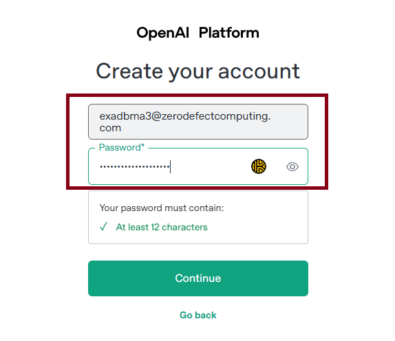

3. OpenAI will then send you a confirmation link to the email account you supplied. Upon receipt, verify your email with the six-digit code they provided and continue the signup process.

    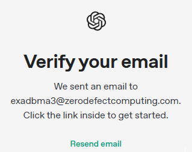

4. Supply the requested personal information and click the *Agree* button to continue the signup process.

    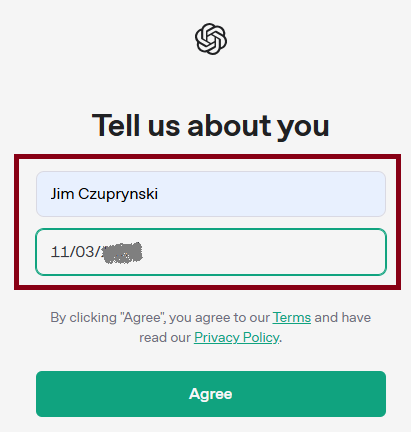

5. Supply the remaining requested information and click the *Create Organization* button to continue the signup process.

    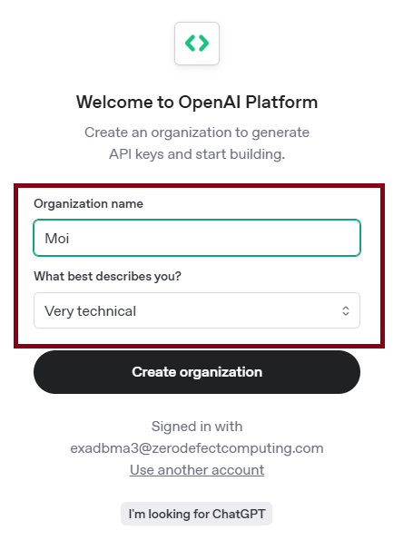

6. At last it's time to create an API key. Supply the requested information and click the *Generatee API Key* button.

    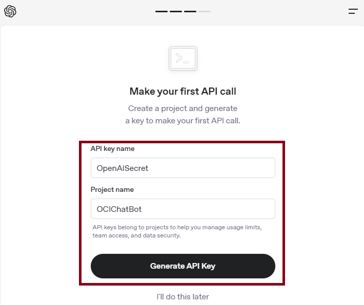

7. OpenAI will return the requested API key. Copy this key and **be sure to retain it safely** as you will need it in the next lab. **Do not click the *Done* button until you have saved this key!** 

    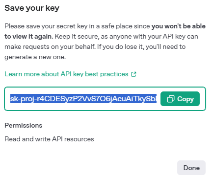

8. Select the recommended *$5 credits* option to purchase the  minimum amount of OpenAI credits. Click *Purchase credits* to complete the signup process. 

    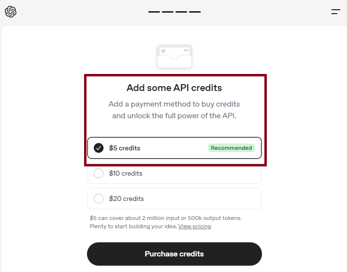

9. Supply your credit card details and then click *Continue* to complete the signup process. Note that these credits are usable for any other OpenAI experiments you may wish to pursue beyond this Live Lab.

    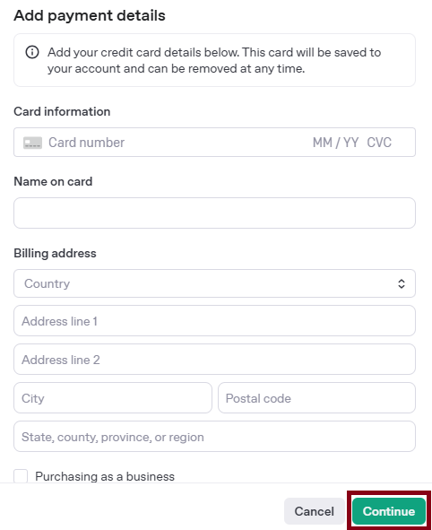

10. **You've successfully completed all tasks to prepare your APEX application infrastructure.** You may proceed to the next lab.

## Learn More
* [APEX Application Builder Concepts](https://docs.oracle.com/en/database/oracle/apex/24.1/htmdb/application-builder-concepts.html)
* [OpenAI API Reference](https://platform.openai.com/docs/api-reference/introduction)

## Acknowledgements
- **Author** - Jim Czuprynski, LiveLabs Contributor, Zero Defect Computing, Inc. 
* **Last Updated By/Date** - Jim Czuprynski, February 2025