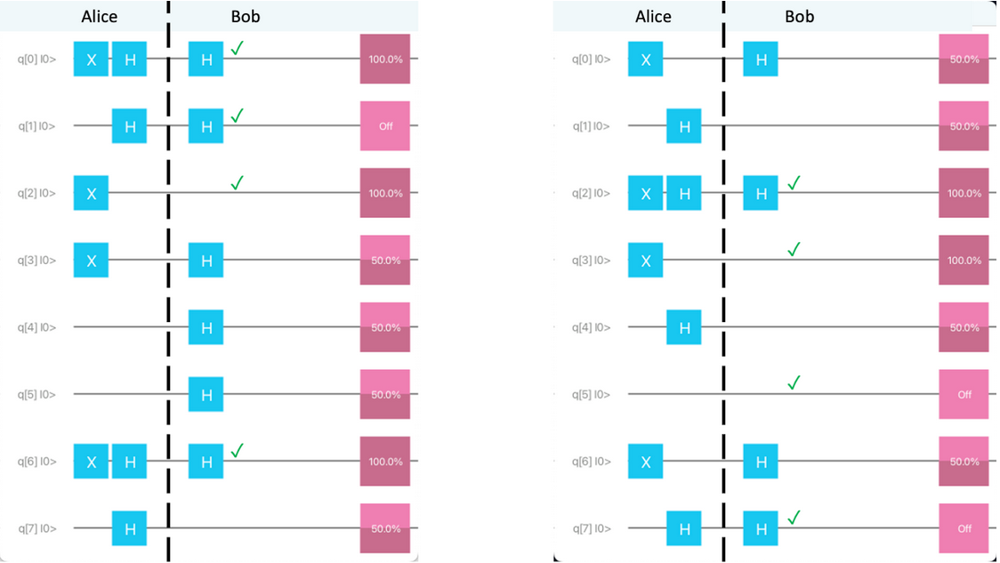

# Distribute Secret Encryption Keys

## Introduction

The BB84 Algorithm (named in 1984 after Charles Bennett and Gilles Brassard) creates a key that's known two tw parties without sending the key over a public line of communication.

Estimated Time: 25 minutes

### Objectives

In this lab, you will:
* Run code that distributes a secret key in a provably secure way.

## Task 1: Run the sample code

1. Run the code shown below.

    You'll find this code in the file `QKD.java`. 

    ```
    <copy>
    //usr/bin/env jbang "$0" "$@" ; exit $?
    //DEPS org.redfx:strange:0.1.1
    //DEPS org.redfx:strangefx:0.1.4
    
    import java.util.Random;
    
    import org.redfx.strange.*;
    import org.redfx.strange.QuantumExecutionEnvironment;
    import org.redfx.strange.gate.*;
    import org.redfx.strange.local.SimpleQuantumExecutionEnvironment;
    import org.redfx.strangefx.render.Renderer;
    
    public class QKD {
    
        static final int N = 8;
        static Random random = new Random();
    
        public static void main(String[] args) {
            QuantumExecutionEnvironment simulator = 
                    new SimpleQuantumExecutionEnvironment();
            Program program = new Program(N);
            Step data = new Step();
            data.addGates(new X(0), new X(2), new X(3), new X(6));
            program.addStep(data);
    
            // Places to store random booleans:
            boolean[] aliceRandom = new boolean[N];
            boolean[] bobRandom = new boolean[N];
    
            Step aliceBase = new Step();
            Step noOpSeparator = new Step();
            Step bobBase = new Step();
    
            // Alice and Bob randomly apply Hadamard gates
            for (int i = 0; i < N; i++) {
                aliceRandom[i] = random.nextBoolean();
                bobRandom[i] = random.nextBoolean();
                if (aliceRandom[i]) aliceBase.addGate(new Hadamard(i));
                if (bobRandom[i]) bobBase.addGate(new Hadamard(i));
            }
    
            program.addStep(aliceBase);
            program.addStep(noOpSeparator);
            program.addStep(bobBase);
            Result result = simulator.runProgram(program);
            Qubit[] qubits = result.getQubits();
    
            // When did Alice's and Bob's random choices agree?
            for (int i = 0; i < N; i++) {
                if (aliceRandom[i] == bobRandom[i]) {
                    System.err.println("Index " + i + 
                            " has a usable bit: " + qubits[i].measure());
                } else {
                    System.err.println(
                            "Bob and Alice used a different base " +
                            "for measuring qubit " + i + ", discard.");
                }
            }
    
            Renderer.renderProgram(program);
        }
    }
    </copy>
    ```

2. Compare these two runs of the QKD simulation code:

    


### Console output from the run on the left:

```
Index 0 has a usable bit: 1
Index 1 has a usable bit: 0
Index 2 has a usable bit: 1
Bob and Alice used a different base for measuring qubit 3, discard.
Bob and Alice used a different base for measuring qubit 4, discard.
Bob and Alice used a different base for measuring qubit 5, discard.
Index 6 has a usable bit: 1
Bob and Alice used a different base for measuring qubit 7, discard.
```

### Console output from the run on the right:

```
                                        Bob and Alice used a different base for measuring qubit 0, discard.
                                        Bob and Alice used a different base for measuring qubit 1, discard.
                                        Index 2 has a usable bit: 1
                                        Index 3 has a usable bit: 1
                                        Bob and Alice used a different base for measuring qubit 4, discard.
                                        Index 5 has a usable bit: 0
                                        Bob and Alice used a different base for measuring qubit 6, discard.
                                        Index 7 has a usable bit: 0
```

## Appendix: How the BB84 algorithm works

We want to send qubits from one node to another. (In this example, we simplify things by putting the sending node and receiving node in the same quantum program.) The sending node creates the qubits and manipulates them, the receiving node does more manipulation and reads the qubits. By sending a number of qubits that are either in the 0 state or the 1 state, we can send data from the sender to the receiver. 

In the `QKD.java` program (above), the sender (Alice) creates 8 qubits (with initial value 0) and flips 4 of them so that they have value 1. The 4 qubits that she flips are the ones with index 0, 2, 3 and 6. This corresponds to the data message 01001101 (MSB order). (See the figure below.)


Between  sending and receiving, Alice randomly chooses to apply a Hadamard gate, and Bob randomly chooses to apply a Hadamard gate. (See the figure below.)


In this figure, the dashed line marks the separation between Alice's part and Bob's part. In real-world applications, the qubits would be send over e.g. a fibre optic cable. In our code, we do not have a physical separation.

After transmitting all 8 qubits, Alice and Bob publicly compare their random choices about whether or not to apply the Hadamard gate. In the figure below, they mark the fact that their decisions agreed for the qubits with indices 0, 1, 2, and 6.


On the marked lines (in this example, lines 0, 1, 2, and 6), there are two cases:

* Neither Alice nor Bob applied a Hadamard gate (in this example, line 2).
In that case, Alice sent either a 0 or a 1. Assuming there is no eavesdropper between Alice and Bob, Bob should be able to read the 0 or 1 accurately.
* Both Alice and Bob applied a Hadamard gate (in this example, lines 0, 1, and 6).
As we saw in Step 3, applying two Hadamard gates in a row is like applying no Hadamard gates at all. Assuming there is no eavesdropper between Alice and Bob, Bob should be able to read the 0 or 1 accurately.

Qubits are delicate. If an eavesdropper observes a qubit during transmission between Alice and Bob, there’s no way for that eavesdropper to accurately forward the qubit onward to Bob. So, 

      There was an eavesdropper

         if and only if

       on all the qubits on the marked lines 
             (lines 0, 1, 2, and 6), Bob accurately 
             read the 0 or 1 values that Alice sent.

Alice and Bob sacrifice half of the marked lines by publicly comparing their results. In this example, Bob announces his readings for the top two lines. (See the figure.)


The decision to sacrifice half of the lines is like the checksum bit that is often used in classical code. Developers can use more or less than half the matching results as check-qubits.

If Bob’s readings agree with Alice’s original transmissions, there was no eavesdropper. In that case, Alice and Bob use the remaining half of the marked lines as their private encryption key.

## Acknowledgements
* **Authors** - Johan Vos, Co-Founder of Gluon HQ; Barry Burd, Professor at Drew University
* **Last Updated By/Date** - Barry Burd, October 2022
