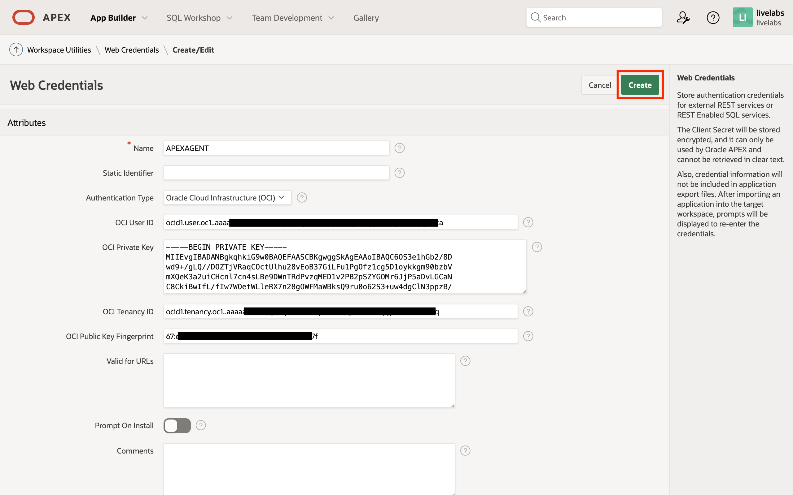

# Create an Oracle APEX Automation to Publish Custom Metrics

## Introduction

The *Oracle Cloud Infrastructure* (OCI) *Monitoring* service allows developers to publish *custom metrics* and use them in *alarms* to be alerted when preset limits are exceeded. In this lab, we will create an *Oracle APEX* application that publishes the number of failed user logins to the OCI Monitoring service as custom metrics, using an *Automations* task.

Estimated Time: 15 minutes

### About the OCI Resources

Oracle APEX is a low-code software development platform that is included with every Oracle *Autonomous Database* (ADB) provisioned. The *Oracle Cloud Infrastructure* (OCI) REST API will be used by the platform's `APEX_WEB_SERVICE` PL/SQL package to interface with the OCI Monitoring service, specifically, the endpoint for ingesting telemetric data. OCI Monitoring is one of several *Observability & Management* services that help OCI administrators better monitor and manage their tenancies. Applications may interface with the services using the OCI REST APIs.

### Objectives

In this lab, you will:

* Create an Oracle APEX application.
* Set up a Web Credential.
* Create an Automation to publish custom metrics to the OCI every minute.
* Check that the custom metrics has been successfully posted using the OCI Console's Metrics Explorer.

### Prerequisites

This lab assumes that you have the necessary permissions on the Oracle Cloud Infrastructure (OCI) tenancy to create the following resources:

* Access to an Oracle APEX development environment and workspace that has the require network access to the OCI REST endpoints.
* An IAM user, the API keys generated, and required IAM policies to allow the user to use the OCI REST API to publish custom metrics.

## Task 1: Create a New Oracle APEX Application

1. After successful login to the workspace, click on the *App Builder* icon.

1. Click the *Create* icon.

1. Click the card item *New Application*.

1. Enter the desired application name, and then click the button *Create Application*.

1. Once the application has been created successfully, you will be redirected to the applications's home page.


## Task 2: Setup a Workspace Web Credential

> **IMPORTANT - Supported Versions**
>
> Working with OCI REST APIs requires clients to [sign requests](https://docs.oracle.com/iaas/Content/API/Concepts/signingrequests.htm). From Oracle APEX 19.2, using the Oracle APEX Web Credential's OCI authentication type makes this process transparent.

1. Back on the App Builder home page, click on the *Workspace Utilities* icon.

1. Click on the link *Web Credentials*.

1. Click the button *Create*.

1. Select the authentication type *Oracle Cloud Infrastructure (OCI)*, and then enter the information from Lab 1, Task 5, when an API key was generated for the *Identity and Access Management* (IAM) user that will interact with the OCI REST APIs on the application's behalf. The required information are the tenancy [Oracle Cloud ID](https://docs.oracle.com/iaas/Content/General/Concepts/identifiers.htm) (OCID), user OCID, fingerprint of the user's API public key, and the user's API private key. Then, click the *Create* button.

1. Unless specified, the web credential's *Static Identifier* is derived from its name.


## Task 3: Create Substitution Strings

1. From the application's home page, go to the application definition by clicking the button *Edit Application Definition*, close to the top-right of the page.

1. Click on the *Substitutions* tab and then create the **four** *Substitution Strings* listed below the screenshot.

	* **`TELEMETRY_ENDPOINT`** - the Monitoring API endpoint varies with the region that you wish to publish the custom metrics to. You can obtain the appropriate value from this [page](https://docs.oracle.com/iaas/api/#/en/monitoring/20180401/). Most importantly, for posting custom metrics, you **must** use the URLs where it begins with `telemetry-ingestion` or a `404` HTTP response will be returned.
	* **`COMPARTMENT_ID`** - this is the compartment's OCID that you may obtain from the compartment's details page.
	* **`TARGET_APP_ID`** - the Oracle APEX applications ID that you wish to monitor.
    * **`DATABASE_NAME`** - the database instance name.
	* **`G_OCI_WEB_CREDENTIAL`** - the *Static Identifier* of the web credential created in Task 2.
1. If you are unsure of what the value of `COMPARTMENT_ID` should be, then return to the *Compartments* page under *Identity & Security* in the OCI Console.
1. Place the mouse cursor over the compartment's OCID value to expose a modal with the required value. Click the link *Copy* to copy the OCID to your operating system's clipboard.


## Task 4: Create an Automation

Automations is a feature [introduced](https://blogs.oracle.com/apex/post/automate-your-business-process-in-oracle-apex-202) to Oracle APEX in version 20.2. This allows developers to schedule and monitor background tasks from the development environment. In this task, we will create an automation that will execute a PL/SQL procedure that calls the OCI REST endpoint for ingesting telemetric data.

In this example, we will query the `APEX_WORKSPACE_ACCESS_LOG` database view and count the number of events since the automation last executed, where the authentication process was not successful. It will then post the custom metrics to the target compartment under the metric namespace `oracle_apex`. The namespace is a logical name to group related metrics. We will name the metric `number_of_failed_logins`, and provide addition metadata using metric dimensions `resource_name` and `app_id`. The latter can be used to filter metric streams. Finally, the automation will run every minute.

1. From the application's home page, go to the *Shared Components* page by clicking the icon marked in the screenshot below.

1. Scroll down, and then under the go to *Workflows and Automations* group, click *Automations*.

1. Click button *Create* to begin creating a new automation.

1. Enter the configuration for the new automation, and then click the button *Create*.

    * **Name** - `POST_FAILED_LOGIN_METRICS`
    * **Type** - *Scheduled*
    * **Actions initiated on** - *Always*
    * **Execution Scheduled** - *Custom*
    * **Frequency** - *Minutely*
    * **Interval** - *1*
1. After the automation has been created successfully, you will be redirected to the automation's configuration page. Under the *Actions* section, click on the edit icon for the only action that has been pre-created and listed in the table.

1. Enter an appropriate name for the action, e.g., *Post Metrics*, and leave the remaining fields to their default values.
!
1. Copy the PL/SQL procedure below, and pasted it in the *Code* editor.
    ```sql
    <copy>
    declare
        c_ingestion_endpoint_url constant varchar2(32767)
            := :TELEMETRY_ENDPOINT;

        l_payload clob;
        l_response clob;
        l_number_of_failed_logins number;

        request_failed exception;
    begin
        select count(1)
        into l_number_of_failed_logins
        from apex_workspace_access_log
        where 1 = 1
            and application_id = :TARGET_APP_ID
            and authentication_result != 'AUTH_SUCCESS'
            and access_date > cast(apex_automation.get_last_run
                    at time zone dbtimezone as date)
        ;

        l_payload :=
            json_object(
            'metricData' value json_array(
                json_object(
                'compartmentId' value :COMPARTMENT_ID
                , 'namespace' value 'oracle_apex'
                , 'name' value 'number_of_failed_logins'
                , 'dimensions' value json_object(
                    'resource_name' value :DATABASE_NAME
                    , 'app_id' value :TARGET_APP_ID
                    )
                , 'datapoints' value json_array(
                    json_object(
                        'timestamp' value to_char(systimestamp at time
                            zone 'UTC',
                            'YYYY-MM-DD"T"HH24:MI:SSxFF3"Z"')
                        , 'value' value l_number_of_failed_logins
                    )
                    )
                )
            )
            )
        ;

        apex_web_service.set_request_headers(
            p_name_01 => 'Content-Type'
            , p_value_01 => 'application/json'
        );

        l_response := apex_web_service.make_rest_request(
            p_url => c_ingestion_endpoint_url
            , p_http_method => 'POST'
            , p_credential_static_id => :G_OCI_WEB_CREDENTIAL
            , p_body => l_payload
        );

        if apex_web_service.g_status_code != 200 then
            apex_automation.log_error('HTTP Status Code: ' ||
                to_char(apex_web_service.g_status_code));
            apex_automation.log_error(l_response);
            raise request_failed;
        end if;
    end;
    ```
1. Click the button *Apply Changes* to save the changes.
1. Before activating the automation, click the button *Save and Run* to test the automation.

1. Return to the Automations page by clicking the button *Cancel*.
1. On the Automations page, click the tab *Execution Log*.

1. Here, you will a table/log of automation executions. If there are any failures, check the messages for clues to resolve the issues.

1. If the automation executed successfully, return to the configuration page and set the *Schedule Status* to *Active*, and then click the button *Save Changes*.

1. Back on the Automations page, once activated successfully, the automation's *Next Run* column should have a value and is future dated.

## Task 5: Use the Metrics Explorer to View Published Custom Metrics

Although the automation task is now running successfully, we should validate that the custom metrics have been successfully ingested by the OCI service using the *Metrics Explorer*.

1. Login to the OCI Console.
1. Click the *navigation menu* button on the top left and then click *Observability & Management*. Under *Monitoring*, click *Metrics Explorer*.

1. On the Metrics Explorer page, scroll down to the Query section and enter the suggested parameters.

    * **Compartment** - the compartment that the custom metrics were published to.
    * **Metric namespace** - `oracle_apex`
    * **Metric name** - `number_of_failed_logins`
    * **Interval** - *5 minutes*
    * **Statistic** - *Mean*
    * **Dimension name** - `resource_name`
    * **Dimension value** - select the database instance's name.
1. Click the button *+ Additional dimension*, and then add the following parameters:
    * **Dimension name** - `app_id`
    * **Dimension value** - select the application ID of target Oracle APEX application.
1. Click the button *Update Chart* and scroll up.
1. If the custom metrics were published successfully, then it show up in the graphs. You may have to attempt a few failed logins on the application to see a chart similar to the one below.


> **Note:** It may take a while for the posted custom metrics to show up in the Metrics Explorer. If you do not see the expected changes in the chart, try again later, adjusting the start and end times as necessary.

You may now **proceed to the next lab**.

## Acknowledgements

* **Author** - Adrian Png, Senior Cloud Solutions Architect, Insum Solutions Inc.
* **Last Updated By/Date** - Adrian Png, February 2023
