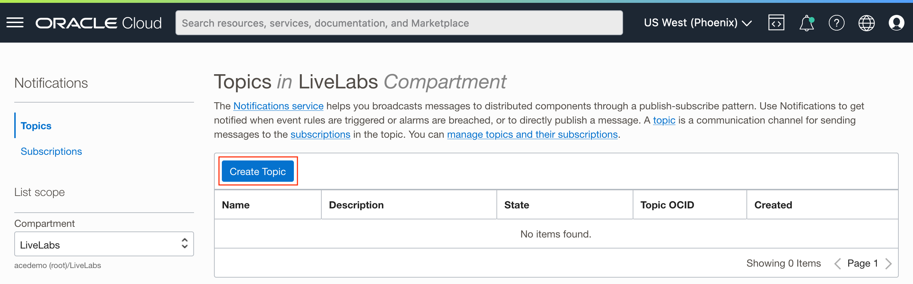

# Create an OCI Alarm and Notification to Alert Administrators

## Introduction

The *Oracle Cloud Infrastructure* (OCI) *Monitoring* service is one of several *Observability & Management* services that allows administrators to monitor the health of resources, and be notified when thresholds are breached. In this lab, we will utilize the custom metrics published by the *Oracle APEX* application to notify administrators when the number of failed user logins are high.

Estimated Time: 15 minutes

### About the OCI Resources

As demonstrated in the previous lab, we can publish custom metrics to the OCI Monitoring service. Using the published metrics, we can create alarms that are filtered and triggered by preset limits. Alarms are a part of the Monitoring service offerings. When triggered, it may use the OCI Notifications service to alert administrators.

### Objectives

In this lab, you will:

* Create a Notifications topic and subscribe to it.
* Create an alarm from the Metrics Explorer.

### Prerequisites

This lab assumes that you have the necessary permissions on the Oracle Cloud Infrastructure (OCI) tenancy to create the following OCI resources:

* A topic in the Notifications service.
* An alarm definition in the Monitoring service.

## Task 1: Create a Topic

1. Login to the OCI Console.
1. Click the *navigation menu* button on the top left and then click *Developer Services*. Under *Application Integration*, click *Notification*.

1. Click the button *Create Topic*.

1. Enter a suitable name and description for the topic.

## Task 2: Subscribe to the Topic

1. Click the name of the newly created topic to access its details.

1. Click the button *Create Subscription*.

1. There several options for selecting the subscription protocol, for example, email, *Oracle Cloud Function*, or *Slack*. For this workshop, select *Email*, and then enter an email address that you have access to. Click the button *Create* to proceed.

1. Check your email inbox for the subscription confirmation email, and click the link *Confirm subscription*.

1. This will open the link in a new browser that will then activate your subscription.

1. On the topic's details page, the subscription's *State* should have changed from *Pending* to *Active*.

## Task 3: Create an Alarm Definition

There are two starting points for creating an alarm definition. In this task, we will start from the work we did in lab 3, task 5, where we used the *Metrics Explorer* to set up the query for viewing the `number_of_failed_logins` metric in the `oracle_apex`.

1. Repeat the final task in the previous lab. Then, in the query section, click the button *Create Alarm*.

1. The browser will redirect to the new alarm definition page. Enter the alarm's name and text to be included in the email body. Please note that the alarm's name is also used in the email's subject field, and ideally, provide a message describing the alarm such that the recipient will quickly understand the reason for the alarm.

1. When creating the alarm from the Metric Explorer, the *Metric description* and *Metric dimensions* fields will be preset to the values defined in the query. Validate these values.

1. Next, set the *Trigger rule* that will cause the alarm to go into its *firing* state. The rule consists of an operator, value, and a delay in minutes. The operator is set based on what the metric captures. For example, when measuring a service's state, up or down, choose an operator like *less than* and set the value to `1` (for up). In this workshop, we are tracking a continuous integer value that counts the number of failed logins, starting from 0. In this case, we could use the graph below to aid us in setting a sensible threshold. The dashed horizontal red line displays the value that the trigger is set to.

    * **Operator** - *greater than*
    * **Value** - `0.5`
    * **Trigger delay minutes** - `1`
1. Scroll down and set the alarm's notification settings. In this section, set the topic that was created earlier in task 1. As we only have on metric stream in this workshop, leave the message grouping in its default value, *Group notifications across metric streams*. For the *Message Format*, set it to *Send formatted messages* so that the messages are easier to read.

    * **Destination service** - *Notifications*
    * **Compartment** - set this to the compartment where the topic was created in.
    * **Topic** - *SystemNotificationsForAdministrators*
1. Finally, ensure that the alarm is enabled, and then click the button *Save alarm.

## Task 4: Simulate Failed User Login to Trigger the Alarm

In this final task, make a few attempts to login to the application with either a wrong username or password. Once the threshold has been exceeded, you will receive the email notification that indicates the alarm's state has changed from *OK* to *Firing*.

When the rate of failed login attempts falls below the preset limit, the alarm should return to its *OK* state.

Congratulations! You have **completed** all the necessary labs and tasks.

## Acknowledgements

* **Author** - Adrian Png, Senior Cloud Solutions Architect, Insum Solutions Inc.
* **Last Updated By/Date** - Adrian Png, February 2023
