# Set Up an Oracle APEX Development Environment

## Introduction

In this lab, we will provision and *Always Free* Oracle Autonomous Database (ADB) that comes with Oracle APEX preinstalled. However, for this workshop, all you need is an Oracle APEX development environment that supports *Automations*. You may optionally create the application on any of the following options:

* A paid instance of an Oracle Autonomous Database, including the APEX service.
* An on-premises Oracle APEX instance.

Estimated Time: 15 minutes

### About the OCI Resources

Oracle APEX is a rapid application development environment that is available free to all editions of the Oracle Database, and comes preinstalled on the Oracle Autonomous Database. The ADB is a fully-managed, converged database solution that also includes out-of-the-box support for machine learning, spatial and graph, and JSON.

### Objectives

In this lab, you will:

* Provision a new Oracle Autonomous Database to host the web application.
* Create an Oracle APEX workspace and database schema for this workshop.

### Prerequisites

This lab assumes that you have the necessary permissions on the Oracle Cloud Infrastructure (OCI) tenancy to create an Oracle Autonomous Database. If you have an existing Oracle APEX workspace and application that you wish to use, please ensure that the version of Oracle APEX **must** support Automations, and that it should have the necessary privileges to access the OCI REST APIs. The instance should also be installed on an Oracle Database version that will support OCI web credentials.

## Task 1: Provision an Autonomous Database

1. Click the *navigation menu* (sometimes known as the "hamburger") button on the top left to show all the available menu items on the OCI Console, *Oracle Database*, and then *Autonomous Database*.
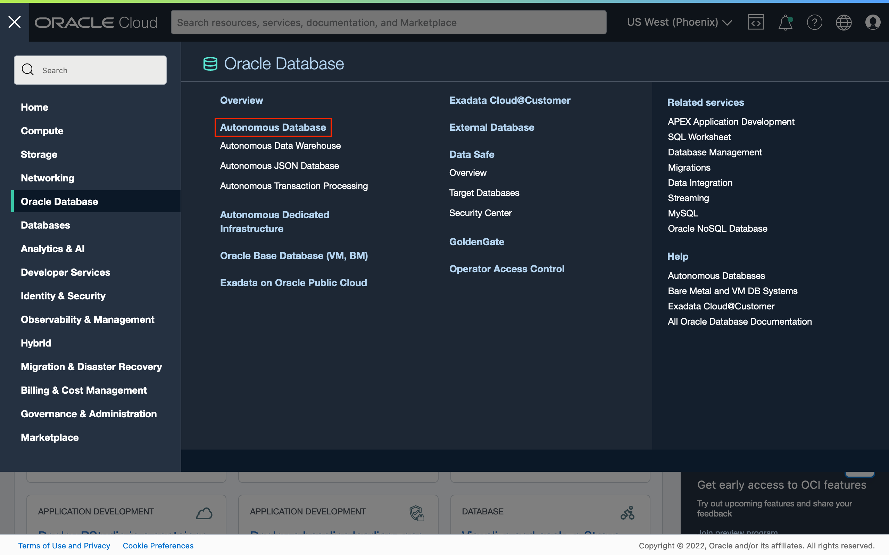
1. Click the *Create Autonomous Database* button.
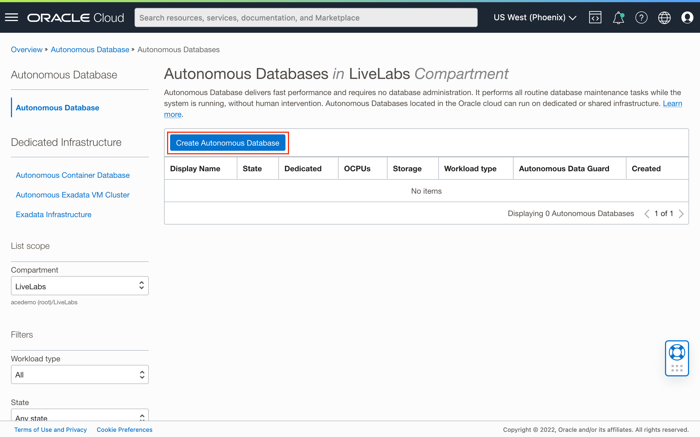
1. Begin by choosing the target compartment to create the database. Next, enter a suitable *Display name* and *Database name*. Then, select the desired the workload type, for example, *Transaction Processing*.
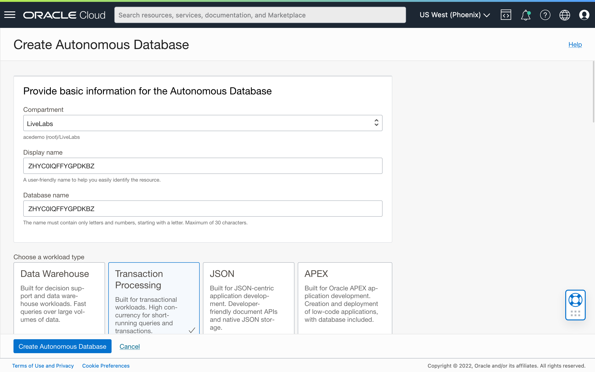
1. Scroll down and select *Serverless* deployment type. 
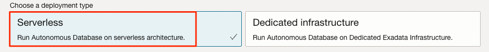
1. For this workshop, select *Always Free* option if within the tenancy's service limits. For Always Free databases, the *OCPU count* and storage limits are fixed. Also, auto scaling is not available for both OCPU and storage. Select the database version *19c* and then scroll down again.
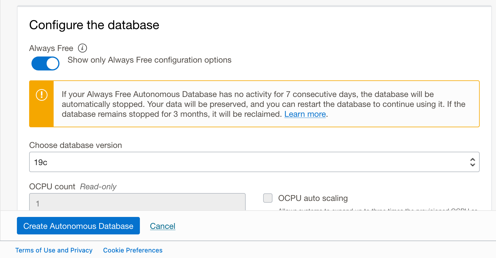
1. Enter a password (twice) that meets the database's password complexity rules. It must be between 12 and 30 characters long and must include at least one uppercase letter, one lowercase letter, and one numeric character. It should not include the word *admin*.
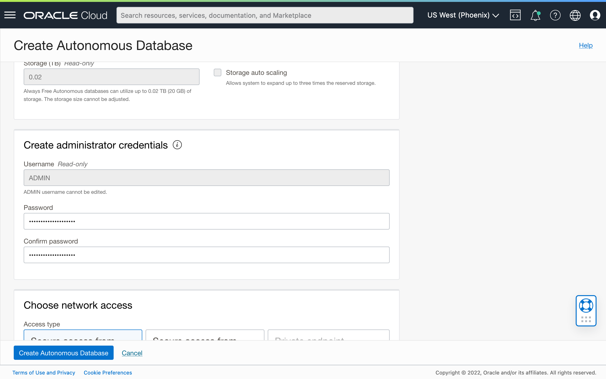
1. Scroll down once more. If this is an Always Free ADB, then the license type choice is set. If not, select the license type that is appropriate to the tenancy. Next, optionally provide an email address to be contacted about announcements and notifications concerning the newly provisioned instance. Finally, click the *Create Autonomous Database* button.
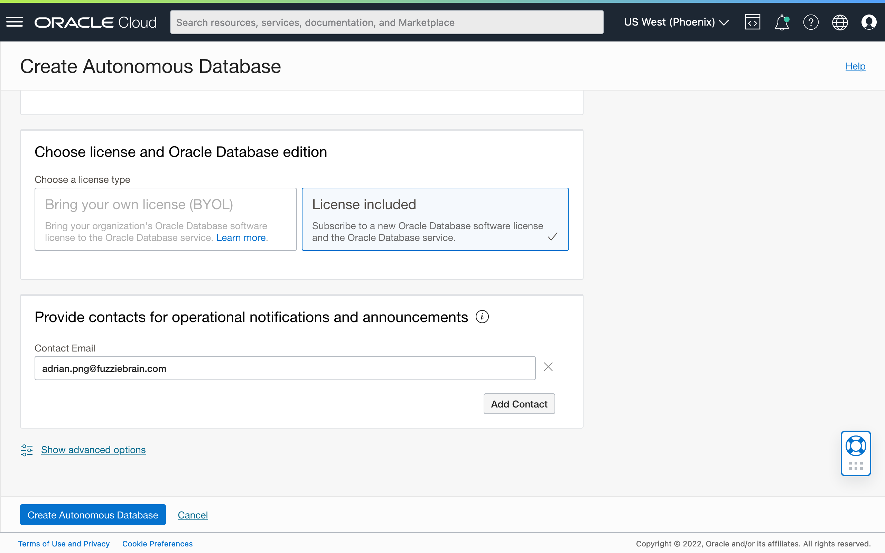

## Task 2: Create an Oracle APEX Workspace and Database Schema

1. Once the ADB has been fully provisioned, return to the *Autonomous Database* page, locate the instance's display name, and then click on it to view the ADB's details page. Click the *Tools* tab.

1. Click the *Open APEX* button to launch the *App Builder* in a new browser tab/window.
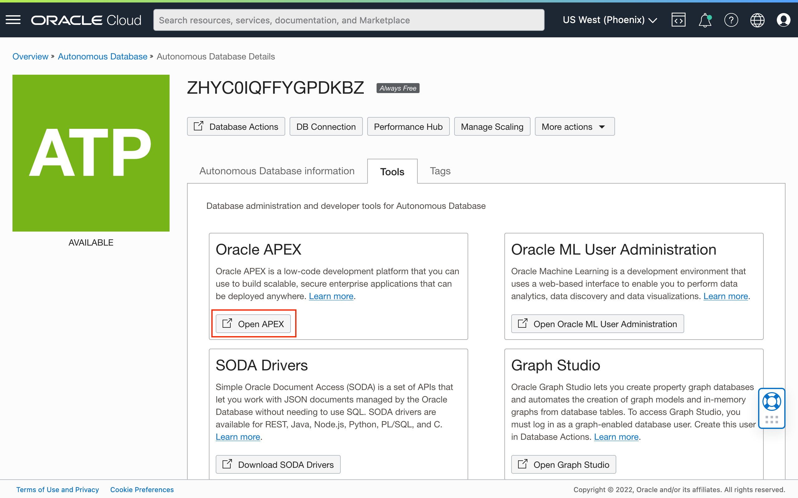
1. For new ADB instances, this should launch the *Administration Services* login screen. Enter the password for the *admin* user and click the *Sign In to Administration* button.
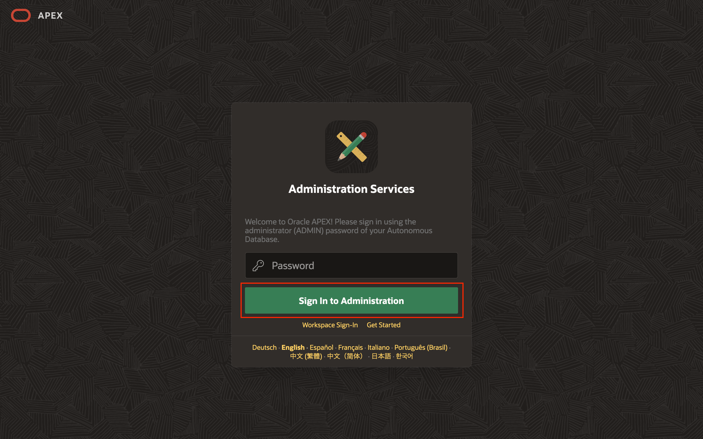
1. Again, for new ADB instances, after a successful login, the browser will redirect to the page shown below. Click the *Create Workspace* button.
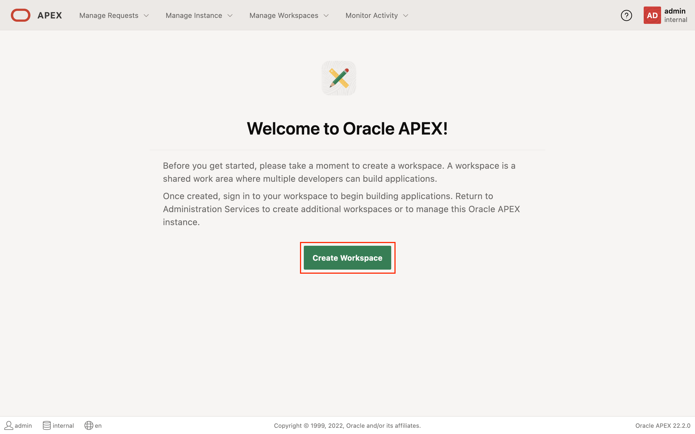
1. Click and select the *New Schema* option.
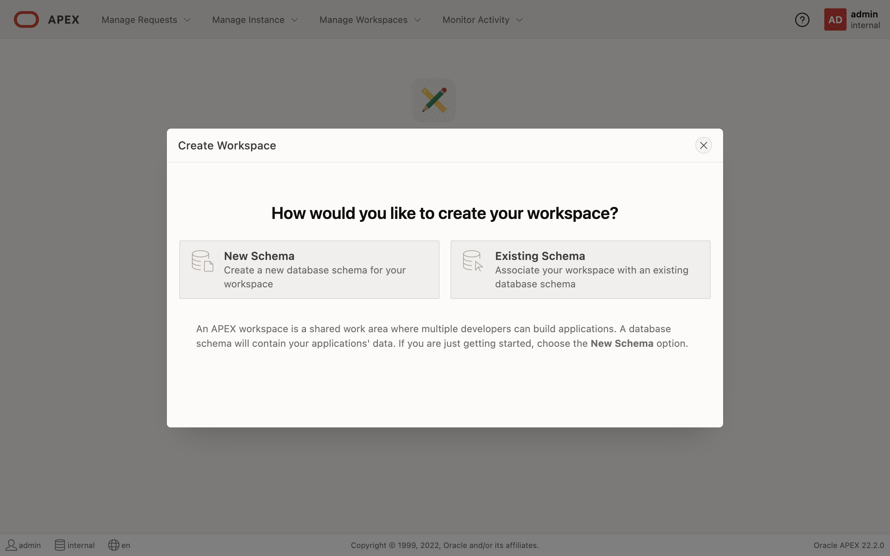
1. Enter the desired *Workspace Name* and *Workspace Username*. The latter will be used to create an Oracle Database user account. Also, provide a new *Workspace Password* that conforms to the same password policy described in *Task 1*. Click the *Create Workspace* button to create the workspace.
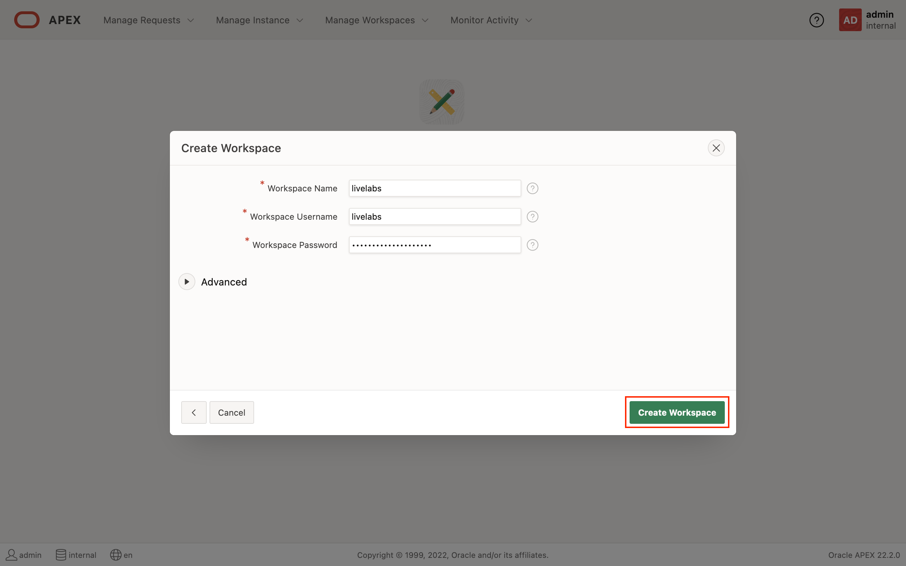
1. After the workspace has been successfully provisioned, click the button on the top-right, and then click the *Sign out* button to return to the App Builder login screen.
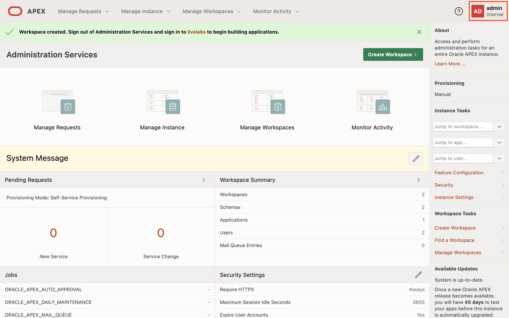
1. Enter the workspace name, username, and password set earlier when creating the workspace. Click the *Sign In* button to access the newly created workspace.
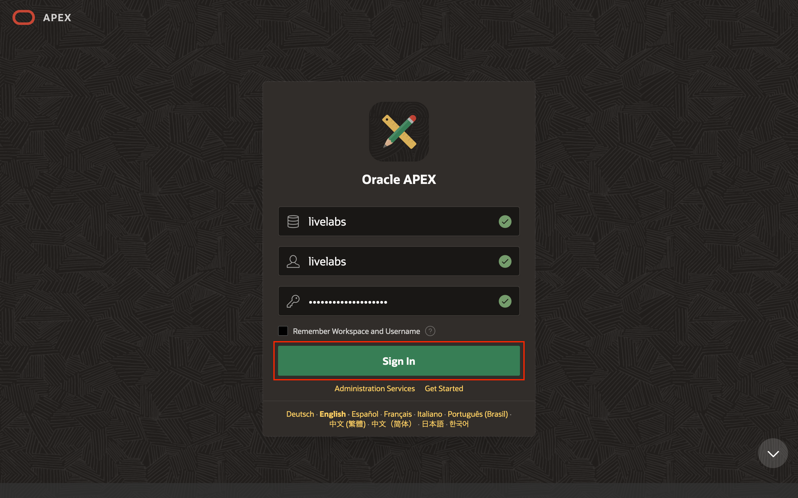
1. After successful authentication, the browser will redirect to the default App Builder landing page where workspace administrators and developers will have access to various functionalities to develop and manage APEX applications.
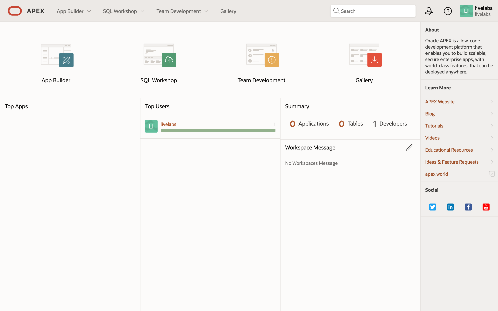

You may now **proceed to the next lab**.

## Acknowledgements

* **Author** - Adrian Png, Senior Cloud Solutions Architect, Insum Solutions Inc.
* **Last Updated By/Date** - Adrian Png, February 2023
