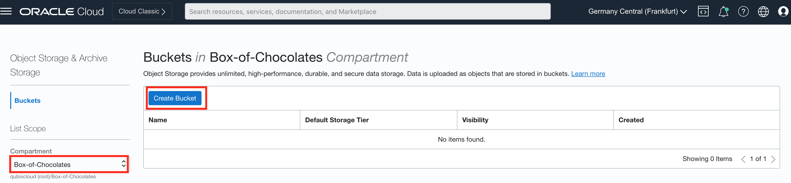
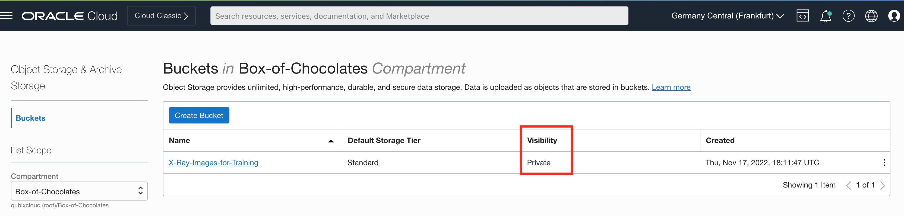
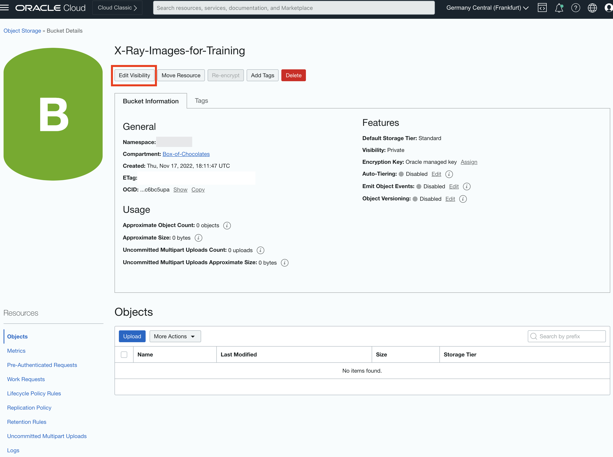
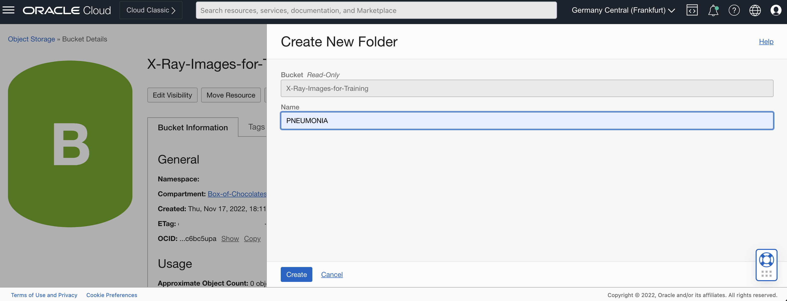

# Lab 1: Create image library

## Introduction

This lab walks you through the steps to organize an image library in Object Storage. You will then upload your X-Ray images to folders set in your image library.

Estimated Time: 45 minutes

### About OCI Object Storage

OCI Object Storage service is an internet-scale, high-performance storage platform that offers reliable and cost-efficient data durability. The Object Storage service can store an unlimited amount of unstructured data of any content type, including analytic data and rich content, like images and videos.

### Objectives

In this lab, you will:

* Create a new bucket within Object Storage
* Set bucket visibility
* Setup required folder structure
* Load images

### Prerequisites

This lab assumes you have:

* Completed **Get started** lab.

## Task 1: Create a new bucket

You will organize your image library in a new **Object Storage Bucket**.

1. Step 1: Log into OCI

    Login as a user who will manage your image library and will also perform the rest of the activities in this workshop.

    Select your Identity Provider, **oracleidentitycloudservice** in this case, ...

    

    ... and provide your user's credentials. For example, Candy.Sweets.

    

2. Step 2: Navigate to Buckets page

    From the **Navigator** menu (top-left corner) select **Storage** and then **Buckets**.

    

3. Step 3: Create a new bucket

    Please pay attention that you've selected correct compartment, ie. *Box-of-Chocolates*.

    Then click **Create Bucket**.

    

4. Step 4: Define bucket

    When defining a new bucket, you should provide a **Bucket Name** of your choosing and then leave everything else as default:
    * choose *Standard* for **Default Storage Tier**,
    * use *Encrypt* using Oracle managed keys for **Encryption** and
    * provide some **Tags** if you want to improve your OCI management and control.

    

    Finally click **Create** to create a new bucket.

## Task 2: Set visibility

In order to make your image library visible to other users/service, you have to update its visibility. Default visibility is set to *Private*. One way of changing visibility settings is simply to set visibility to **Public**. This can be a bit tricky from security reasons, but for this workshop we could squint in one eye.

1. Step 1: Change visibility

    From your bucket list choose your newly created bucket.

    

2. Step 2: Click on edit visibility

    In the Bucket Details page, click **Edit Visibility**.

    

3. Step 3: Update visibility to public

    Check **Public** radio button and click **Save Changes**

    

4. Step 4: (alternative option) Set Pre-Authenticated Request (PAR)

    Please note that you have an option to set **Pre-Authentication Request** instead of changing visibility to **Public**. This gives you more control over what can users see and do with your images.

    In this case click **Pre-Authentication Requests** link under **Resources** and then **Create Pre-Authenticated Request**, otherwise simply skip this step.

    

    Fill required field in PAR definition and finally click **Create Pre-Authenticated Request**.

    

    Pre-Authenticated Request details popup window is displayed. **NOTE:** Please copy URL for your reference as it won't be shown again.

    

    Click **Close** to return to the **Bucket Details** page.

    

## Task 3: Setup required folder structure

As already explained in the **Introduction** chapter of this workshop, this workshop is using [Chest X-Ray Images (Pneumonia)](https://www.kaggle.com/datasets/paultimothymooney/chest-xray-pneumonia) dataset. Check for more details **Introduction** chapter. If you haven't downloaded image, this might be the right time to do so. Images are downloaded as a zip file, which you should unzip to your local drive.

In this task you will setup the folder structure and load images into proper folders.

Start with the library folder structure. Image library will contain two folders:

* PNEUMONIA: this folder contains x-ray images of bacteria or virus infected lungs, and
* NORMAL: this folder contains x-ray images of normal and unaffected lungs.

1. Step 1: Create a new folder

    You should still be in the **Bucket Details page**. Scroll to the **Objects** section on the page (if you don't see **Objects** then click on **Objects** link under **Resources**.

    Click **More Actions** (next to **Upload**) and choose **Create New Folder** from the menu.

    

2. Step 2: Define folders

    **Name** your new folder *PNEUMONIA* and click **Create**

    

    Repeat this step for another new folder called *NORMAL*.

    

3. Step 3: Verify your folder structure

    Please verify that you've created two folders, PNEUMONIA and NORMAL, under the *root*.

    

## Task 4: Load images

We are now ready to load images into appropriate folders. The following steps might seem a bit time consuming and far from being optimal as all images will be loaded using **Upload** utility provided on **Bucket Details** page. More elegant way of uploading would be to run the image load programmatically.

The main issue with **Upload** is that you can only load approx. 200 images in one attempt. This means repeating the upload step several times to upload all 5000 images. This step can take approx. 30 minutes to complete.

1. Step 1: Initiate images **Upload**

    You should still be located in the **Objects** sub-page of the **Bucket Details** page of your bucket.

    Navigate to the **PNEUMONIA** folder first.

    

    And click **Upload**.

2. Step 2: Upload images for *PNEUMONIA*

    In the dialog window leave **Object Name Prefix** empty, and leave **Storage Tier** unchanged, ie. *Standard*.

    Then **drag image files** or **select files** from your computer (images from local folder *TRAIN/PNEUMONIA*) onto **Choose Files from your Computer Area**. When ready, **Upload** button will become enabled (blue). Please note that you can upload approx. 200 images in one upload job and that you will need to make several iterations to upload all of approx 3.500 images for *PNEUMONIA*.

    Click **Upload** and wait all images are uploaded.

    

    Repeat this step for all 3500 images for *PNEUMONIA*.

3. Step 3: Upload images for *NORMAL*

    Repeat the previous step, except this time navigate to *NORMAL* folder and upload images from *TRAIN/NORMAL* local folder.

    

    There should be approx. 1300 images for *NORMAL*.

4. Step 4: Verify images are correctly loaded

    Before you continue to the next lab, just make sure that you've uploaded all images and that images are correctly placed into *PNEUMONIA* and *NORMAL* folders:

    

    You can check and review details of uploaded images in corresponding folders.

    

    Once verified, you can **proceed to the next lab, Lab 2: Label your images**.

## Learn More

* [OCI Object Storage](https://docs.oracle.com/en-us/iaas/Content/Object/home.htm)

## Acknowledgements
* **Author** - Žiga Vaupot, Oracle ACE Pro, Qubix
* **Contributors** -  Grega Dvoršak, Qubix
* **Last Updated By/Date** - Žiga Vaupot, December 2022