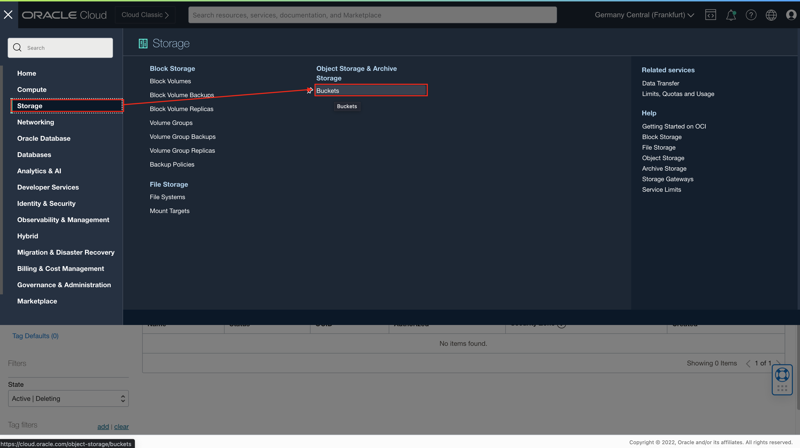
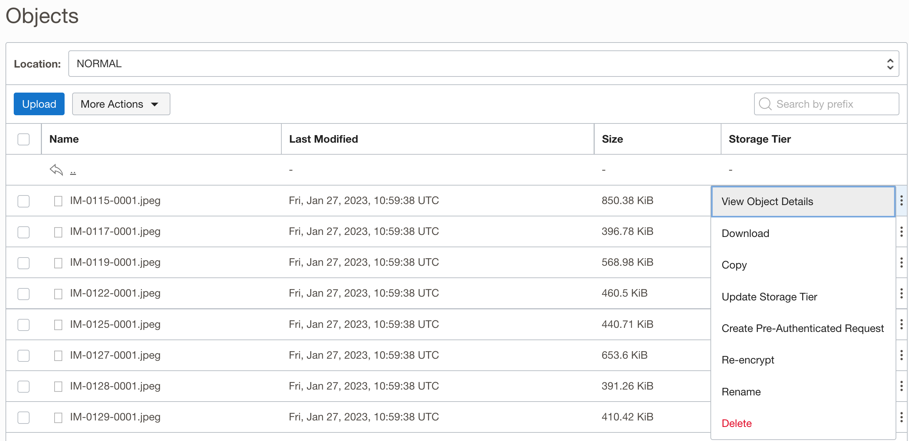
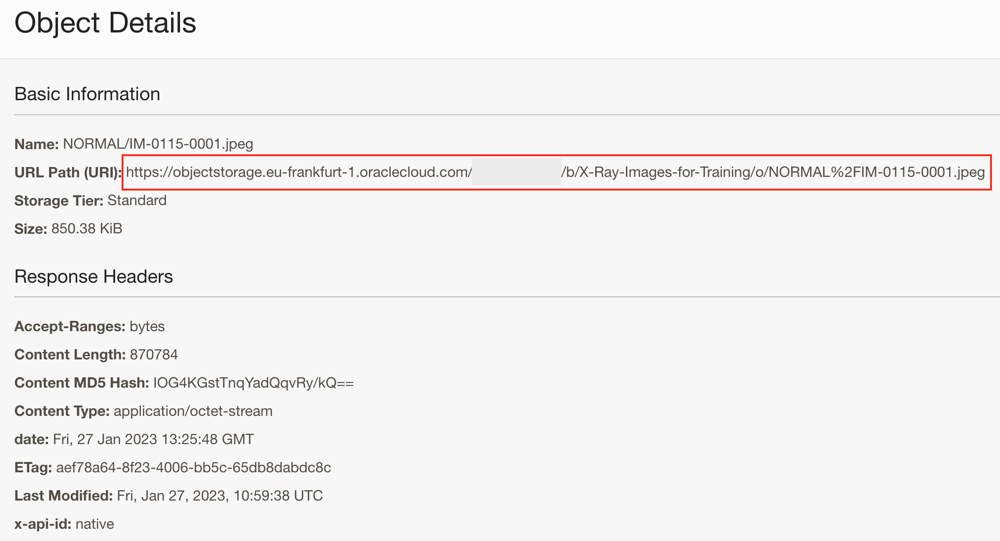

# Lab 1: Create image library

## Introduction

This lab walks you through the steps to organize an image library in Object Storage. You will then upload your X-Ray images to folders set in your image library.

Estimated Time: 45 minutes

### About OCI Object Storage

OCI Object Storage service is an internet-scale, high-performance storage platform that offers reliable and cost-efficient data durability. The Object Storage service can store an unlimited amount of unstructured data of any content type, including analytic data and rich content, like images and videos.

### Objectives

In this lab, you will:

* Create a new bucket within Object Storage
* Set bucket visibility
* Setup required folder structure
* Load images

### Prerequisites

This lab assumes you have:

* Completed **Get started** lab.

## Task 1: Create a new bucket

You will organize your image library in a new **Object Storage Bucket**.

1. Login into OCI using your (new) workshop user

    Login as a user, whom you created in the previous lab and who will manage your image library. You will use this same user to perform the rest of the activities in this workshop.

    You can follow log into OCI steps as described in **Get started** lab.

    

2. Navigate to Buckets page

    From the **Navigator** menu (top-left corner) select **Storage** and then **Buckets**.

    

3. Create a new bucket

    Please pay attention that you've selected correct compartment, ie. *Box-of-Chocolates*.

    Then click **Create Bucket**.

    

4. Define bucket

    When defining a new bucket, you should provide a **Bucket Name** of your choosing and then leave everything else as default:
    * choose *Standard* for **Default Storage Tier**,
    * use *Encrypt* using Oracle managed keys for **Encryption** and
    * provide some **Tags** if you want to improve your OCI management and control.

    

    Finally click **Create** to create a new bucket.

## Task 2: Set visibility

In order to make your image library visible to other users/service, you have to update its visibility. Default visibility is set to *Private*. 

One way of changing visibility settings is simply to set visibility to **Public**. However, it is not recommended to use this option from security reasons. It is much better to manage visibility using Pre-Authenticated Request (PAR), which is explained in the next task.

1. Change visibility

    From your bucket list choose your newly created bucket.

    

2. Click on edit visibility

    In the Bucket Details page, click **Edit Visibility**.

    

3. (optional) Update visibility to public

    Please take a look at the note about pre-authenticated requests. It is recommended to use pre-authenticated requests instead of public visibility therefore you can skip this step and continue with the next step.

    If you decided to set visibility to *public* afterall, then complete this and skip the next step.

    Check **Public** radio button and click **Save Changes**. Also pay attention to the **Consider using pre-authenticated requests instead** note.

    

4. Set Pre-Authenticated Request (PAR)

    Oracle recommends using **pre-authenticated requests** instead of public buckets. Pre-authenticated requests support additional authorization, expiry, and scoping capabilities not possible with public buckets.

    This is why you will set and use **Pre-Authentication Request** instead of **public** visibility.

    Click **Pre-Authentication Requests** link under **Resources** and then **Create Pre-Authenticated Request**.

    

    Fill required field in PAR definition and finally click **Create Pre-Authenticated Request**.

    

    Pre-Authenticated Request details popup window is displayed.

    **NOTE:** Make sure you **make a copy of the URL** as you will require it later to access and view images. This URL won't be shown again.

    

    Click **Close** to return to the **Bucket Details** page.

    

## Task 3: Setup required folder structure

As already explained in the **Introduction** chapter of this workshop, this workshop is using [Chest X-Ray Images (Pneumonia)](https://www.kaggle.com/datasets/paultimothymooney/chest-xray-pneumonia) dataset. Check for more details **Introduction** chapter. If you haven't downloaded image, this might be the right time to do so. Images are downloaded as a zip file, which you should unzip to your local drive.

In this task you will setup the folder structure and load images into proper folders.

Start with the library folder structure. Image library will contain two folders:

* PNEUMONIA: this folder contains x-ray images of bacteria or virus infected lungs, and
* NORMAL: this folder contains x-ray images of normal and unaffected lungs.

1. Create a new folder

    You should still be in the **Bucket Details page**. Scroll to the **Objects** section on the page (if you don't see **Objects** then click on **Objects** link under **Resources**.

    Click **More Actions** (next to **Upload**) and choose **Create New Folder** from the menu.

    

2. Define folders

    **Name** your new folder *PNEUMONIA* and click **Create**

    

    Repeat this step for another new folder called *NORMAL*.

    

3. Verify your folder structure

    Please verify that you've created two folders, *PNEUMONIA* and *NORMAL*, under the *root*.

    

## Task 4: Prepare browser for image bulk load

Original image dataset resides on Kaggle.com. There are several options how to load data into Object Storage. The simplest (but also longest) way is to download all images to your laptop and then upload them to the bucket using upload utility from console. This is fine when dealing with smaller datasets, but with 5000+ images this process could be a bit lengthy and unproductive. That is why, you can use better and much faster approach:

* download image to OCI Cloud Shell,
* unzip downloaded image dataset to OCI Cloud Shell file system (each user has 5GB of free space available by default)
* perform images bulk load to Object Storage into respective folders in bucket folders.

This procedure will probably save you more than 90% of the time if you decided to load images manually. But before you start you need to perform some short setup steps:

1. Install GetCookies in Chrome

    In Chrome, navigate to Chrome Web Store and install *Get cookies.txt* extension. This will help you to store cookie information which is needed to connect and download images from Kaggle.com from command line interface.

    Navigate to:

    ```text
    <copy>https://chrome.google.com/webstore/detail/get-cookiestxt/bgaddhkoddajcdgocldbbfleckgcbcid/related</copy>
    ```

    

    ... and click **Add to Chrome**.

    Then follow the dialog:

    

    

2. Login to Kaggle.com using your account and save GetCookies.txt file

    In order to obtain proper cookies, log into Kaggle.com and obtain cookie information using **Get cookie.txt** extension. If you don't have Kaggle.com account, create one. It is not complicated and is free.

    In your browser search for GetCookie.txt extension and open it.

    

    Get cookies.txt window for www.kaggle.com will open. You have to copy its content to clipboard. Therefore click **Copy**.

    

3. Save copied cookie information to local file

    Open a new file on your local laptop and copy clipboard content to this new file. Save it, for example as *kaggle\_cookies.txt*.

    

## Task 5a: Load images to Object Storage

When your cookie.txt file is locally stored, you can start the loading process.

1. Open Cloud Shell

    Return to your OCI console and open Cloud Shell. You can do it by clicking on **Developer tools** menu icon. From the list of available options, select **Cloud Shell**.

    

    Cloud Shell opens as Command Line Interface (CLI).

    

2. Upload your cookie.txt file to Cloud Shell

    To start downloading images from Kaggle.com, you must first upload your cookie.txt file to Cloud Shell.

    

    

    

    

3. Download images to Cloud Shell

    Images can be downloaded from Kaggle.com by issuing the following command:

    ```console
    <copy>wget -x -c --load-cookies kaggle_cookies.txt https://www.kaggle.com/datasets/paultimothymooney/chest-xray-pneumonia/download?datasetVersionNumber=2</copy>
    ```

    Image archive download starts and you can track progress. This operation won't take long to complete.

    

4. Unzip image archive

    When image archive is downloaded, create a new folder for images and unzip all images into that folder.

    ```console
    <copy>
    mkdir pneumonia-dataset

    unzip www.kaggle.com/datasets/paultimothymooney/chest-xray-pneumonia/download\?datasetVersionNumber\=2 -d pneumonia-dataset/
    </copy>
    ```

    This operation won't take much time as well. After unzip is completed, a new */pneumonia-dataset/chest-xray* folder is created. You will use content of *train* and *val* folders.

    For example, you can check the number of images in /train/NORMAL and /train/PNEUMONIA folders.

    

5. Load images to Object Storage

    In the last step, you will load images from Cloud Shell to Object storage. 

    Return to Cloud Shell and issue the following two command to load images for NORMAL and PNEUMONIA respectively:

    ```console
    <copy>
    oci os object bulk-upload -ns frly8pi3k85f -bn X-Ray-Images-for-Training --src-dir /home/X_Ray/pneumonia-dataset/chest_xray/train/PNEUMONIA --prefix PNEUMONIA/
    oci os object bulk-upload -ns frly8pi3k85f -bn X-Ray-Images-for-Training --src-dir /home/X_Ray/pneumonia-dataset/chest_xray/train/NORMAL --prefix NORMAL/
    </copy>
    ```

    Again, you can track the process. It might take a little bit longer than download, but not by much. When completed, you can verify the number of images copied into your bucket.

    

## Task 5b: Alternative option to load images into Object Storage

If you successfully completed Task 4, then simply skip this Task. If not, then you can load yur images manually as described below.

The following steps might seem a bit time consuming and far from being optimal as all images will be loaded using **Upload** utility provided on **Bucket Details** page. More elegant way of uploading is already described and performed in previous Task.

The main issue with **Upload** is that you can only load approx. 200 images in one attempt. This means repeating the upload step several times to upload all 5000 images. This step can take approx. 30 minutes to complete.

1. Initiate images **Upload**

    You should still be located in the **Objects** sub-page of the **Bucket Details** page of your bucket.

    Navigate to the **PNEUMONIA** folder first.

    

    And click **Upload**.

2. Upload images for *PNEUMONIA*

    In the dialog window leave **Object Name Prefix** empty, and leave **Storage Tier** unchanged, ie. *Standard*.

    Then **drag image files** or **select files** from your computer (images from local folder *TRAIN/PNEUMONIA*) onto **Choose Files from your Computer Area**. When ready, **Upload** button will become enabled (blue). Please note that you can upload approx. 200 images in one upload job and that you will need to make several iterations to upload all of approx 3.500 images for *PNEUMONIA*.

    Click **Upload** and wait all images are uploaded.

    

    Repeat this step for all 3500 images for *PNEUMONIA*.

3. Upload images for *NORMAL*

    Repeat the previous step, except this time navigate to *NORMAL* folder and upload images from *TRAIN/NORMAL* local folder.

    

    There should be approx. 1300 images for *NORMAL*.

## Task 5: Verify images are loaded properly

When you have successfully completed the task of loading images to Object Storage, make sure that you've uploaded all images and that images are correctly placed into *PNEUMONIA* and *NORMAL* folders:

1. Verify images are loaded into proper folders.

    

    You can check and review details of uploaded images in corresponding folders.

    

    Once verified, you can **proceed to the next lab**.

2. Check if you can see your images

    You are using a private bucket with pre-authenticated request. This means, that you will not be able to see your image using URL provided in object details.

    Navigate to one of the folders, ie. NORMAL and click on the menu icon on the right. Select **View Object Details**. 

    

    This opens details of selected image. 

    

    When applied, this image URL will not display an image, because visibility for the bucket is set to *private*. In order to be able to view an image, you must replace first part of the url with the URL that you stored when you were creating pre-authenticated request (PAR).

    For example, if the URL of an image is:

    ```text
    https://objectstorage.eu-frankfurt-1.oraclecloud.com/n/...domain.../b/X-Ray-Images-for-Training/o/PNEUMONIA%2Fperson1000_bacteria_2931.jpeg
    ```

    and PAR URL is:

    ```text
    https://objectstorage.eu-frankfurt-1.oraclecloud.com/p/...some code.../n/...domain.../b/X-Ray-Images-for-Training/o/
    ```

    then replace first part of the image URL with PAR URL and add only image name at the end: `PNEUMONIA/person1000_bacteria_2931.jpg`. New URL should look like this:

     ```text
    https://objectstorage.eu-frankfurt-1.oraclecloud.com/p/...some code.../n/...domain.../b/X-Ray-Images-for-Training/o/PNEUMONIA%2Fperson1000_bacteria_2931.jpeg
    ```

    You can now open an image with this combined URL, for example:

    

    If you don't use combined URL, then your browser would display the following error:

    .

    This concludes this lab. You can proceed now to the next lab.

## Learn More

* [OCI Object Storage](https://docs.oracle.com/en-us/iaas/Content/Object/home.htm)


## Acknowledgements
* **Author** - Žiga Vaupot, Oracle ACE Pro, Qubix
* **Contributors** -  Grega Dvoršak, Qubix
* **Last Updated By/Date** - Žiga Vaupot, December 2022