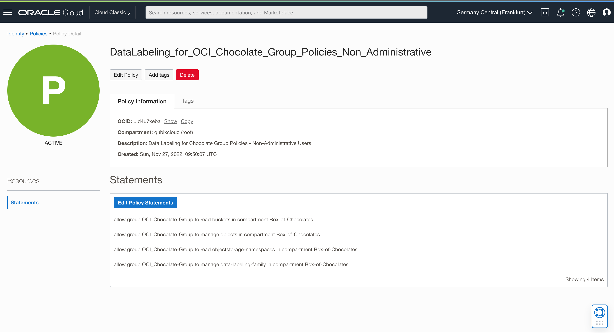

# Image Library

## Introduction

This lab walks you through the steps to create a new dataset using images from your image library and to label images with one of two labels.

Estimated Time: 60 minutes

### About Data Labeling

<... ADD text about data labeling ...> 

### Objectives

In this lab, you will:

* Create a new dataset using images from object storage
* Label images using Data Labeling utility
* Programmatic (Bulk) Image labeling

### Prerequisites

This lab assumes you have:

* An Oracle Cloud account

## Task 1: Set privileges for Data Labeling

Before you can start your data labeling process, you must set additional dynamic group and set some policies for your existing OCI Group and for that new Dynamic Group.

1. Step 1: Navigate to **Data Labeling** page

    From the **Navigator** menu select **Analytics & AI** and then **Data Labeling**.

    

2. Step 2: Create a new Dataset

    Click on **Datasets** link under **Data Labeling** on the left side of the page. This will open **Dataset list** page in selected Compartment.

    

3. Step 3: Verify **Data Labeling Prerequisites**

    Expand **Show more information** to display what prerequisites have to be met before you can start you data labeling exercise. If these are not met, then Data Labeling just might not run properly.
    
    

    You can use OCI Group you've created in the beginning of this workshop, so you can skip the first step and continue with creating a new Dynamic Group.

4. Step 4: Navigate to **Dynamic Groups** page

    From **Navigator** menu choose **Identity & Security** and then **Dynamic Groups**.

     

5. Step 5: Create a new **Dynamic Group**

    Click **Create** and define a new **Dynamic Group**.

    Provide **Name**, **Description** and enter the following statement to the **Matching Rules**

    ```console
    ALL { resource.type = 'datalabelingdataset' }
    ```

    

6. Step 6: Verify your new **Dynamic Group**

    Verify that your **Dynamic Group** is properly defined.

    


7. Step 7: Set policies for **Data Labeling**

    From the **Navigator** menu select **Identity & Security** and then **Policies**.

    

8. Step 8: Create a new policy for Non-Administrative users

    Make sure that you've selected your *root* compartment first. Then click **Create Policy**.

    The first policy is for Non-Administrative users. These are members of previously created OCI Group. 

    OCI Group needs the following privileges:

    ```console
    allow group OCI_Chocolate-Group to read buckets in compartment Box-of-Chocolates
    allow group OCI_Chocolate-Group to manage objects in compartment Box-of-Chocolates
    allow group OCI_Chocolate-Group to read objectstorage-namespaces in compartment Box-of-Chocolates
    allow group OCI_Chocolate-Group to manage data-labeling-family in compartment Box-of-Chocolates
    ```

    

    Verify policies are properly entered.

    


9. Step 9: Create a new policy for Dynamic Group

    Repeat **Create Policy** for Dynamic Group you've created in the previous step. 

    Enter the following statements:

    ```console
    allow dynamic-group Box-of-Chocolates_DataLabeling to read buckets in compartment Box-of-Chocolates
    allow dynamic-group Box-of-Chocolates_DataLabeling to read objects in compartment Box-of-Chocolates
    allow dynamic-group Box-of-Chocolates_DataLabeling to manage objects in compartment Box-of-Chocolates where any {request.permission='OBJECT_CREATE'}
    ```

    

    Verify policies are properly entered.

    

    You are now ready to start with Data Labeling.

## Task 2: Label images using Data Labeling tool

Basic labeling tool is provided within OCI. With this tool, you can label one image at the time, which is useful if your image library is not too large. In case of larger libraries, manual image labeling can be very time consuming and error prone. That is why, we will use programmatic data labeling using utilities provided by Oracle. We will provide code in the next session.

But before you continue, you need to perform the first step, **Create Dataset** from your object storage image library.

1. Step 1: **Create Dataset**

    Navigate again to **Data Labeling** page you've entered in the first task of this Lab. 

    Make sure you've selected your *root* compartment, **Box-of-Chocolates** in our case, and then click **Create dataset**.

    

2. Step 2: Define your dataset - **Add dataset details**

    Use **Create dataset** wizard and set the parameters of your dataset.

    First, **Name** your dataset and optionally add **Description** and provide **Labeling instructions**

    

    Click **Images** from **Dataset format** and **Single label** for **Annotation class**.

    Click **Next**

3. Step 3: Define your dataset - **Add files and labels**

    In the 2nd step choose **Select from Object Storage** and provide **Object Storage location** details. This should be your bucket where you've put all of your images.

    

    Then *scroll* down to the lower section of this step.

    Your files will be displayed.

    

    Add two labels:  **PNEUMONIA** and **NORMAL** in **Labels set**

    

    Click **Next**.

4. Step 4: Define your dataset - **Review** and **Create**

    Review your dataset details and click **Create**

5. Step 5: Generating records

    Records for your dataset are generated. You will have to wait for approx. 20-30 minutes. You can track the progress in top right corner.

    

6. Step 6: Review your dataset

    You can see that there were 4881 records generated, none of them labeled yet.

    

    You can switch between **Data records** and **Gallery view**

    

7. Step 7: Open Data Labeling tool and set labels manually

    You can click on the first image and Data Labeling tool will open. Since the first image is from PNEUMONIA folder, you can label it as **PNEUMONIA**.

    Click **Save & next** and continue with manual labeling process.

    

    When you're done with labeling, exit by clicking **Cancel**. You can now see how many records have been labeled. 1 out of 4881 records in our example below.

    

## Task 3: Bulk image labeling

We have 4881 images to label. This is too much to label images manually, hence we will use Python program to label images programmatically.

Oracle provides code which can be adjusted and used in your specific case. You can find the *original code* on [Github](https://github.com/oracle-samples/oci-data-science-ai-samples/tree/master/data_labeling_examples).


We have used Python code and adjusted to this labs requirements.You can download [data-labeling.zip](./files/data-labeling.zip) to your laptop.

1. Step 1: Download [data-labeling.zip](./files/data-labeling.zip) to your computer.

    You don't have to extract the zip file now, but you can still check it's content and the folder structure.

    

2. Step 2: Open **Cloud Shell**

    In OCI Console, for example from Data Labeling > Dataset page, open **Cloud Shell** console.

    

    On the top bar, you open menu and choose **Cloud Shell**

    

3. Step 3: Upload data-labeling.zip file.

    **Cloud Shell** opens in the bottom section of your screen. In the top left corner, open **Utilities** menu and select **Upload**

    

    File Upload window pops up. Drag data-labeling.zip file to the rectangle area or select it from your computer.

    

    *data-labeling.zip* file is added below the upload section. You can now click **Upload** and the file will be loaded to your home directory.

    

4. Step 4: Unzip *data-labeling.zip* file.

    Once uploaded, simply unzip your file in your home directory.

    ```console
    unzip data-labeling.zip
    ```

    

    A new *data-labeling* folder is created with the content you've already reviewed above.

    ```console
    ls -l
    ls ./labeling_schemas/* -l
    ```

    

5. Step 5: Invoke **Code Editor** and update *config.py*

    Navigate to *data-labeling* folder and open *config.py* for editing. You can use **vi** for that, or if you are not so familiar with it, you can open **Code Editor** and edit the file there.

    

    When **Code Editor** opens, open file *config.py*.

    

    Please make sure you make changes in the lines

    ```console
    # region identifier of DLS Dataset, ie.: eu-frankfurt-1
    region_identifier="<YOUR REGION>"

    # compartment where DLS Dataset exists
    compartment_id = "<YOUR COMPARTMENT OCID>"

    # ocid of the DLS Dataset
    dataset_id = "<YOUR DATASET OCID>"
    ```

    In case you are new to OCI, here is how you can obtain required values:

    **YOUR REGION**

    **YOUR COMPARTMENT OCID**

    **YOUR DATASET OCID**

    Once you have required values, change corresponding lines in *config.py" and leave other lines unchanged.

6. Step 6: Create *.oci/config* file for authorization

    There is more requirement you need to fulfill before you can run data labeling program.

    In the *config.py*, you can see that the first line defines *config_ file_ path*.

    ```console
    # config file path
    config_file_path="/home/<YOUR USER>/.oci/config"
    ```

    At the moment */home/YOUR USER/.oci/* folder and */home/YOUR USER/.oci/config* file are not existing. So we need to create it manually.

    The content of the config file is as follows:

    ```console
    [DEFAULT]
    user=<YOUR USER OCID>
    fingerprint=<FINGERPRINT FOR PRIVATE API KEY>
    key_file=<PATH TO YOUR PRIVATE API KEY>
    tenancy=<YOUR TENANCY OCID>
    region=<YOUR REGION>
    ```

    You can also download the [config]](./files/config) file and update it with required values.

    The missing values can be obtained here:

    **YOUR USER OCID**

    **PRIVATE API KEY** and **FINGERPRINT FOR PRIVATE API KEY**

    **YOUR TENANCY OCID** and **YOUR REGION**

    Return back to **Cloud Shell** and make sure you are located in your home directory, */home/Candy_Swee/* folder in our case. 

    Create a new folder called *.oci* first and then open *vi* to create *config*. Copy the content of your local updated *config* file into *vi* and save the file.

    ```console
    mkdir .oci
    cd .oci
    vi config
    ```

    

    Save and exit *vi*.

    *config* file also points to your private API key, *oci_api_key.pem*. You have already downloaded it in one of the previous steps. Now you need to upload it to your home folder and then place it into *.oci* folder.


10. Step 10: Run *main.py*

    You can finally start bulk labeling. Make sure you are in *data-labeling* folder and run *main.py*.

    ```console
    python3 main.py
    ```
    
    

    Program will run approx. 20-30 minutes.

    

    Once finished, check if all images are labeled now:

    

    This concludes this session, and now you can start training your new vision model.


## Learn More

* [OCI Data Labeling](https://docs.oracle.com/en-us/iaas/Content/Object/home.htm)

## Acknowledgements

* **Author** - Žiga Vaupot, Oracle ACE Pro, Qubix
* **Contributors** -  Grega Dvoršak, Qubix
* **Last Updated By/Date** - Žiga Vaupot, November 2022
