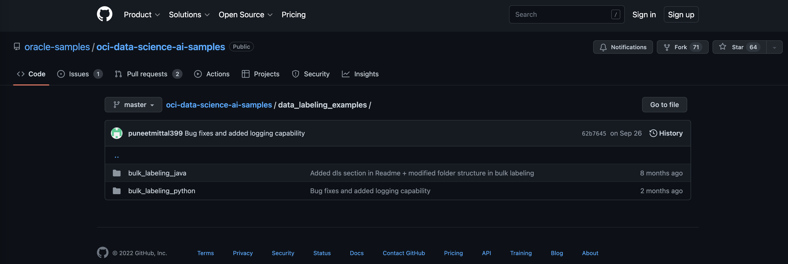

# Image Library

## Introduction

This lab walks you through the steps to create a new dataset using images from your image library and to label images with one of two labels.

Estimated Time: 60 minutes

### About Data Labeling

<... ADD text about data labeling ...> 

### Objectives

In this lab, you will:

* Create a new dataset using images from object storage
* Label images using Data Labeling utility
* Programmatic (Bulk) Image labeling

### Prerequisites

This lab assumes you have:

* An Oracle Cloud account

## Task 1: Set privileges for Data Labeling

Before you can start your data labeling process, you must set additional dynamic group and set some policies for your existing OCI Group and for that new Dynamic Group.

1. Step 1: Navigate to **Data Labeling** page

    From the **Navigator** menu select **Analytics & AI** and then **Data Labeling**.

    

2. Step 2: Create a new Dataset

    Click on **Datasets** link under **Data Labeling** on the left side of the page. This will open **Dataset list** page in selected Compartment.

    

3. Step 3: Verify **Data Labeling Prerequisites**

    Expand **Show more information** to display what prerequisites have to be met before you can start you data labeling exercise. If these are not met, then Data Labeling just might not run properly.
    
    

    You can use OCI Group you've created in the beginning of this workshop, so you can skip the first step and continue with creating a new Dynamic Group.

4. Step 4: Navigate to **Dynamic Groups** page

    From **Navigator** menu choose **Identity & Security** and then **Dynamic Groups**.

     

5. Step 5: Create a new **Dynamic Group**

    Click **Create** and define a new **Dynamic Group**.

    Provide **Name**, **Description** and enter the following statement to the **Matching Rules**

    ```console
    ALL { resource.type = 'datalabelingdataset' }
    ```

    

6. Step 6: Verify your new **Dynamic Group**

    Verify that your **Dynamic Group** is properly defined.

    


7. Step 7: Set policies for **Data Labeling**

    From the **Navigator** menu select **Identity & Security** and then **Policies**.

    

8. Step 8: Create a new policy for Non-Administrative users

    Make sure that you've selected your *root* compartment first. Then click **Create Policy**.

    The first policy is for Non-Administrative users. These are members of previously created OCI Group. 

    OCI Group needs the following privileges:

    ```console
    allow group OCI_Chocolate-Group to read buckets in compartment Box-of-Chocolates
    allow group OCI_Chocolate-Group to manage objects in compartment Box-of-Chocolates
    allow group OCI_Chocolate-Group to read objectstorage-namespaces in compartment Box-of-Chocolates
    allow group OCI_Chocolate-Group to manage data-labeling-family in compartment Box-of-Chocolates
    ```

    

    Verify policies are properly entered.

    


9. Step 9: Create a new policy for Dynamic Group

    Repeat **Create Policy** for Dynamic Group you've created in the previous step. 

    Enter the following statements:

    ```console
    allow dynamic-group Box-of-Chocolates_DataLabeling to read buckets in compartment Box-of-Chocolates
    allow dynamic-group Box-of-Chocolates_DataLabeling to read objects in compartment Box-of-Chocolates
    allow dynamic-group Box-of-Chocolates_DataLabeling to manage objects in compartment Box-of-Chocolates where any {request.permission='OBJECT_CREATE'}
    ```

    

    Verify policies are properly entered.

    

    You are now ready to start with Data Labeling.

## Task 2: Label images using Data Labeling tool

Basic labeling tool is provided within OCI. With this tool, you can label one image at the time, which is useful if your image library is not too large. In case of larger libraries, manual image labeling can be very time consuming and error prone. That is why, we will use programmatic data labeling using utilities provided by Oracle. We will provide code in the next session.

But before you continue, you need to perform the first step, **Create Dataset** from your object storage image library.

1. Step 1: **Create Dataset**

    Navigate again to **Data Labeling** page you've entered in the first task of this Lab. 

    Make sure you've selected your *root* compartment, **Box-of-Chocolates** in our case, and then click **Create dataset**.

    

2. Step 2: Define your dataset - **Add dataset details**

    Use **Create dataset** wizard and set the parameters of your dataset.

    First, **Name** your dataset and optionally add **Description** and provide **Labeling instructions**

    

    Click **Images** from **Dataset format** and **Single label** for **Annotation class**.

    Click **Next**

3. Step 3: Define your dataset - **Add files and labels**

    In the 2nd step choose **Select from Object Storage** and provide **Object Storage location** details. This should be your bucket where you've put all of your images.

    

    Then *scroll* down to the lower section of this step.

    Your files will be displayed.

    

    Add two labels:  **PNEUMONIA** and **NORMAL** in **Labels set**

    

    Click **Next**.

4. Step 4: Define your dataset - **Review** and **Create**

    Review your dataset details and click **Create**

5. Step 5: Generating records

    Records for your dataset are generated. You will have to wait for approx. 20-30 minutes. You can track the progress in top right corner.

    

6. Step 6: Review your dataset

    You can see that there were 4881 records generated, none of them labeled yet.

    

    You can switch between **Data records** and **Gallery view**

    

7. Step 7: Open Data Labeling tool and set labels manually

    You can click on the first image and Data Labeling tool will open. Since the first image is from PNEUMONIA folder, you can label it as **PNEUMONIA**.

    Click **Save & next** and continue with manual labeling process.

    

    When you're done with labeling, exit by clicking **Cancel**. You can now see how many records have been labeled. 1 out of 4881 records in our example below.

    

## Task 3: Bulk image labeling

We have 4881 images to label. This is too much to label images manually, hence we will use Python program to label images programmatically.

Oracle provides code which can be adjusted and used in your specific case. You can find the *original code* on [Github](https://github.com/oracle-samples/oci-data-science-ai-samples/tree/master/data_labeling_examples).



We have used Python code and adjusted to this labs requirements.You can download [lab2.zip](./files/lab2.zip) to your laptop.

1. Step 1: Download [lab2.zip](./files/lab2.zip) to your computer.

    You don't have to extract the zip file on your laptop as you will upload it to your OCI environment. In any case if you check there should be two folders: *data-labeling* and *.oci* (this one is hidden).

    If unzipped, *lab2.zip* has the following structure:

    

2. Step 2: Open **Cloud Shell**

    In the OCI Console, on the top bar, click **Developer Tools** icon to open associated menu and choose **Cloud Shell** option. That would open **Cloud Shell** terminal window.

    

3. Step 3: Upload pre-prepared files for data labeling.

    In the **Cloud Shell** click **Cloud Shell Menu** icon (top right icon). Select **Upload**.

    

    This opens a dialog window. Drop lab2.zip file onto designated area or browse your computer and upload it. Observe that file name appears in the list of files for upload.

    Click **Upload**.

    

    You can check the upload status. Once *Completed*, click **Hide**.

    

    Now you can unzip *lab2.zip* file in your home directory.

    ```console
    unzip lab2.zip
    ```

    

    Please check that unzip created 2 folders: *data-labeling* and *.oci* with files as presented in image below:

    

    You can now minizize **Cloud Shell** terminal as you will need it a bit later.

    

4. Update *config.py* with required configuration parameters

    In order to run the data labeling program properly, you need to make some changes in */data-labeling/config.py* and */.oci/config* files. Let's show how to update and configure */data-labeling/config.py* first.

    **4.1 YOUR REGION**

    Probably the easiest way to obtain your region information is to look at the URL. Spot *region* section and copy the value succeeding '=' simbol.

    

    In our example, region is *eu-frankfurt-1*, but it can not be the case with your tenancy.

    **4.2 YOUR COMPARTMENT OCID**

    To obtain your compartment OCID navigate to **Compartments** page.

    

    Your **Compartment OCID** is located in **Compartment Information** tab (default). Click **Show** to display complete OCID and **Copy** to copy it clipboard.

    

    **4.3 YOUR DATASET OCID**

    **Dataset OCID** can be found on your **Dataset Details Page** under **Data Labeling**. **Dataset OCID** can be found under **Dataset information** tab.
    
    

5. Update *config* with required configuration parameters

    *config* file is located in *.oci* folder. This is the file to which *config.py* is referring to in the first line.
    
    Check this entry in *config.py*:

    ```console
    # config file path
    config_file_path="/home/.oci/config"
    ```
    There are several entries in the *config* file that you need to set:

    **5.1 YOUR USER OCID**

    In your OCI Console, navigate to **Profile** (top right corner icon) and choose **User settings** from the menu.

    

    **User Details Page** opens. You can copy your user OCID information from **User Information** tab. Click **Show** to display complete OCID and click **Copy** to copy OCID to *config* file.

    

    **5.2 FINGERPRINT FOR PRIVATE API KEY**

    On the same, **User Details** page, you can now obtain also **fingerprint for your private API key**. You will generate your private API key, download it and then upload it into your *.oci* folder.

    Click **API Keys** under **Resources** menu on the left and then click **Add API Key**.

    

    In the dialog box, click **Download Private Key**. A new *.pem* file will be generated and downloaded to your computer.

    In the **API Keys** section check and copy **Fingerprint** - 16 2-digit string, separated by ':'. Copy this string to *config* file.

    

    **5.3 PATH TO YOUR PRIVATE API KEY**

    Set this entry to

    ```console
    key_file=~/.oci/oci_api_key.pem
    ```

    You have generated and downloaded this file in the previous step, but so far you haven't uploaded it. This will be done in the next step.

    **5.4 YOUR TENANCY OCID**

    For your tenancy OCID, open again **Profile** menu and select Tenancy option. 

    

    Copy **OCID** from **Tenancy Information** tab and paste it into *config* files

    
    

    **5.5 YOUR REGION**

    You should have already obtain information about your region. Just reuse it from the previous step.

    You can save *config* file.

6. Step: Upload your **Private Key** file

    You have already generated and downloaded **Private Key** for your user from OCI.

    The file has a name something like this:

    ```console
    -12-01-13-16.pem
    ```
    Rename this *.pem* file to *oci_ api_ key.pem*.

    ```console
    mv -12-01-13-16.pem oci_api_key.pem
    ```
    You can now upload your private key to OCI. 

    In your OCI Console click **Restore** (it should be left-bottom in your console) or open **Cloud Shell** again.

    Click on **Cloud Shell Menu** again and select **Upload**.

    

    When dialog window opens, choose *oca_api_key.pem* file to upload, and click **Upload*

    

    Confirm *oca_ api_ key.pem* file was uploaded and click **Hide**

    

    *oca_ api_ key.pem* file is now in your user home folder. (Upload utility always loads file there)

    

    Move *oca_ api_ key.pem* file to *.oci* folder.

    ```console
    mv oci_api_key.pem ./.oci
    ```

    Check *.oci* folder and confirm it contains to files:  *oca_ api_ key.pem* and *config*.

    ```console
    ls ./.oci -l
    ```

    

    You are now ready to run the data labeling program. 

7. Step 7: Run *main.py*

    You can finally start bulk labeling. Make sure you are in *data-labeling* folder and run *main.py*.

    ```console
    python3 main.py
    ```
    Program will run approx. 20-30 minutes.

    

    Once finished, check if all images are labeled now:

    

    This concludes this session, and now you can start training your new vision model.

## Learn More

* [OCI Data Labeling](https://docs.oracle.com/en-us/iaas/Content/Object/home.htm)

## Acknowledgements

* **Author** - Žiga Vaupot, Oracle ACE Pro, Qubix
* **Contributors** -  Grega Dvoršak, Qubix
* **Last Updated By/Date** - Žiga Vaupot, November 2022
