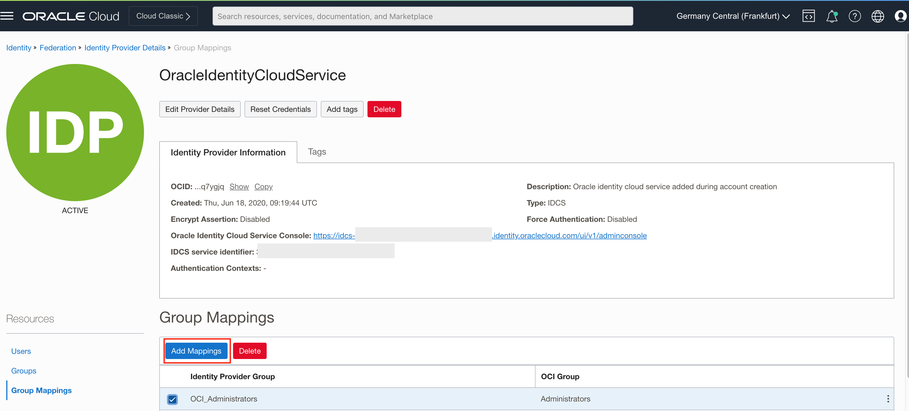
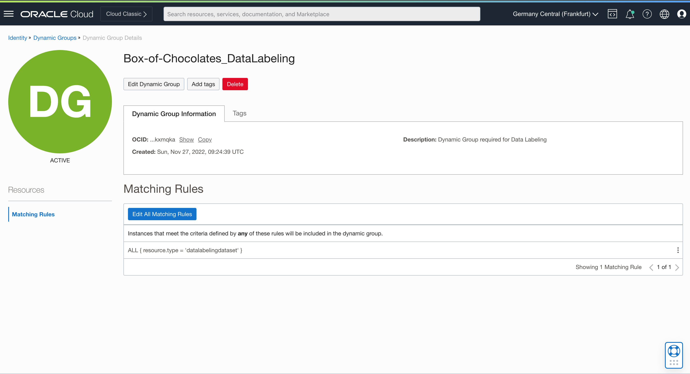
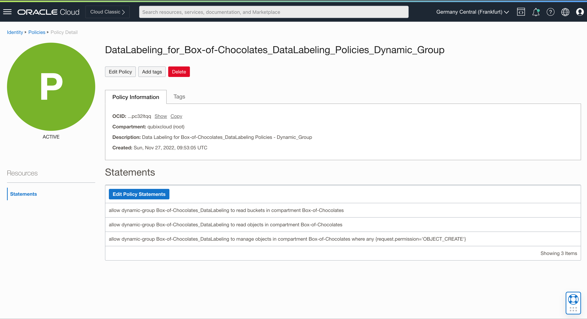
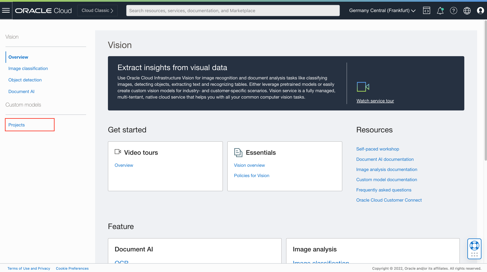
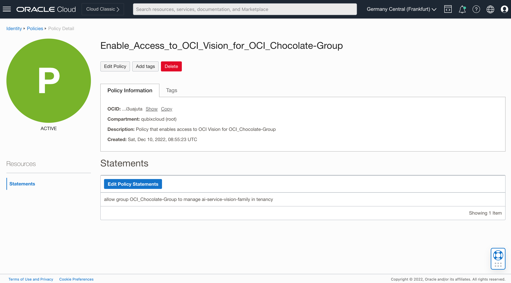
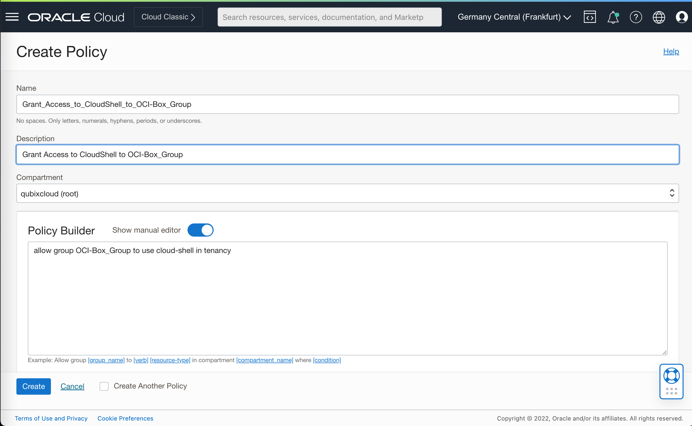
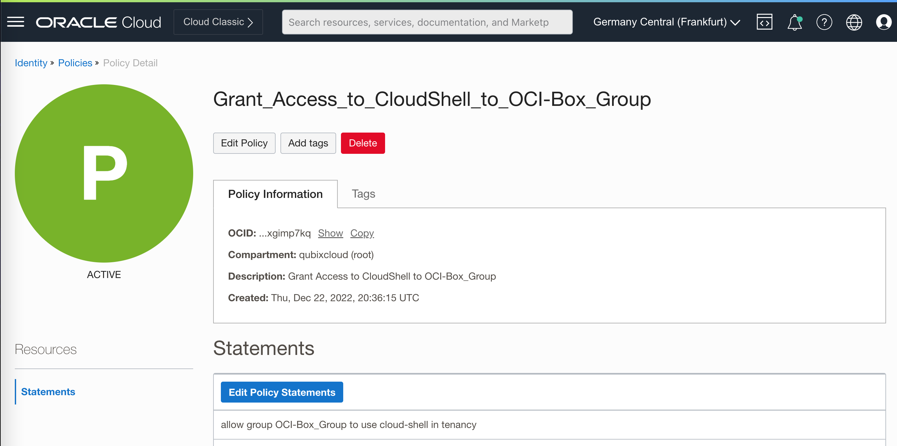

# Get started

## Introduction

Oracle Analytics and OCI Vision: Just like a Box of Chocolates workshop is using various OCI services, such as Object Storage, Data Labeling, Vision and Analytics Cloud.

There are several assumptions based on which this workshop is prepared. These assumptions are:

* Starting point for this workshop is your own, paid, tenancy. Services that are used in this workshop are not included within Free Tenancy option.
* You will create all services from scratch. If you have more experience working with OCI, you can adopt some of the scripts to use instances/resources already in use.
* If your user has OCI and IDCS administration privileges, then you can use that user to perform environment preparation (Get Started) steps, otherwise you should ask you OCI Administrator to perform those steps for you.

In this lab you will create a new compartment where you will create all of your objects used in this workshop. You will also create a new user which will have privileges to manage all resources in the new compartment. Additionally, you will set policies which will enable you to run data labeling and vision model creation.

When finished, you will login as a newly created user and continue with the labs.

Estimated Time: 60 minutes incl. images download

### Objectives

In this lab, you will:

* Download images
* Create a new compartment for objects used in workshop
* Create (optionally) a new user and a new group in IDCS
* Create a new group in OCI and map it to the group in IDCS
* Set policies for the new OCI group to manage a new compartment
* Create a new Dynamic Group and required Policies for Data Labeling
* Create new Policies for AI Vision Service
* Create a new Policy for Cloud Shall access

### Prerequisites

This lab assumes:

* You have an Oracle Cloud account with OCI and IDCS administration privileges or
* Your OCI and IDCS administrator can perform steps in this lab for you.

## Task1: Download and extract images

1. Step 1: Download images

    Go to [https://www.kaggle.com/datasets/paultimothymooney/chest-xray-pneumonia](https://www.kaggle.com/datasets/paultimothymooney/chest-xray-pneumonia) and download image files (one zipped file will be downloaded). To do this, you will most likely be asked to register as a new Kaggle users

2. Step 2: Extract images from downloaded zip file

    Extract downloaded zip file to you local files system. You will use images from **Train** and **Validate** folders in this workshop.

## Task 2: Log into OCI

1. Step 1: Enter your cloud account name

    Open [cloud.oracle.com](https://cloud.oracle.com) in your browser.

    Login into OCI is a 3-step process in which you should provide your Cloud Account Name (this is not your user name!) in the first step and click **Next**.

    

2. Step 2: Select your identity provider

    In the second step, you should choose your Identity Provider. Your tenancy (not in case of an empty tenancy) might be using several Identity Providers. Choose the right one. Most likely this (as in example below) would be **oracleidentityservice**. Click **Continue**.

    

3. Step 3: Enter your credentials

    In order to complete login process, enter your **User Name** and **Password**. Click **Sign In**

    

## Task 3: Create a new compartment

You will use one compartment for all required objects in this workshop, hence you need to create one.

1. Step 1: Navigate to Compartments page

    In OCI console, open the **Navigator** menu. Navigate to **Identity & Security** and then choose **Compartments**.

    

2. Step 2: Create a new compartment

    The list of all active compartments is displayed. Click **Create Compartment** to start creating a new compartment.

    

3. Step 3: Define compartment details

    This step is fairly straight forward. You just have to provide **Name**, **Description** and **Parent Compartment**. For better management and administration of your OCI environment you can optionally add Tags.

    Finally, click **Create Compartment**.

    

## Task 4: (optional) Create a new user in IDCS

In this task you will create a new user which will be used throughout this workshop.

This step is optional, if you would like to use any other existing user (for example, your user account you normally log into Oracle Cloud). Then you might decide to use that user and not to create another user. In this case, this step is optional and can be skipped.

You will create a new user in **Oracle Identity Cloud Service** (and not in **OCI Console**!)

1. Step 1: Navigate to Federation page

    From the **Navigator** menu (top-left corner) select **Identity & Security** and then **Federation**.

    

2. Step 2: Choose identity provider

    **Federation** page is displayed. You will see the list of all available Identity Providers.

    Locate and click on **OracleIdentityCloudService**.

    

3. Step 3: Navigate to OracleIdentityCloudService from the Identity Provider page

    **OracleIdentityCloudService** page opens. Search for **Oracle Identity Cloud Service Console** link in **Identity Provider Information** tab and click on the IDCS Console URL.

    

4. Step 4: Create a new user from IDCS console

    **Oracle Identity Cloud Service Console** opens in a new tab.

    To add a new user simply click on **Add a user** icon.

    

5. Step 5: Add a new user using Add User wizard

    Follow the two-step **Add user** dialog and provide user details in the first step. Make sure that you provide **your own email address** to receive Welcome email to activate the user.

    

    In example above, a new user with username *Candy.Sweets* is created. In the second step, you should assign a new user to groups. However, this step is optional as there is no group at the moment you can assign new user to. So simply ignore it and click **Finish**.

6. Step 6: Check newly created user's details

    You can check and verify details for the newly created user.

    

7. Step 7: Activate user

    You should also check your inbox for the Welcome email. Once received, follow the links from email and activate your new user.

    

## Task 5: Create a new user group in IDCS

Your new or existing user should become a member of the **User Group** which will be assigned privileges (ie., compartment manage privileges) required to use services in this workshop. At this point that user group hasn't been created, so you should create one.

1. Step 1: Create a new group in IDCS

    Stay in IDCS console. If you skipped previous task, you will still need to perform steps 1-3 to navigate to the IDCS console.

    From the **IDCS Console Home Page** or from the **Navigator** menu (top-left corner) choose an option to **Create a new Group**.

    This is again a two-step process. In the first step provide group's **Name** and optionally **Description**. In our example, user group is named  *Chocolates-Group*.

    

    In the second step add your user to this new group. To add a user, search for users by entering (parts of) their names in the search field and add the user to the new group - check the check-box in front of the user's name and click **Finish**.

    

## Task 6: Create a new OCI group and map it to an IDCS group

Next step is to create a new OCI group and map it to the IDCS group you've just created. This step is required because you can't create policies, needed for example to create dataset for data labeling, for IDCS groups, but for OCI groups. Hence a new OCI group has to be created and mapped to IDCS group.

1. Step 1: Navigate to OCI Groups page

    Use **Navigator** to navigate again to **Identity & Security** and then choose **Groups**.

    

2. Step 2: Start adding a new OCI group

    Click **Create Group** to start creating a new group.

    

3. Step 3: Define a new OCI group

    In the dialog form, provide **Name** and **Description** for the new group and click **Create**. In example below, group is called *OCI_Chocolate-Group*.

    

4. Step 4: Define mapping between IDCS group and OCI group

    Now, you need to map previously created **IDCS Group** to the new **OCI Group**. This is required because all privileges, defined with policies will be created against the OCI Group. You can not assign privileges directly to IDCS Groups.

    Navigate back to **OracleIdentityCloudService** details page:

    * Navigate first to **Identity** and then to **Federation**.
    * From **Federation** page click **OracleIdentityCloudService** link to open **OracleIdentityCloudService** page.

    Observe **Resources** menu on the left side of the page. There are three links: **Users**, **Groups** and **Group Mappings**. Click on **Group Mappings** and when page is refreshed, click **Add Mappings**.

    

    **Add Mappings** popup window opens. Choose your IDCS Group from **Identity Provider Group** list and your OCI Group from the **OCI Group** list.

    

    Click **Add Mappings** to add a new mapping.

## Task 7: Create a new policy for compartment management

Finally, you need to create a **policy** which grants manage privileges in a new compartment to the new OCI group.

1. Step 1: Navigate to **Policies** page

    Once again use **Navigator** to navigate to **Identity & Security** and now choose **Policies**.

    

2. Step 2: Create a new policy

    In the **Policies** page click **Create Policy**.

    

3. Step 3: Define a new policy

    Provide a new Policy **Name** and **Description**.

    This policy is set at the *root* compartment level, therefore select the *root* compartment of your tenancy.

    In **Policy Builder** section, search for **Let compartment admins manage the compartment** in the **Common policy templates** pulldown list.

    Make sure **Groups** option is selected and then choose your newly created OCI Group from the list of available OCI Groups. For **Location**, select tenancy *root* compartment.

    

    Your policy should look like this:

     ```console
     Allow group <OCI Group> to manage all-resources in tenancy <root compartment>
     ```

4. Step 4: Finish creating a new policy

     Click **Create** to create a new policy in your *root* compartment.

     

     This is not the only required policy that is required for this workshop. You will return to this step to create additional policies later.

## Task 8: Create a new dynamic group and policies for Data Labeling

One of the tasks in this workshop will be data labeling. This is a process in which all images from your training image library will be assigned a single label that describe that specific image.  To be able to perform your data labeling process, you must perform the following prerequisite steps to:

* create one new dynamic group and
* set required policies for data labeling

To find out which steps you need to perform, you can navigate to **Data Labeling** page. You will find detailed instructions there.

1. Step 1: (optional) Navigate to dData Labeling page

    From the **Navigator** menu select **Analytics & AI** and then **Data Labeling**.

    

2. Step 2: (optional) Open Datasets sub-page

    Click on **Datasets** link under **Data Labeling** on the left side of the page. This will open **Dataset list** page in selected Compartment (you might need to change compartment to the one you've created for this workshop).

    

3. Step 3: (optional) Verify data labeling prerequisites

    Expand **Show more information** to display what prerequisites have to be met before you can start your data labeling exercise. If these are not met, then Data Labeling might not run properly.

    

    You have already created a new OCI group, hence creating a new OCI group is not needed. Continue with creating a new dynamic group.

4. Step 4: Navigate to Dynamic Groups page

    From **Navigator** menu choose **Identity & Security** and then **Dynamic Groups**.

    

5. Step 5: Create a new dynamic group

    Click **Create** and define a new **Dynamic Group**.

    Provide **Name**, **Description** and enter the following statement to the **Matching Rules**:

    ```console
    ALL { resource.type = 'datalabelingdataset' }
    ```

    

6. Step 6: Verify your new dynamic group

    Verify that your **Dynamic Group** is properly defined.

    

7. Step 7: Set policies for data labeling

    From the **Navigator** menu select **Identity & Security** and then choose **Policies**.

    

8. Step 8: Create a new policy for non-administrative users

    Make sure that you've selected your *root* compartment first. Then click **Create Policy**.

    The first policy is for Non-Administrative users. These users are members of previously created OCI Group.

    OCI Group needs the following privileges (assuming OCI Group is called *OCI_Chocolate-Group* and compartment's name is *Box-of-Chocolates*):

    ```console
    allow group OCI_Chocolate-Group to read buckets in compartment Box-of-Chocolates
    allow group OCI_Chocolate-Group to manage objects in compartment Box-of-Chocolates
    allow group OCI_Chocolate-Group to read objectstorage-namespaces in compartment Box-of-Chocolates
    allow group OCI_Chocolate-Group to manage data-labeling-family in compartment Box-of-Chocolates
    ```

    

    Verify and double check all policies statements are properly entered and click **Create**.

    

9. Step 9: Create a new policy for dynamic group

    Repeat **Create Policy** for Dynamic Group you've created in the previous step.

    Enter the following statements (again assuming Dynamic Group is called *Box-of-Chocolates_DataLabeling* and compartment's name is *Box-of-Chocolates*):

    ```console
    allow dynamic-group Box-of-Chocolates_DataLabeling to read buckets in compartment Box-of-Chocolates
    allow dynamic-group Box-of-Chocolates_DataLabeling to read objects in compartment Box-of-Chocolates
    allow dynamic-group Box-of-Chocolates_DataLabeling to manage objects in compartment Box-of-Chocolates where any {request.permission='OBJECT_CREATE'}
    ```

    

    Verify and double check all policies statements are properly entered and click **Create**.

    

    You are now ready to start using Data Labeling service.

## Task 9: Create new policies for OCI Vision service

Similarly to Data Labeling service, you will require some privileges to use OCI Vision service. 

1. Step 1: (optional) Navigate to Vision page

    Using **Navigator** (on the left) navigate to **Analytics & AI** and then choose **Vision**.

    

2. Step 2: (optional) Go to custom Projects sub-page

    You will see a menu of Vision options on the left side of the page. As you can see **Vision** service can be used for **Image Classification**, **Object Recognition** and **Document AI**. These services are ready to use services, so you can try them without any preparation.

    In your case, you will create your own custom model. So, Click **Projects**

    

3. Step 3: (optional) Review important information about custom projects

    When you open the **Projects** page, pay attention to **important information** note that is displayed at the top of the page. There are some policies required which need to be set before you create a new custom project and before you start training your models.

    

4. Step 4: Set policies for Vision

    From the **Navigator** menu select **Identity & Security** and then choose **Policies**.

    

5. Step 5: Create a new policy

    Click **Create Policy**.

    

6. Step 6: Define policies to access Vision service

    Provide a name of a new policy and description in **Create Policy** dialog page. In the **Policy Builder** section enable **Show manual editor** and enter the following policy:

    ```console
    allow group <OCI Group> to manage ai-service-vision-family in tenancy
    ```

    

    Click **Create**.

7. Step 7: Confirm Policy

    Wait until policy is created and verify it has been properly set.

    

## Task 10: Create a Policy to grant access to Cloud Shell

1. Step 1: Navigate to Policies page

    Once again, from the **Navigator** menu select **Identity & Security** and then choose **Policies**.

    

2. Step 2: Create a new policy that grants access to Cloud Shell

    Enable **Show manual editor** in **Policy Builder** area and enter the following policy statement:

    ```console
    allow group <OCI Group> to use cloud-shell in tenancy
    ```

    

    Click **Create**.

3. Step 3: Verify created policy

    Verify entered policy.

    

## Task 11: Logout

Once finished with prerequisite tasks, simply logout from [cloud.oracle.com](https://cloud.oracle.com) as you will (optionally) continue with your newly created user.

You can now **proceed to the next lab, Lab1: Create image library**.

## Learn More

* [OCI Documentation](https://docs.oracle.com/en-us/iaas/Content/home.htm)

## Acknowledgements

* **Author** - Žiga Vaupot, Oracle ACE Pro, Qubix
* **Contributors** -  Grega Dvoršak, Qubix
* **Last Updated By/Date** - Žiga Vaupot, December 2022
