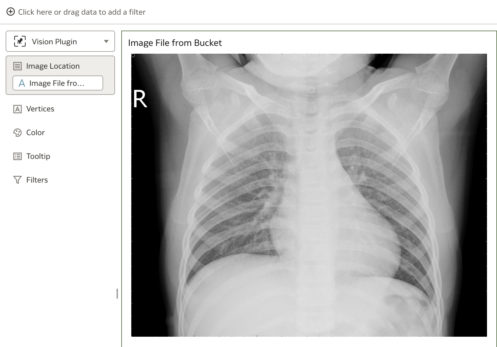

# Image Library

## Introduction

This lab walks you through the steps to organize an image library in OCI Object Storage and upload X-Ray images to the the library.

Estimated Time: 20 minutes

### About OCI Object Storage
The Oracle Cloud Infrastructure Object Storage service is an internet-scale, high-performance storage platform that offers reliable and cost-efficient data durability. 

The Object Storage service can store an unlimited amount of unstructured data of any content type, including analytic data and rich content, like images and videos.

### Objectives

In this lab, you will:

* Create a new Oracle Analytics Cloud instance
* Create a bucket for new images
* Set connection in Oracle Analytics to connect OCI Vision
* Update Safe Domains
* Register Vision Model with Oracle Analytics
* Apply Vision Model and perform image classification using Data Flows
* Import and Install Vision Series Plug-in
* Visualize and Analyze predictions

### Prerequisites

This lab assumes you have:

* An Oracle Cloud account

## Task 1: Create a new OAC instance

This lab assumes you don't have any OAC instance available at the moment. That is why you should create one. You will create one Non-Production instance with features that are available in Professional Edition. To perform this lab, you don't have to setup an OAC Enterprise Edition, but of course, you can.

1. Step 1: Navigate to **Analytics** page

    From the **Navigator** menu (top-left corner) select **Analytics & AI** and then **Analytics Cloud**.

    

2. Step 2: Create a new instance

    Make sure you are looking at your Compartment, in our case this is **Box-of-Chocolates** Compartment.

    

3. Step 3: Define a new Analytics Cloud instance

    Provide a name for your new instance and optionally description. Confirm Compartment is correct.

    Then scroll down to **Capacity** section and pick one of the two options. In this case select **OCPU** as **Capacity Type** and select **OCPU Count**. **1 (Non-production)** should be enough.

    

    Then scroll down again and specify **License and Edition**. As already said, **Professional Edition** should be fine as you don't need any of Enterprise Edition features.

    

    Click **Create** to start provisioning your new Oracle Analytics Cloud

    

4. Step 4: Verify that Oracle Analytics instance has been created

    It takes approx. 30 minutes to create an instance. At least this was the time which was needed in our environment.

    

    Instance should be in **Active** state.

    In your Oracle Analytics console page, click **Analytics Home Page**.

    

    **Oracle Analytics Home Page** opens.

    

## Task 2: Create a new bucket for prediction images

It's time to prepare an image library for new images which are going to be classified for *PNEUMONIA* and *NORMAL*

1. Step 1: Navigate to **Buckets**

    Once again, navigate to **Buckets** page and create a new bucket. 

    

2. Step 2: Define a new bucket

    

3. Step 3: Download validation dataset

    Download and unzip [validation-dataset.zip](./files/validation_dataset.zip) to your laptop. 

4. Step 4: Upload images from validation dataset to newly create bucket.

    Return to your new bucket and click **Upload**.

    

    Drag and drop your validation images to the **Drop files here** area.

    

    Wait for images to prepare for upload and click **Upload**.

    

    Validation images are now uploaded. You can return to Oracle Analytics and continue with this lab.

    

## Task 3: Connect Oracle Analytics to OCI Vision

You are ready now to connect from Oracle Analytics Cloud to OCI Vision. There is a native **Oracle Cloud** connector available in Oracle Analytics, which you will use to retrive and register your Vision model with Oracle Analytics Cloud.

1. Step 1: Navigate to **Connections**

    Click **Navigator icon** (top-left) to open the **Navigator menu** on the left. Choose **Data**.

    

    Click **Connections** tab to review if there are any existing connections. At this point, there shouldn't be any (if case you've just provisioned OAC instance).

    

2. Step 2: Create a **new Connection**

    In the top menu bar click **Create** and choose **Connection** from available options.

    

3. Step 3: Select **Connection Type**

    **Create Connection** dialog window opens. From the available **Connection Types** choose **OCI Resource**.

    

4. Step 4: Provide **Connection details**

    In the second step, define details for your connection. You will need to know in which **region** is your instance running. Then you also have to provide the **Tenancy OCID** and **User OCID** that would connect to OCI Vision. 

    Based on the information provided you will then **generate API Key** and register it with the user whose OCID you've provided.

    

5. Step 5: (optional) Obtain **Tenancy OCID**

    This is an optional step. You will have to open a new OCI Console page in a separate tab or window. If you have already obtained your **Tenancy OCID**, then you should use it. If you haven't got your **Tenancy OCID**, then open the **Profile** menu (top-right in your OCI console, not in Oracle Analytics Cloud Home Page) and select **Tenancy** menu option. 

    

    Tenancy page opens and you can copy **OCID** into clipboard from there.

    

    You can navigate to your original page and paste **Tenancy OCID** information in **Connection details**.

6. Step 6: (optional) Obtain **User OCID**

    This is also optional step as you have already obtained your **User OCID** when you were labeling images. Nevertheless, you will have to add newly generated API Key with that user, so you might open User page at least for later.

    In any case, open the Profile menu again and select **User settings**. 

    

    You will see user's **OCID** under **User Information** tab. Copy **OCID** into respective field in **Connection details**.

    

    Don't close this tab page just yet.

7. Step 7: Generate API Key

    You should now return to **Connection details** dialog window to complete the setting.

    Click **Generate**.

    

    API Key Fingerprint will be generated in the **API Key** field. You should click **Copy** now and copy API Key in clipboard.

    

8. Step 8: Add **API Key** to **User settings**

    Return back to **User settings** page. 

    

    Scroll down to **Resources** menu located at bottom-left. Click **API Keys**. There should be one **API Key** in the **API Keys** list which you created earlier doing **Data Labeling** lab. You are going to create a new one. 

    Click **Add API Key**

    

    When **Add API Key** dialog window opens, check radio button **Paste Public Key**. Click into **Public Key** field and paste clipboard content. Your public key should now be copied into an empty **Public Key** field.

    Click **Add**

    

    Before completing this step, you can now review **Configuration File** that was generated and then click **Close** to close **Add API Key** dialog.

    

    You should see additional API Key in the **API Keys** list.

    

9. Step 1: Save your OCI Resource connection

    Only now, you can save your connection. If you've tried to do it earlier, you would see an error. 

    

    Your new connection is now visible under **Connections**.

    

## Task 4: Update Safe Domains

1. Step 1: Navigate to Console

    From Analytics Cloud home page click **Navigator menu** icon and navigate to **Console**

    

2. Step 2: Open **Safe Domains**

    Click **Safe Domains**

    

3. Step 3: Add domain

    Click **add domain** and add your domain. For example, if you are using eu-frankfurt-1 region, then domain entry should be as follows:

    ```console
    *.eu-franfurt-1.oraclecloud.com
    ```

    Check **Image** and **Connect** checkboxes, indicating that you are going to connect to that domain and you will download images from there.

    

## Task 5: Register Vision Model with Oracle Analytics

In one of the previous step, you have already established a connection between Analytics Cloud and Vision. Now, you can register machine learning from Vision with Analytics Cloud using that connection.

1. Step 1: Open **Register Model** dialog

    Open top-right menu and select **Register Model/Function**. From the submenu choose **OCI Vision Models**.

    

2. Step 2: Select a connection

    **Register a Vision model** dialog window opens. In the first step select a connection. That should be the one you've created earlier.

    

3. Step 3: Select a model

    Based on selected connection, all the list of all available models is displayed. You can review each model details. There should also be your model. Click on it. On the right side the following information will be displayed **Model Name**, **Description** and **Staging Bucket Name**.

    

    Observe that **Register** button is shaded and inactive. This is because you need to specify **Staging Bucket Name** - remember you have created it in one of the previous steps. Obtain the name of your **staging bucket** and continue with **OCI Vision Model** registration.

    

4. Step 4: Inspect your model in Analytics Cloud

    Your model is now registered and imported into Analytics Cloud. You can navigate to **Machine Learning** section from **Navigator menu** or simply search for it from **Ask BI** search line. Click **Machine Learning** to filter all ML models and the look for your model. 

    

    Right-mouse click and select **Inspect**. You can now review your model details.

    

    

## Task 6: Apply Vision Model using Data Flows

In Oracle Analytics, **Vision based machine learning model** is applied (as any other ML model) using **Data Flows**. 

  1. Step 1: Obtain Bucket and/or Images URLs

    The input information for your new data flow is the URL of the bucket in which you stored images for prediction or URLs of those images. When you provide only bucket URL then Vision model will be applied to all images found in bucket and when you use direct image URLs then only those images will be used in prediction.

    To obtain Bucket URL navigate to the bucket where you keep images for prediction, and simply copy current URL. 

    

    In case you want to use direct Image URLs, then you have to navigate to the Bucket and scroll to each image and copy URL from Image details page.

    

2. Step 2: Prepare datasets to be used with Data Flows

    You will then create a csv file, bucket.csv or images.csv, with the following structure and content:

    *bucket.csv*
    ```console
    ID;Bucket Name;Bucket URL
    1;Pneumonia;https://cloud.oracle.com/object-storage/buckets/...

    ```

    *images.csv*
    ```console
    ID;Image Name;File Location
    1;IM-1427-0001.jpeg;https://objectstorage.../val_NORMAL_NORMAL2-IM-1427-0001.jpeg
    2;IM-1430-0001.jpeg;https://objectstorage.../val_NORMAL_NORMAL2-IM-1430-0001.jpeg
    …
    11;bacteria_4881.jpeg;https://objectstorage.../val_PNEUMONIA_person1950_bacteria_4881.jpeg
    12;bacteria_4883.jpeg;https://objectstorage.../val_PNEUMONIA_person1952_bacteria_4883.jpeg
    ```

3. Step 3: Create a new data flow

    Start creating a new data flow.

    

4. Step 4: Add Data by Creating a new dataset

    By now, you haven't uploaded either of *bucket.csv* of *images.csv* files to dataset storage. Click **Create Dataset**.

    

    ... and drag *bucket.csv* or *images.csv* to the **Drop data file here or click to browse** area.

    

5. Step 5: Create Dataset

    You will use the **buckets** option, so examples from here on are using this option, but using *images.csv* is no different from using *bucket.csv*.

    

    Pay attention that URL is correctly stored in **Bucket URL** column.

    You can save your new dataset now.

    

6. Step 6: Continue building your new data flow

    When you save your new dataset, you can return back to the tab page with you new data flow and continue with its definition. 

    Click on your new dataset and click **Add**

    

    The first step of the data flow is completed:

    

7. Step 7: Add Apply AI Model

    As a second step of your data flow, add **Apply AI Model** step. 

    

8. Step 8: Select AI Model

    **Select AI Model** dialog opens. Select the model you've created in the previous lab, **Pneumonia X-Ray Image Classification** for example.

        

9. Step 9: Define AI Model

    In this step you must pay attention to the **Parameters** section. You have to select an **input column as**. Choose **Bucket URL** as this contains the URL of the bucket where images are stored.

    Leave **Buckets** as **Input Type**.

    

10. Step 10: Save results as new dataset

    Apply AI Model results in a new dataset generated. This dataset contains information about predictions for each image. Actually two rows are generated for each image, for each label separately (we are using only two labels, hence two rows).

    

    You can see **Object Name** column which in fact contains different Label values for each image, and you can observe also **Confidence** for each option.

    

11. Step 11: Save and Run your dataflow

    Save.

    

    And run.

    

12. Step 12: Review *predicted* dataset

    You can find your new dataset that contains predictions for your new images under **Datasets**

    

    If you **open** dataset, you will see that it contains predictions for all images from the bucket you've stored them. As already mentioned, each image has a row for each of the labels defined in your training dataset.

    

## Task 7: Vision Series Plug-in

You are close to your last taks in this lab. But before that, there is one small technicality you need to take care. In order to visualize you X-Ray images you need proper visualisation. Oracle Analytics, out of the box, doesn't support this sort of visualizations, that is why you have to upload it as an **Extension**. 

1. Step 1: Navigate to Oracle Analytics Examples Library

    **Visualization source** can be found in [Oracle Analytics Examples Library](https://www.oracle.com/business-analytics/data-visualization/examples/). Open this link in a new browser window.

    

2. Step 2: Search for *AI Vision Series Samples* plug-in

    Locate the *AI Vision Series Samples* plug-in ...

    

    ... and download it to your computer.

3. Step 3: Unzip downloaded *zip* file

    Current version of the *AI Vision Series Samples* plug-in is **OAC-vision\_samples\_OCT22.zip**, but this might change through time. In any case, unzip it. 

    

    Among others, there should be two *zip* files extracted *customviz_com-company-visionseries_JUNE2022.zip* and *customviz_com-company-imageGalleryViz_JUNE2022.zip*. Make sure these two files or similar are present.

4. Step 4: Navigate to **Console** to Analytics Cloud

    In Oracle Analytics, navigate to Console page.

    

5. Step 5: Upload and activate extension

    Click **Extensions** to open **Extensions** page.

    In **Extensions** page click **Upload Extension** and upload both extensions, zip files.

    
    
     When both extensions are uploaded and you can see them in the Extensions list, **reload** the page. This will activate both extensions. If this is not done, then you will not see these two extensions under Visualisation > Custom Visualisation list. 

    

## Task 8: Visualize and Analyze

In this last excercise, you will create a visualisation and visualize your predictions. 

 1. Step 1: Navigate to Analytics Home Page.

    In your **home page** (or if you navigate to **Datasets**) start creating a new workbook using the *predicted* dataset.

    

2. Step 2: Review your dataset and confirm two custom visualisation

    Under **Data** tab in the left panel, review dataset columns.

    

    Then click on **Visualisations** tab and scroll down until you get to **Custom Visualizations**. You should find two visualisations there: *Vision Plugin* and *ImageGalleryViz Plugin*.

    

3. Step 3: Create your first visualization

    From your dataset on the left, select *Object Name*, *Confidence* and *Image File from Bucket* columns and drag them onto empty canvas.

    

4. Step 4: Re-arrange visualisation

    **Auto-Visualization** was activated, hence **Bar** was automatically selected. Simply change **Bar** to **Pivot Table** (used in this example) or **Table**. 

    

    Re-arrange columns in **Pivot Table**, so you end up with the following **Pivot Table**.

    

    Maybe, you can change **Number Format** for *Confidence* to **Percent**

    

    Set **Use as Filter** parameter for this **Pivot Table** visualization.

    

5. Step 5: Add **Vision Plugin** to the canvas

    In the left panel, click on **Visualizations** tab and drag custom vizualisation **Vision Plugin** to the canvas. 

    

    Drag **Image File from Bucket** column onto **Vision Plugin**

    

6. Step 6: Save your work

    

7. Step 7: Test your visualizations and review predictions.

    You can now start testing your solution.

    Clicking the rows in the **Pivot Table** filters and changes X-Ray images of the **Vision Plugin**. Review them and observe results of predictions. There might be some incorrectly classified images for the label *NORMAL*. As you have already observed from the training metrics, predicion for *PNEUMONIA* is much more confident than *NORMAL*.

    

    

    

This concludes this Lab. Thank you!

## Learn More

* [Oracle Analytics Cloud](https://docs.oracle.com/en/cloud/paas/analytics-cloud/index.html)
* [Integrate Oracle Analytics with OCI Vision](https://docs.oracle.com/en/cloud/paas/analytics-cloud/acubi/integrate-oracle-analytics-cloud-oci-vision.html)

## Acknowledgements
* **Author** - Žiga Vaupot, Oracle ACE Pro, Qubix
* **Contributors** -  Grega Dvoršak, Qubix
* **Last Updated By/Date** - Žiga Vaupot, November 2022