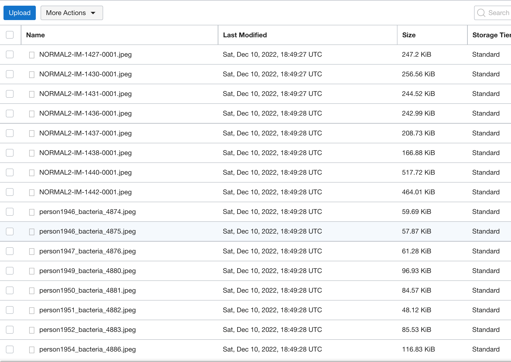

# Image Library

## Introduction

This lab walks you through the steps to organize an image library in OCI Object Storage and upload X-Ray images to the the library.

Estimated Time: 20 minutes

### About OCI Object Storage
The Oracle Cloud Infrastructure Object Storage service is an internet-scale, high-performance storage platform that offers reliable and cost-efficient data durability. 

The Object Storage service can store an unlimited amount of unstructured data of any content type, including analytic data and rich content, like images and videos.

### Objectives

In this lab, you will:

* Create a new Oracle Analytics Cloud instance
* Create a bucket for new images
* 
*
*

### Prerequisites

This lab assumes you have:

* An Oracle Cloud account

## Task 1: Create a new OAC instance

This lab assumes you don't have any OAC instance available at the moment. That is why you should create one. You will create one Non-Production instance with features that are available in Professional Edition. To perform this lab, you don't have to setup an OAC Enterprise Edition, but of course, you can.

1. Step 1: Navigate to **Analytics** page

    From the **Navigator** menu (top-left corner) select **Analytics & AI** and then **Analytics Cloud**.

    

2. Step 2: Create a new instance

    Make sure you are looking at your Compartment, in our case this is **Box-of-Chocolates** Compartment.

    

3. Step 3: Define a new Analytics Cloud instance

    Provide a name for your new instance and optionally description. Confirm Compartment is correct.

    Then scroll down to **Capacity** section and pick one of the two options. In this case select **OCPU** as **Capacity Type** and select **OCPU Count**. **1 (Non-production)** should be enough.

    

    Then scroll down again and specify **License and Edition**. As already said, **Professional Edition** should be fine as you don't need any of Enterprise Edition features.

    

    Click **Create** to start provisioning your new Oracle Analytics Cloud

    

4. Step 4: Verify that Oracle Analytics instance has been created

    It takes approx. 30 minutes to create an instance. At least this was the time which was needed in our environment.

    

    Instance should be in **Active** state.

    In your Oracle Analytics console page, click **Analytics Home Page**.

    

    **Oracle Analytics Home Page** opens.

    

## Task 2: Create a new bucket for prediction images

It's time to prepare an image library for new images which are going to be classified for *PNEUMONIA* and *NORMAL*

1. Step 1: Navigate to **Buckets**

    Once again, navigate to **Buckets** page and create a new bucket. 

    

2. Step 2: Define a new bucket

    

3. Step 3: Download validation dataset

    Download and unzip [validation-dataset.zip](./files/validation_dataset.zip) to your laptop. 

4. Step 4: Upload images from validation dataset to newly create bucket.

    Return to your new bucket and click **Upload**.

    

    Drag and drop your validation images to the **Drop files here** area.

    

    Wait for images to prepare for upload and click **Upload**.

    

    Validation images are now uploaded. You can return to Oracle Analytics and continue with this lab.

    

## Task 3: 

## Learn More

* [OCI Object Storage](https://docs.oracle.com/en-us/iaas/Content/Object/home.htm)

## Acknowledgements
* **Author** - Žiga Vaupot, Oracle ACE Pro, Qubix
* **Contributors** -  Grega Dvoršak, Qubix
* **Last Updated By/Date** - Žiga Vaupot, November 2022