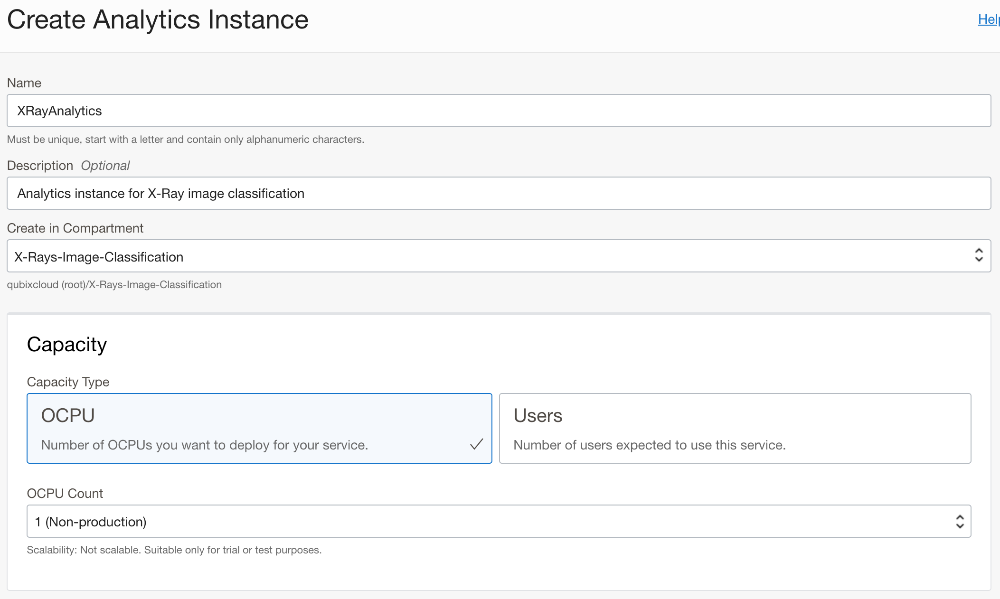
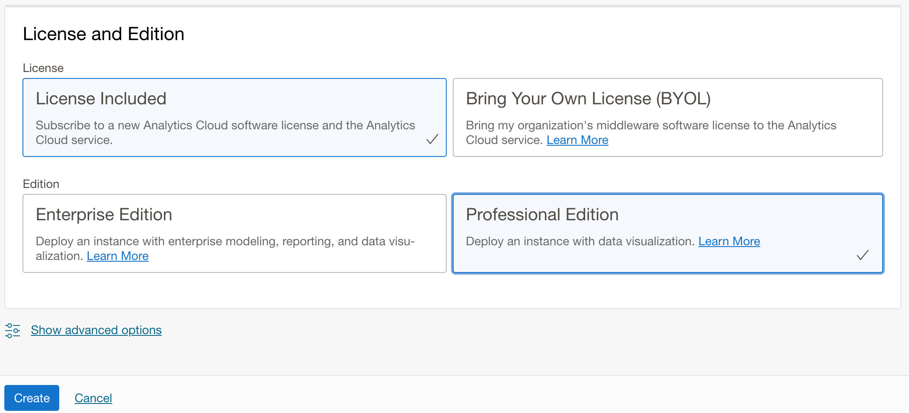
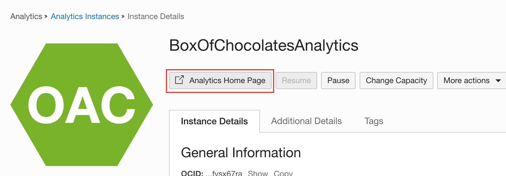
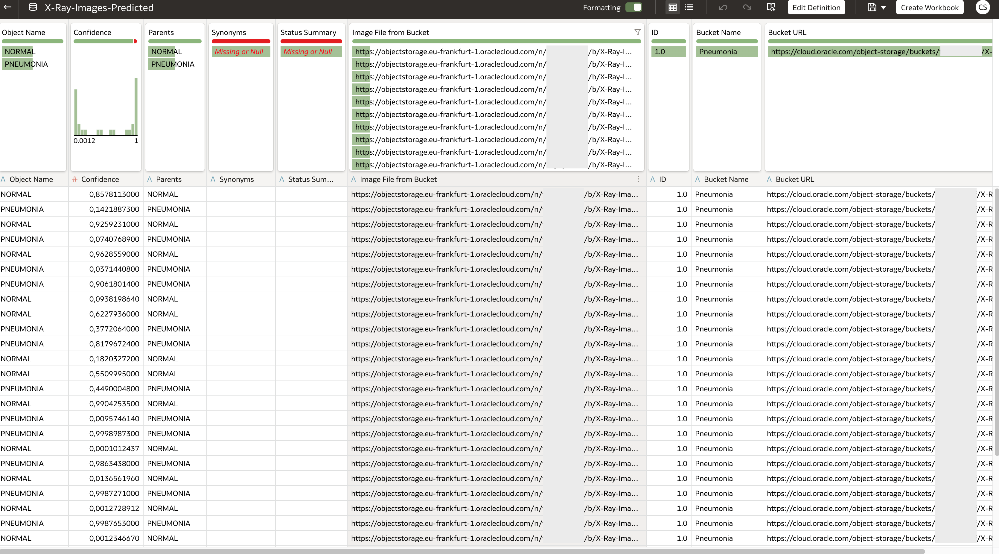
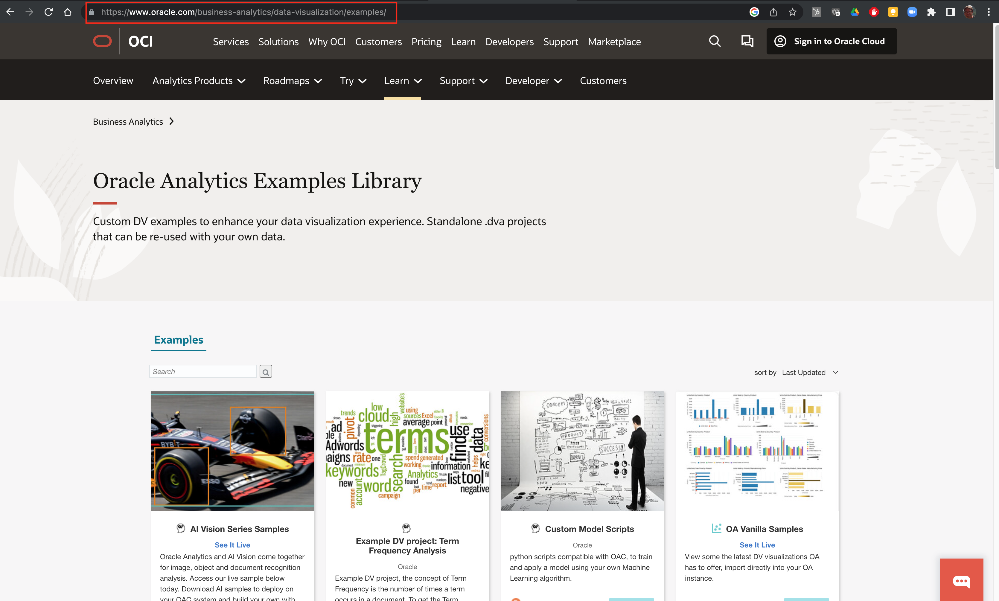
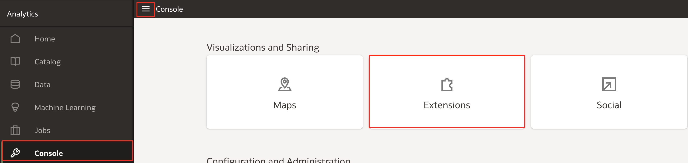
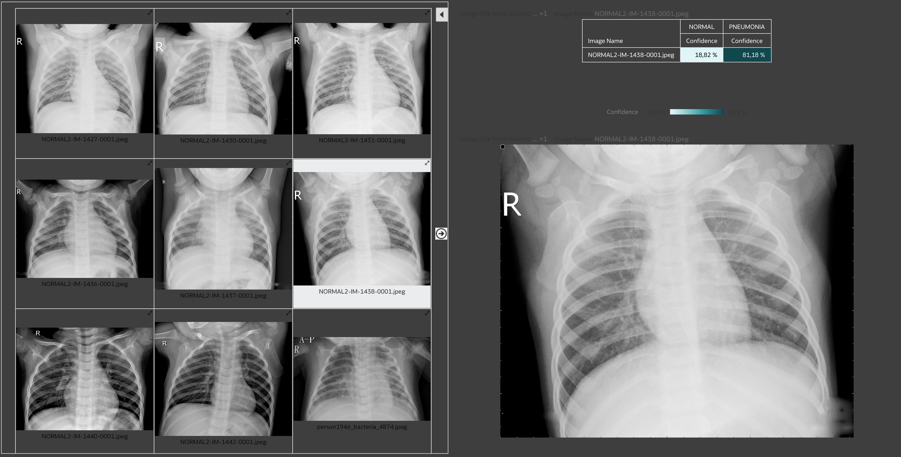

# Predict, visualize, analyze

## Introduction

This lab walks you through the steps to setup a new Analytics Cloud instance with connection to OCI Vision. You will register your ML model from the previous lab and deploy it using data flows to classify new set of images for pneumonia. Finally, you will visualize results and use them in an analysis.

Estimated Time: 60 minutes

### About Analytics Cloud

Oracle Analytics empowers business users, data engineers, and data scientists to access and process data, evaluate predictions, and make quick, accurate decisions. Oracle Analytics addresses the entire analytics process, including data ingestion, data preparation and enrichment, and data visualization and collaboration. Machine learning (ML) is embedded throughout the platform to help organizations go beyond being data-driven to become analytics-driven.

### Objectives

In this lab, you will:

* Create a new Oracle Analytics Cloud instance
* Create a bucket for new images
* Set connection in Oracle Analytics to connect OCI Vision
* Update Safe Domains
* Register Vision Model with Oracle Analytics
* Apply Vision Model and perform image classification using Data Flows
* Import and Install Vision Series Plug-in
* Visualize and Analyze predictions

### Prerequisites

This lab assumes you have successfully completed all three labs of this workshop:

* Get started
* Lab 1: Create image library,
* Lab 2: Label images and
* Lab 3: Train image classification model.

## Task 1: Create a new OAC instance

This lab assumes you don't have any OAC instance available at the moment. That is why you will create one.

To perform this lab, OAC Professional Edition using 1 OCPU (non-production) will be enough. Of course you are free to set OAC Enterprise Edition too, but for this lab it is not required.

> **Note:** This task can be performed anytime during the workshop. For example while waiting on model training to complete. This will save some time as OAC creating will run at least for 30 minutes.

1. Navigate to Analytics page

    From the **Navigator** menu (top-left corner) select **Analytics & AI** and then **Analytics Cloud**.

    

2. Create a new Analytics instance

    Make sure you are looking at your Compartment, in our case this is **Box-of-Chocolates** Compartment.

    Click **Create Instance**.

    

3. Define a new Analytics Cloud instance

    **Create Analytics Instance** dialog opens. Provide a name for your new instance and optionally description. Make sure that you have selected correct Compartment.

    Then scroll down to **Capacity** section and pick one of the two options. In this case select **OCPU** as **Capacity Type** and select **OCPU Count**. **1 (Non-production)** should be enough.

    

    Then scroll down again and specify **License and Edition**. As already said, **Professional Edition** should be fine as you don't need any of Enterprise Edition features.

    

    Click **Create** to start provisioning your new Oracle Analytics Cloud.

    

4. Verify that Oracle Analytics instance has been created

    It takes approx. 30 minutes to create an instance. At least this was the time which was needed in our environment.

    

    When finished, your new OAC instance should be in **Active** state. Click on your instance name to navigate to the Oracle Analytics console page for your instance for review and to start using it. Click **Analytics Home Page**.

    

    **Oracle Analytics Home Page** opens.

    

## Task 2: Create a new bucket for prediction images

It's time to prepare an image library for new images which are going to be classified for *PNEUMONIA* and *NORMAL*

1. Navigate to Buckets page and create a new bucket

    Once again, navigate to **Buckets** page and create a new bucket.

    

2. Define a new bucket

    

    **Set visibility** for this new bucket to *public*.

3. Download validation dataset

    Download and unzip [validation-dataset.zip](https://objectstorage.us-ashburn-1.oraclecloud.com/p/b1_vZe_9llVqw_oTDq-SQyRrkDshcuABTHc6QuUDG984jfUi0mbk5x7pOZ7mPDPh/n/c4u04/b/livelabsfiles/o/partner-solutions/oas-and-vision/validation-dataset.zip) to your laptop. 

4. Upload images from validation dataset to newly created bucket.

    Return to your new bucket and click **Upload**.

    

    Drag and drop your validation images to the **Drop files here** area.

    

    Wait for images to prepare for upload and click **Upload**.

    

    Validation images are now uploaded. You can return to Oracle Analytics and continue there.

    

## Task 3: Connect Oracle Analytics to OCI Vision

You are ready now to connect from Oracle Analytics Cloud to OCI Vision. There is a native **OCI Resource** connector available in Oracle Analytics, which you will use to retrieve and register your Vision model with Oracle Analytics Cloud.

1. Navigate to Connections

    Click **Navigator icon** (top-left) in Oracle Analytics to open the **Navigator menu** on the left. Choose **Data**.

    

    Click **Connections** tab to review if there are any existing connections. At this point, there shouldn't be any (in case you've just provisioned OAC instance).

    

2. Create a new connection

    In the top menu bar click **Create** and choose **Connection** from available options.

    

3. Select connection type

    **Create Connection** dialog window opens. From the available **Connection Types** choose **OCI Resource**.

    

4. Provide connection details

    In this step, you will define details for your connection. You need to know in which **region** is your instance running. Then you also have to provide the **Tenancy OCID** and **User OCID** that would connect to OCI Vision.

    Based on the information provided you will then **generate API Key** and register it with the user whose OCID you've provided.

    

5. (optional) Obtain tenancy OCID

    This is an optional step as you obtained this information in one of previous labs. 

    Open a new OCI Console page in a separate tab or window. If you have already obtained your **Tenancy OCID**, then you should use it. If you haven't got your **Tenancy OCID**, then open the **Profile** menu (top-right in your OCI console, not in Oracle Analytics Cloud Home Page) and select **Tenancy** menu option.

    

    Tenancy page opens and you can copy **OCID** into clipboard from there.

    

    You can navigate to your original page and paste **Tenancy OCID** information in **Connection details**.

6. (optional) Obtain user OCID

    This is also optional step as you have already obtained your **User OCID** when you were labeling images. Nevertheless, you will have to add newly generated API Key with that user, so you might open User page at least for the next step.

    In any case, open the Profile menu again and select **User settings**.

    

    User's **OCID** is located in **User Information** tab. Copy **OCID** into respective field in **Connection details**.

    

    Don't close this tab page just yet.

7. Generate API key

    You should now return to **Connection details** dialog window to complete the settings.

    Click **Generate**.

    

    API Key Fingerprint will be generated in the **API Key** field. You should click **Copy** to store API Key in clipboard.

    

8. Add API Key to user settings

    Return back to **User settings** page.

    

    Scroll down to **Resources** menu located at bottom-left.

    Click **API Keys** and then click **Add API Key**.

    

    When **Add API Key** dialog window opens, check radio button **Paste Public Key**. Click into **Public Key** field and paste clipboard content (from previous step). Your public key should now be copied into an empty **Public Key** field.

    Click **Add**.

    

    Before completing this step, you can now review **Configuration File** that was generated and then click **Close** to close **Add API Key** dialog.

    

    There should be additional API Key in the **API Keys** list.

    

9. Save your OCI resource connection

    You can save your connection now. If you've tried to do it earlier, you would have received an error.

    

    Your new connection is now visible under **Connections**.

    

## Task 4: Update safe domains

1. Navigate to console

    From Analytics Cloud home page click **Navigator menu** icon and navigate to **Console**

    

2. Open safe domains

    Click **Safe Domains**

    

3. Add domain

    Click **add domain** and add your domain. For example, if you are using eu-frankfurt-1 region, then domain entry should be as follows:

    ```text
    <copy>*.eu-franfurt-1.oraclecloud.com</copy>
    ```

    Check **Image** and **Connect** checkboxes, indicating that you are going to connect to that domain and you will download images from there.

    

## Task 5: Register Vision model with Oracle Analytics

In one of the previous step, you have already established a connection between Analytics Cloud and Vision. Now, you can register machine learning from Vision with Analytics Cloud using that connection.

1. Open Register Model dialog

    Open top-right menu and select **Register Model/Function**. From the submenu choose **OCI Vision Models**.

    

2. Select a connection

    **Register a Vision model** dialog window opens. In the first step select a connection from which you will register your model. It is the one you've created earlier.

    

3. Select a model

    Based on selected connection, all the list of all available models, including your model, is displayed. You can review each model details. Click on your model to review its details. The following information is displayed **Model Name**, **Description** and **Staging Bucket Name**.

    

    Observe that **Register** button is shaded and inactive. This is because you need to specify **Staging Bucket Name** - remember you have created it in one of the previous steps. Obtain the name of your **staging bucket**, enter it into **Staging Bucket Name** and continue with **OCI Vision Model** registration.

    

4. Inspect your model in Analytics cloud

    Your model is now registered and imported into Analytics Cloud. You can navigate to **Machine Learning** section from **Navigator menu** or simply search for it from **Ask BI** search line. Click **Machine Learning** to filter all ML models and the look for your model. 

    

    Right-mouse click and select **Inspect**. You can now review your model details.

    

    

## Task 6: Apply Vision model using data flows

In Oracle Analytics, **Vision based machine learning model** is applied (as any other ML model) using **Data Flows**.

  1. Obtain bucket and/or images URLs

    The input information for your new data flow is the URL of the bucket in which you stored images for prediction or full URLs of those same images.

    When you provide only bucket URL then Vision model will be applied to all images found in that bucket and when you use direct image URLs then only those images will be used in prediction.

    To obtain Bucket URL navigate to the bucket where you keep images for prediction, and simply copy current URL.

    

    In case you want to use direct Image URLs, then you have to navigate to the Bucket and scroll to each image and copy URL from Image details page.

    

2. Prepare datasets to be used with data flows

    You will then create a csv file, *bucket.csv* or *images.csv*, with the following structure and content:

    *bucket.csv*
    ```text
    <copy>ID;Bucket Name;Bucket URL
    1;Pneumonia;https://cloud.oracle.com/object-storage/buckets/...</copy>
    ```

    Here, you can also [download](https://objectstorage.us-ashburn-1.oraclecloud.com/p/b1_vZe_9llVqw_oTDq-SQyRrkDshcuABTHc6QuUDG984jfUi0mbk5x7pOZ7mPDPh/n/c4u04/b/livelabsfiles/o/partner-solutions/oas-and-vision/buckets.csv) a sample buckets.csv file.

    *images.csv*
    ```text
    <copy>
    ID;Image Name;File Location
    1;IM-1427-0001.jpeg;https://objectstorage.../val_NORMAL_NORMAL2-IM-1427-0001.jpeg
    2;IM-1430-0001.jpeg;https://objectstorage.../val_NORMAL_NORMAL2-IM-1430-0001.jpeg
    …
    11;bacteria_4881.jpeg;https://objectstorage.../val_PNEUMONIA_person1950_bacteria_4881.jpeg
    12;bacteria_4883.jpeg;https://objectstorage.../val_PNEUMONIA_person1952_bacteria_4883.jpeg
    </copy>
    ```

    Instead of csv file, you can also use xlsx file format.

    Here, you can also [download](https://objectstorage.us-ashburn-1.oraclecloud.com/p/b1_vZe_9llVqw_oTDq-SQyRrkDshcuABTHc6QuUDG984jfUi0mbk5x7pOZ7mPDPh/n/c4u04/b/livelabsfiles/o/partner-solutions/oas-and-vision/images.csv) a sample *images.csv* file.

3. Create a new data flow

    Start creating a new data flow.

    

4. Add data by creating a new dataset

    By now, you haven't uploaded either of *bucket.csv* of *images.csv* files to dataset storage. Click **Create Dataset**.

    

    ... and drag *bucket.csv* or *images.csv* to the **Drop data file here or click to browse** area.

    

5. Create dataset

    You will use the *buckets.csv* option, so examples from here on are using this option, but using *images.csv* is no different from using *bucket.csv*.

    

    Pay attention that URL is correctly stored in **Bucket URL** column.

    You can save your new dataset now.

    

6. Continue building your new data flow

    When you save your new dataset, you can return back to the tab page with you new data flow and continue with its definition. 

    Click on your new dataset and click **Add**

    

    The first step of the data flow is completed:

    

7. Add Apply AI model

    As a second step of your data flow, add **Apply AI Model** step.

    

8. Select AI model

    **Select AI Model** dialog opens. Select the model you've created in the previous lab, **Pneumonia X-Ray Image Classification** for example.

    

9. Define AI model

    In this step you must pay attention to the **Parameters** section.

    Choose *Bucket URL* as **input column**. *Bucket URL* contains the URL of the bucket where images are stored.

    Leave *Buckets* as **Input Type**.

    

10. Save results as new predicted dataset

    **Apply AI Model** results in a new dataset generated. This dataset contains information about predictions for each image. Actually two rows are generated for each image, for each label separately (we are using only two labels, hence two rows).

    

    You can see **Object Name** column which in fact contains different label values for each image with calculated **Confidence** for each option.

    

11. Save and Run your dataflow

    Save your data flow ...

    

    ... and run it.

    

12. Review predicted dataset

    You can find your new dataset that contains predictions for your new images under **Datasets**

    

    If you **open** dataset, you will see that it contains predictions for all images from the bucket you've stored them. As already mentioned, each image has a row for each of the labels defined in your training dataset.

    

## Task 7: Vision Series Plug-in

You are close to your last tasks in this lab. But before that, there is one small technicality you need to take care. In order to visualize you X-Ray images you need proper visualization for image display. Oracle Analytics, out of the box, doesn't support this sort of visualizations, that is why you have to upload it as an **Extension**.

1. Navigate to Oracle Analytics examples library

    **Visualization source** can be found in [Oracle Analytics Examples Library](https://www.oracle.com/business-analytics/data-visualization/examples/). Open this link in a new browser window.

    

2. Search for AI Vision Series Samples plug-in

    Locate the *AI Vision Series Samples* plug-in ...

    

    ... and download it to your computer.

3. Unzip downloaded ZIP file

    Current version of the *AI Vision Series Samples* plug-in is **OAC-vision\_samples\_OCT22.zip**, but this might change through time. In any case, unzip it.

    

    Among others, there should be two *zip* files extracted *customviz_com-company-visionseries_JUNE2022.zip* and *customviz_com-company-imageGalleryViz_JUNE2022.zip*. Make sure these two files or similar are present.

4. Navigate Analytics Cloud console

    In Oracle Analytics, navigate to Console page.

    

5. Upload and activate extension

    Click **Extensions** to open **Extensions** page.

    In **Extensions** page click **Upload Extension** and upload both extensions, zip files.

    

     When both extensions are uploaded and you can see them in the Extensions list, **reload** the page. This will activate both extensions. If this is not done, then you will not see these two extensions under Visualisation > Custom Visualisation list.

    

6. (optional) FOR CHROME USERS

    > **Note:** Extensions that you've just uploaded and activated might cause some issues when presenting images. The solution to this issue is described in the README file located in downloaded extension ZIP file.

    In Google Chrome, open the browser and type in the URL: chrome://flags/#block-insecure-private-network-requests.

    The following extension might be needed with Google Chrome:
    https://chrome.google.com/webstore/detail/always-disable-content-se/ffelghdomoehpceihalcnbmnodohkibj?utm_source=chrome-ntp-icon

    Also temporarily disable “Block insecure private network requests”, if you have issues accessing your object storage as a debugging test.

## Task 8: Visualize and analyze

In this last exercise, you will create a visualization and visualize your predictions.

 1. Navigate to Analytics home page.

    In your **home page** (or if you navigate to **Datasets**) start creating a new workbook using the *predicted* dataset.

    

2. Review your dataset and confirm two custom visualizations

    Under **Data** tab in the left panel, review dataset columns.

    

    Then click on **Visualisations** tab and scroll down until you get to **Custom Visualizations**. You should find two visualisations there: *Vision Plugin* and *ImageGalleryViz Plugin*.

    

3. Create your first visualization

    From your dataset on the left, select *Object Name*, *Confidence* and *Image File from Bucket* columns and drag them onto empty canvas.

    

4. Re-arrange visualisation

    **Auto-Visualization** was activated, hence **Bar** was automatically selected. Simply change **Bar** to **Pivot Table** (used in this example) or **Table**.

    

    Re-arrange columns in **Pivot Table**, so you end up with the following **Pivot Table**.

    

    Maybe, you can change **Number Format** for *Confidence* to **Percent**

    

    Set **Use as Filter** parameter for this **Pivot Table** visualization.

    

5. Add **Vision Plugin** to the canvas

    In the left panel, click on **Visualizations** tab and drag custom vizualization **Vision Plugin** to the canvas.

    Drag **Image File from Bucket** column onto **Image Location** placeholder of **Vision Plugin** visualization.

    

6. Save your work

    

7. Test your visualizations and review predictions.

    You can now start testing your solution.

    Clicking the rows in the **Pivot Table** filters and changes X-Ray images of the **Vision Plugin**. Review them and observe results of predictions. There might be some incorrectly classified images for the label *NORMAL*. As you have already observed from the training metrics, predicion for *PNEUMONIA* is much more confident than *NORMAL*.

    

    

    

This concludes the Workshop. Thank you!

## Learn More

* [Oracle Analytics Cloud](https://docs.oracle.com/en/cloud/paas/analytics-cloud/index.html)
* [Integrate Oracle Analytics with OCI Vision](https://docs.oracle.com/en/cloud/paas/analytics-cloud/acubi/integrate-oracle-analytics-cloud-oci-vision.html)

## Acknowledgements
* **Author** - Žiga Vaupot, Oracle ACE Pro, Qubix
* **Contributors** -  Grega Dvoršak, Qubix
* **Last Updated By/Date** - Žiga Vaupot, November 2022