# Prepare environment

## Introduction

In this lab you will create a new user and a user group which you will use in this workshop. You will also create a compartment and set some base policies that are required.

Estimated Time: 15 minutes

### Objectives

In this lab, you will:

* Create a new user and a new group in IDCS
* Create a new group in OCI and map it to the group in IDCS
* Create a new compartment
* Set policies for the new OCI group to manage a new compartment

### Prerequisites

This lab assumes you have:

* An Oracle Cloud account with administration privileges

## Task 1: Create a new user in IDCS

1. Step 1: Log in OCI
  
    Log into [cloud.oracle.com](https://cloud.oracle.com) and priced your Cloud Account Name.

    Click **Next**.

    

    Choose **oracleidentityservice** as Identity Provider and click **Continue**.

    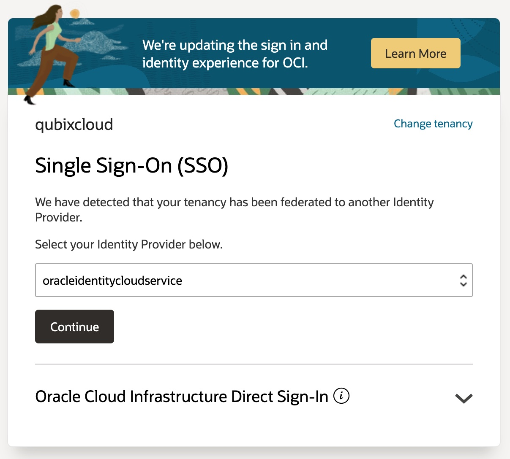

    Enter your **username** and **password**.

    

2. Step 2: Create a new user in IDCS

    From the **Navigator** menu (top-left cornent) select **Identity & Security** and **Federation**.

    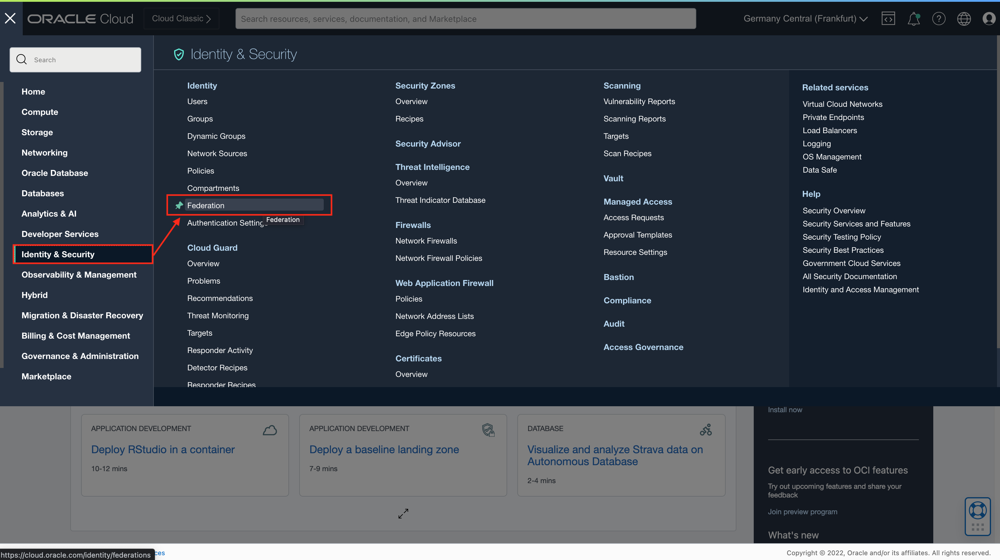

    In the Providers list click on **OracleIdentityCloudService** link.

    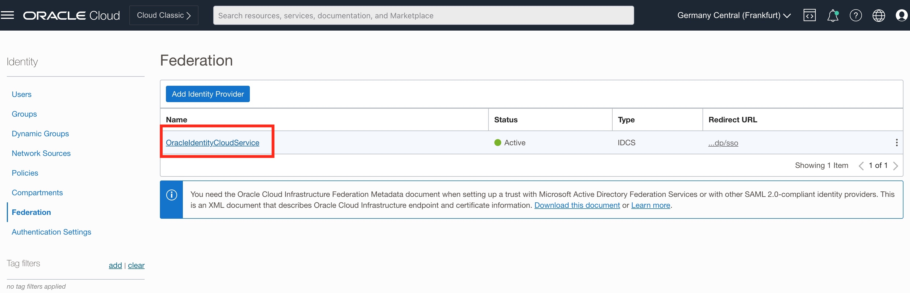

    **OracleIdentityCloudService** console page opens. Navigate to **Oracle Identity Cloud Service Console** by clicking on the URL.

    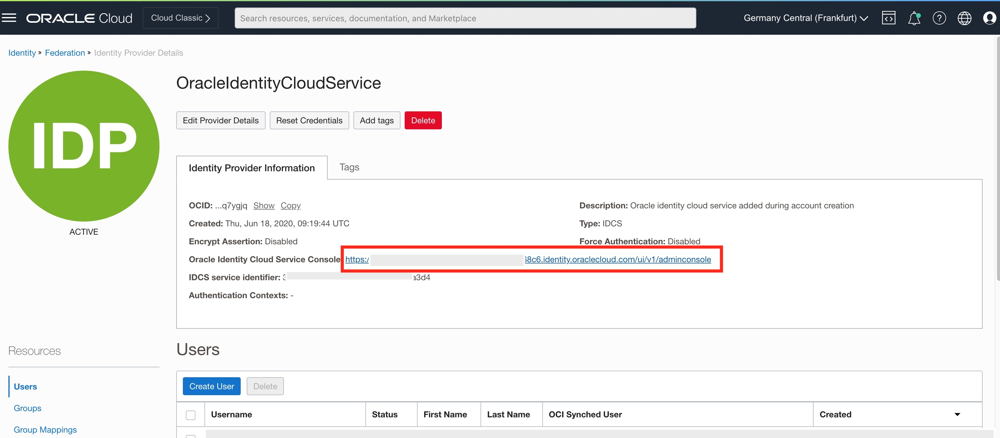

    When **Oracle Identity Cloud Service Console** opens, click on **Add a user** icon to add a new user.

    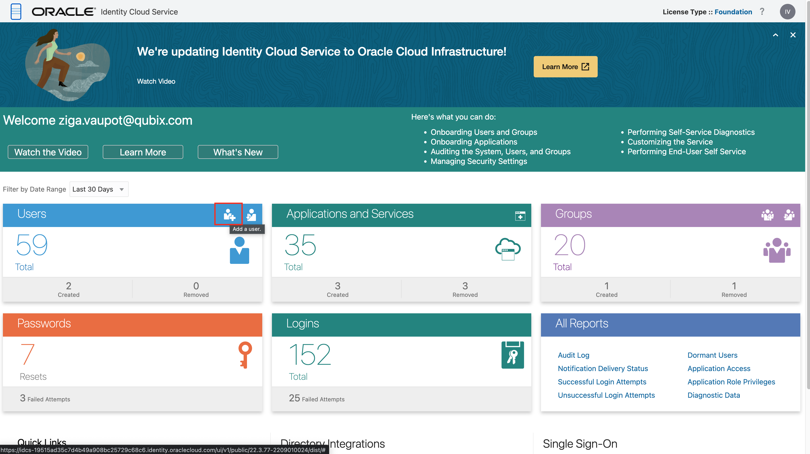

    Follow the **Add user** wizard and provided user details in the first step:

    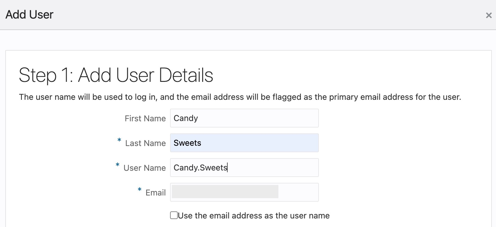

    We'll use user with username *Candy.Sweets* and provide a password of your choice in the second step.

    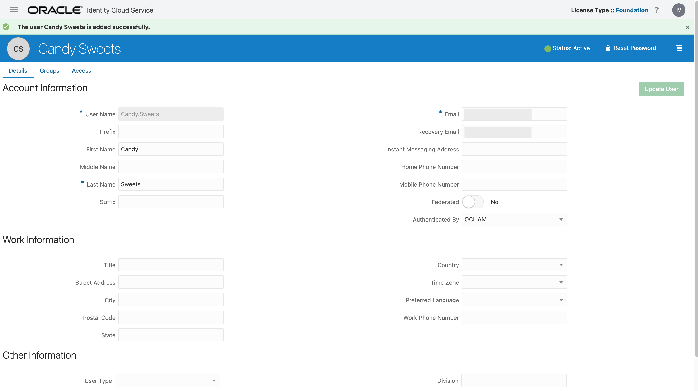

    A new user is now created.

3. Step 3: Create a new user group in IDCS

    From the Navigator menu on the right or from Groups portlet in Identity Cloud Service Console **Create a new Group**.

    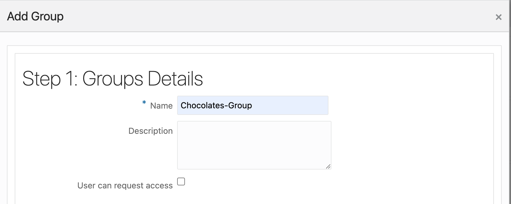

    Search for your new user and add it to the new group.

    

4. Step 4: Create a new compartment

    From the **Navigator** menu select **Identity & Security** and **Compartments**.

    

    To create a new compartment click **Create Compartment**.

    

    Provide **Name**, **Description** and **Parent Compartment**, optionally add Tags, and click **Create Compartment**.

    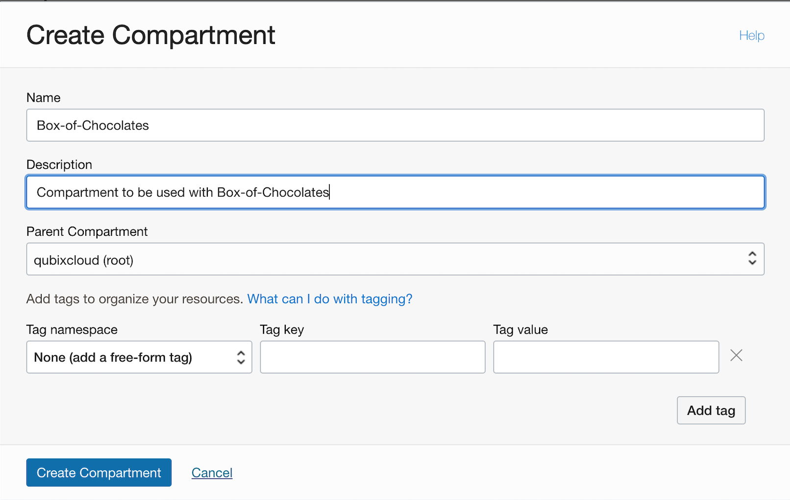

5. Step 5: Create a new OCI Group and map it to an IDCS Group

    In order to create policies for the Compartment you've just created, you need to create a new OCI Group. This group will map to previously created IDCS Group.

    Use **Navigator** to navigate again to **Identity & Security** and then choose **Groups**.

    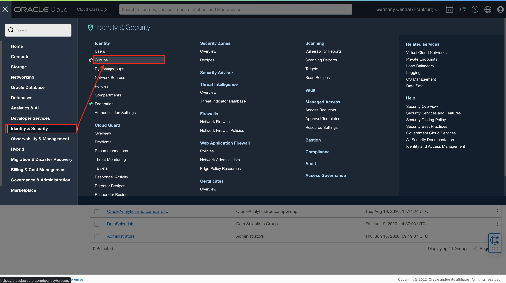

    Click **Create Group**

    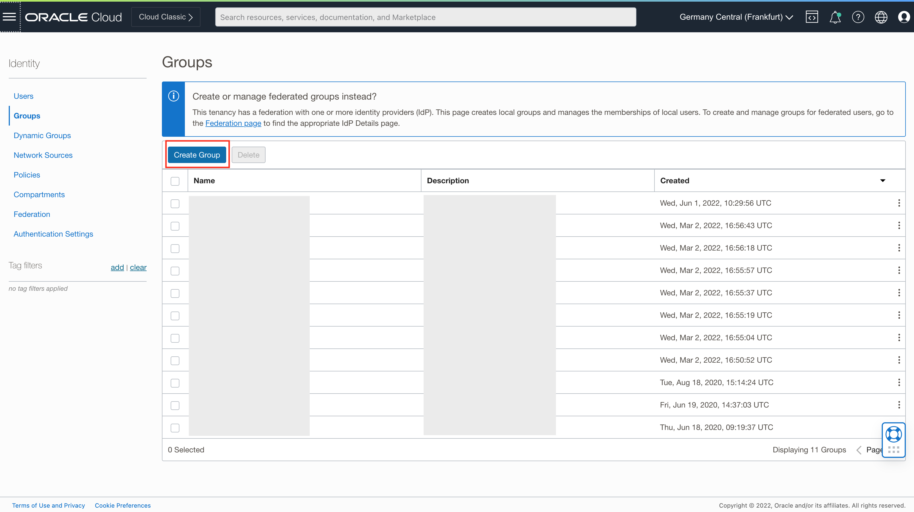

    Provide **Name** and **Description** and create a new group.

    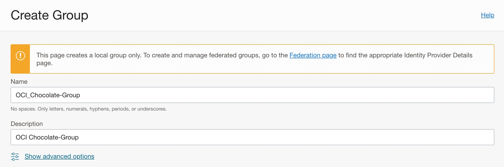

    Navigate back to **OracleIdentityCloudService** details page. Click on **Group Mappings** and then on **Add Mappings** button.

    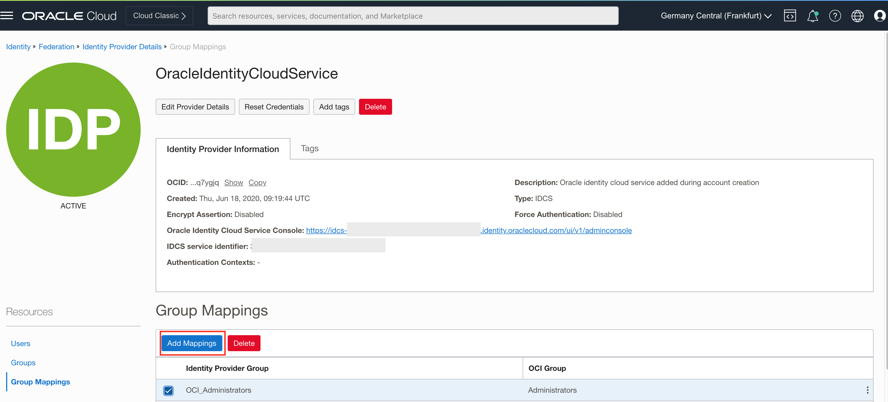

    This will open **Add Mappings** popup window. Select your new group from **Identity Provider Group** list and your newly created OCI group from the **OCI Group** list.

    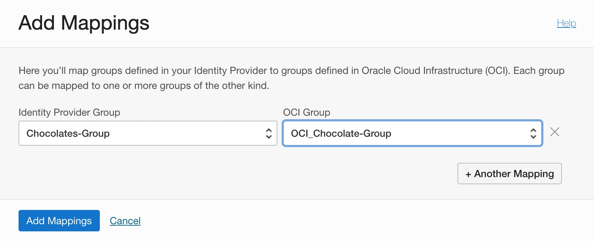

6. Step 6: Create a new Policy which grants manage privileges in a new Compartment to the new OCI Group

    Once again use **Navigator** to navigate to **Identity & Security** and choose **Policies**.

    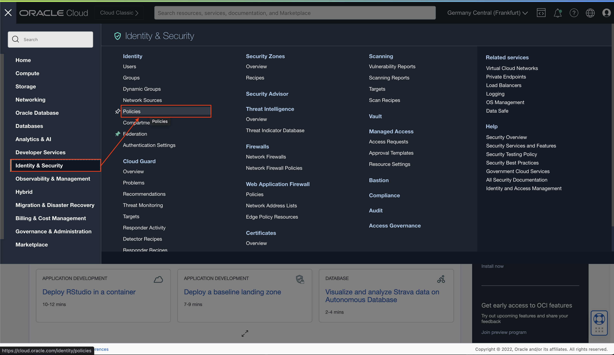

    In the Console click **Create Policy**.

    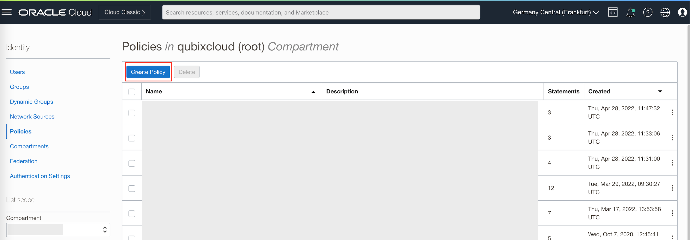

    Provide a new Policy **Name** and **Description**.

    Select *root* compartment of your tenancy.

    In **Policy Builder** section, search for **Let compartment admins manage the compartment** in the **Common policy templates** pulldown list.

    Make sure **Groups** is selected and then choise your newly created OCI Group from the list of available OCI Groups. And choose **your root** compartment for **Location**.

    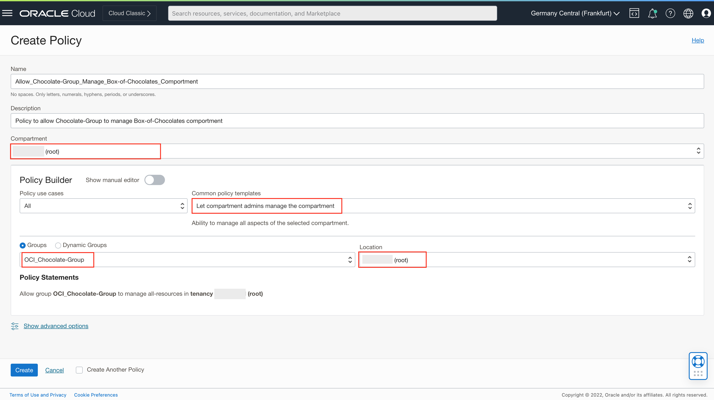

    Your policy should look like this:

     ```
     Allow group OCI_Chocolate-Group to manage all-resources in tenancy <your root comparment>
     ```

     Click **Create** to create a new policy in your *root* compartment.

     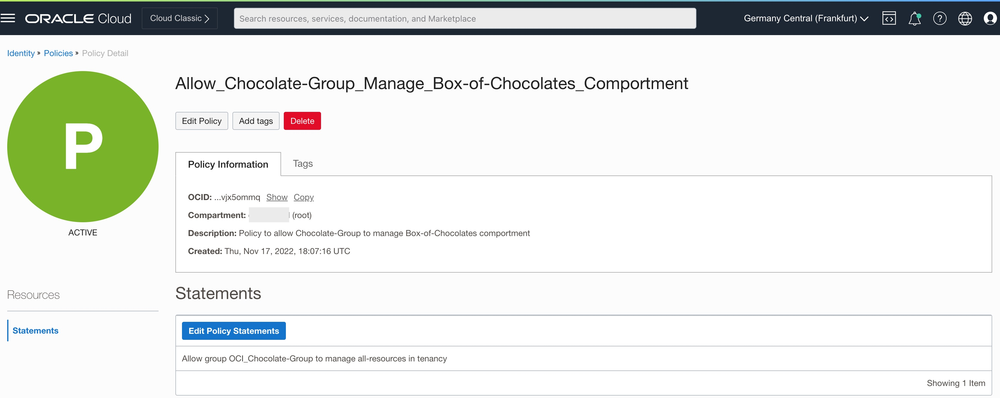

## Task 2: Logout

When you are finished with Task 1, simply logout from [cloud.oracle.com](https://cloud.oracle.com) as you will continue with your newly created user.

## Learn More

* [OCI Documentation](https://docs.oracle.com/en-us/iaas/Content/home.htm)

## Acknowledgements

* **Author** - Žiga Vaupot , Qubix Intl.
* **Contributors** -  Grega Dvoršak, Qubix Intl.
* **Last Updated By/Date** - Žiga Vaupot, November 2022
