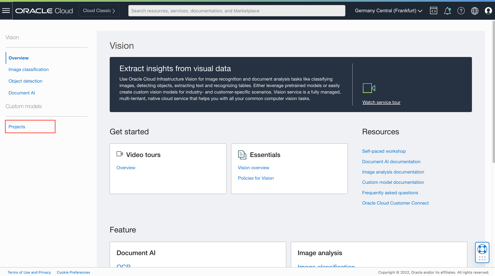
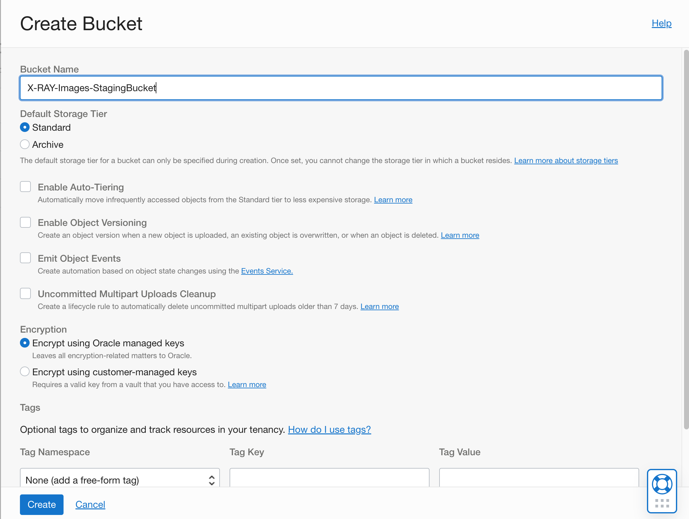

# Image Library

## Introduction

This lab walks you through the steps to organize an image library in OCI Object Storage and upload X-Ray images to the the library.

Estimated Time: 20 minutes

### About OCI Object Storage
The Oracle Cloud Infrastructure Object Storage service is an internet-scale, high-performance storage platform that offers reliable and cost-efficient data durability. 

The Object Storage service can store an unlimited amount of unstructured data of any content type, including analytic data and rich content, like images and videos.

### Objectives

In this lab, you will:

* Create a new vision model
* Set a staging bucket
* Test a model

### Prerequisites

This lab assumes you have:

* An Oracle Cloud account

## Task 1: Create your first Vision model

In the previous lab, you have labeled all images (records) in your dataset, which is prerequisite to start working with **Vision** service. In this lab, you will create your first **vision** model and you will run some test to confirm it is working properly.

1. Step 1: Navigate to **Vision**

    Using **Navigator** (on the left) navigate to **Analytics & AI** and then choose **Vision**.

    

2. Step 2: Create a custom **Project**

    You will see a menu of Vision options on the left side of the page. As you can see **Vision** service can be used for **Image Classification**, **Object Recognition** and **Document AI**. These there services are ready to use services, so you can try them without any preparation. 

    In your case, you will create your own custom model. So, Click **Projects**

    

3. Step 3: Projects

    When you open the **Projects** page, pay attention to **important information** note that is displayed at the top of the page. There are some policies required which need to be set before you create a new custom project and before you start training your models.

    

4. Step 4: Setting policies for Vision

    If you haven't set policies for Vision before, then open a new browser tab and navigate to **Policies** page.

    

5. Step 5: Create a new policy

    Click **Create Policy**.

    

6. Step 6: Define policies to access Vision service

    Provide a name of a new policy and description in **Create Policy** dialog page. In the **Policy Builder** section enable **Show manual editor** and enter the following policy

    ```console
    allow group OCI_Chocolate-Group to manage ai-service-vision-family in tenancy
    ```

    

    Click **Create**.

7. Step 7: Confirm Policy

    Wait till policy is created and verify it has been properly set.

    

    You can close your 2nd tab page now.

8. Step 8: Continue with customer Project setup

    Click **Projects** on the left side menu list, confirm you are in correct **Compartment** (ie. Box-of-Chocolates) and click **Create Project**

    

9. Step 9: Define custom project

    Select compartment in which you would like to create your Vision model.

    Give your model a name and provide short description. Click **Create project**.

    

10. Step 10: Verify your project

    You can monitor creation of your new project. This should be completed pretty quickly. Once done, your project should have status **ACTIVE**.

    

    Click on your **project name**.

11. Step 11: Create a new vision model

    Project page opens. You can see there is a list of **Models** that is currently empty. So, let's create your first Vision model.

    Click **Create Model**

    

12. Step 12: Create and Train Model - Step 1

    Create and Train Model wizard will now take you through a few simple steps.

    In the first step, you need to provide data for the model to be trained on. You are obviously using your X-Ray Images dataset, which was labeled, using **Data Labeling Service** in the previous exercise.

    Click **Next** to proceed to the second step.

    

13. Step 13: Create and Train Model - Step 2

    In this second step, you need to define parameters for the model itself. As you can see, there isn't much to do. Provide a name and description and then define **training duration**.

    As you can see you can choose between *up to 24 hours*, *about an hour* and *custom duration*. In the script, **the recommended** option is chosen, which means up to 24 hours. In fact it should take approx. 5 hours to complete. But feel free to pick your option.

    

    Click **Next** to proceed to the **Review** step.

14. Step 14: Create and Train Model - Step 3

    In this step you will only review and confirm the settings. If you are ok with them, click **Create and train**.

    


15. Step 15: Training in progress ...

    Model training is now in progress. In the **Project details: models** page you can monitor the progress by clicking the **Work Request** operation (in this case **CREATE_MODEL).

    

16. Step 16: Work request log

    You can now monitor the progress by reviewing **Log Messages**.

    

    


## Task 2: Create a staging bucket for Vision

While your model is being created, you can set a staging bucket which is also required when using your model. Vision service, when running predictions, requires additional storage. Actually it is a staging bucket, where each prediction temporarily stores results. You need to create a staging bucket and allow access and manage privileges to you user group.

1. Step 1: Navigate to **Storage** and then to **Buckets**.

    As you've done this for the Image Library, open **Navigator** menu, select **Storage** and then choose **Buckets**

    

2. Step 2: Create a **new Bucket**

    In the **Object Storage & Archive Storage** page confirm you are in your compartment, ie. **Box-of-Chocolates** and click **Create Bucket**

    

3. Step 3: Define your **Bucket**

    Provide **Bucket Name**, and simply leave all other parameters as default.

    

    Click **Create** to create a new bucket.

4. Step 4: Verify new bucket is correctly created

    You can now verify that a new bucket has been correctly created. 

    

5. Step 5: Set policies for access and manage objects in new bucket

    To access, read and manage objects in a staging bucket the following policies are required (replace User Group and Compartment names as required for your settings):

    ```console
    allow group OCI_Chocolate-Group to read buckets in compartment Box-of-Chocolates
    allow group OCI_Chocolate-Group to manage objects in compartment Box-of-Chocolates where any {request.permission='OBJECT_CREATE', request.permission='OBJECT_INSPECT'}
    ```

    


## Task 3: not relevant


In order to make your image library visible to other users/service, you have to update its visibility. One way of doing it is to set visibility to **Public**.

1. Step 1: Change visibility to Public.

    From your bucket list choose your newly created bucket.

    

2. Step 2: Edit Visibility

    In the Bucket Details page, click **Edit Visibility**.

    

3. Step 3: Update Visibility

    Check **Public** radio button and click **Save Changes**

    

4. Step 4: (optional) Set Pre-Authenticated Request

    Please note that you have an option to set **Pre-Authentication Request** instead of changing visibility to **Public**.

    In this case click **Pre-Authentication Requests** link under **Resources** and then **Create Pre-Authenticated Request**.

    

    Fill required field in PAR definition and finally click **Create Pre-Authenticated Request**.

    

    Pre-Authenticated Request details popup window is shown. Please copy URL for your reference as it won't be shown again.

    

    Click **Close** to return to the **Bucket Details** page.

    

## Task 3: Set required folder structure

This workshop is using [Chest X-Ray Images (Pneumonia)](https://www.kaggle.com/datasets/paultimothymooney/chest-xray-pneumonia) dataset.

In this task you will setup the folder structure and load images into proper folders in the next. 

Start with the library folder structure. Image library is organized in two folders:

* PNEUMONIA, which contains images of bacteria or virus infected lungs, and
* NORMAL, which contains images of normal, unaffected lungs

1. Step 1: Create a new folder

    Make sure you've clicked **Objects** under **Resources** in the Bucket Details page of you new bucket. 

    Click **More Actions** and choose **Create New Folder** from the menu.
    
    

2. Step 2: Define folder

    Name your new folder **PNEUMONIA** and click **Create**

    

    Repeat this step for another new folder **NORMAL**.
    
    

3. Step 3: Verify your folder structure

    Please verify that you've created two folders, PNEUMONIA and NORMAL, under the *root*.

    

## Task 4: Load images

We are now ready to load images into appropriate folders. The following steps might seem a bit long and far from being optimal as all images will be loaded using **Upload** utility provided on **Bucket Details** page. More elegant way of uploading would be to upload programmatically. 

The main issue with **Upload** is that you can only load approx. 200 images in one attempt. This means repeating the upload step several times to upload all 5000 images. This step can take approx 20-30 minutes to complete.

1. Step 1: Initiate images Upload

    You should still be located in the **Objects** sub-page of the **Bucket Details** page of your bucket.

    Navigate to the **PNEUMONIA** folder first.

    

    And click **Upload**.

2. Step 2: Upload images for PNEUMONIA

    In the dialog window leave **Object Name Prefix** empty, and leave **Storage Tier** unchanged.

    Then **drag image files** or **select files** from your computer onto **Choose Files from your Computer Area**. When ready, **Upload** button will become enabled (blue). Please note that you can upload approx. 200 images in one upload job.

    Click **Upload** and wait all images are uploaded.

    

    Repeat this step for all 3000+ images for PNEUMONIA.

3. Step 3: Upload images for NORMAL

    Repeat the previous step, except this time navigate to NORMAL folder and upload images for NORMAL.

    

    There should be approx. 1000+ images for NORMAL.

4. Step 4: Verify images are correctly loaded

    Before you continue to the next lab, just make sure that you've uploaded all images and that images are correctly placed into PNEUMONIA and NORMAL folders:

    

    You should see and review all details of uploaded images in corresponding folders.

    

## Learn More

* [OCI Object Storage](https://docs.oracle.com/en-us/iaas/Content/Object/home.htm)


## Acknowledgements
* **Author** - Žiga Vaupot, Oracle ACE Pro, Qubix
* **Contributors** -  Grega Dvoršak, Qubix
* **Last Updated By/Date** - Žiga Vaupot, November 2022