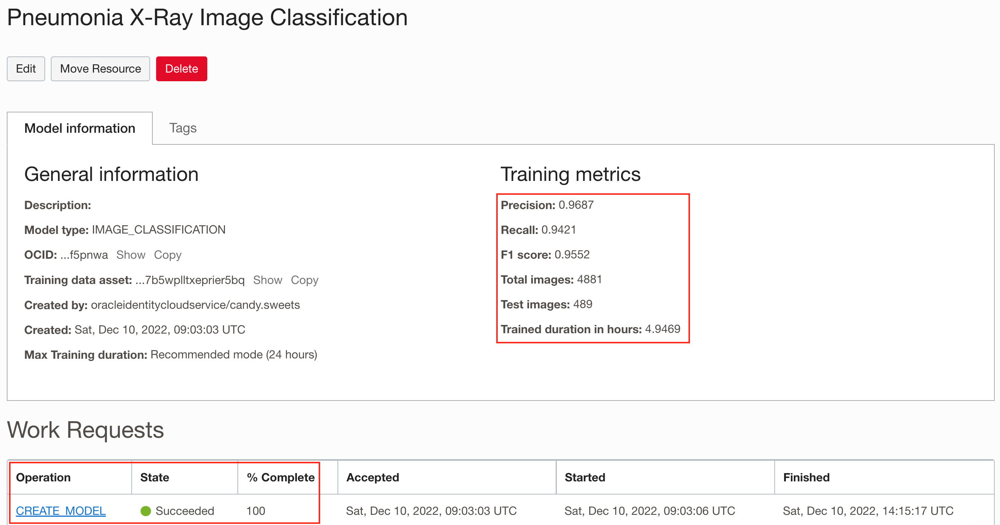
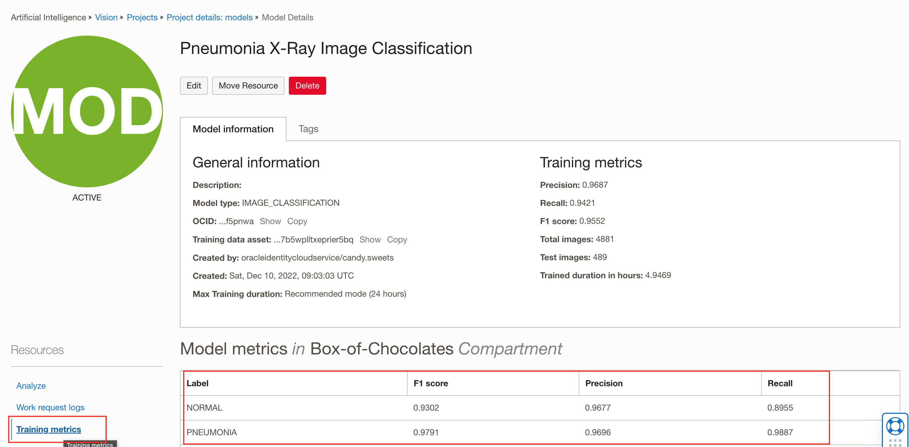
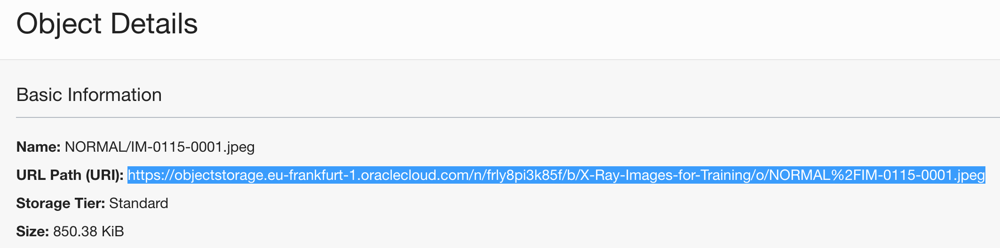
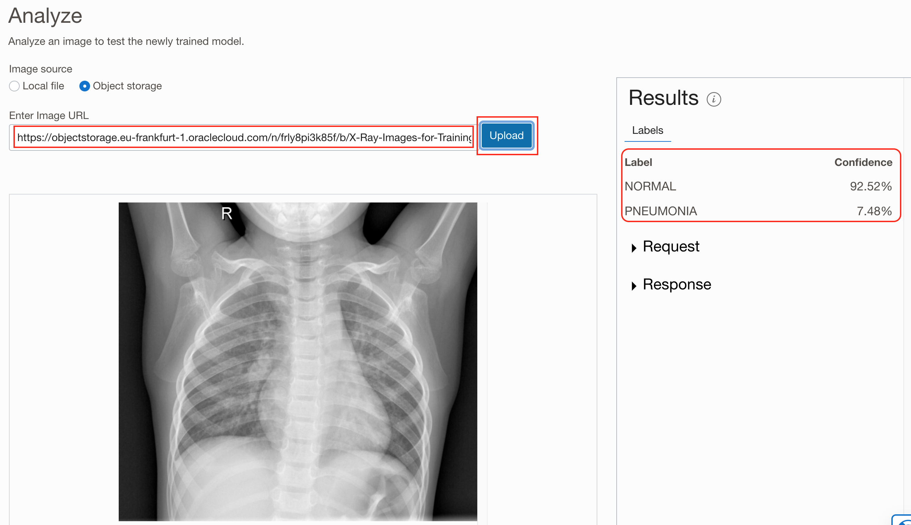
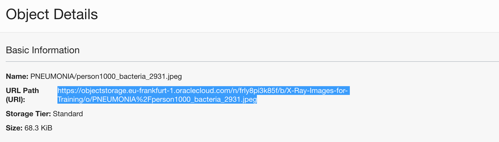
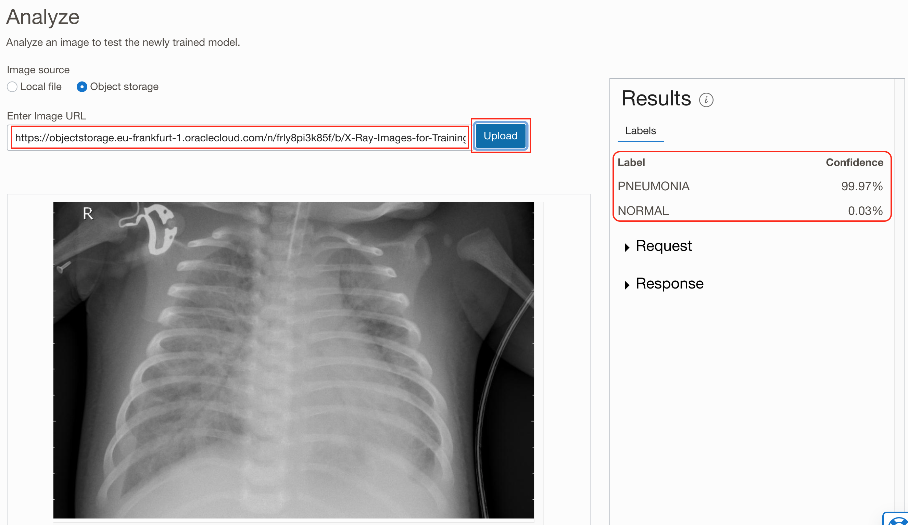

# Image Library

## Introduction

This lab walks you through the steps to train custom Image Classification model and to perform basic testing.

Estimated Time: 30 minutes and minimum 60 minutes for model training (up to 5 additional hours if max. training time is selected).

### About OCI Vision

OCI Vision is a serverless, cloud native service that provides deep learning-based, prebuilt, and custom computer vision models over REST APIs. OCI Vision helps you identify and locate objects, extract text, and identify tables, document types, and key-value pairs from business documents like receipts.

### Objectives

In this lab, you will:

* Set a staging bucket
* Create a new vision model
* Test a model

### Prerequisites

This lab assumes you have:

* An Oracle Cloud account

## Task 1: Create a staging bucket for Vision

Before you will begin with model training, one small prerequisite is needed. Vision service, when running predictions, requires additional storage, a staging bucket, where each prediction's results stores temporary results. You need to create a staging bucket and then allow access and manage privileges to you user group.

1. Step 1: Navigate to **Storage** and then to **Buckets**.

    As you've done this for the Image Library, open **Navigator** menu, select **Storage** and then choose **Buckets**

    

2. Step 2: Create a **new Bucket**

    In the **Object Storage & Archive Storage** page confirm you are in your compartment, ie. **Box-of-Chocolates** and click **Create Bucket**

    

3. Step 3: Define your **Bucket**

    Provide **Bucket Name**, and simply leave all other parameters as default.

    

    Click **Create** to create a new bucket.

4. Step 4: Verify new bucket is correctly created

    You can now verify that a new bucket has been correctly created. 

    

5. Step 5: Set policies for access and manage objects in new bucket

    To access, read and manage objects in a staging bucket the following policies are required (replace User Group and Compartment names as required for your settings):

    ```console
    allow group OCI_Chocolate-Group to read buckets in compartment Box-of-Chocolates
    allow group OCI_Chocolate-Group to manage objects in compartment Box-of-Chocolates where any {request.permission='OBJECT_CREATE', request.permission='OBJECT_INSPECT'}
    ```

    

## Task 2: Create your first Vision model

In the previous lab, you have labeled all images (records) in your dataset, which is prerequisite to start working with **Vision** service. In this lab, you will create your first **vision** model and you will run some test to confirm it is working properly.

1. Step 1: Navigate to **Vision**

    Using **Navigator** (on the left) navigate to **Analytics & AI** and then choose **Vision**.

    

2. Step 2: Create a custom **Project**

    You will see a menu of Vision options on the left side of the page. As you can see **Vision** service can be used for **Image Classification**, **Object Recognition** and **Document AI**. These there services are ready to use services, so you can try them without any preparation. 

    In your case, you will create your own custom model. So, Click **Projects**

    

3. Step 3: Projects

    When you open the **Projects** page, pay attention to **important information** note that is displayed at the top of the page. There are some policies required which need to be set before you create a new custom project and before you start training your models.

    

4. Step 4: Setting policies for Vision

    If you haven't set policies for Vision before, then open a new browser tab and navigate to **Policies** page.

    

5. Step 5: Create a new policy

    Click **Create Policy**.

    

6. Step 6: Define policies to access Vision service

    Provide a name of a new policy and description in **Create Policy** dialog page. In the **Policy Builder** section enable **Show manual editor** and enter the following policy

    ```console
    allow group OCI_Chocolate-Group to manage ai-service-vision-family in tenancy
    ```

    

    Click **Create**.

7. Step 7: Confirm Policy

    Wait till policy is created and verify it has been properly set.

    

    You can close your 2nd tab page now.

8. Step 8: Continue with customer Project setup

    Click **Projects** on the left side menu list, confirm you are in correct **Compartment** (ie. Box-of-Chocolates) and click **Create Project**

    

9. Step 9: Define custom project

    Select compartment in which you would like to create your Vision model.

    Give your model a name and provide short description. Click **Create project**.

    

10. Step 10: Verify your project

    You can monitor creation of your new project. This should be completed pretty quickly. Once done, your project should have status **ACTIVE**.

    

    Click on your **project name**.

11. Step 11: Create a new vision model

    Project page opens. You can see there is a list of **Models** that is currently empty. So, let's create your first Vision model.

    Click **Create Model**

    

12. Step 12: Create and Train Model - Step 1

    Create and Train Model wizard will now take you through a few simple steps.

    In the first step, you need to provide data for the model to be trained on. You are obviously using your X-Ray Images dataset, which was labeled, using **Data Labeling Service** in the previous exercise.

    Click **Next** to proceed to the second step.

    

13. Step 13: Create and Train Model - Step 2

    In this second step, you need to define parameters for the model itself. As you can see, there isn't much to do. Provide a name and description and then define **training duration**.

    As you can see you can choose between *up to 24 hours*, *about an hour* and *custom duration*. In the script, **the recommended** option is chosen, which means up to 24 hours. In fact it should take approx. 5 hours to complete. But feel free to pick your option.

    

    Click **Next** to proceed to the **Review** step.

14. Step 14: Create and Train Model - Step 3

    In this step you will only review and confirm the settings. If you are ok with them, click **Create and train**.

    

15. Step 15: Training in progress ...

    Model training is now in progress. In the **Project details: models** page you can monitor the progress by clicking the **Work Request** operation (in this case **CREATE_MODEL).

    

16. Step 16: Work request log monitoring

    You can now monitor the progress by reviewing **Log Messages**.

    

    

17. Step 17: Evaluate your model

    When model training is completed - **State** is *Succeeded* and **% Complete** is *100%*.

    In the **training metrics** area calculated metrics that were automatically calculated using 10% of images as test dataset. Training metrics **Precision**, **Recall** and **F1 Score** are in this case around 95%.

    

    Additionally, you can review more detailed metrics for each label used in the model. Click on **Training metrics** link on the left side (under **Resources**). Table reveals, that training metrics for *PNEUMONIA* are slightly higher than for *NORMAL*.

    

## Task 3: Testing your model

1. Step 1: Test you model using known images

    Open bucket with your training image library (ie. *X-Ray-Images-for-Training*) in the second tab. Navigate to *NORMAL* folder and open details of any image. Copy **Image URL** to clipboard.

    

    Navigate back to tab with your Project model's details.

    Check **Object Storage** as your **Image Source** and paste **Image URL** from clipboard into **Enter Image URL** field. Click **Upload**. 

    Image will be uploaded and automatically analyzed. **Image** and prediction **Results** are displayed. And we can see that this image has been classified as *NORMAL* with very high **Confidence**.

    

    You can repeat and perform prediction for one image which is clearly showing *PNEUMONIA* infected lungs.

    Copy **Image URL** to clipboard again ...

    

    ... and copy it to **Enter Image URL** field and click **Uplaod**

    

    You can see that image is now classified as *PNEUMONIA* as expected with almost 100% confidence.

2. Step 2: Analyze predictions, confidence, requests and responses

    You have already checked **Results** on the right side of the page. 

    Beside a table showing **Prediction Confidence** for each of the **Labels** you can see two additional items in the **Results** area: *Request* and *Response*.

    

    Expand *Request*. This is request code for JSON call which is requesting prediction to be performed on the selected image.

    

    ```json
    {
    "compartmentId": "ocid1.compartment.oc1..aaaaaaaa5pczgqb5i6dcs2sew52ztgesfx7yuuvrlsujgwa6xmsfio3em3pa",
    "image": {
        "source": "OBJECT_STORAGE",
        "namespaceName": "frly8pi3k85f",
        "bucketName": "X-Ray-Images-for-Training",
        "objectName": "PNEUMONIA/person1000_bacteria_2931.jpeg"
    },
    "features": [
        {
        "modelId": "ocid1.aivisionmodel.oc1.eu-frankfurt-1.amaaaaaa4qfwndya2bdnv3rkfyj2fxqpiim2yeo7fjw2iuzkv4vfebf5pnwa",
        "featureType": "IMAGE_CLASSIFICATION",
        "maxResults": 5
        }
    ]
    }
    ```

    Expand *Response* and observe the JSON response with prediction results.

    

    ```json
    {
    "imageObjects": null,
    "labels": [
        {
        "name": "PNEUMONIA",
        "confidence": 0.99974525
        },
        {
        "name": "NORMAL",
        "confidence": 0.00025476996
        }
    ],
    "ontologyClasses": [
        {
        "name": "PNEUMONIA",
        "parentNames": [],
        "synonymNames": []
        },
        {
        "name": "NORMAL",
        "parentNames": [],
        "synonymNames": []
        }
    ],
    "imageText": null,
    "imageClassificationModelVersion": "version",
    "objectDetectionModelVersion": null,
    "textDetectionModelVersion": null,
    "errors": []
    }
    ```

    This concludes the third lab. You will register created model in Analytics Cloud and deploy it with new images that require classification.

## Learn More

* [OCI Vision](https://docs.oracle.com/en-us/iaas/vision/vision/using/home.htm)


## Acknowledgements
* **Author** - Žiga Vaupot, Oracle ACE Pro, Qubix
* **Contributors** -  Grega Dvoršak, Qubix
* **Last Updated By/Date** - Žiga Vaupot, November 2022