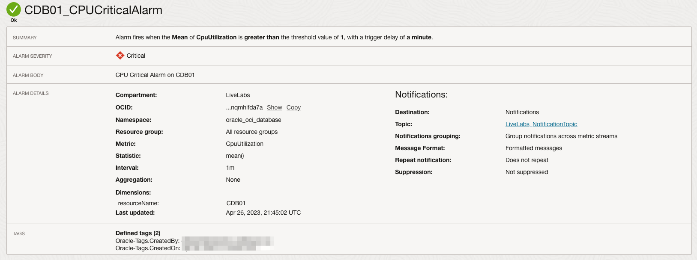

# Create an alarm using Database Management metrics

## Introduction

Using the OCI Monitoring service, you can actively monitor your OCI components with *Metrics* and *Alarms*. The Monitoring service receives metrics coming from OCI components like the Compute sending metrics on *CPU utilization*, DBCS sending metrics on *Storage Utilization by tablespace*, etc. In addition, *Custom Metrics* can also be sent to the Monitoring service.

We will see how to create *alarms* based on these metrics.

Estimated Time: 10 minutes

### Objectives

In this lab, you will:
* Create a Notification Topic
* Create a Database Alarm using metrics
* Check Alarm history

### Prerequisites

This lab assumes you have:
* A valid Oracle Cloud Infrastructure paid account.
* The necessary privileges to create the resources in this lab.

## Task 1: Create a Notification Topic
The Notification Topic is required for the creation of an *alarm*.

1. Click the navigation menu, click the link *Developer Services*, and then *Notifications*.

	

2. Make sure you are located in the *LiveLabs* compartment and click on *Create Topic*.

	

3. Provide the following information, Name *LiveLabs_NotificationTopic* and the Description *Notification Topic used by Monitoring service*. Click on *Create*.

	

4. Once the topic is created, we have to create a subscription. Click on the newly created topic and click on *Create Subscription*.

	

5. There are several options for selecting the subscription protocol, for example, email, Oracle Cloud Function, or Slack. For this lab, create an email type subscription. Select Email in the *Protocol* dropdown list, provide the email address and click on *Create*. Your request will show as *Pending* until you approve this new subscription.

	

> **_NOTE:_** If you are not getting the email, please look in your spam folder.

6. Check your email inbox to approve the subscription. Click on *Confirm subscription*.

	

7. A new browser tab will open to confirm the activation.

	

Your subscription is now active.

## Task 2: Create a Database Alarm using metrics

We will create an alarm based on the CPU utilization of the database. The metric is calculated based on the CPU allocated to the database.
1. Click the navigation menu, click the link *Observability & Management*, and then *Alert Definitions*.

	

2. Make sure you are location in the *LiveLabs* compartment and click on *Create Alarm*.

	

3. In the section *Define alarm*, provide Alarm name `CDB01_CPUCriticalAlarm` and Alarm body *CPU Critical Alarm on CDB01*. In the section Metric description information, make sure you are in *LiveLabs* compartment, select the Metric namespace `oracle_oci_database` and Metric name *CpuUtilization*.

	

  > **_NOTE:_** To utilize one of the 39 metrics that come with *Database Management*, you must use the namespace `oracle_oci_database`.

4. In the section *Metric dimensions*, provide dimension name *resourceName* and Dimension value *CDB01*. In the section *Trigger rule*, select operator *greater than*, Value *1*, Trigger delay minutes *1*. You will notice the graph automatically updated with the previous information. The red dotted line represents the trigger value. An alarm will be created when CDB01 will utilize 1% of the database allocated CPU.

	

5. In the section *Define alarm notifications*, select Destination service *Notifications*, *LiveLabs* compartment and Topic previously created *LiveLabs_NotificationTopic*. Make sure to checked *Enable this alarm?* and click on *Save alarm*

	

6. You will have the summary of the newly created alarm.

	

You will now receive an email when the CPU Utilization will be greater then the value you have used in the alarm definition.

## Task 3: Check alarm history

1. Click the navigation menu, click the link *Observability & Management*, and then *Alert Definitions*.

	

2. Make sure you are location in the *LiveLabs* compartment and click on the desire *Alarm name*.

	

3. Go to the bottom of the page, select the desire period and you will see the alarm history. In this example, the alarm fired 2 times. You should have received emails for each transition changes.

	

Congratulations! You have completed all the necessary labs and tasks.

## Acknowledgements
* **Author** - Luc Demanche, Cloud & DBA Practice Director, Insum Solutions Inc.
* **Last Updated By/Date** - Luc Demanche, April 2023
