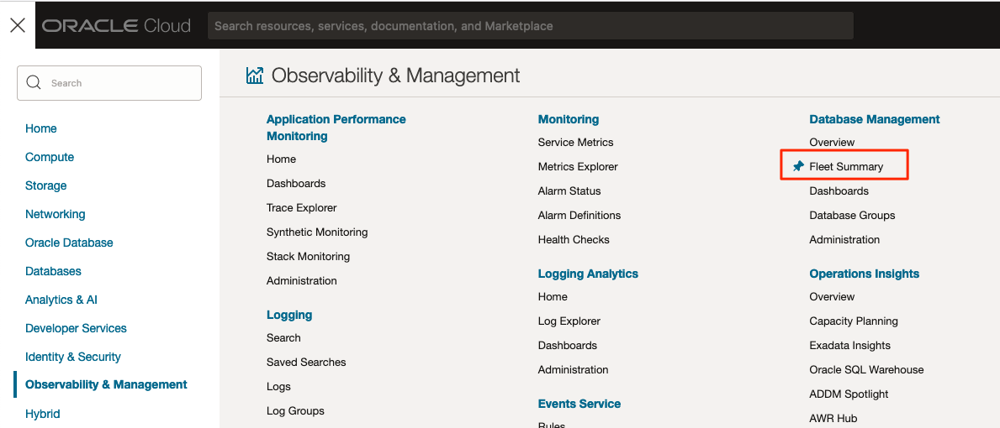
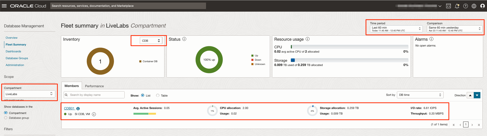
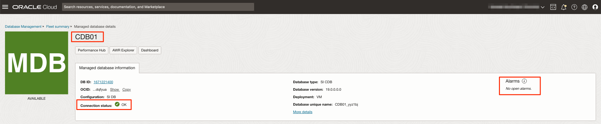
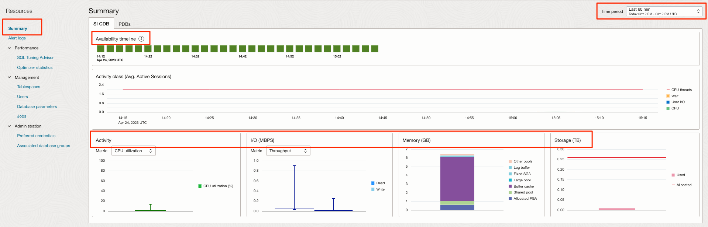
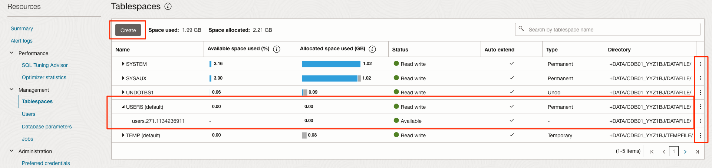
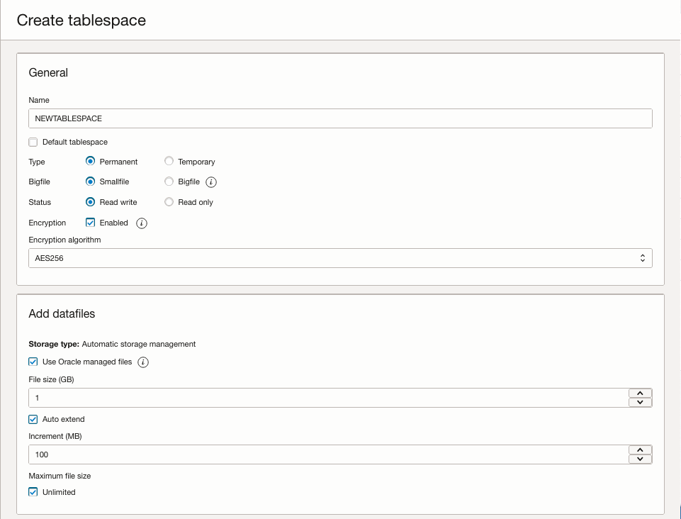
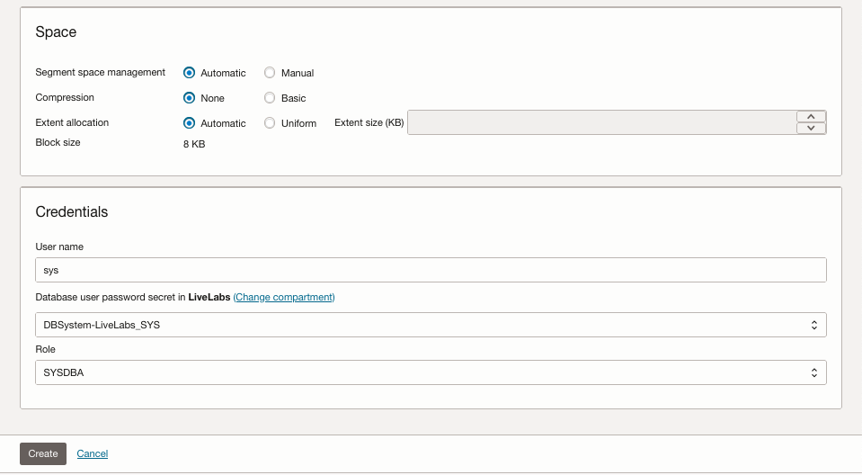
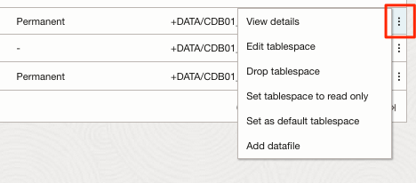

# Explore Database Full Management option with DBCS

## Introduction

In this lab, we will look at the capabilities that come with Database Full Management option.

Estimated Time: 10 minutes

### Objectives

In this lab, you will:
* Explore the Fleet Summary
* Explore monitoring a specific database
* Explore alert log details
* Explore tablespace actions

### Prerequisites

This lab assumes you have:
* A valid Oracle Cloud Infrastructure paid account.
* The necessary privileges to create the resources in this lab.

## Task 1: Explore the Fleet Summary

Fleet summary provides a unified view of your Oracle databases. In this single point of view, you can see performance statistics about Active Sessions, CPU Allocation/Usage, Storage Allocation/Usage and I/O Rate/Throughput.

1. Click the navigation menu, click the *Observability & Management* menu item, and then *Fleet Summary* under *Database Management*.

  

2. Make sure you have selected the right *Compartment*. Select the Inventory type *CDB*. Select the desired *Time period*. You will get information for the *CDB01*, *Average Active Sessions*, *CPU*, *Storage* and *I/O* information. You can change the *Time period* or the *Comparison* period as you want.

  

## Task 2: Explore monitoring a specific database

1. From the *Fleet Summary* page, click on *CDB01* to go to *Managed database details* page.
From this page, you can also open the *Performance Hub*, *AWR Explorer* and *Dashboard* page.

  

From the *Managed database details*, we can see the following information:
* Name of the component: *CDB01*
* Configuration: *SI CDB*, which means Standalone CDB
* Connection status: *OK*
* Alarms: *No open alarms*

2. Click on *Summary* under the *Resources* menu. You will get the summary information for the *CDB01* for the selected *Time period*. Information such as *Availability timeline*, *CPU Activity*, *I/O*, *Memory* and *Storage* will be displayed.

  > **_NOTE:_** If you select the *PDBs* tab, you will get information related to the PDBs.

## Task 3: Explore alert log details

1. Click on *Alert Logs* under the *Resources* menu. You will get the content of the alert log file. You can filter by level or type, and perform searches. You can also get more details by clicking on the arrow.

  > **_NOTE:_** *Attention log* is a feature available on database 21c or higher.

## Task 4: Explore tablespace actions

Database Management provides a way to manage tablespaces. You can create, alter and drop a tablespace. You can also add and edit datafiles.

1. Click on *Tablespaces* under the *Resources* menu. You will see a list of tablespace.

2. You can create a new tablespace by clicking on *Create*. Provide the *Name*, *Type*, *Bigfile*, *Status*, *Encryption* information. Provide the *datafiles* information too.

3. Continue by providing the *Space* and *Credentials* information. Credentials were created in the Lab #2, task #2. Click on *Create*

  > **_NOTE:_** Same tablespace creation process for PDBs.

You will then see the newly created tablespace in the list.

4. If you click on the 3 dots at the end of any tablespace line, you will have these options.

5. If you click on the arrow to expand the tablespace details, you will see the datafile information. If you click on the 3 dots at the end of any datafile line, you will be able to edit this datafile. You can make any changes, provide credentials and click on *Save changes*.

You may now proceed to the next lab.

## Acknowledgements
* **Author** - Luc Demanche, Cloud & DBA Practice Director, Insum Solutions Inc.
* **Last Updated By/Date** - Luc Demanche, April 2023
