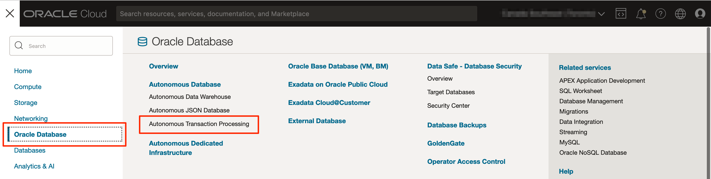
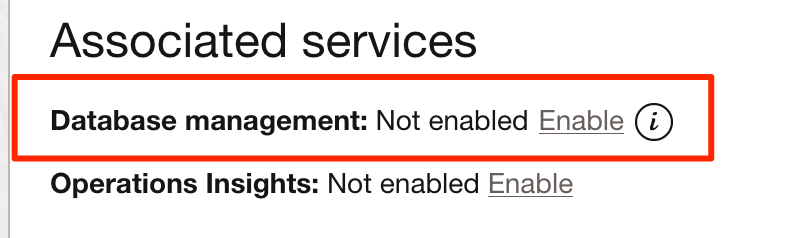
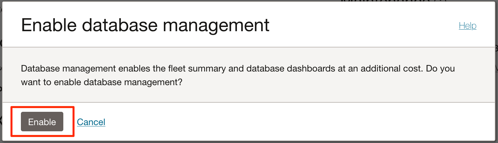
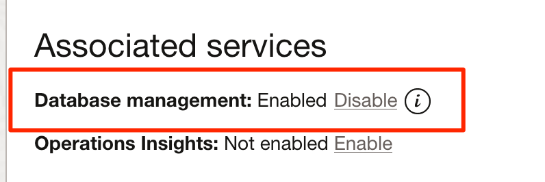

# Enable Database Management for the ADB

## Introduction

In this lab, we will register the ADB in Observability & Management Database Management service.

Estimated Time: 10 minutes

### Objectives

In this lab, you will:
* Register the ADB in Database Management Service

### Prerequisites

This lab assumes you have:
* A valid Oracle Cloud Infrastructure paid account.
* The necessary privileges to create the resources in this lab.

## Task 1: Check the status of Database Management

1. Click the navigation menu, click the link *Oracle Database*, and then *Autonomous Transaction Processing*.

	

2. Select the ADB you have created. Make sure to be in the *LiveLabs* compartment.

3. Under *Associated services*, you can see Database Management is not enabled.

	

## Task 2: Enable Database Management for the ADB

1. Click on *Enable* and confirm you want to enable Database Management.

	

2. Once the registration is completed, you will notice the status of Database management is *Enabled*.

	

You may now proceed to the next lab.

## Acknowledgements
* **Author** - Luc Demanche, Cloud & DBA Practice Director, Insum Solutions Inc.
* **Last Updated By/Date** - Luc Demanche, April 2023
