# Enable Database Management for DBCS

## Introduction

In this lab, we will register the DBCS in the Observability & Management Database Management service. The Database Management Private Endpoint allows communication between the subnet where the database is running on the Database Management service. Vault is also used to securely use DBSNMP password.

Estimated Time: 10 minutes

### Objectives

In this lab, you will:
* Register the DBS in Database Management Service

### Prerequisites

This lab assumes you have:
* A valid Oracle Cloud Infrastructure paid account.
* The necessary privileges to create the resources in this lab.

## Task 1: Check the status of Database Management

1. Click the navigation menu, click the *Oracle Database* menu item, and then *Oracle Base Database (VM, BM)*.

  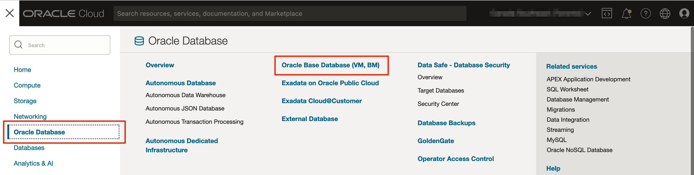

2. Select the DBCS *DBSystem-LiveLabs*. Make sure to be in the *LiveLabs* compartment.

  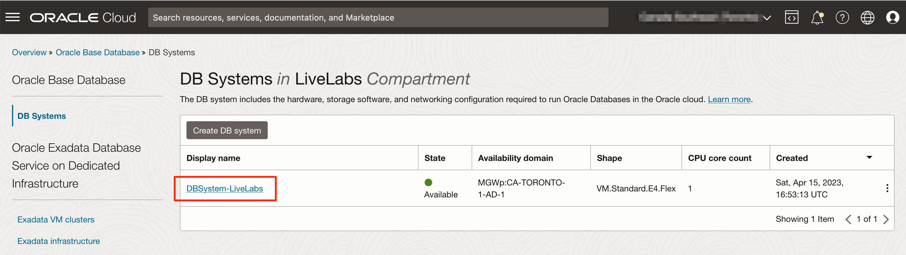

3. From the *DBSystem-LiveLabs* homepage, click on the database *CDB01* under the menu *Databases (1)*.

  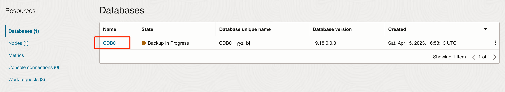

4. From the *CDB01* homepage, go down the page and you will see the status of *Database Management* is *Not enabled*. You will notice some metrics displayed in the namespace *oci_database*. This namespace is the default metric namespace when Database Management is not enabled and provides 13 different metrics.

  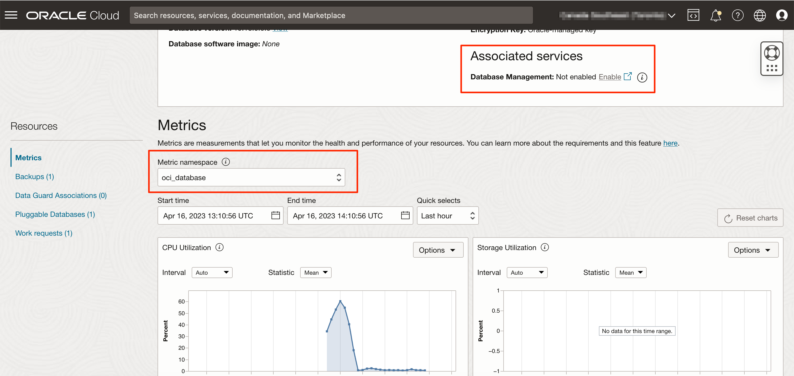

## Task 2: Enable Database Management for the CDB

1. In the *CDB01* homepage, under *Associated services / Database Management:*, click *Enable*.

  

2. Validate the following information.

  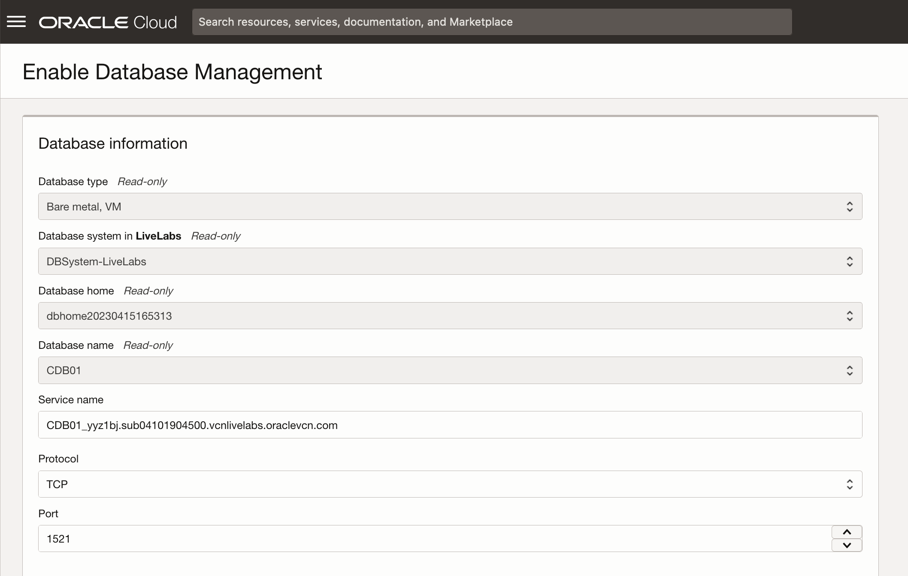

3. Provide the Database username *dbsnmp* you configured in Lab #2, the secret information `DBSystem-LiveLabs_DBSNMP` and the private endpoint `LiveLabs_DBMGMT_PrivateEndpoint` also created in Lab #2.

  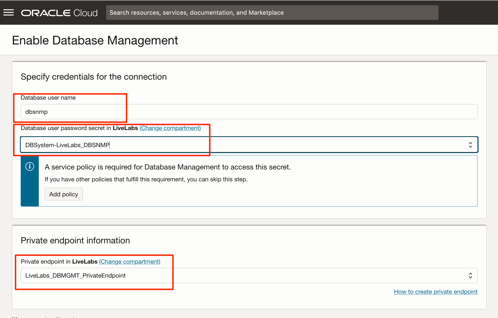

4. Select the Management option *Full Management*, and click on *Enable Database Management*.

  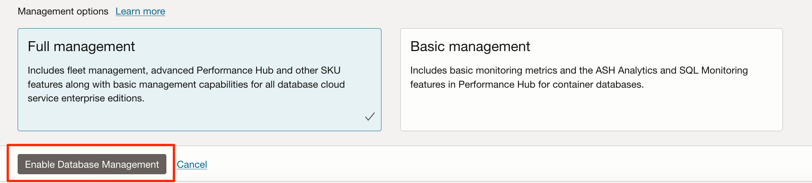

5. You can follow the progression of the process under the *Work requests* menu. If the process fails, you also have the log and error messages.

  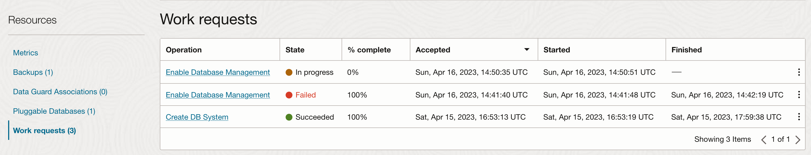

6. Once the registration is completed, you will notice the Database management status is either *Full* or *Basic* and you will be able to select another metric namespace `oracle_oci_database`. This namespace provides more database metrics (38) than the default one (13).

  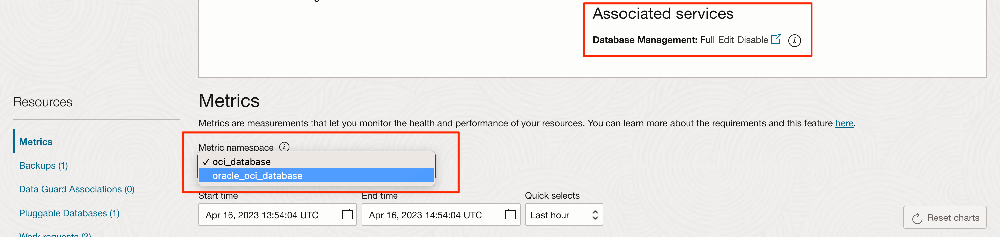

7. Once Database Management is enable on the Enterprise Edition DBCS CDB, you can access the *Performance Hub* which is a powerful tool to help diagnose database performance issues. From the CDB01 homepage, click on *Performance Hub* button.

  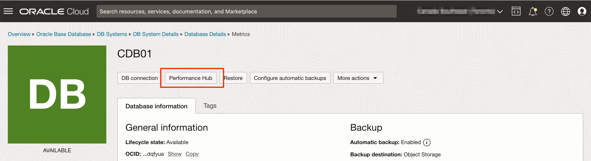

8. The *Performance Hub* provides a view of the activity during a specific period. Once you have selected the period, you will be able to analyze the running SQL using *ASH Analytics*, a list of SQL using *SQL Monitoring*, recommendations from *ADDM* as well as *Blocking Sessions*.

  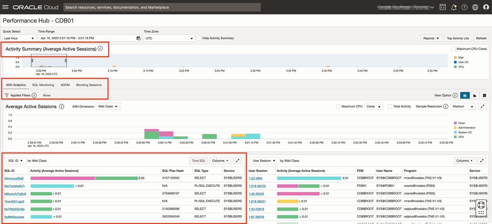

  I strongly encourage you to explore *Performance Hub*. This is a powerful tool to help you identifying performance issues from the database point of view.

## Task 3: Enable Database Management for the PDB

  We will follow the same process for enabling Database Management for the PDB. Enabling Database Management for PDB is possible only if the CDB is using the Database Full Management option.

1. In the *CDB01* homepage, under *Pluggable Database (1)*, click on *PDB01*.

  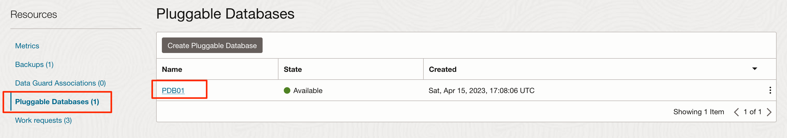

2. In the *PDB01* homepage, under *Associated services / Database Management:*, click *Enable*.

  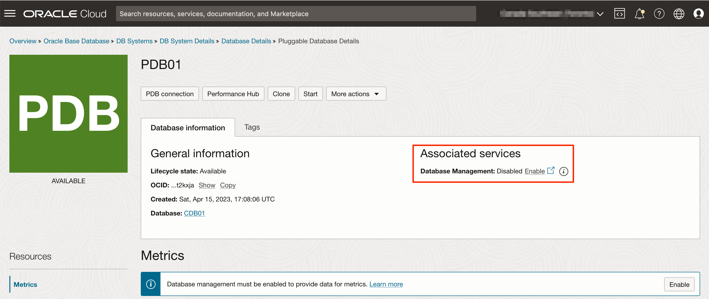

3. Validate the following information.

  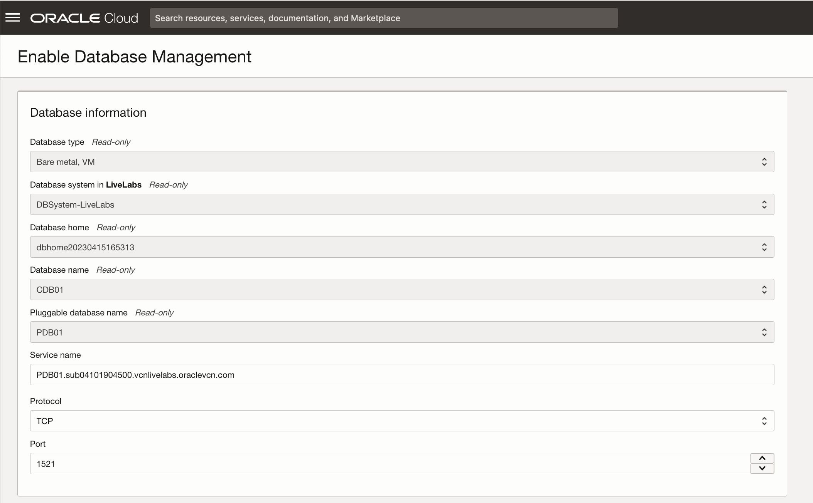

4. Provide the Database username *dbsnmp* you configured in Lab #2, the secret information `DBSystem-LiveLabs_DBSNMP` and the private endpoint `LiveLabs_DBMGMT_PrivateEndpoint` also created in Lab #2 and click on *Enable Database Management*.

  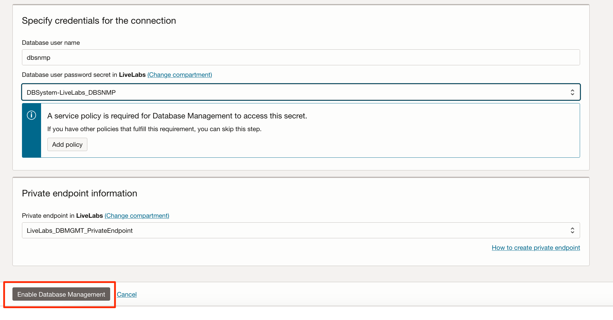

5. Once the registration is completed, you will notice the status of Database management is *Enabled* and you will be able to select another metric namespace `oracle_oci_database`.

  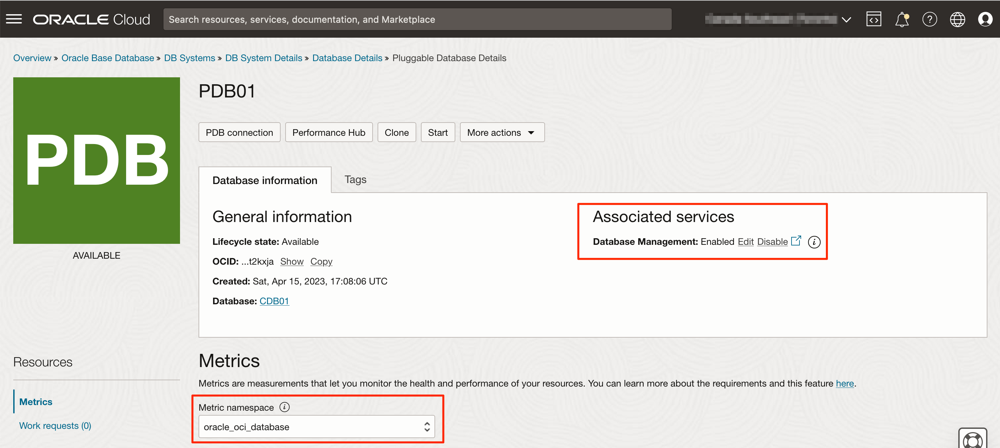

6. Once Database Management is enabled on the Enterprise Edition DBCS PDB, you can access the *Performance Hub* which is a powerful tool to help diagnose database performance issues. From the PDB01 homepage, click on *Performance Hub* button.

  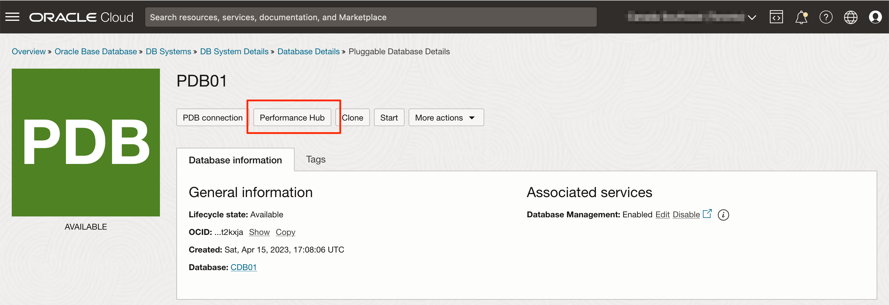

7. Same as for the CDB, the *Performance Hub* provides a view of the activity during a specific period. Once you have selected the period, you will be able to analyze the running SQL using *ASH Analytics*, a list of SQL using *SQL Monitoring*, recommendations from *ADDM* as well as *Blocking Sessions*.

  

  I strongly encourage you to explore *Performance Hub*. This is a powerful tool to help you identify performance issues from the database point of view.

You may now proceed to the next lab.

## Acknowledgements
* **Author** - Luc Demanche, Cloud & DBA Practice Director, Insum Solutions Inc.
* **Last Updated By/Date** - Luc Demanche, April 2023
