# Provision the environment

## Introduction

In this lab, we will create the infrastructure that will be use to complete all the following labs. The infrastructure will contain the network components (VCN, subnets, NSG, etc), one Database Cloud Service (DBCS) and one Autonomous Database (ADB).

To enable Database Management for the DBCS, we will need to create a Vault entry to securely store the password as well as the Database Management Private Endpoint.

Estimated Time: 45 minutes

### Objectives

In this lab, you will:
* Create the network infrastructure
* Create one Enterprise Edition DBCS and a Vault entry
* Create the Database Management Private Endpoint and Network Security Group (NSG)
* Create one Enterprise Edition ADB


### Prerequisites

This lab assumes you have the necessary privileges for the creation of all the components.

## Task 1: Create the network components

1. From OCI Console main page, click on *Set up a network with wizard*.

	

2. Click on *Start VCN Wizard*

	

3. Provide the VCN Name and the Compartment *LiveLabs*. You have to provide the VCN CIDR block.

	

4. Provide the CIDR block for the public and private subnets and click on *Next*.

	

5. Validate the *Review and create* page and click on *Create*.

	

6. The VCN is successfully created.

	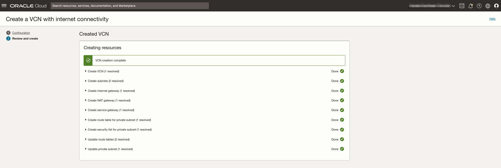

## Task 2: Create the DBCS and Vault entry

1. Click the navigation menu, click the link *Oracle Database*, and then *Oracle Base Database (VM, BM)*.

	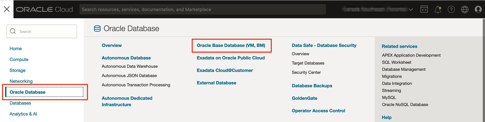

2. Select the compartment *LiveLabs* and click on *Create DB system*.

	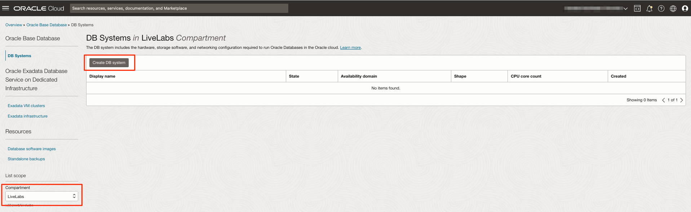

3. Provide the following information, Name of the DB System *DBSystem-LiveLabs*, Change the shape for *1 core*

	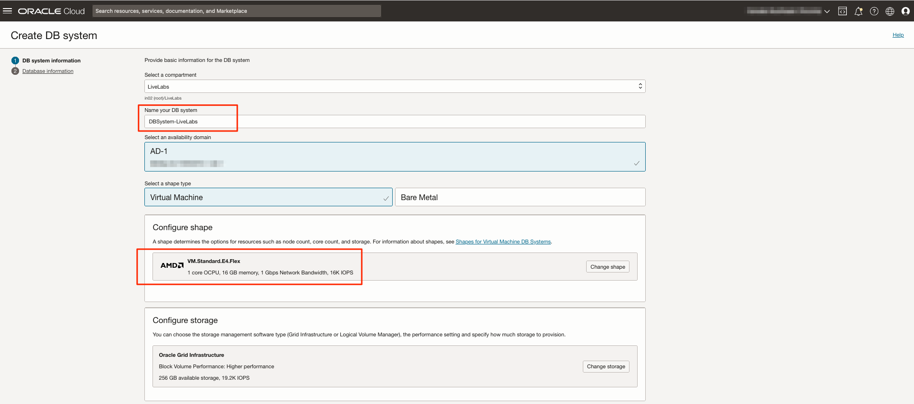


4. Change the Oracle Database software edition to *Enterprise Edition*. Upload your SSH key.

	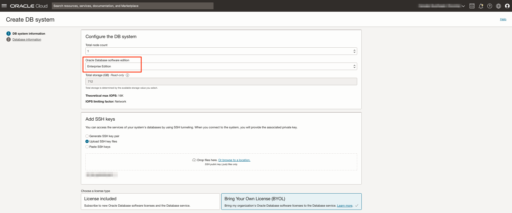

5. Select *Bring Your Own Licence* type. To ease the access to the DBCS during the lab, provide the VCN and public subnet information and the hostname and click on *Next*.

	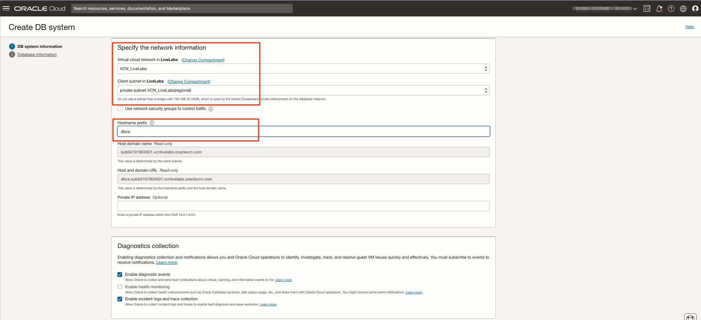

6. Provide the Database name, the PDB name. and password with sys and TDE. You can also disable database backups. Click on *Create DB system*.

	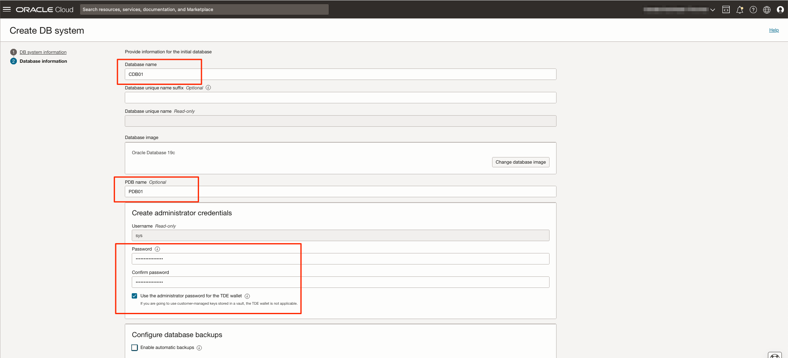

6. Using your prefered client tool, connect to the new CDB using *sys* user. Run the following SQL statements to configure the DBSNMP user account. This user will be used by Database Management.

	```
	<copy>GRANT CREATE PROCEDURE TO DBSNMP;</copy>
	<copy>GRANT SELECT ANY DICTIONARY, SELECT_CATALOG_ROLE TO DBSNMP;</copy>
	<copy>GRANT ALTER SYSTEM TO DBSNMP;</copy>
	<copy>GRANT ADVISOR TO DBSNMP;</copy>
	<copy>GRANT EXECUTE ON DBMS_WORKLOAD_REPOSITORY TO DBSNMP;</copy>
	<copy>GRANT CREATE SESSION TO DBSNMP;</copy>
	<copy>ALTER USER DBSNMP ACCOUNT UNLOCK;</copy>
	<copy>ALTER USER DBSNMP IDENTIFIED BY "<password>";</copy>
	```

7. The service Vault is necessary to securely store DBSNMP password. Click the navigation menu, click the link *Identity & Security* and click on *Vault*

	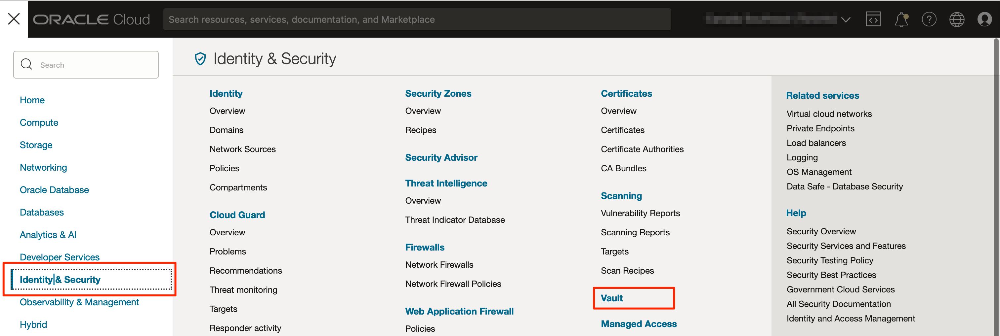

8. Make sure you are in the compartment *LiveLabs* and click on *Create Vault*

	

9. Provide the name *LiveLabs_Vault1* and click on *Create Vault*

	

10. Select the newly created vault and click on *Master Encryption Keys* under *Resources*. Click on *Create Key*.

	

11. Make sure you are in the compartment *LiveLabs*, use Protection Mode *Software* and provide the name *DBSystem-LiveLabs_Key*. Click on *Create Key*.

	

12. Select the newly created vault and click on *Secret* under *Resources*. Click on *Create Secret*.

	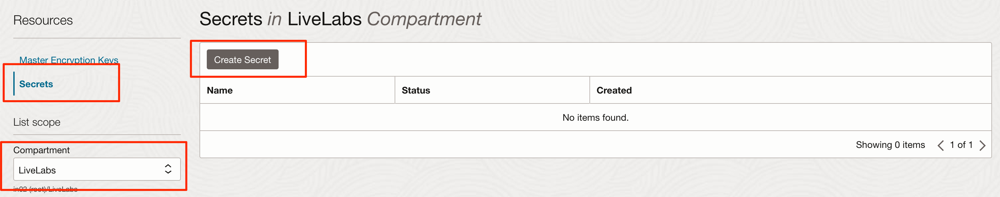

13. Make sure you are in the compartment *LiveLabs*, provide the name *DBSystem-LiveLabs_DBSNMP*, the description *Password of the user DBSNMP*, select the Encrytion Key previously created, and provide the secret content, the password of DBSNMP. Click on *Create Secret*.

	

## Task 3: Create the Database Management Private Endpoint and Network Security Group (NSG)

The database management private endpoint resides in the database subnet and allows the communication between the database and Database Management service.

1. Click the navigation menu, click the link *Observability & Management*, and then *Administration * under *Database Management*.

	

2. Select *Private Endpoint* under *Administration*. Make sure you are in the compartement *LiveLabs* and click on *Create private endpoint*.

	

3. Provide the name *LiveLabs_DBMGMT_PrivateEndpoint*, the description *Database Management PrivateEndpoint for compartment LiveLabs*, make sure you are in the compartment *LiveLabs* and provide the VCN and public subnet information where the DBCS resides. Click on *Create private endpoint*.

	

	> **_NOTE:_** The information for the Network Security Group will be provided later in the lab. Leave the section empty.

4. Click on the newly created private endpoint and take note of the *Private IP*.

	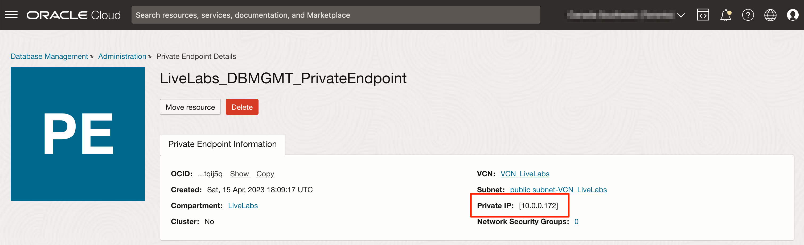

5. The NSG will allow the communication between the database systems and the Database Management service through the private endpoint. Click the navigation menu, click the link *Virtual cloud networks*, select the VCN *VCN_LiveLabs*, click on *Network Security Groups (0)* and click on *Create Network Security Group*

	

5. Provide the name *NetworkSecurityGroup_LiveLabs_DatabaseManagement* and make sure you are in the compartment *LiveLabs*. Click on *Next*.

	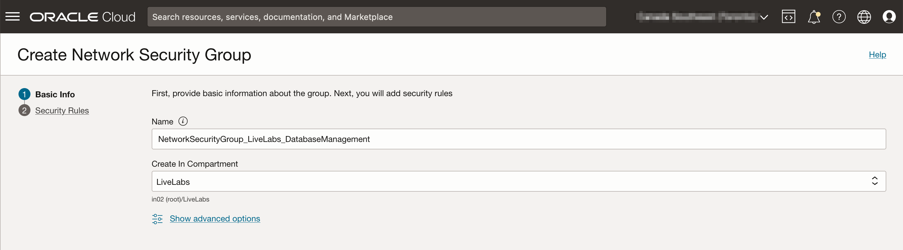

6. Provide the required 2 *Security Rules*. Click on *Create*.

	

| Direction  | Source Type | Source CIDR | IP Protocol | Destination Port | Description |
| ------------- | ------------- | ------------- | ------------- | ------------- |
| Ingress  | CIDR  | IP address of the Database Management Private Endpoint (10.0.0.172/32) | TCP | 1521 | Connection from Database Management from any port to any database system on port 1521 in the database subnet |
| Egress  | CIDR  | Range IP address of the database subnet (10.0.0.0/24) | TCP | 1521 | Database Management is sending request to the any database system on port 1521 in the database subnet |

6. Assign the new NSG to the database system. From the DBCS homepage, click on *Edit* next to *Network security groups*.

	

7. Select `NetworkSecurityGroup_LiveLabs_DatabaseManagement` and click on *Save changes*.

	

8. Assign the new NSG to the Database Management Private Endpoint. Select the private endpoint and click on *Network Security Groups: 0*.

	

9. Select `NetworkSecurityGroup_LiveLabs_DatabaseManagement` and click on *Save changes*.

	


## Task 4: Create the ADB

1. Click the navigation menu, click the link *Oracle Database*, and then *Autonomous Transaction Processing*.

	

2. Select the compartment *LiveLabs* and click on *Create Autonomous Database*.

	

3. Provide the following information, Compartment *LiveLabs*, Display Name, Database Name. Select the desired workload type.

	

4. Select the Deployment type. Make sure not to use *Always Free* ADB.

	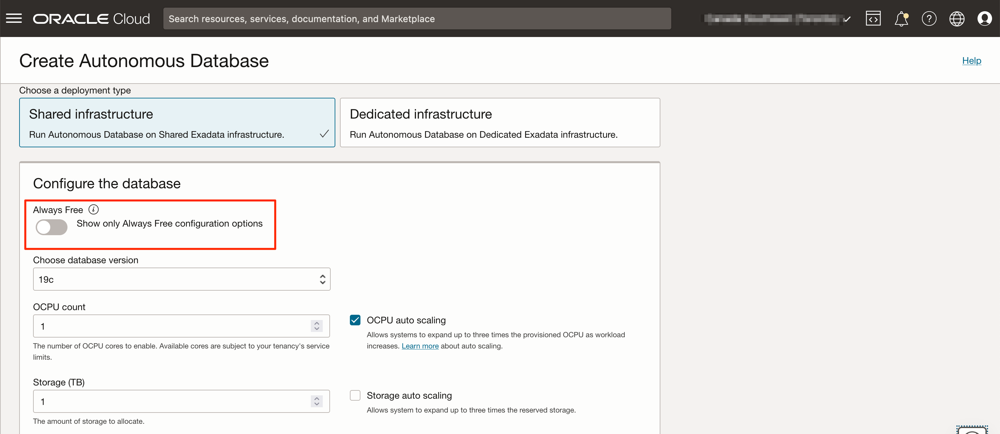

5. Continue by providing the *ADMIN* password. To ease the access to the ADB during the lab, select *Secure access from everywhere*.

	

6. Complete by providing the licence type, Database Edition *Enterprise Edition* and a contact email. Click on *Create Autonomous Database*.

	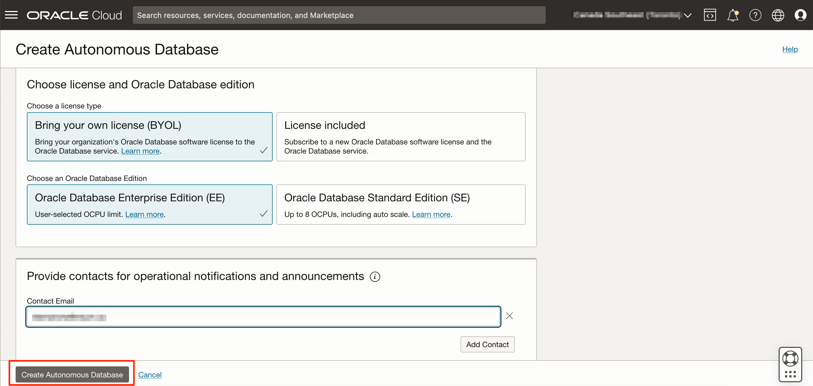


## Learn More

*(optional - include links to docs, white papers, blogs, etc)*

* [URL text 1](http://docs.oracle.com)
* [URL text 2](http://docs.oracle.com)

## Acknowledgements
* **Author** - <Name, Title, Group>
* **Contributors** -  <Name, Group> -- optional
* **Last Updated By/Date** - <Name, Month Year>
