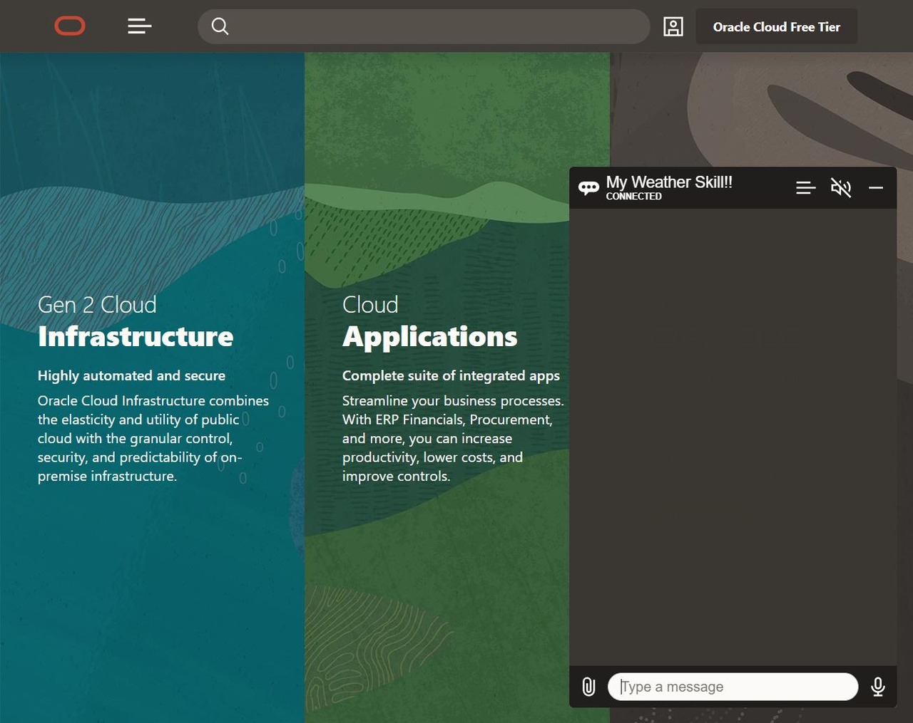
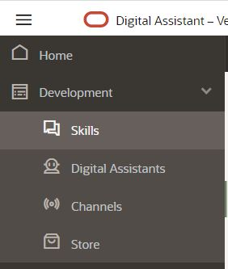
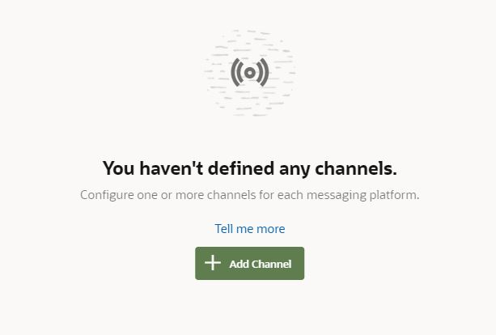
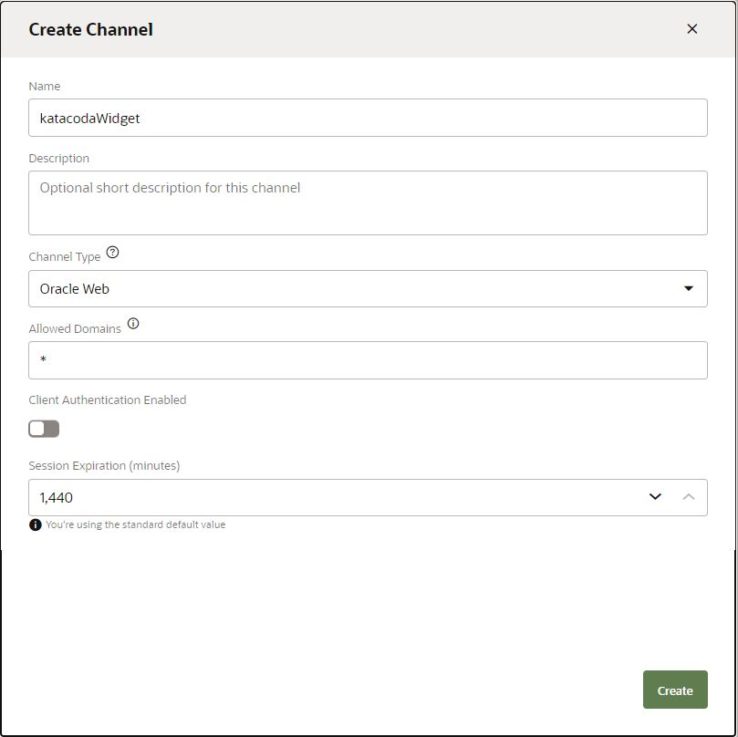
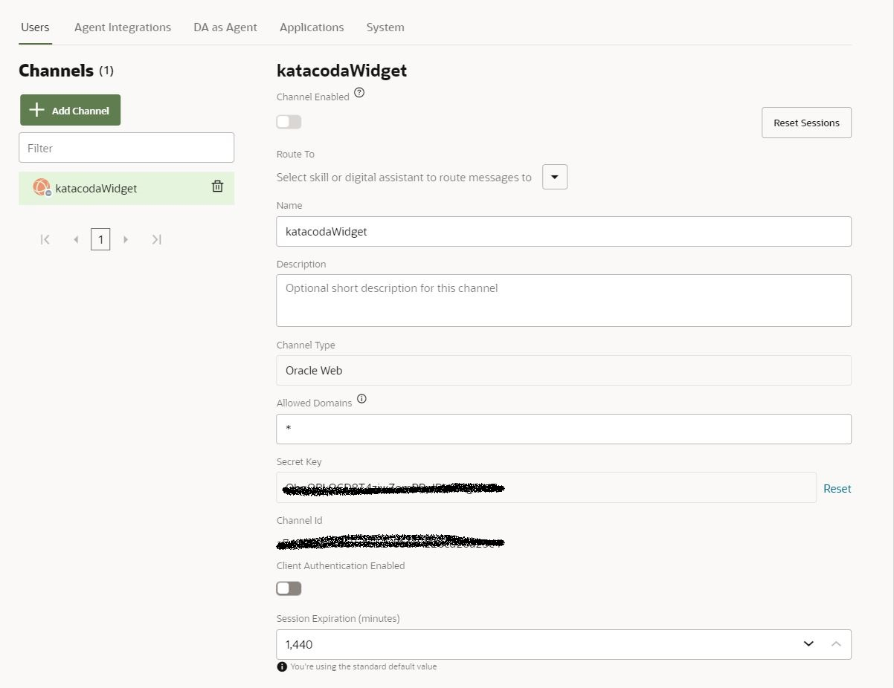
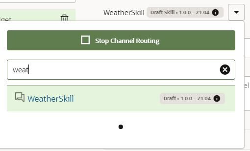
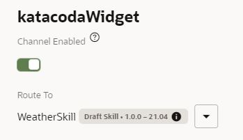
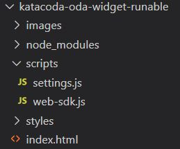
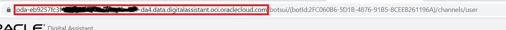
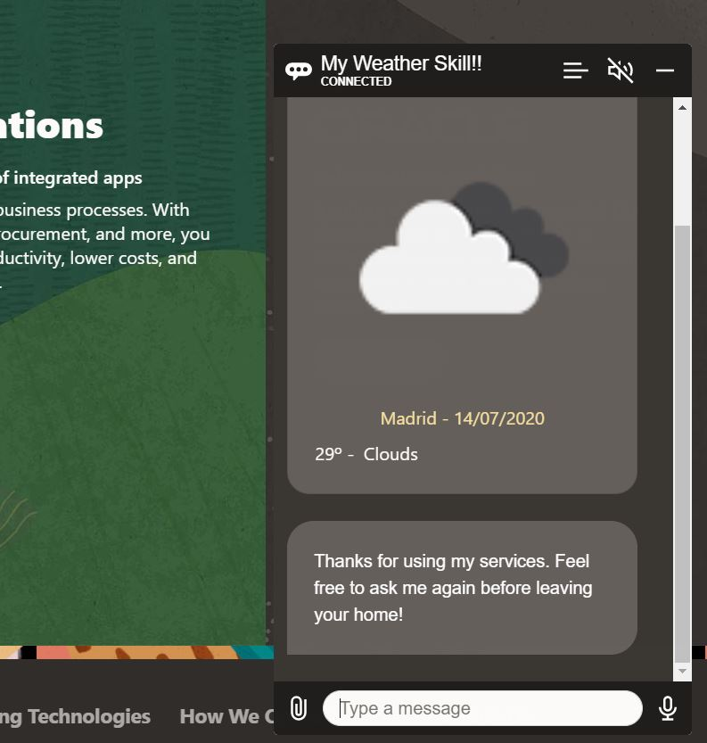

# Lab 5: Exposing your Weather Forecast Skill

## Introduction

Oracle Digital Assistant (ODA) provides out of the box integration with some messaging platforms such as MS Teams, Facebook Messenger or Slack, and the hability to create your webhook to integrate other channels such as WhatsApp.
Moreover, ODA includes a set of widgets for native iOS and Android, and JavaScript that enables you to add a widget to any web or hybrid application.

This lab will help you to setup and configure a web widget to expose the Skill you created in the past labs.

## Task 1: Create a new channel

In your Oracle Digital Assistant console menu, under Development click on 'Channels'.

Then click on '+ Channel' button.

By clicking on '+ Channel' button you will see the creation dialog.

You have to fill the values like the picture above.

* Name: I suggest you to give it a name that identifies the place where you are going to set up the widget, not the skill that is going to be exposed itself.
* Channel Type: In this case, as we are setting it up on a web site, you have to choose 'Oracle Web'.
* Allowed Domains: You can restrict what domains can communicate with the channel, and you actually want to restrict this on a production environment. For the hands-on you can just set '*',
* Client Authentication Enabled: By enabling this flag, you enforce using JSON Web Tokens (JWT) that is used for communication between the client and the chat server. For the hands-on we will leave it disabled.
* Session Expiration: By default is set for its max value of 60 minutes.

Click on 'Create' button once you have filled all the information. 

## Task 2: Associate the skill and channel activation

The channel has been successfully created but now we need to configure it as by default theres no skill associated and it is disabled as well.

**You need to save the Channel ID as this needs to be configured later in the lab on the web widget.**

Click on the button maked in the picture above to associate the skill to the channel and select your weatherSkill as you can see in the picture below.

Now you just need to activate the channel.

## Task 3: Web widget setup

Configuration in ODA Platform is now completed, and now we need to install and configure the web widget.

First, you have to create a folder where the component will be created

<pre>mkdir ODAComponents</pre>

For a production environment you want to download the SDK from the [Oracle ODA Downloads](https://www.katacoda.com/rsantrod/scenarios/oda04-skill-custom-components) page, but for this hands-on there is a node application preconfigured on Github.
Clone the repository where the widget app is stored. You will need to download GIT if you don't have it installed. [GIT](https://git-scm.com/)

<pre>git clone https://github.com/rsantrod/katacoda-oda-widget-runable.git</pre>

Lastly install the required node modules that are registered on package.json file

<pre>npm install</pre>

The configuration of the environment is now completed. Now you have to click on the IDE tab on Katacoda to start reviewing the different parts of the widget and configuring the ODA Channel.

As you can see in the image below, there are some folder and files that you will review during this process.

### index.html
This would be the page where you will display the widget. For example, if you want to display the widget in all the pages of your application you would include thse two script tags that you can see on lines 12 and 13.

<pre><code>
	13 
	14 
</code></pre>

### styles folder
There's nothing to do at this time for the hands-on, but you can override some of the css properties of the widget. You would need to add the css file to the index.html file as well.

<pre><code>
<link rel="stylesheet" href="styles/style.css">
</code></pre>

### scripts/web-sdk.js
You dont want to modify this file at all. It is the web sdk and all changes must be done via settings.js file.

### scripts/settings.js
This is the file where all the widget configuration is done, including the instance and channel details, and the customizations available

## Task 4: Web widget settings

Now, lets review in settings.js file in a bit more detail as you will be modifying it.

The first few functions: mockApiCall, generateJWTToken and generateToken are a starting point in case you want to enforce client authentication in your channel, so you can ignore it for this hands-on.
As we are ignoring, or not enabling client authentication, you have to make sure that 'isClientAuthEnabled' is set to false.

<pre><code>
	4 const isClientAuthEnabled = false;
</code></pre>

Next part is where you will be making the widget customizations, function 'initSdk'.
First you need to modify 'ODA_URI' value with the host name of your instance. You can see an example below.

And, for 'channelID', you need the get de channelID from the channel you created in Step 3.

<pre><code>
	let chatWidgetSettings = {
		URI: 'ODA_URI',                    
		channelId: 'channelID',
		...
		...
	}
</code></pre>
As an example of modifications, you are going to change the color of some elements.
For that, add to 'chatWidgetSettings' json the following property:

<pre><code>
	colors: {
		"branding": "green",
		"text": "green",
		'botMessageBackground': 'white'
	}
</code></pre>

Now you are ready to run the widget. Just execute the following commands.

<pre>cd katacoda-oda-widget-runable</pre>

<pre>npm start</pre>

## Task 5: Testing and advanced customizations

Go to your web browser and open the following url: [localhost:3000](http://localhost:3000/) 

Try to ask for the weather in your city!

There are multiple settings that can be overriden, and not just in terms of appearance. For example, we will send a hidden message to trigger Greetings Intent so the bot greets the user instead of the user having to say hello.

Add to 'chatWidgetSettings' json the following property:
<pre><code>
	initUserHiddenMessage: "hello"
</code></pre>

To test the change made, go to the Terminal tab and make Ctrl + C to stop the process and execute again:

<pre>npm start</pre>

Go back to your web browser and refresh the page.
When opening the widget you will see the massages from the bot.

You can see the full list of available customizations on the user-guide.md file in the project in VSCode.

## Summary

In this lab you have learned how to configure a web widget on your web site to expose your Digital Assistant or Skill and what kind of customizations cab be done to it.

Hope you have enjoyed implementing in Digital Assistant and also hope the course has been usefull for you!

Remmeber to check the Resources below as those links will help you to extend your knowledge on Oracle Digital Assistant.

You may now proceed to the next lab.

## Learn More

[Oracle Digital Assistant Documentation](https://docs.cloud.oracle.com/en-us/iaas/digital-assistant/index.html)

[Oracle Digital Assistant Enablement documentation](http://bit.ly/ODAEnablement)

[Oracle Digital Assistant Enablement documentation](https://blogs.oracle.com/mobile/tech-exchange)

## Acknowledgements
* **Author** - Ruben Rodriguez, Vice President Consulting Expert at CGI & Oracle ACE Director
* **Last Updated** - April 2024