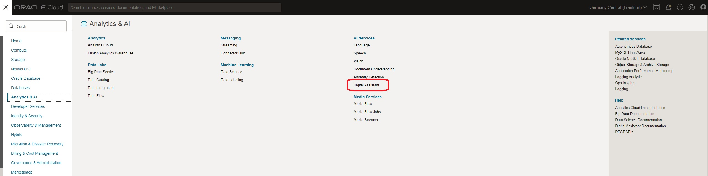
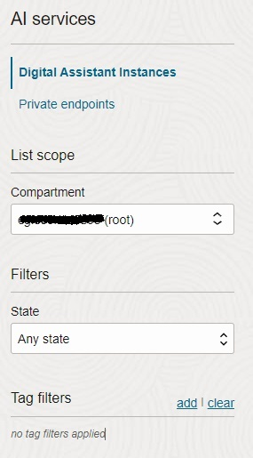

# Lab 1: Oracle Digital Assistant instance provisioning

## Introduction

This lab will help you to provision an Oracle Digital Assistant instance.

The assumption is that you are the administrator of the tenancy - either a fresh or preexisting cloud trial or a "regular" OCI tenancy.

If you don't have an OCI Tenancy yet, you can request a free trial here: https://oracle.com/free

Estimated Time: 15 minutes

## Task 1: Provisioning an Oracle Digital Assistant instance in OCI Console

Provisioning an Oracle Digital Assistant instance is an easy task. First you need to open your OCI console.
On the left hand side, in the menu you will find 'Digital Assistant'. Click on it!

Once you click on it, on the following screen you will need to select a Compartment.

A Compartment allows you to organize and isolate your cloud resources to control the access to those resources.

For this hands-on, you can select the root compartment. Then proceed to the next step!

Now you can click on 'Create Digital Assistant Instance' button.

In the dialog, you have to mandatory fill name and shape.

1. For the name, you can add something that identifies your instance. In the screen you can see I named it 'odadev'.

2. For the shape, you have two options:

  * Development: minimum charge of 50 request per hour at the time of writing.

  * Production: minimum charge of 250 request per hour at the time of writing.

As you can see, the only difference is the number of requests and, for this hands-on, you can use the development shape so yoour credits will last longer.

Once you have filled the details click on 'Create'.

Now, you have requested the creation of your Oracle Digital Assistant Instance and it will take a few minutes to complete!

## Task 2: Accessing Oracle Digital Assistant instance

You will receive an email once the instance is created and in Active status. To access the environment, you can click on the button with 'three dots' and select 'Service Console'

You have now finished the first lab and have your Oracle Digital Assistance Instance set up!

You can now move to the next one, where you will create an Skill and define Intents and Entities.

## Learn More

[Oracle Cloud Infrastructure Documentation - Order the Service and Provision an Oracle Digital Assistant Instance](https://docs.cloud.oracle.com/en-us/iaas/digital-assistant/doc/order-service-and-provision-instance.html#GUID-EB06833C-7B1C-46F6-B63C-1F23375CEB7E)

## Acknowledgements
* **Author** - Ruben Rodriguez, Vice President Consulting Expert at CGI & Oracle ACE Director
* **Last Updated** - April 2024