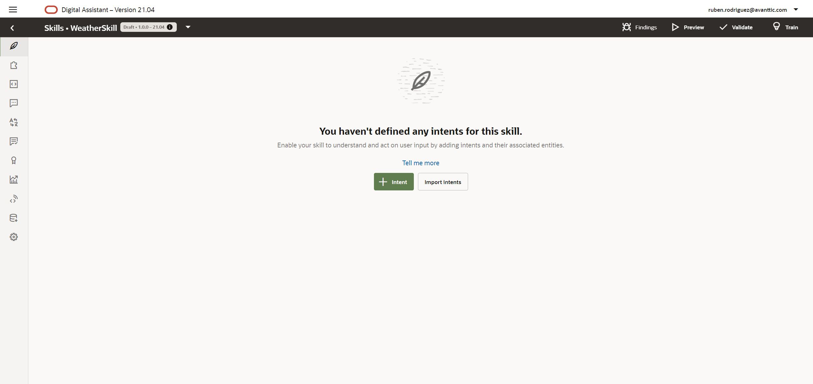
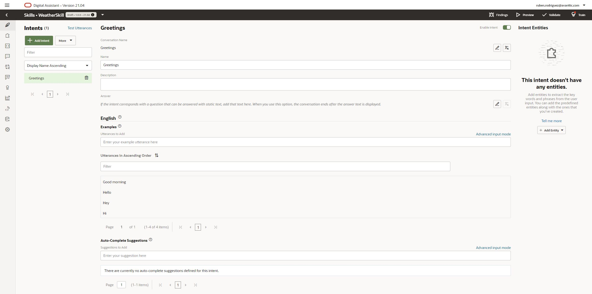

# Lab 2: Intents and Entities definition

## Introduction

At the end of the next 4 labs you will have built your own Weather Assistant! 
Giving a location and optionally a date, the chatbot will consume a weather API to retrieve the weather information.

In these labs you will read a lot the word skill. An skill is an individual chatbots that are focused on specific tasks. The same way, you can have multiple skills in Alexa, in terms of Oracle Digital Asistant, you may have multiple skills within the same Digital Assistant (or Master Bot, as I like to call it).

In this first lab you are going to define the intents needed for the skill and training the NLP model so the input provided is matched with the correct intent.

Estimated Time: 15 minutes

## Task 1: Enable Location entity

The last step of the first lab was to access the ODA service console.

In ODA there is a feature mangement where you can enable or disable some of the new features that has been included in the product. In this case, a LOCATION entity has been recently included so you will enable it so you can use it in your skill. 

Click on the menu button on the top left side and click on Settings -> Feature Management.
At the moment if preparing this labs, the feature was disabled by default.

If it is enabled, you can proceed to the next step!
If it is disabled, you need to select from the dropdown list 'Enable all' and click on 'Switch profile' as you can see in the picture below.

## Task 2: Create your Weather Skill

Now that LOCATION entity is available, you can create your skill.
On the main menu, click on Skills and you will see the list of skills (If it is the first time you access your environment it will be empty).

To create the skill click on 'New Skill' button. The following dialog will appear.

In the dialog fill the display name of your skill 'WeatherSkill' and click on 'Create' button

## Task 3: Learning more about the Skills

Before going further with your skill definition, in this step you will see an quick overview of the different pages within your skill.

*  In this page you can define the intents. An intent is what the user want to do or achieve.

*  An entity is a variable that adds relevance to an Intent. ODA includes some out-if-the-box entities and in this page you can create new entities such as Value List, Regular Expressions, etc. 

*  The dialog flow definition in ODA is implemented in YAML. Here you can define the different states you conversation will have.

*  The Conversation Designer is an easy way to start building a conversation without a single line of code. You will find it very usefull for quick prototypes.

* . Resource Bundles. Instead of having the static strings in the dialog flow definition you can define some key-value pair per language to centralize and facilitate the modification of those texts.

*  Q&A. THis is a great feature that enable you to define a set of questions and answer. This can run on its own but can be combined with Intents as well.

*  Quality. Provides some reports that evaluates your utterances to fins overlaps and suggests you some changes.

*  In Insight you can see some analytics of your skill. You can even see the actual conversations and the different states where those conversations have passed.

*  Components. In this page you can define service connections to your custom components. 

*  Manufacturing. Offer tools to enhance conversational data from all stakeholders. 

*  Skill settings. 

## Task 4: Defining Intents

Now you can start creating the intents for your skill!
You will create three intents for your skill:
  * Greetings: Any chatbot has to be polite and reply accordingly to a 'Hello'. This is usefull to indicate what can you do for the user.
  * WeatherForecast: Main intent of the skill. 
  * Help: You would usually have a help intent in case the user does not know how to use the bot.

Let's start with Greetings Intent. Go to Intents page and click on '+ Intent'

Change Conversation Name, by clcking on the pencil to the right, and Name properties to Greetings.
Under Examples, enter the following utterances or phrase examples.

| Utterances    |
| ------------- |
| Good morning  |
| Hello         |
| Hey           |
| Hi            |

Now you have to repeat the process with the other two intents and the following utterances:

| Intent            | Utterances                                            |
|-------------------|-------------------------------------------------------|
| WeatherForecast   | is it raining in London                               |
|                   | what is the temperature in New York                   |
|                   | what's the weather forecast in Madrid for tomorrow    |
| Help              | I don't know how to use the bot                       |
|                   | I need help                                           |
|                   | What can I do                                         |

Once you have finished, you can move to the next step!

## Task 5: Defining Entities

Itents are now completed but... you would normally ask the weather for a location and on a specific date or dates right? 
Before starting the intents testing you need to create the entities you need and associate it to the intent.

Navigate to the entities menu and click on 'Add Entity'

 

Fill the name of the entity and select 'Composite Bag' as type and click on create.

You can understand a composite bag like a business object. For example, if we talk about ordering pizza, you need also to provide the crust, size and toppings right? So you would have a Composite Bag pizza, and a set of items inside (crust, size, toppings, etc). 

Inside the  bag you have a add a new item by clicking on '+ Bag Item'.

There are multiple configurations you can make for every item but we are going to focus on two of them for this Workshop.
First you have to select the entity type of the item.

 

And lastly, at the bottom of the screen, you can add prompts. This prompts will be automatically sent to the user when a value for this entity is needed.

 

Now that you have created the composite bag, you are ready to add the entities to the itent.
Navigate to the Intents page, select WeatherForecast Intent and, on the right-hand side of the screen, click on '+ Entity' dropdown and select WeatherBag and DATE_TIME entities.

 

## Task 6: Testing your skill

Now you just have to train the skill, test the intents and repeat! Chatbot training is a repetitive process where you will start with a few utterances and based on end user input, you can assign those phrases as utterances of an Intent.
For the hands-on, it will be enough with the utterances provided but keep that in mind for your live projects!

At the time of writing, there are two models available.
  * Trainer Ht: This one is a linguistic-based model that does not require a lot of utterances to disambiguate the intent.
  * Trainer Tm: On the other hand, Trainer Tm is a machine learing-based model. This is the one you usually want to be enabled when going live.

 Click on the 'Train' button and select 'Trainer Ht'.

Once the trainig has finnished, you can start testing. On the intents page, click on 'Try It Out!' link.

You can write the phrase on the tester and it will be evaluated, asigning a confidence percentage to each Intent.
You can try the following phrases.

| Phrases                                   |
| ------------------------------------------|
| What's the weather like?                  |
| is it snowing in Madrid?                  |
| Whats the weather in London for tomorrow? |

As you can see in the image below, if you provide a location and a date is it recognized and marked as an Entity.

Feel free to try out new phrases. If by any chance, the Confidence percentaqge is low (<60) or another intent is higher than the one you think it should recognize, you can click on 'Add Example' button and retrain the model.

## Summary

In this lab you have understood what is the difference between a Digital Assistant and a Skill. Moreover, you can now define and create Intents and associate the Entities you need to complete your intents.

In the next lab you will implement the dialog flow of your Skill

### Learn More

[Oracle Digital Assistant Skills](https://docs.cloud.oracle.com/en-us/iaas/digital-assistant/doc/skills-ada.html)

[Oracle Digital Assistant Enablement documentation](http://bit.ly/ODAEnablement)

## Acknowledgements
* **Author** - Ruben Rodriguez, Vice President Consulting Expert at CGI & Oracle ACE Director
* **Last Updated** - April 2024