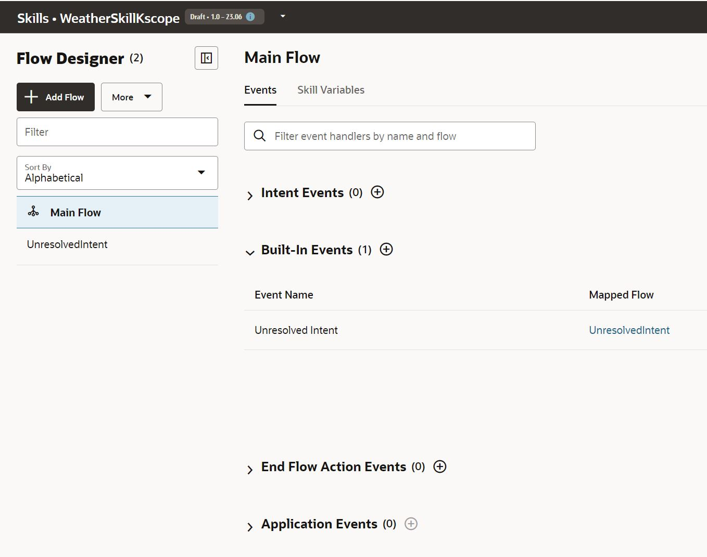
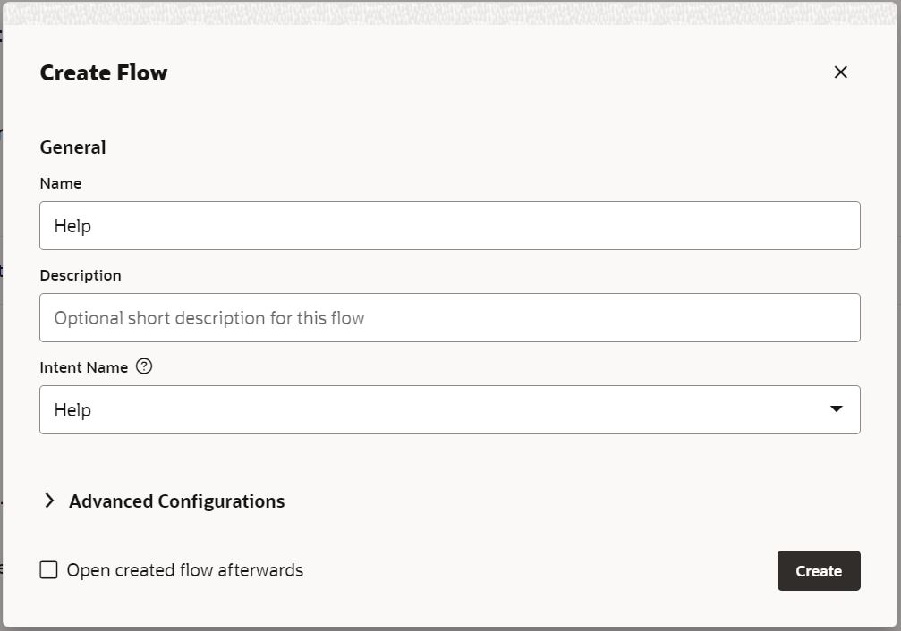
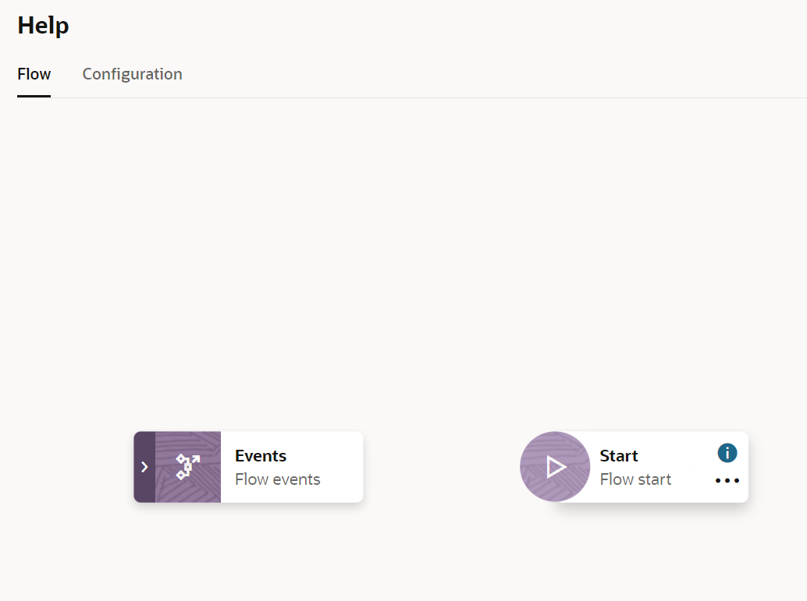
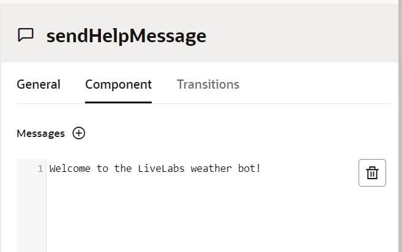
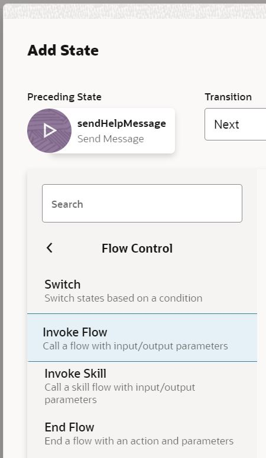
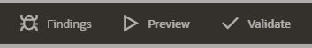

# Variables in LiveLabs

## Introduction

The next step after creating the intents is to implement the dialog flow, well not really, as you will need to define the dialog flow in advance of the implementation but it is for this hands-on.

Starting in Oracle Digital Assistant release 22.04, you can choose to implement your skill flows with YAML or using the Visual Flow Designer.

In the YAML flow definition you just had one file where you would add states and transitions among them. Also you needed to add an intent state so the routing could be made based on the user message.

In the Visual Flow Designer it is organized in flows and the intent matching is done automatically.

In this lab you will implement the dialog flow for your skill and, as you have not implemented the REST call to OpenWeatherMap API, you will just set static data as response to the user requests.

Estimated Time: 15 minutes

## Task 1: Create Flows

You can start creating the Help flow by clicking on 'Add Flow' button.

By selecting the intent, the skill with execute the flow Help if the messge of the user matches with Help intent.
After that, you can continue creating flows with the following data.

| Flow              | Intent             |
|-------------------|--------------------|
| Help              | Help               |
| Greetings         | Greetings          |
| WeatherForecast   | WeatherForecast    |

Now, it is time to build the different flows.
You are going to start with the Help flow.

 

## Task 2: Help flow implementation

This is an easy flow where you will just add an state thats end a message to the user.
Click on the 3-dots button that appears when you hover the Flow Start node and then click on Add start state.

As you can see there are different types of states and you will use some on them in this workshop.
In this case, select 'Send Message' and name the state 'sendHelpMessage'.
It is recommended to give descriptive names to the states so read what the flow does easily.

Then to finish adding it, just click on 'Insert' button.

Now you can set the message that will be sent by clicking on the state and typing it in the properties panel that will appear.

## Task 3: Greetings flow implementation

In the greetings flow, you will start adding a new Start State of type Send Message like you did on the previous step and and a greetings message to it.

| State name            | Type               | Message            |
|-----------------------|--------------------|--------------------|
| sendGreetingsMessage  | Send Message       | Welcome to the LiveLabs Weather Chatbot! |

Something different you are going to do in the flow is to redirect the conversation to the help flow, so after the welcome message you transition to Help flow.
You can achive this by adding an Invoke flow nexst to the send message state.

By clicking the invokeFlow state, you can select the flow where you will redirect the conversation.

## Task 4: Weather Forecast implementation.

The frst thing you are going to do in the Weather Forecast flow is to add a resolve bag component as the first state, this component help us to fill the variables inlcuded in the composite bag you defined before.

As you can see, the resolve component has a variable to select and since you don't have any variable created, first you need to do so.

 

Click on create variable button and select flow variable.
Give it a name and select entity as type and select the composit bag you created in the previous lab.

 

After finishing the creation you can see the component fully filled. Also, it displays the first prompt that you defined previously.

 

Remember that the requirements are that the date can be optionally provided by the user. This is why you don't included it inside the composite bag. Anyway, if the user provides it, you need to retrive it.

Next, you are going to add a set variable state. 

 

In this component, as you can see, you have to provide a variable as well.
Create another flow variable called DateVariable and in the nexxt dialog, select entity, DATE_TIME and the subtype Date.

 

Also, you have to fill the value of this variable by 'manually' retrieving the value of the DATA_TIME entity associated with the WeatherForecast intent. Select the switch next to Expression and copy and paste the following Apache Freemarker expression.
What you are doing here is accessing the nlpresult system variable that stores the intent and entities matching information to retrieve the first position of the array of values that are matching with the DATE_TIME entity.

<pre>${(skill.system.nlpresult.value.entityMatches['DATE_TIME'][0])!}</pre>

 

The last thing you are going to add to this flow before testing it is a state to print the weather data.
In this case, you are going to use a component called Common Response that enabled you from sending a simple text to build complex structures.

You can go ahead and filter by 'message' and select 'Display Text Message'
  

As you can see, it has many configurations.

 

For this example you are going to create another flow variable of type List.

 

And also, since you are going to display the data in a card format you have to define a response items structure.
Be careful when adding the following code. The ident of the YAML code in two spaces and it will not work if it is not provided properly.

<pre>
responseItems:
  - cardLayout: vertical
    cards:
      - imageUrl: "https://cdn-icons-png.flaticon.com/512/3222/3222691.png"
        description: "30º - Sunny"
        cardUrl: "https://www.cgi.com"
        title: "Madrid - 25/04/2023"
    type: cards
</pre>

 

## Task 5: Testing your dialog flow

Implementation has been finished! Now it is time to test what you have implemented.

As you can see in the image below, theres three buttons.
* The bug button displays the rror that you might have in your flow definition.
* The play button opens a conversation tester.
* The 'Validate' button validates your flow definiton.

Feel free to click on 'Validate' to ensure that your flow does not have any error. 
Once it is validated, you can click on the play button.

On the left-hand side you can have a conversation with the bot, and on the right-hand side you have some information that let you debug your flow such as variable values, states history, etc.

You can try to play with it using different phrases, for example, the ones you used in the previous lab.

| Phrases                                   |
| ------------------------------------------|
| What's the weather like?                  |
| is it snowing in Madrid?                  |
| How will be the weather for tomorrow?     |

As you can see, if there is no location provided, the chatbot will ask for it, but if you don't provide the date, as it was an optional requirement in this workshop, the chatbot will just display the weather information.

 

On the other hand, if you provide the date, it will be retrieved and stored in the date flow variable that we created.

 

## Summary

You have learned how to implement the dialog flow of your skill using some of the built-in components such as Intent, List and CommonResponse.

If you have missed something or the code is not working, you can get the full flow definition in the following link: [Lab 3 Flow Definition](https://github.com/oracle-livelabs/partner-solutions/blob/main/oda-weather-forecast-chatbot-visual/skill-flow-implementation/images/flow.yaml)

In the next lab you will be implementing you own Custom Component and integrating it in the dialog flow.

## Learn More

[Oracle Digital Assistant - The Dialog Flow Definition](https://docs.cloud.oracle.com/en-us/iaas/digital-assistant/doc/dialog-flow-definition.html)

[Oracle Digital Assistant Enablement documentation](http://bit.ly/ODAEnablement)

## Acknowledgements
* **Author** - Ruben Rodriguez, Vice President Consulting Expert at CGI & Oracle ACE Director
* **Last Updated** - April 2024