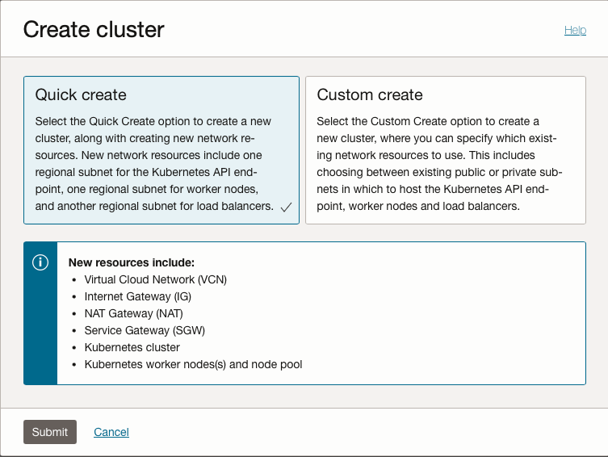
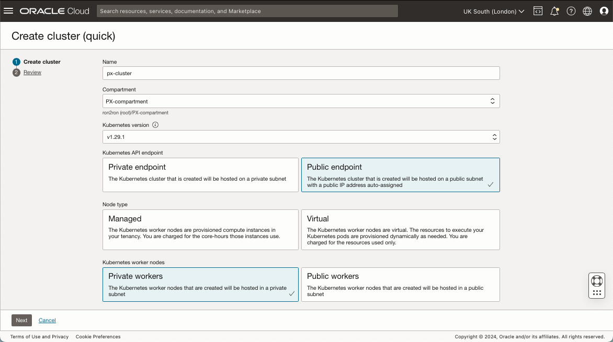
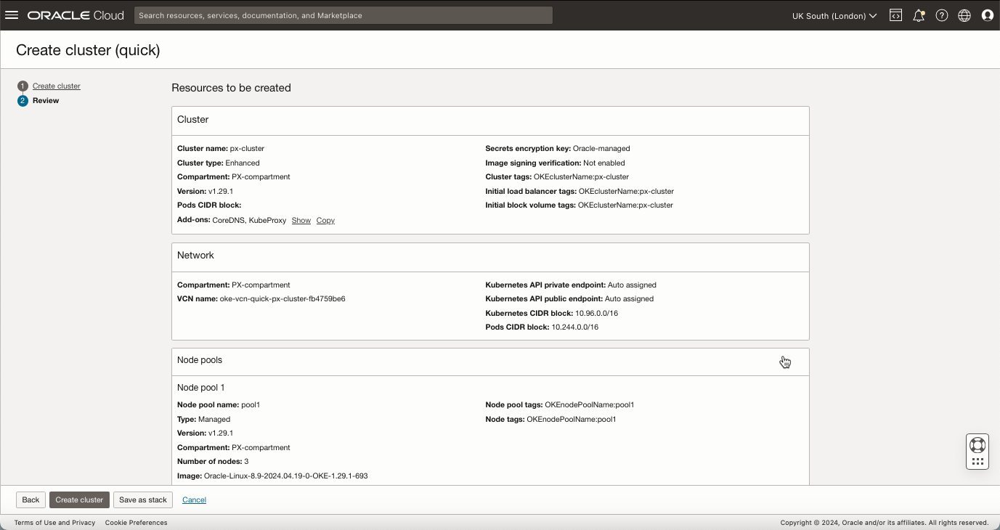
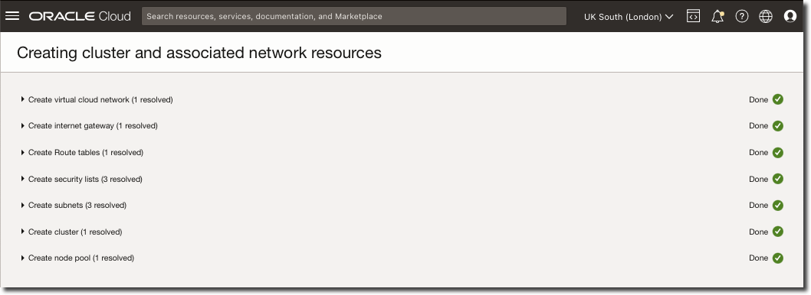
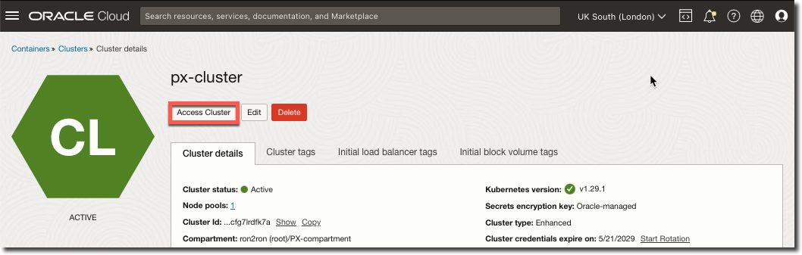
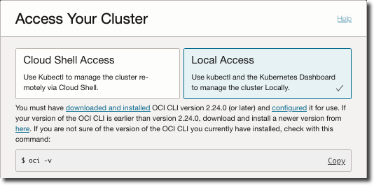

# Provision Oracle Container Engine for Kubernetes (OKE) Cluster

## Introduction

In this lab will create a new Oracle Container Engine for Kubernetes (OKE) cluster, and enable the Oracle Database Operator for Kubernetes (OraOperator)

Estimated Time: 10 minutes

**Oracle Container Engine for Kubernetes (OKE)** is a managed container orchestration service to deploy and manage containerized applications. It is based on the open source Kubernetes system and is available on the Oracle public cloud. The Kubernetes master nodes are managed by Oracle and the agent nodes are managed by the users. An OKE cluster can be created via the Oracle console, OCI CLI, or using the OCI Terraform provide.

The **Oracle Database Operator for Kubernetes (OraOperator)** extends the Kubernetes API with custom resources and controllers for automating Oracle Database lifecycle management.

### Objectives

In this lab, you will:

* Use the Oracle Cloud WebUI to provision an new OKE cluster
* Setup Local Access
* Increase OKE Boot Volumes

### Prerequisites (Optional)

This lab assumes you have:

* An Oracle Cloud account
* Basic Kubernetes knowledge
* OCI CLI configured
* kubectl installed

## Task 1: Create OKE cluster

Create Oracle Container Engine for Kubernetes (OKE) Cluster.

1. Navigate to Kubernetes cluster (OKE)

   Logon to Oracle Cloud Infrastructure (OCI) account using the hamburger menu navigate to Developer Services and click **Kubernetes Clusters (OKE)**

   

   > **Note:** Use OCI Pins to bookmark frequently used services.

2. Select **Compartment**

   Select required Compartment and click **Create cluster**
   

3. Create **cluster**

   For this lab, select the **Quick create** option to create a new cluster, along with creating new network resources.

   New network resources include one regional subnet for the Kubernetes API endpoint, one regional subnet for worker nodes, and another regional subnet for load balancers, click **Submit**.

   

   Update cluster **Name**, **Compartment**, **Kubernetes version**, **Node type** and **Kubernetes worker type**, for example Kubernetes version **1.29.1**, Node type **Managed** and **Private workers**

   

   Within the **Shape and image** section and update number of **OCPUs**, and amount of **memory** as required, for example **16** OCPUs and **64GB** of memory.

   

   Expand the **Show advanced options** section and increase **Boot volume size** to **128GB**.

   

   Review settings and if OK click **Create cluster**

   

   The OKE wizard will launch the creation of the OKE cluster, click **Close** once all tasks are reported as **Done**.

   

   > ***Note:*** If required, before clicking **Create cluster** review [Portworx prerequisites](https://docs.portworx.com/portworx-enterprise/install-portworx/prerequisites) for latest installation requirements and supported OKE versions.

## Task 2: Setup local access

1. Access Cluster

   Wait till Cluster status changes to ACTIVE, then click **Access Cluster**

   

2. Local Access

   Select **Local Access** and use follow detailed instructions provided.

   

   Confirm OCI CLI version is higher than minimal requirement.

    ```bash
    <copy>oci -v</copy>
    ```

   Example output:

    ```text
    <copy>% oci -v</copy>
    3.37.1
    ```

   Apply OKE provided **oci ce cluster create-kubeconfig** command to desktop and test local access using **kubectl get nodes**.

   Use the Kubernetes **topology.kubernetes.io** labels to see OCI Region, Availability Domain and Fault Domain.

    ```bash
    <copy>
    kubectl get nodes -L topology.kubernetes.io/region,topology.kubernetes.io/zone,oci.oraclecloud.com/fault-domain
    </copy>
    ```

   Example output:

    ```text
    % <copy>kubectl get nodes -L topology.kubernetes.io/region,topology.kubernetes.io/zone,oci.oraclecloud.com/fault-domain</copy>
    NAME         STATUS   ROLES   AGE    VERSION   REGION        ZONE               FAULT-DOMAIN
    10.0.10.57   Ready    node    101s   v1.29.1   uk-london-1   UK-LONDON-1-AD-1   FAULT-DOMAIN-2
    10.0.10.64   Ready    node    119s   v1.29.1   uk-london-1   UK-LONDON-1-AD-3   FAULT-DOMAIN-3
    10.0.10.77   Ready    node    2m4s   v1.29.1   uk-london-1   UK-LONDON-1-AD-2   FAULT-DOMAIN-1
    ```

## Task 3: Increase OKE boot volumes

1. Check current **rootfs** size.

   OKE worker nodes in a OKE node pool use their boot volume for pod storage. The default size for the boot volume is *46.6GB*.
   On an Oracle Linux 8 based node, the root filesystem has a capacity *~38GB*.

   This is adequate for many applications, however for applications that require larger container images this can be an issue.

   Check current **rootfs** size using the below and a local node IP address.

    ```bash
    <copy>kubectl get --raw "/api/v1/nodes/<node name IP Address>/proxy/stats/summary"</copy>
    ```

   In the **rootfs** section you can get the capacity and available byes. This is returned for each pod on the node, it will normally be identical across all pods in the pool.

   Example output:

    ```text
    <copy>kubectl get --raw "/api/v1/nodes/<node name IP Address>/proxy/stats/summary"</copy>
    "rootfs": {
    "time": "2024-05-30T10:58:52Z",
    "availableBytes": 19952750592,
    "capacityBytes": 38069878784,
    "usedBytes": 0,
    "inodesFree": 18339210,
    "inodes": 18597888,
    "inodesUsed": 21
    ```

2. Update OKE Pool Configuration

   Navigate to **Kubernetes Containers (OKE)**, select **Cluster**, **Node pools** and select **Node pool**

   

   Click **Edit**

   

   Scroll down and  click **Show advanced options**

   Click **Download Custom Cloud Init Script Template** from the **Initialization script** panel.

   Paste the downloaded template and append **sudo /usr/libexec/oci-growfs -y**

    ```bash
    <copy>
    #!/bin/bash
    curl --fail -H "Authorization: Bearer Oracle" -L0 http://169.254.169.254/opc/v2/instance/metadata/oke_init_script | base64 --decode >/var/run/oke-init.sh
    bash /var/run/oke-init.sh
    sudo /usr/libexec/oci-growfs -y
    </copy>
    ```

   For example:

   

   Click **Save changes**

   Note **Node pool status** will change to *updating*, wait till **Node pool status** returns to *Active*.

3. Cycle Worker nodes

   Click **Cycle nodes**.

   

   OKE will manage the creation and deletion of worker nodes, with new nodes running the updated **Cloud-Init** script.

   Note **Node pool status** will again change to *updating*, wait till **Node pool status** returns to *Active*.

4. Repeat **rootfs** size check

   Obtain new worker node IP addresses and check **rootfs** size.

    ```bash
    <copy>kubectl get --raw "/api/v1/nodes/<node name IP Address>/proxy/stats/summary"</copy>
    ```

   Example output:

    ```text
    <copy>kubectl get --raw "/api/v1/nodes/<node name IP Address>/proxy/stats/summary"</copy>
    "rootfs": {
    "time": "2024-05-30T12:03:16Z",
    "availableBytes": 107350925312,
    "capacityBytes": 125500145664,
    "usedBytes": 0,
    "inodesFree": 61017593,
    "inodes": 61288448,
    "inodesUsed": 19
    ```

   We can see we have successfull increased the root file system capacity from *~38GB* to *~125GB* providing enough space for event the largest container images.

## Learn More

* [Container Engine for Kubernetes](https://docs.oracle.com/en-us/iaas/Content/ContEng/home.htm)
* [Oracle Database Operator for Kubernetes (OraOperator)](https://github.com/oracle/oracle-database-operator)
* [Oracle Database 23ai Free](https://www.oracle.com/database/free/)
* [Kubernetes Documentation](https://kubernetes.io/docs/home/)
* [Portworx Documentation](https://docs.portworx.com/portworx-enterprise/)
* [ronekins.com](https://ronekins.com/)

## Acknowledgements

* **Author** - [Ron Ekins](https://ace.oracle.com/apex/ace/profile/ronekins), Oracle ACE Director, Director of Field Solution Architecture for EMEA & LATAM @ Pure Storage
* **Last Updated By/Date** - Ron Ekins, May 2024
