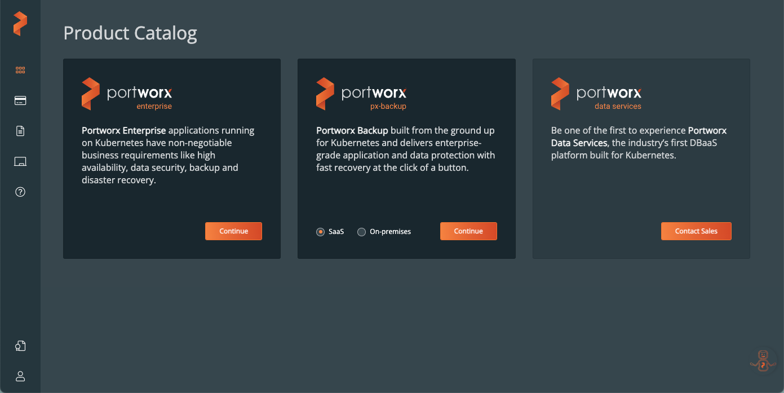
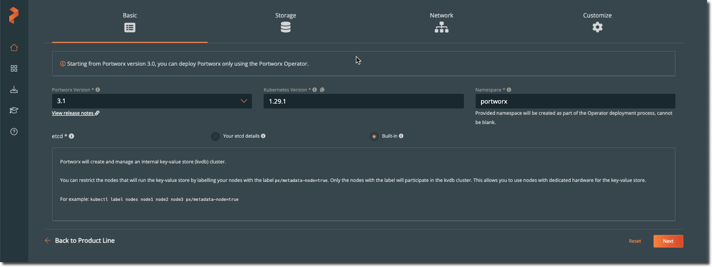
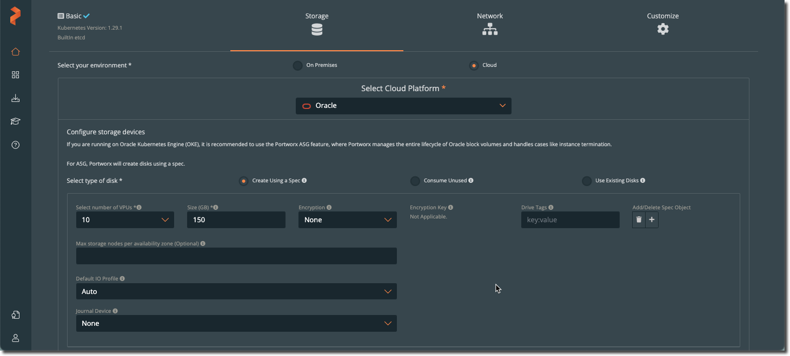
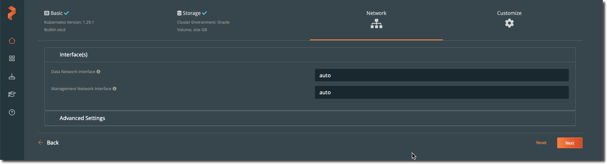
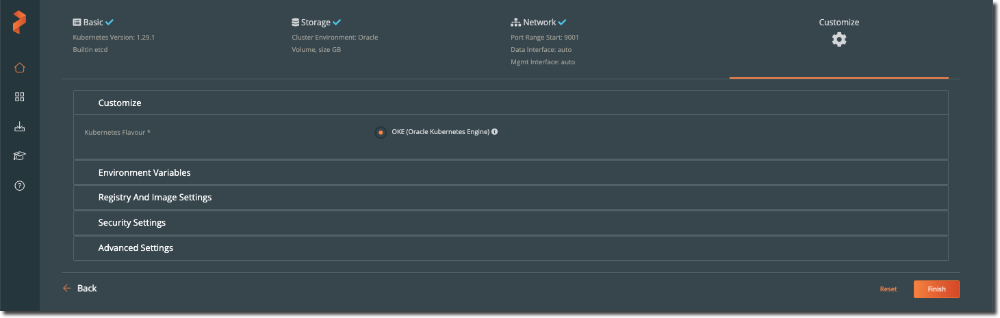
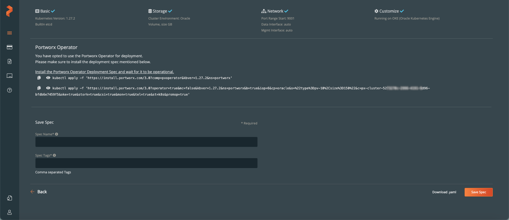

# Install Portworx on Oracle Container Engine for Kubernetes (OKE)

## Introduction

In this optional lab will learn how to deploy Portworx Enterprise for OKE into an existing OKE cluster.

If you are not planning on using Portworx, you can progress to next lab.

Estimated Time: 10 minutes

**Portworx** is a software defined storage overlay that allows you to:

* Run containerized stateful applications that are highly-available (HA) across multiple nodes, cloud instances, regions, data centers or even clouds
* Migrate workflows between multiple clusters running across same or hybrid clouds
* Run hyperconverged workloads where the data resides on the same host as the applications
* Have programmatic control on your storage resources

### Objectives

In this lab, you will:

* Configure Cluster for Portworx
* Deploy Portworx Operator
* Deploy Portworx Storage Cluster
* Review Portworx install
* Create New Portworx Kubernetes StorageClass

### Prerequisites

This lab assumes you have:

* An OKE cluster that meets the Portworx prerequisites
* A Portworx Central Account
* A working knowledge of Kubernetes
* OCI CLI configured
* kubectl installed

## Task 1: Configure cluster for Portworx

Before we deploy Portworx Enterprise, we need to create a namespace for the portworx operator.

1. Create Kubernetes namespace

   Use **kubectl create namespace** to create Kubernetes namespace for Portworx

    ```bash
    <copy>kubectl create namespace portworx</copy>
    ```

    Example output:

    ```text
    % <copy>kubectl create namespace portworx</copy>
    namespace/portworx created
    ```

2. Create Secret

   To install the Portworx Operator we need to create a Kubernetes secret to allow Portworx to manage OCI block storage using our Oracle API signing key and fingerprint details, for example.

    ```bash
    <copy>
    kubectl create secret generic ociapikey \
    --namespace portworx \
    --from-file=oci_api_key.pem=oci_api_key.pem \
    --from-literal=PX_ORACLE_user_ocid="<ocid>" \
    --from-literal=PX_ORACLE_fingerprint="<fingerprint>"
    </copy>
    ```

    Replace *`<ocid>`* with Oracle user OCID and *`<fingerprint>`* with fingerprint for your Oracle API signing key

3. Get Secret

    ```bash
    <copy>kubectl get secret/ociapikey -n portworx</copy>
    ```

    Example output:

    ```text
    <copy>
    NAME        TYPE     DATA   AGE
    ociapikey   Opaque   3      10s
    </copy>
    ```

## Task 2: Generate specification

To install Portworx with Kubernetes, you must first generate Kubernetes manifests that you will deploy in your cluster. Once the spec is generated you must also install the Portworx Operator.

1. Navigate to [Portworx Central](https://central.portworx.com/) and sign-in using Portworx account details.
  

2. Select **Portworx Enterprise**.
  

3. Select required version of Portworx, for this lab we use **Portworx Enterprise**, select and click continue.
  

4. For **Platform**, select **Oracle**, then click **Customize** at the bottom of the **Summary** section.
  

5. Update OKE cluster's **Kubernetes version**, then click **Next**.
  

6. In the **Storage** section, update **Select number of VPUs** (Volume Performance Units) for required OCI Oracle block volumes as per performance, defaulted to 10 (Balanced), and **Size(GBs) default (150GBs)
For Volume Performance Units (VPUs) options see: [OCI Block Volume Performance](https://docs.oracle.com/en-us/iaas/Content/Block/Concepts/blockvolumeperformance.htm)
   

7. In the **Networking** section, accept defaults and click **Next**.
   

8. In the **Customize** section, click **Finish** to generate the specs.
  

9. Within the Portworx Operator section, we can see 2 kubectl apply commands which we will use to deploy the Portworx Operator and Storage Cluster.
  

## Task 3: Deploy Portworx

Deploy Portworx using the commands provided from Portworx Central UI

1. Deploy Portworx Operator

   To deploy the Operator, run the generated **kubectl apply** command.

     ```bash
     <copy>kubectl apply -f 'https://install.portworx.com/3.1?comp=pxoperator&kbver=1.29.1&ns=portworx'</copy>
     ```

2. Deploy Storage Cluster

   To deploy the StorageCluster, run the command that Portworx Central provided **kubectl apply** command, which looks similar to the following:

     ```text
     <copy>
     kubectl apply -f 'https://install.portworx.com/3.1?operator=true&mc=false&kbver=1.29.1&ns=portworx&b=true&iop=6&cp=oracle&s=%22type%3Dpv-10%2Csize%3D150%22&ce=oracle&c=px-cluster-28f9ba86-8066-4c86-aafc-0cd7c7fa83a5&oke=true&stork=true&csi=true&mon=true&tel=true&st=k8s&promop=true'
     </copy>
     ```

## Task 4: Review Portworx deployment

Once you've installed Portworx, you can perform the following tasks to verify that Portworx has installed correctly.

1. Monitor Portworx nodes

   Enter the following **kubectl get** command and wait until all Portworx nodes show as *Online* in the output:

    ```bash
    <copy>kubectl -n portworx get storagenodes -l name=portworx</copy>
    ```

   Example output:

    ```text
    % <copy>kubectl -n portworx get storagenodes -l name=portworx</copy>
    NAME          ID                                     STATUS   VERSION           AGE
    10.0.10.107   fd569097-11fa-4984-8816-f3ff894d3db8   Online   3.1.1.1-9341d08   8m59s
    10.0.10.109   ade50a83-c380-4091-a8ef-cc3f2a79794e   Online   3.1.1.1-9341d08   8m59s
    10.0.10.41    468a2f7d-ac7d-4de8-b371-4185ac7dbe9a   Online   3.1.1.1-9341d08   8m59s
    ```

2. Verify Portworx pods are running.

   Enter the following **kubectl get pods** command to list and filter the results for Portworx pods:

      ```bash
      <copy>kubectl get pods -n portworx -l name=portworx</copy>
      ```

    Example output:

     ```text
     % <copy>kubectl get pods -n portworx -l name=portworx</copy>
     NAME                                                    READY   STATUS    RESTARTS   AGE
     px-cluster-28f9ba86-8066-4c86-aafc-0cd7c7fa83a5-25zh5   1/1     Running   0          11m
     px-cluster-28f9ba86-8066-4c86-aafc-0cd7c7fa83a5-2lpsz   1/1     Running   0          11m
     px-cluster-28f9ba86-8066-4c86-aafc-0cd7c7fa83a5-txbh7   1/1     Running   0          11m
     ```

3. Set up Portworx Control (**pxctl**)

   Export environmental variable

     ```bash
     <copy>export PX_POD=$(kubectl get pods -l name=portworx -n portworx -o jsonpath='{.items[0].metadata.name}')</copy>
    ```

    And alias

     ```bash
     <copy>alias pxctl='kubectl exec $PX_POD -n portworx -- /opt/pwx/bin/pxctl'</copy>
     ```

4. Portworx version

   Confirm version of Portworx using **pxctl --version**

     ```bash
     <copy>pxctl --version</copy>
     ```

    Example output:

     ```text
     % <copy>pxctl --version</copy>
     pxctl version 3.1.1.1-9341d08
     ```

5. Deployment Status

   Confirm Portworx deployment using **pxctl status**

     ```bash
     <copy>pxctl status</copy>
     ```

6. Storage pools

   Use the **pxctl cluster provision-status** command to view OCI *Region* and *Availability Domain* of storage pools within the Portworx cluster.

     ```bash
     <copy>pxctl cluster provision-status</copy>
     ```

7. Cloud Drives

   The **pxctl clouddrive** command is useful for getting more insight into the OCI block volumes provisioned by Portworx, including the *OCID* for each block volume.

     ```bash
     <copy>pxctl clouddrive list</copy>
     ```

8. OCI Block Volumes

   Use **oci bv volume list** command with **–lifecyle-state** “Available” to list OCI block volumes in a JSON format, use grep to limit output to the display-name, for example.

     ```bash
     <copy>oci bv volume list --compartment-id <compartment id> --lifecycle-state "Available" | grep display-name</copy>
     ```

   Replace the *`<compartment id>`* with OCI compartment id

## Task 5: Create Portworx Kubernetes storage class

   1. Create new Kubernetes Storage Class

      Copy the below and paste into an editor, save as **px-csi-ora.yaml**

      ```bash
      <copy>
      apiVersion: storage.k8s.io/v1
      kind: StorageClass
      metadata:
        name: px-csi-ora
      provisioner: pxd.portworx.com
      parameters:
        repl: "3"
        io_profile: "auto"
        priority_io: "high"
      allowVolumeExpansion: true
      </copy>
      ```

      Use **kubectl apply -f < filename>** to create **px-csi-ora** Kubernetes StorageClass.

      ```bash
      <copy>kubectl apply -f px-csi-ora.yaml</copy>
      ```

      Use **kubectl describe sc** to inspect the **px-csi-ora** Kubernetes StorageClass.

      ```bash
      <copy>kubectl describe sc/px-csi-ora</copy>
      ```

      Example output:

      ```text
      <copy>kubectl describe sc/px-csi-ora</copy>
      Name:            px-csi-ora
      IsDefaultClass:  No
      Annotations:     kubectl.kubernetes.io/last-applied-configuration={"allowVolumeExpansion":true,"apiVersion":"storage.k8s.io/v1","kind":"StorageClass","metadata":{"annotations":{},"name":"px-csi-ora"},"parameters":{"io_profile":"auto","priority_io":"high","repl":"3"},"provisioner":"pxd.portworx.com"}

      Provisioner:           pxd.portworx.com
      Parameters:            io_profile=auto,priority_io=high,repl=3
      AllowVolumeExpansion:  True
      MountOptions:          <none>
      ReclaimPolicy:         Delete
      VolumeBindingMode:     Immediate
      Events:                <none>
      ```

## Learn More

* [Container Engine for Kubernetes](https://docs.oracle.com/en-us/iaas/Content/ContEng/home.htm)
* [Oracle Database Operator for Kubernetes (OraOperator)](https://github.com/oracle/oracle-database-operator)
* [Oracle Database 23ai FREE](https://www.oracle.com/database/free/)
* [Kubernetes Documentation](https://kubernetes.io/docs/home/)
* [Portworx Documentation](https://docs.portworx.com/portworx-enterprise/)
* [ronekins.com](https://ronekins.com/)

## Acknowledgements

* **Author** - [Ron Ekins](https://ace.oracle.com/apex/ace/profile/ronekins), Oracle ACE Director, Director of Field Solutions Architecture for EMEA & LATAM @ Pure Storage
* **Last Updated By/Date** - Ron Ekins, May 2024
