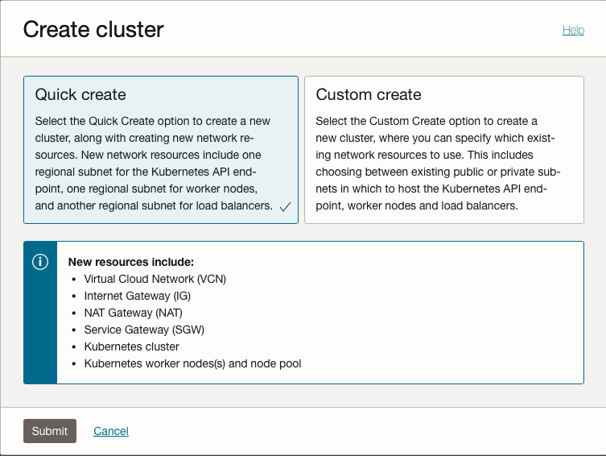
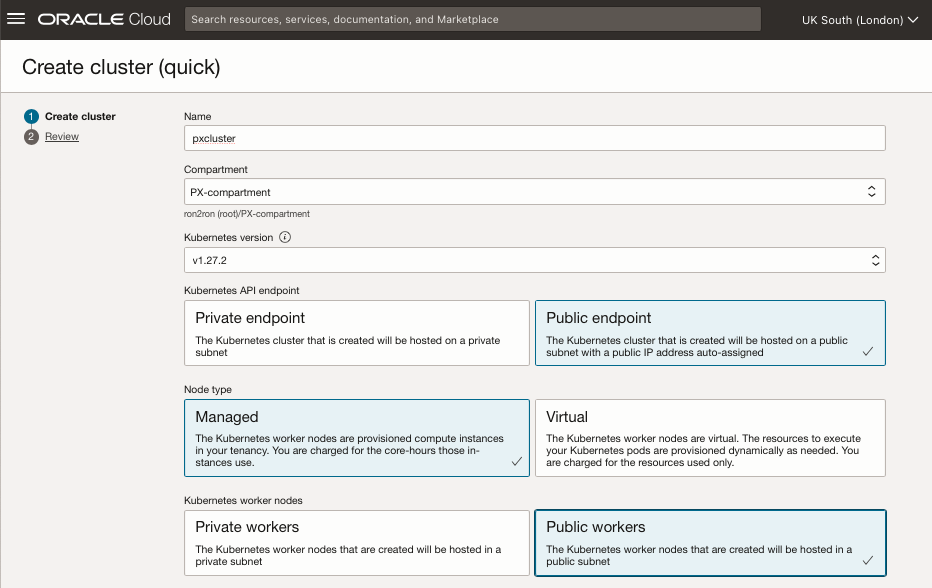
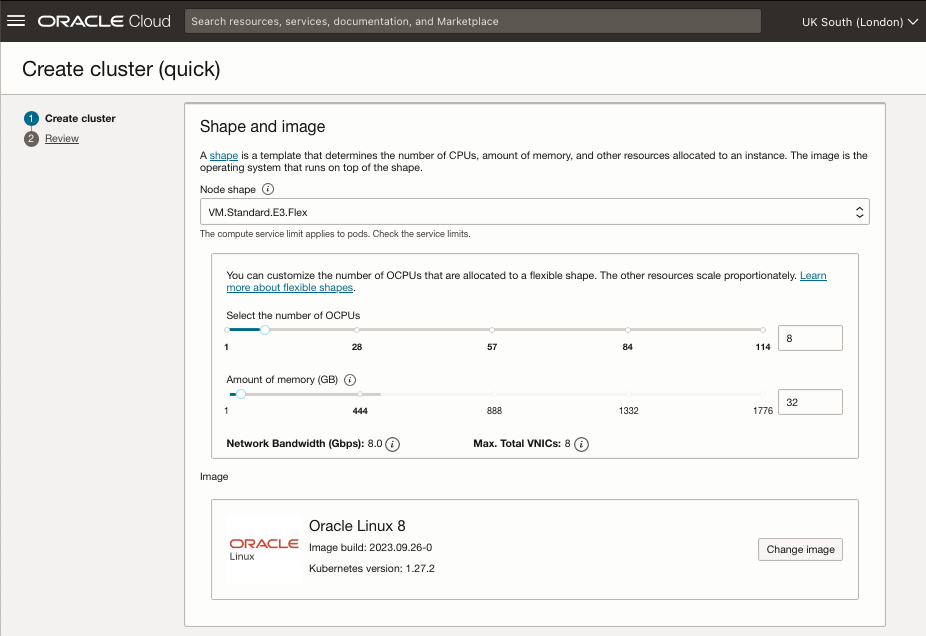
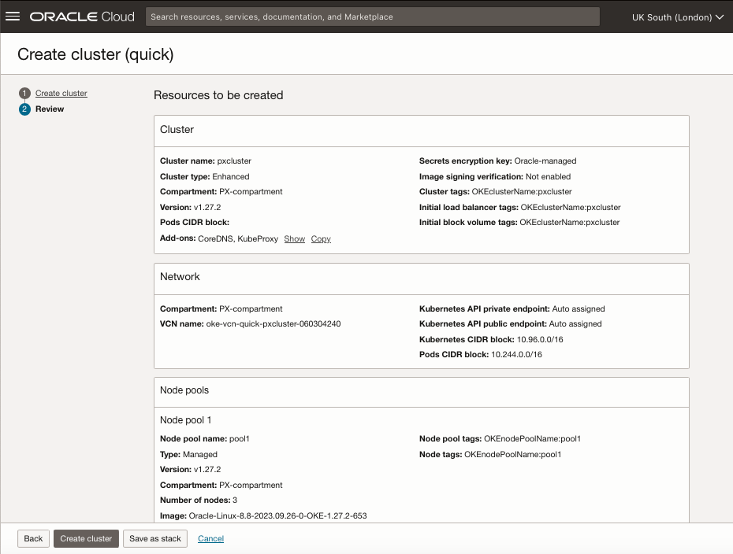
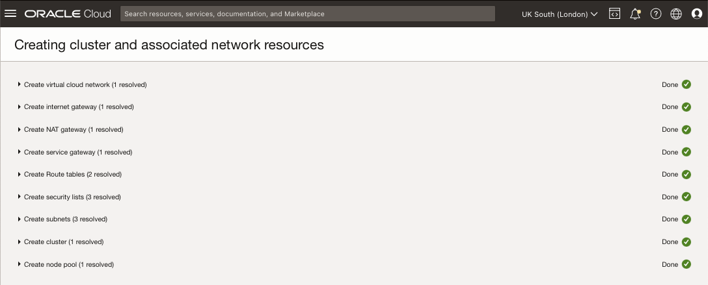
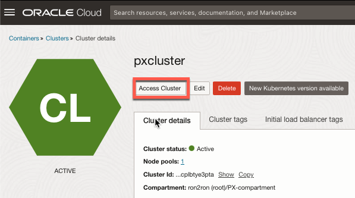
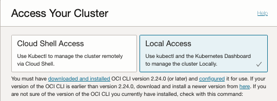

# Provision Oracle Container Engine for Kubernetes (OKE) Cluster

## Introduction

In this lab will create a new Oracle Container Engine for Kubernetes (OKE) cluster

Estimated Time: 10 minutes

### Oracle Container Engine for Kubernetes (OKE)

OKE is a managed container orchestration service to deploy and manage containerized applications. It is based on the open source Kubernetes system and is available on the Oracle public cloud. The Kubernetes master nodes are managed by Oracle and the agent nodes are managed by the users. An OKE cluster can be created via the Oracle console, OCI CLI, or using the OCI Terraform provide.

### Objectives

In this lab, you will:

* Use the Oracle Cloud WebUI to provision an new OKE cluster
* Use kubectl to confirm installation details

### Prerequisites (Optional)

This lab assumes you have:

* An Oracle Cloud account
* Basic Kubernetes knowledge
* OCI CLI configured
* kubectl installed

## Task 1: Create OKE Cluster

Create Oracle Container Engine for Kubernetes (OKE) Cluster.

1. Navigate to Kubernetes Clusters (OKE)

   Logon to Oracle Cloud Infrastructure (OCI) account using the hamburger menu navigate to Developer Services and click **Kubernetes Clusters (OKE)**

   

   > **Note:** Use OCI Pins to bookmark frequently used services.

2. Select **Compartment**

   Select required Compartment and click **Create cluster**
   

3. Create **cluster**

   For this lab, select the **Quick create** option to create a new cluster, along with creating new network resources.

   New network resources include one regional subnet for the Kubernetes API endpoint, one regional subnet for worker nodes, and another regional subnet for load balancers, click **Submit**.

   

   Update cluster **Name**, **Compartment**, **Kubernetes version**, **Node type** and **Kubernetes worker type**, for example Kubernetes version **1.27.2**, Node type **Managed** and **Public workers**

   

   Within the **Shape and image** section and update number of **OCPUs**, and amount of **memory** as required, for example **8** OCPUs and **32GB** of memory.

   

   Review settings and if OK click **Create cluster**

   

   The OKE wizard will launch the creation of the OKE cluster, click **Close** once all tasks are reported as **Done**.

   

   > ***Note:*** Before clicking **Create cluster** review [Portworx prerequisites](https://docs.portworx.com/portworx-enterprise/install-portworx/prerequisites) for latest installation requirements and supported OKE versions.

## Task 2: Setup Local Access

1. Access Cluster

   Wait till Cluster status changes to ACTIVE, then click **Access Cluster**

   

2. Local Access

   Select **Local Access** and use follow detailed instructions provided.

   

   Confirm OCI CLI version is higher than minimal requirement.

    ```bash
    <copy>oci -v</copy>
    ```

   Example output:

    ```bash
    % oci -v
    3.33.3
    ```

   Apply OKE provided **oci ce cluster create-kubeconfig** command to desktop and test local access using **kubectl get nodes**.

   Use the Kubernetes **topology.kubernetes.io** labels to see OCI Region, Availability Domain and Fault Domain.

    ```bash
    <copy>kubectl get nodes -L topology.kubernetes.io/region,topology.kubernetes.io/zone,oci.oraclecloud.com/fault-domain</copy>
    ```

   Example Output:

    ```bash
    % kubectl get nodes -L topology.kubernetes.io/region,topology.kubernetes.io/zone,oci.oraclecloud.com/fault-domain
    NAME          STATUS   ROLES   AGE   VERSION   REGION        ZONE               FAULT-DOMAIN
    10.0.10.114   Ready    node    15m   v1.27.2   uk-london-1   UK-LONDON-1-AD-1   FAULT-DOMAIN-1
    10.0.10.67    Ready    node    14m   v1.27.2   uk-london-1   UK-LONDON-1-AD-2   FAULT-DOMAIN-3
    10.0.10.85    Ready    node    15m   v1.27.2   uk-london-1   UK-LONDON-1-AD-3   FAULT-DOMAIN-2
    ```

## Task 3: Create Portworx Namespace

Before we deploy Portworx Enterprise, we need to create a namespace for the portworx operator.

1. Create Kubernetes namespace using **kubectl create namespace**:

    ```bash
    <copy>kubectl create namespace portworx</copy>
    ```

    Example Output

    ```bash
    % kubectl create namespace portworx
    namespace/portworx created
    ```

## Task 4: Create OCI Secret for Portworx

To install the Portworx Operator we need to create a Kubernetes secret to allow Portworx to manage OCI block storage using our Oracle API signing key and fingerprint details, for example.

1. Create Secret

    ```bash
    <copy>kubectl create secret generic ociapikey \
    --namespace portworx \
    --from-file=oci_api_key.pem=oci_api_key.pem \
    --from-literal=PX_ORACLE_user_ocid="<ocid>" \
    --from-literal=PX_ORACLE_fingerprint="<fingerprint>"</copy>
    ```

    Replace *`<ocid>`* with Oracle user OCID and *`<fingerprint>`* with fingerprint for your Oracle API signing key

2. Get Secret

    ```bash
    <copy>kubectl get secret/ociapikey -n portworx</copy>
    ```

    Example Output

    ```bash
    NAME        TYPE     DATA   AGE
    ociapikey   Opaque   3      1d
    ```

## Task 5: Inspect Kubernetes Storage Classes

OCI provides two Kubernetes storage classes *oci*, and *oci-bv*, the oci block volume (*oci-bv*) is now the **default** and is used by the CSI volume plugin.

The *oci* class is considered *legacy* and is only used by the **FlexVolume** plugin.

1. Get Storage Class (sc)

    ```bash
    <copy>kubectl get sc </copy>
    ```

    Example Output

    ```bash
    NAME                                 PROVISIONER                       RECLAIMPOLICY   VOLUMEBINDINGMODE      ALLOWVOLUMEEXPANSION   AGE
    oci                                  oracle.com/oci                    Delete          Immediate              false                  9d
    oci-bv (default)                     blockvolume.csi.oraclecloud.com   Delete          WaitForFirstConsumer   true                   9d
    ```

## Learn More

* [Container Engine for Kubernetes](https://docs.oracle.com/en-us/iaas/Content/ContEng/home.htm)
* [Kubernetes Documentation](https://kubernetes.io/docs/home/)
* [Portworx Documentation](https://docs.portworx.com/portworx-enterprise/)
* [ronekins.com](https://ronekins.com/)

## Acknowledgements

* **Author** - [Ron Ekins](https://ace.oracle.com/apex/ace/profile/ronekins), Oracle ACE Director, Database Practice Lead for EMEA & LATAM @ Pure Storage
* **Last Updated By/Date** - Ron Ekins, January 2024
