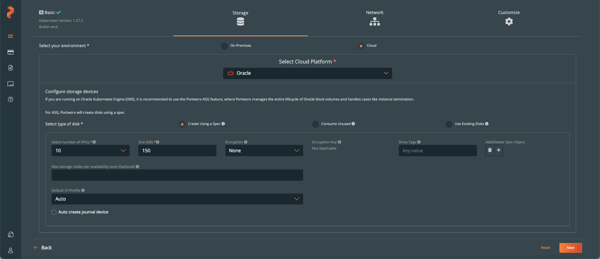
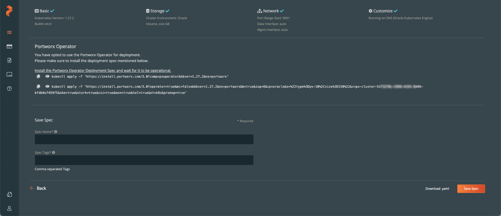

# Install Portworx on Oracle Container Engine for Kubernetes

## Introduction

In this lab will use Portworx Central to create Kubernetes manifests that will be used to deploy

Estimated Time: 10 minutes

### Prerequisites

* An OKE cluster that meets the Portworx prerequisites.
* An Oracle API signing key and fingerprint.
    Download and store the key with the name oci\_api\_key.pem, and record the fingerprint of the key for use during this procedure.
* Your Oracle user OCID. Record the OCID for use during this procedure.

This lab assumes you have:

* An Oracle Cloud account
* A Portworx Central Account
* A working knowledge of Kubernetes

## Task 1: Generate Specification

To install Portworx with Kubernetes, you must first generate Kubernetes manifests that you will deploy in your cluster. Once the spec is generated you must also install the Portworx Operator.

1. Navigate to [Portworx Central](https://central.portworx.com/) and sign-in using Portworx account details.
    

2. Select **Portworx Enterprise**.
    

3. Select required version of Portworx, for this lab we use **Portworx Enterprise**, select and click continue.
    

4. For **Platform**, select **Oracle**, then click **Customize** at the bottom of the **Summary** section.
    

5. Ensure that **Use the Portworx Operator** is selected, then select Portworx version 2.13 or newer. Update your cluster's **Kubernetes version**, then click **Next**.
    

6. In the **Storage** section, Portworx recommends that you select **Create using a Spec**, specify your own values for **Select number of VPUs** for required OCI Oracle block volumes as per performance.
For details see: [OCI Block Volume Performance](https://docs.oracle.com/en-us/iaas/Content/Block/Concepts/blockvolumeperformance.htm)
    

7. In the **Networking** section, click **Next**.
     

8. In the **Customize** section, select **(OKE) Oracle Kubernetes Engine** and click **Finish** to generate the specs.
    

9. Within the Portworx Operator section, we can see 2 kubectl apply commands which we will use to deploy the Portworx Operator and Storage Cluster.
    

## Task 2: Deploy the Operator

To deploy the Operator, run the command that Portworx Central provided, which looks similar to the following:

```bash
kubectl apply -f 'https://install.portworx.com/<portworx_version>?comp=pxoperator&kbver=<k8s-version>&ns=portworx'
```

## Task 3: Deploy the Storage Cluster

To deploy the StorageCluster, run the command that Portworx Central provided, which looks similar to the following:

```bash
kubectl apply -f “https://install.portworx.com/<portworx_version>?operator=true&mc=false&kbver=<k8s-version>&ns=portworx&b=true&kd=type%3Dpv-10%2Csize%3D150&mz=2&cp=oracle&s=%22type%3Dpv-10%2Csize%3D150%22%2C%22type%3Dpv-20%2Csize%3D150%22&j=auto&c=px-cluster-703d279b-ed06-4c39-9ff5-1f911204536e&oke=true&stork=true&csi=true&mon=true&tel=false&st=k8s&promop=true”
```

## Task 4: Verify your Portworx installation

Once you've installed Portworx, you can perform the following tasks to verify that Portworx has installed correctly.

1. Verify OCI OKE Storage Classes.

    Previously **kubectl get sc** only returned two storage classes, we should now see additional Kubernetes storage classes generated by Portworx.

    ```bash
    <copy>kubectl get sc</copy>
    ```

    Example Output

    ```bash
    NAME                                 PROVISIONER                       RECLAIMPOLICY   VOLUMEBINDINGMODE      ALLOWVOLUMEEXPANSION   AGE
    oci                                  oracle.com/oci                    Delete          Immediate              false                  9d
    oci-bv (default)                     blockvolume.csi.oraclecloud.com   Delete          WaitForFirstConsumer   true                   9d
    px-csi-db                            pxd.portworx.com                  Delete          Immediate              true                   9d
    px-csi-db-cloud-snapshot             pxd.portworx.com                  Delete          Immediate              true                   9d
    px-csi-db-cloud-snapshot-encrypted   pxd.portworx.com                  Delete          Immediate              true                   9d
    px-csi-db-encrypted                  pxd.portworx.com                  Delete          Immediate              true                   9d
    px-csi-db-local-snapshot             pxd.portworx.com                  Delete          Immediate              true                   9d
    px-csi-db-local-snapshot-encrypted   pxd.portworx.com                  Delete          Immediate              true                   9d
    px-csi-replicated                    pxd.portworx.com                  Delete          Immediate              true                   9d
    px-csi-replicated-encrypted          pxd.portworx.com                  Delete          Immediate              true                   9d
    px-db                                kubernetes.io/portworx-volume     Delete          Immediate              true                   9d
    px-db-cloud-snapshot                 kubernetes.io/portworx-volume     Delete          Immediate              true                   9d
    px-db-cloud-snapshot-encrypted       kubernetes.io/portworx-volume     Delete          Immediate              true                   9d
    px-db-encrypted                      kubernetes.io/portworx-volume     Delete          Immediate              true                   9d
    px-db-local-snapshot                 kubernetes.io/portworx-volume     Delete          Immediate              true                   9d
    px-db-local-snapshot-encrypted       kubernetes.io/portworx-volume     Delete          Immediate              true                   9d
    px-replicated                        kubernetes.io/portworx-volume     Delete          Immediate              true                   9d
    px-replicated-encrypted              kubernetes.io/portworx-volume     Delete          Immediate              true                   9d
    stork-snapshot-sc                    stork-snapshot                    Delete          Immediate              true                   9d
    ```

2. Verify Portworx pods are running.

    Enter the following kubectl get pods command to list and filter the results for Portworx pods:

    ```bash
    <copy>kubectl get pods -n portworx -l name=portworx</copy>
    ```

    Example output

    ```bash
    NAME                                                    READY   STATUS    RESTARTS   AGE
px-cluster-d82572aa-852f-4ca8-b097-28aeb5975b2b-5jkdj   2/2     Running   0          9m47s
px-cluster-d82572aa-852f-4ca8-b097-28aeb5975b2b-rmg97   2/2     Running   0          9m47s
px-cluster-d82572aa-852f-4ca8-b097-28aeb5975b2b-sf28n   2/2     Running   0          9m47s
    ```

3. Verify Portworx cluster status

    Set up   environmental variable
    ```bash
    <copy>PX_POD=$(kubectl get pods -l name=portworx -n portworx -o jsonpath='{.items[0].metadata.name}')</copy>
    ```
   
   Confirm Portworx version
   ```bash
   <copy>kubectl exec $PX_POD -n portworx -- /opt/pwx/bin/pxctl --version</copy>
   ```
   example output:
   ```bash
   Defaulted container "portworx" out of: portworx, csi-node-driver-registrar
pxctl version 2.13.10-ebd8383
   ```
    You can find the status of the Portworx cluster by running **pxctl** status commands from a pod. Enter the following kubectl exec command, specifying the pod name you retrieved in the previous section:
