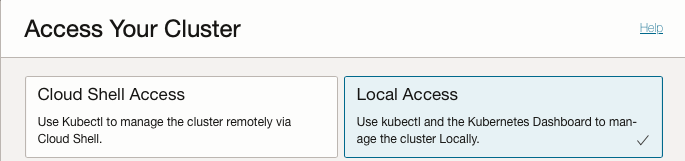

# Setup OKE Cluster for Portworx Enterprise

## Introduction

Setup OKE Cluster for Portworx Enterprise Cloud Native Storage deployment

**Estimated Lab Time**: 10 minutes

### Objectives

This module takes you through the process of setting up your environment for the Portworx Enterprise

### Prerequisites (Optional)

This lab assumes you have a running OKE Cluster

## Task 1: Confirm cluster access

Access to the cluster is managed via a config file that by default is located in the `$HOME/.kube` folder, and is called `config` .

If you used the OKE **Access Cluster**, **Access Your Cluster**, **Local Access** this will have been configured for you.

  

1. Verify cluster access, *OCI Region*, *Availability Domains* and *Fault Domains* using:

    ```bash
    <copy>kubectl get nodes -L topology.kubernetes.io/region,topology.kubernetes.io/zone,oci.oraclecloud.com/fault-domain</copy>
    ```

    Example Output

    ```bash
    NAME          STATUS   ROLES   AGE   VERSION   REGION        ZONE               FAULT-DOMAIN
    10.0.10.148   Ready    node    33m   v1.25.4   uk-london-1   UK-LONDON-1-AD-1   FAULT-DOMAIN-3
    10.0.10.53    Ready    node    33m   v1.25.4   uk-london-1   UK-LONDON-1-AD-3   FAULT-DOMAIN-1
    10.0.10.86    Ready    node    33m   v1.25.4   uk-london-1   UK-LONDON-1-AD-2   FAULT-DOMAIN-2
    ```

## Task 2: Create Portworx Namespace

Before we deploy Portworx Enterprise, we need to create a namespace for the portworx operator.

1. Run the following command :

    ```bash
    <copy>kubectl create namespace portworx</copy>
    ```

    Example Output

    ```bash
    namespace/portworx created
    ```

## Task 3: Create OCI Secret for Portworx

To install the Portworx Operator we need to create a Kubernetes secret to allow Portworx to manage OCI block storage using our Oracle API signing key and fingerprint details, for example.

1. Create Secret

    ```bash
    <copy>kubectl create secret generic ociapikey \
    --namespace portworx \
    --from-file=oci_api_key.pem=oci_api_key.pem \
    --from-literal=PX_ORACLE_user_ocid="<ocid>" \
    --from-literal=PX_ORACLE_fingerprint="<fingerprint>"</copy>
    ```

    Replace the following values:

    - `<ocid>` - Your Oracle user OCID
    - `<fingerprint>` - The fingerprint for your Oracle API signing key

2. Get Secret

    ```bash
    <copy>kubectl get secret/ociapikey -n portworx</copy>
    ```

    Example Output

    ```bash
    NAME        TYPE     DATA   AGE
    ociapikey   Opaque   3      1d
    ```

## Task 4: Check Kubernetes Storage Classes

OCI provides two Kubernetes storage classes *oci*, and *oci-bv*, the oci block volume (*oci-bv*) is now the **default** and is used by the CSI volume plugin. The *oci* class is considered *legacy* and is only used by the **FlexVolume** plugin.

1. Get Storage Class (sc)

    ```bash
    <copy>kubectl get sc </copy>
    ```

    Example Output

    ```bash
    NAME                                 PROVISIONER                       RECLAIMPOLICY   VOLUMEBINDINGMODE      ALLOWVOLUMEEXPANSION   AGE
    oci                                  oracle.com/oci                    Delete          Immediate              false                  9d
    oci-bv (default)                     blockvolume.csi.oraclecloud.com   Delete          WaitForFirstConsumer   true                   9d
    ```
