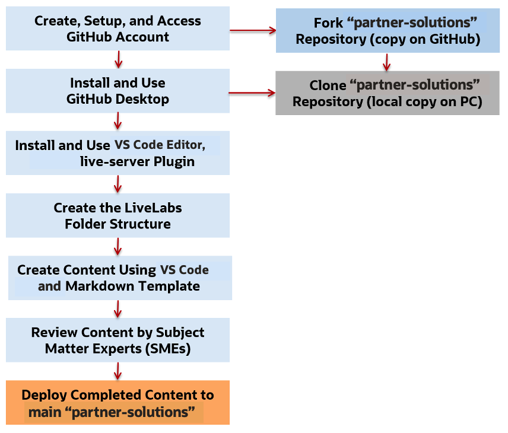

# Introduction to Labs and Workshops

The labs in this workshop walk you through all the steps to **develop workshops** for LiveLabs.

> **Note:** If you have any questions or concerns through out the process of workshop development life-cycle, contact Oracle LiveLabs team through email - [livelabs-help-community_us@oracle.com](livelabs-help-community_us@oracle.com).

### **What are Labs and Workshops?**

An individual Markdown (.md) file is called a lab. A collection of labs is called a workshop. A LiveLabs workshop must contain more than one lab. You cannot create a single lab LiveLabs (LL) workshop. In most cases, this is not a problem since most of the LL workshops contain at least one common lab titled **Get Started** that guides the user on the different types of Cloud accounts.

### **Understanding the Roles and Responsibilities**

**Workshop author or the workshop team** are the workshop developer(s) who submits the new workshop request to LiveLabs team, edit and update their workshop. They are also responsible for answering questions related to the workshop and performing regular quarterly QA.

**LiveLabs Team or the workshop council group** helps the workshop author or the workshop team to navigate through the workshop development life-cycle and answer any questions related to workshop development.

### **Oracle LiveLabs GitHub Project and Repositories**

We organize workshops into 26 GitHub repositories (as of July 2022) according to their product or feature groups, in the Oracle LiveLabs own GitHub project called [oracle-livelabs](https://github.com/oracle-livelabs). Those repositories are referred to as **Production**, since they are where customers view the completed LiveLabs workshops from.

> **Note:** You will be working in one of the **oracle-livelabs** Github project repositories called **oracle-livelabs/partner-solutions**. You can access the repository using this URL - [https://github.com/oracle-livelabs/partner-solutions](https://github.com/oracle-livelabs/partner-solutions). We recommend to bookmark this URL, as you will use it often.

## **LiveLabs Workshop Workflow**

Before you start, please check LiveLabs ([developer.oracle.com/livelabs](https://developer.oracle.com/livelabs)) to see if there is already a workshop similar to the content you want to create. If you see content that resembles yours and can be developed further, please contact that LiveLabs team to see if you can cooperate with the workshop team on the enhancement of the workshop. If not, please proceed.

For a workshop to go from an idea to a LiveLabs workshop in production, it has to go through the following phases or statuses. You can refer to this section to see your current and next steps.

1.  The workshop author or the workshop team submits the new workshop request (see details in Lab 1 -> Task 1) by emailing to [livelabs-help-community_us@oracle.com](livelabs-help-community_us@oracle.com). The new workshop request will be considered to be in *Submitted* status. Oracle LiveLabs workshop's *council* team will review the workshop within 2-3 business days. Council will either approve the workshop and move it to *Approved*, or ask the workshop team for more information and move it to *More Info Needed*.

   

2. Council will mail the workshop team for *more information* if needed. The workshop team will respond to the council via email [livelabs-help-community_us@oracle.com](livelabs-help-community_us@oracle.com) with the updates to get the workshop approved.

  

3. Council *approves* the workshop and shares you the ID of the workshop. Now, the workshop team can start developing the workshop. Refer to the notification email to see your action items.

  

4. Council will move the workshop to *In Development* once you start workshop development. The workshop team can refer to Lab 1 to Lab 4 to see workshop development-related instructions.

  

5. After development, the workshop team will update the council when they start perform the self QA of the workshop. Then the council will move the workshop status to *Self QA*. Follow Lab 4 -> Task 8 to self-QA the workshop.

  

6. Once the Self QA of the workshop is completed, the workshop team will notify council and mail the completed Self QA form to [livelabs-help-community_us@oracle.com](livelabs-help-community_us@oracle.com). The council will update the workshop status to *Self QA Complete* and will verify the QA within 2 business days.

  

7. The council will either send workshop team issues to fix if any, or move the workshop to *Completed* status, meaning the workshop is ready for publishing. LiveLabs team will submit a publishing request, and approve it. After the publishing request is approved, the workshop will be live in LiveLabs automatically within a business day.

  

The following diagram shows the general workflow process that your need to follow to set up your environment to develop labs and workshops. Most of the tasks are performed only once.

### Workshop Objectives

* Set up the GitHub environment.
* Install and use GitHub Desktop Client.
* Fork repositories you need in the Oracle LiveLabs GitHub project (copy repositories' content to GitHub).
* Clone your forked repositories (copy repositories' content to the local machine).
* Understand the lab folders' structure.
* Install and use Atom Editor and the LiveLabs Markdown templates to develop content.
* Review a few Markdown features.
* Perform GitHub operations to commit your developed content to the main (production) repository in the Oracle LiveLabs GitHub project.

This concludes this lab. You may now **proceed to the next lab**.

## Learn More

* [Oracle LiveLabs](https://apexapps.oracle.com/pls/apex/f?p=133:1)
* [Get started with GitHub](https://docs.github.com/en/get-started)

## Acknowledgements

* **Author** - Anoosha Pilli, Product Manager, Database Product Management
* **Last Updated By/Date:** Anoosha Pilli, July 2022
